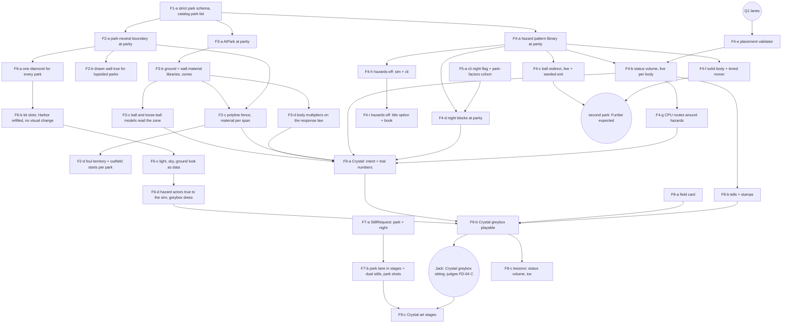

# Fields — implementation map and ledger

> **Historical.** A finished report, kept for its evidence and reasoning; the contract is [gameplay-spec §0.3 and §14](../../spec/14-parks.md) and [the decision plan](../../decisions/plan-fields.md). Where they disagree, the contract is right.

Tracker: [#814](https://github.com/jackguillet/grand-sluggers/issues/814). Design: [plan](../../decisions/plan-fields.md), [register](../../research/fields-decisions.json), [research](research-fields.md). Contract: [gameplay-spec.md](../../gameplay-spec.md) §0.3 (D21), §14, Appendix A.10, Appendix B.9. Audit baseline: `d0c6e12c` ([sim map](../../research/fields-code-map-sim.md), [presentation map](../../research/fields-code-map-presentation.md)).

This file orders the work. It does not reopen a decision and it selects no number. The register stays the record of what Jack accepted. A child issue is filed only when its contract is ready (plan rule 6); the rows below are a map, not thirty filed tasks.

## 0. Where the workstream stands (code-complete September 22, 2026)

**Done.** Every child the plan names, except the ones that wait on a human: the park schema and one resolution (`PlayedPark.Of`); the boundary, the polyline fence, the rail to the pole, per-park foul territory and outfield starts; the ground and wall libraries, the zone map and the body multipliers; the hazard pattern library with every pattern live (status volume, ball redirect with the chompers, reward target, solid body, timed mover), night blocks, the placement validator, hazards off and its title option, the CPU route around a volume; the one field kit, kit slots, looks as data and hazards drawn at the sim's disc; still shots for both poles, the park lane in the still pipeline and the greybox-sitting checklist; the field card, tells and stamps, and a Practice lesson per hazard pattern and ground (four implemented, three planned). Crystal ships its ice, glass boards and cold air, and plays as a greybox in the standalone (F9-b's code).

**Next, in order.**
1. **Jack's greybox sitting at Crystal** (F9-b's gate; checklist in `docs/screenshot-gate.md`). It judges F9-a's numbers (Q10: what counts as noticeable) and FD-04 C (full traction).
2. **F9-c**: Crystal's art, only after the sitting; Jack passes the look.
3. The three planned lessons (T-H05 train, T-H06 billboard, T-H07 Clamber wall) are debt on #814.
4. At tuning: park factors and S-29 (findings 53, 72, 75).

**Open for Jack.** Q10 and Q11 (until tuning); Crystal's night look (the blackout against FD-11-R2, left for now by FD-11-R3); the look of the field card, the tells and the hazard rings; the standalone learning gate for T-H01 to T-H04.

## 1. What the audit found that sets the order

| # | Finding | Where | Effect on the order |
| --- | --- | --- | --- |
| 1 | The park loader drops unknown fields with no error. The rule tables refuse them. | `ContentValidation.cs:42-47`, `Rules.cs:111` | Make the schema strict **before** any child adds a park field, or a misspelled field silently plays Harbor. F1-a is first. |
| 2 | A match already plays on one derived table: `content.Rules.AtLevel(difficulty)`. | `Match.cs:98`, `Rules.cs:38` | `AtPark(park)` follows the same shape. No consumer has to learn a second way to find a number. |
| 3 | `Diamond`, `ParkDiamond` and `RunnerAi` read the process-wide `Rules.Default`. 118 call sites fall back to it. | `Diamond.cs:15-52`, `ParkDiamond.cs:15,24,420`, `RunnerAi.cs:82` | F3-a audits every flight and ground reader. A reader that falls back plays Harbor's air in another park and no test fails. |
| 4 | The foul wrap, rail and backstop are `HarborWall` literals for every park. #732 owns two of them (36 ft, 95 ft). | `FieldBounds.cs:105-188`, `HarborWall.cs:21-32,114,183` | F2-a moves them into data **at today's values** (the #711 move). It changes none of them and adds none to `trials/c80`. |
| 5 | The flight already clips against a polygon sampled from `FenceAt(park, bearing)`. | `FieldBounds.cs:133`, `AtBatResolver.cs:239` | A polyline fence is cheap if the fence stays one distance per bearing (§5 Q4). 16 callers keep working. |
| 6 | Every hazard is one test on the landing point. The slow is a play-wide flag read at 7 sites. | `Fielding.cs:69-90, 402-407`, `LivePlaySystem.Field.cs:1286,1570,1757,1831` | The pattern library lands at parity first (F4-a). The live touch test (F4-b) is a behavior change and re-reports S-29. |
| 7 | Eight status volumes sit on a running lane or a bag pad today (§5 Q1). Nobody notices, because no body touches a hazard. | probe in §5 Q1 | They must be resolved before F4-b makes them real. |
| 8 | The body effect (FD-04) scales the #718 response law. The shipped root has the law off (`accelSec` 0 / `brakeSec` 0). | `data/rules/fielding.json:31-32`, `trials/c80/rules/fielding.json:39-40` | The body effect, and the sitting that judges full traction, exist only on `trials/c80` today (§5 Q2). |
| 9 | A trial park must carry every key its shipped park carries. | `DataRoot.cs:280-341`, `CompactGeometryTests.cs:1039` | A new **required** park key lands in twelve files. Optional blocks that Harbor does not name cost nothing. Prefer optional blocks. |
| 10 | S-29 plays 35 of 50 games away from Harbor. | `AtBatScenarioTests.cs:690` | Every behavior child re-reports S-29 and the park factors, before and after. It never tunes to pass (FD-13). |
| 11 | Two diamonds are drawn. Five parks never draw the foul rail the ball hits. | `ParkView.cs:181-273`, `HarborKit.cs:86-99` | F6-a (one diamond for every park) waits for F2-a, because the kit must read the park-neutral boundary. |
| 12 | `StillRequest` cannot name a park or night. | `StillRequest.cs:15-34` | F7-a is small, has no dependency, and unblocks every later look. |

### Found by the first five children (September 22, 2026)

| # | Finding | Where | Effect |
| --- | --- | --- | --- |
| 13 | `HarborWall.HipHeight` was a `float`, so the clip polygon has always stood at `(double)4.2f`. Authoring 4.2 as a table double would have moved the polygon by 2e-7 ft. | `ParkBoundary.RailTopFt`; protocol row `float-const-widens-when-it-moves-into-data` | Every child that moves a `float` literal into data narrows once, named, and pins it (F2-c, F2-d, F3-b). |
| 14 | `RulesTable` copies list sections by hand; a clean rebase silently dropped F2-a's `Boundary` from `AtPark`, and every test stayed green. | `Rules.cs` `AtLevel` / `AtPark`; protocol row `derived-table-copy-drops-a-section`; a reflection test now asserts every untouched section is the same reference | Any new derived table or new section runs that test. |
| 15 | The resolved table did not reach the first flight: `AtBatResolver` / `FieldingResolver` were built with `content.Rules`. Inert while no park names air — but the fielding **preview** read the shipped difficulty rung while live play waited the match's, so EASY / HARD previews and live play disagreed. | `Match.cs:107-108, 977` | Fixed by F3-a2 (#840): both resolvers play on `_rules`. NORMAL unchanged; EASY / HARD games can move (3 of 24 seeds did). |
| 16 | Funfair's chompers do nothing on `trials/c80`: the three literal discs sit at 198–228 ft, outside the trial's ×0.70 fences. Crystal at night is 1.34 runs / 1.55 HR against Harbor on the shipped root. | `park-factors` cohort report in PR #834 | Findings, not targets (FD-13). F4-a moves the chompers into data; §5 Q9 covers Crystal's window. |
| 17 | `tools/game-feel-scale-probes --check` was already stale on `main` before F2-a; it seals `HarborWall.cs` and is #730's, not in CI. | PR #833 | Leave to #730. |
| 19 | The old `LoopIsSymmetric` test was vacuous: it held for every park because the builder copied one half. The rail ramp near the pole covers 150–177 ft of rail per side on the shipped root and 64–82 ft on `trials/c80`, wider than the docs said. | PR #848 | Q5 stays Jack's; `SF-05` checks position exactly and skips the ramp's top. |
| 20 | Four rules tables now sit outside the evidence seals: `boundary.json`, `grounds.json`, `walls.json`, `hazards.json`. `pipeReachPadFt` left sealed coverage when it moved. Adding a file to the seal list adds a key to the evidence JSON, which is more than a parity child's hash-only gate allows. | PR #851, PR #850 | #853, for the packet owner (#708 / #730). |
| 21 | Moving the chompers into data and migrating them by the zone rule closed #717's recorded anomaly (the trial's centre fielder no longer starts inside a mouth) and made the trial's night Funfair live. `ParkZones.Names` / `ParkEnvironment.Names` are computed record properties that serialise into the trace identity when a block is present. | PRs #851, #850 | Reported; nothing tuned. |
| 18 | The sibling worktrees share one scratchpad root, so a fixed scratch filename (`pr-body.md`) can be overwritten by another session. | PR #832 | Scratch files carry the PR number. |

### Found by the third batch (September 22, 2026)

| # | Finding | Where | Effect |
| --- | --- | --- | --- |
| 22 | The stored race identities (`game-feel-3d-race-*.json`, `game-feel-702-baseline.json`) are pinned at build `46f2e94a`, already differed from `main` before F3-b, and no test reads them. Regenerating them would rewrite #715's and #702's evidence, not refresh a hash. | PRs #864, #869, #867 | §2's trace-identity rail is amended: say that fresh identities moved; do not regenerate the stored ones (a full re-export is the packet owner's, #853). |
| 23 | The CPU's arrival forecasts (`CpuWalkSec`, the cover-arrival estimates) never charge the response law's ramp, so with a `startMul` above 1 the planner accounts for the ground and they do not. | PR #864 | F4-g and F9-a. |
| 24 | The T-R04 slide lesson's press band reads `running.bags.slideFt` directly; a lesson on a slick bag needs `RunnerSystem.SlideFt`. | `TutorialRunningTests`, PR #864 | F8-c. |
| 25 | The response rates are measured against the rated speed, so an outfielder asked 0.6 of it reaches that speed in 0.6 × `accelSec`. | PR #864 | Read `SF-13` this way. |
| 26 | Still-gate captures do not repeat to the pixel on shots with characters (0.5k–81k px between identical runs); only `title`, `lineup` and `field` do. | PR #863 | A look gate compares those, or measures the noise floor first (F7-b). |
| 27 | Park-neutral values live in Harbor-named sim classes: `HarborPostcard.WallThickFt`, `HarborDugout.AlongHome`, `AlongBag`, `StarSpacing`. | PR #863 | F6-b, or a Gameplay child. |
| 28 | `MatchDirector.cs` is sealed, so a Presentation child that passes something through it must reseal. `StillCapture` and `RebuildTitlePark` rebuild the park but not the star pips. `HarborKit.ShowBackstop(false)` hides an empty folder, so `StillCapture.HideBackstop` does nothing. | PR #863 | F2-d (pips); F7-b. |
| 29 | At the five other parks the dress's old backstop (z −24) stands inside the kit's (−36), and Crystal gains the brown track the other parks already had. At Harbor, night, the kit's backstop shades 1–6 of 255 differently. Jack passed the look with these. | PR #863 stills | F6-c (colors), F6-d (dress). |
| 30 | The two first-base-side volumes crossed the lane from inside the diamond, so the outward move carried them about 25 ft, past the lane, to 19–27 ft from the second baseman's start. | PR #867 | F9-a places Crystal's for play. |
| 31 | The placement rule reads the root's own `infield.json`, so a trial that moves the bags without its hazards is refused. It measures the day disc: Ember's breath at night still clears, by 85 ft shipped and 32 ft on the trial. | PR #867 | F4-d checks the night disc. |
| 32 | Counting a ball redirect's `reachPadFt` would refuse Canopy's barrels at (22, 58) and (6, 102) and Funfair's can at (20, 55) on the shipped root, and Canopy's (5, 91) on the trial. The rule counts the hazard's own radius. | PR #867 | Jack: the radius only (FD-19-R2, "5. a"); nothing moves. |
| 33 | Moving the volumes moved S-29's shipped away mean from 1.92 to 1.86, nearer the 1.8 floor (one game: Brondo at Vale, in Crystal). | PR #867 | Re-reported; not tuned (FD-13). |
| 34 | `FieldingResolver.OutfieldGrass` still splits dirt from grass at the lip directly rather than through the zone map; the two agree today. | PR #869 | Note for F9-a (an unequal infield row). |
| 35 | Unity compiles the sim against netstandard 2.1, so a newer BCL helper (`ArgumentNullException.ThrowIfNull`) passes `dotnet test` and fails `unity-compile.sh`. | PR #869; protocol row `sim-uses-a-bcl-api-unity-lacks` | Run the Unity gate before any PR that adds framework calls to the sim. |
| 36 | With five sessions on one Mac the load average reached 80–270, so a single wall time means nothing. | PR #869 | Time the old and new builds side by side. |
| 37 | A still-capture loop fronted its editor every 10 s and took focus from Jack's game window; a bare editor started by activating Unity by name idled for 14 h. | PR #866; protocol row `gui-editor-focus-fight` | One machine-wide GUI lock (`tools/unity_gui.py`); captures take it, front by PID, and ask Jack before `--player-open-ok`. |

### Found by the fourth batch (September 22-23, 2026)

| # | Finding | Where | Effect |
| --- | --- | --- | --- |
| 38 | With hazards off, every park factor on both roots moves by at most 0.09, inside the report's 0.15 noise. Rooftop never moves: its billboards pay the batting team a star, which a CPU-vs-CPU cohort cannot see. | PR #870 | A report, not a target (FD-13). |
| 39 | A scanned seed row (the no-hazard-event premise) belongs to one base: each promotion that reseeds the games (#871, #886) broke some. The traced seed tests cost about 12x an untraced game and CI took 18 min against 13. | PR #870 | Consider a Release probe instead of Debug traced rows. |
| 40 | The park-factors cohort now reports four conditions (day / night x hazards on / off), 1,200 games, JSON schema 2, about twice the run time. | PR #870 | `--hazards on|off` narrows it. |
| 41 | `BattedBall.FenceClearFt` (the rob clearance) still reads `park.FenceHeightFt`, not the top of the span the ball crosses. | PR #878 | Before any park names points with other heights, or with the robbable-span child. |
| 42 | Some readers still use the three posts, not `FenceAt`: `ParkDiamond.GrassZ1`, the centre-field check in `TrackFollowsTheFenceArc`, `HarborKit`'s scoreboard, town and ads, `HarborPostcard`, `WorldView`. | PR #878 | They follow `FenceAt` before any park names points. |
| 43 | The lip does not migrate with the fence (#728 scaled it on the basepath, the fence by 0.70), so a `fenceFrac` legal on the shipped root can be refused on the trial (at Harbor centre field 0.39 shipped, 0.49 trial). | PR #878 | Author fence points against the trial's lip. |
| 44 | Two wall materials cannot be tested from a fixture: the wall library is closed and named, so a second row is content (F9-a's glass boards). F2-c proved the per-span read and the missing-row stop instead. | PR #878 | SF-12's two-row half comes with the first second material. |
| 45 | The old half-degree slack in `HarborWall.IsOutfield` counted the first rail vertices past each pole as outfield, so the last 31-34 ft of rail before each pole (11-12 ft on the trial) was drawn at full fence height; in all, 159-190 ft of drawn rail per side stood above the flight's rail. | PR #875 | Fixed: the drawn top is read from the flight segment (protocol row `drawn-top-recomputes-the-flight`). |
| 46 | None of the ten still shots framed a foul pole, so F2-b2's first captures differed only by character motion. | PRs #875, #884 | F7-b1 added `pole-left` / `pole-right`, posed from the park's own geometry. |
| 47 | `boundary.backstopZFt` (-36) is read by no geometry: the drawn and the flight backstop take their radius from `foulOffsetFt`. | PR #885 | For #732 / F2-d. |
| 48 | The side pavilions, tents and battlements at (+-118, 40) cross the kit's foul rail far up the lines, about 15% of each footprint on the field side. | PR #885 | F6-d. |
| 49 | Every merge to `main` made every other open PR stale in the register, the spec and the seal files; three PRs rebased three or four times in one evening. | #870, #875, #885 | Merge one PR at a time right after its CI; ask the other session to hold merges touching the same files. `scratchpad/merge_register.py`-style three-way merges of the register are safe (byte-stable). |
| 50 | A stacked PR merged after its base shows its base's merge commit as "not an ancestor", though its tree equals what CI tested. | PRs #867, #869 | Compare trees, not ancestry. |
| 51 | A PR was merged before `portable` finished on its final head (#870); the run later passed, as did `main`'s. | PR #870 | Wait for the run on the final head. |
| 52 | Capturing while Jack is at the keyboard pulls focus from whatever he is doing, not only from the game window. | captures under #866 | Warn him first; captures take about 20-30 s per park and light. |

### Found by the fifth batch (September 23, 2026)

| # | Finding | Where | Effect |
| --- | --- | --- | --- |
| 53 | F4-d and F4-b changed play, and neither re-reported park factors or S-29 (Jack: "let's move faster"). The map asked F4-b for both. | PRs #902, #905 | Owed at tuning, with Q10 and Q11; not a target (FD-13). |
| 54 | F4-b changed shipped play at Crystal and Ember and not on `trials/c80`: seed 7 Ember day 3-4 → 4-5, night 5-3 → 4-5; Crystal kept its score in a different game. The live slow and one less draw on the seeded stream both move the game. | PR #905 | Any change to a hazard's draws reseeds the rest of that game. |
| 55 | A stored game at a hazard park is tied to the hazard code: `NightBlockTests`' Ember night rows were re-recorded on both roots, and SF-24's Crystal row moved to day seed 14 because a Crystal night is now its day and seed 10 no longer freezes. | PRs #902, #905 | Re-record the row in the PR that changes the hazard, and say so. |
| 56 | The heart swing's `drops.frozen` roll is the last frozen-drop roll. It is a special, not a park rule. | PR #905 | Out of the fields scope (specials excluded). |
| 57 | Two sub-agents ran wide local test filters, S-29 and park factors after being told not to, and loaded the shared Mac. | PRs #902, #905 | The orchestrator finishes a child itself: rebase, fix only the tests that broke, run only those classes, seed 7 before and after. |
| 58 | In zsh, `${park:+--park $park}` passes one argument, so the CLI saw `--park crystal` as one word. | PR #905 | Build the argument list as an array. |

### Found by the sixth batch (September 23, 2026)

| # | Finding | Where | Effect |
| --- | --- | --- | --- |
| 59 | A new rules key must land in the `trials/c80` copy of its file too: the whole-file rule refuses a trial file that leaves a key out (`fielding.chase.volumeClearFt`). | PR #911 | Name both files in a child that adds a rule number. |
| 60 | F4-g changed shipped play only at Crystal and Ember (seed 7: Ember 4-5 → 3-4); every park with no volume was byte-identical. | PR #911 | A report, not a target (FD-13). |
| 61 | The book's Captain and field page is full at 1024×768 (`BookletLayoutTests`); the hazards line went on Pause and Practice beside the other title verb. | PR #912 | The next title verb needs a page plan, not one more line. |
| 62 | P2-e (#910) changed play and turned `main` red: every stored night game in `NightBlockTests` moved on both roots, and shipped seed 7 lost its chomp (now seed 22). | PR #918 | A stored whole game breaks on any play change; its owner re-records it in the PR that changes play. |
| 63 | The night look is art data: each sky and light row in `data/art/looks.json` has a night, so a park file's night block stays rules-only (a contract choice F6-c made). | PR #916 | F9-a names no look in a park file. |
| 64 | Crystal's night row is still the blackout (sun 0.06), which contradicts FD-11-R2 (night keeps the stadium lights). F6-c kept the look. | PR #916 | Open for Jack. |
| 65 | A pale status-volume ring vanished on white ice and on dark lava; a dark ring reads on both (Jack took the recommendation). | PR #920 | Ring colors are one data value per pattern. |
| 66 | C80's promotion (#915) landed mid-PR and moved the warp pad from 8 to 5.6 ft. | PR #920 | Presentation tests read numbers from the rows, never a shipped literal. F9-a's "trial only" (FD-13-R1) needs re-reading now that C80 is the shipped game. |
| 67 | Another session's post-merge delivery took the GUI lock between "capture" and its start. | stills for PR #920 | Wait on `unity_gui.py status` until free, then capture; 20 park-and-light captures take about 8 min. |

### Found by the seventh batch (September 23, 2026)

| # | Finding | Where | Effect |
| --- | --- | --- | --- |
| 68 | With `trials/c80` gone, FD-13-R1's trial-only home for park numbers went too; Jack chose the shipped data (FD-13-R3). | PR #929 | Park numbers ship as proposals Jack judges in play; there is no trial window for them. |
| 69 | Every parity row that replayed "every park" pinned today's numbers at Crystal. They now replay the parks still at today's numbers (`TodaysParks`: no air, no fence, grass-equal rows), and Crystal is held by `CrystalRinkTests`. | PR #929 | The next park that names a difference drops out of the parity rows by its data, not by an id. |
| 70 | `OutsScenarioTests`' defense is Vale's, whose home park is Crystal, so those outs rows had been running on Crystal by accident. | PR #929 | They keep Crystal's field without F9-a's ice, glass and air. A scenario should name its park. |
| 71 | A park with its own air gets a fresh `AtPark` table per match, so "the same table" holds by value there, not by reference. | PR #929 | Tests compare the air and share the libraries. |
| 72 | F9-a changed seed 7 only at Crystal (2–3 → 0–1 by day). Balance was not measured. | PR #929 | Due at tuning, with finding 53. |

### Found by the eighth batch (September 22, 2026)

| # | Finding | Where | Effect |
| --- | --- | --- | --- |
| 73 | A redirected ball that leaves its exit inside the exit's own disc re-enters it. The exit lock now holds until the ball is horizontally clear of the exit disc. | PR #934 | One redirect per mouth per pass; covered by `BallHazardTests`. |
| 74 | A chomper that ate grounders ate most of Funfair's infield. The chomper is a ball redirect with a mouth floor (4 ft), so grounders pass under it. | PR #934 | Only a ball in the air enters a chomper. |
| 75 | F4-c moved Funfair's scoring (10 seeds, 108 to 114 runs). Balance was not measured. | PR #934 | Due at tuning, with findings 53 and 72. |
| 76 | Outfield starts are now a fraction of each park's own fence. The pursuit sweep's ±12° rows started a fielder on the ball at one park, so they left the sweep. | PR #941 | `OutfieldStartsTests` hold the rule; the sweep keeps the other angles. |
| 77 | `harbor_kit.py` disagrees with the data: HOME_RADIUS 34 against 36 and DUGOUT_PAD 14 against 18. | PR #942 | `HarborKitScriptTests` pin today's values; the fix waits on Harbor's next kit pass. |
| 78 | The evidence seals went stale on main after F8-b (source hashes of `Match.cs`, `MatchDirector.cs`, `InPlayDirector.cs`); the light PR check does not read them. | this PR | Resealed here, hashes only. |
| 79 | In Practice the assistance moves the human's glove on a dead pad. A take lesson's ball must therefore reach its hazard before any glove can, and the fail case is the assistance's take, not an eager player. | PR #947 | Fixtures: the warp can at (18, 49), the tree at (35, 217) by a liner. |
| 80 | The freezer lesson needs the fielder's straight run to cross the disc while the route around still arrives: a fly landing 13 ft from the freezer, fielded by 2B. | PR #947 | T-H02 fails `slowed` on the straight run and passes around it. |

## 2. Rails every child carries

What a PR owes is [agent-rails.md](../../agent-rails.md) §1.2 (2026-09-22). Where a rail below asks for more, §1.2 wins: no local full suite, no reseal, no `trials/c80` twin, no register or ledger edit in a feature child. Balance runs on demand.

- **Parity first (FR-06).** A rail child changes no behavior. It shows `cli match --seed 7` unchanged and the CI breakage suite green. S-29, the Harbor cohorts and the seals run on demand (Actions → Full tests), not in the child.
- **Evidence seals (FR-16).** The seals hash `Models.cs`, `Rules.cs`, `FieldBounds.cs`, `HarborWall.cs`, `BallFlight.cs`, `BattedBall.cs`, `AtBatResolver.cs`, `Fielding.cs`, `FlyCatch.cs`, `ParkDiamond.cs`, `Match.cs`, `LivePlaySystem.Field.cs`, `ContentValidation.cs`, `data/parks/harbor-diamond.json`, `flight.json`, `fielding.json`, `running.json`. A feature child does not reseal. A tuning PR or an evidence packet reseals, in this order: `dotnet run --project tools/game-feel-flight-probes -- --write`, then `python3 tools/compact-field-report.py`, then both `--check`.
- **Trace identity.** `PlayTraceIdentity` serialises the whole `Park` record. A new `Park` member, or a change to a rules table's shape, moves every fresh identity SHA. Say so in the PR and do not hide the member from the identity. The SHAs stored in `docs/research/game-feel-3d-race-*.json` and `game-feel-702-baseline.json` are a pinned record of the #715 / #702 runs at their builds: do not regenerate them in a child (finding 22; a full re-export is the packet owner's, #853).
- **`Park` is built positionally** in `tools/game-feel-flight-probes/Program.cs:44`. A new member has a default and goes last.
- **c80 parity.** On demand. A shipped park edit does not owe its `trials/c80` twin; parity is restored when the trial is next used. If a breakage-suite test fails on a missing trial key, add that key and nothing more. Freeze, promote or retire C80 is open for Jack ([agent-rails.md](../../agent-rails.md) §1.3).
- **#730 / #732 numbers are banned** until those issues close: hazard radii, `pipeReachPadFt`, `emberNightFireMul`, `HarborWall.FoulOffset`, `flareStart`, `infieldLipFt`, the fielder starts. A fields child may move one into data at its current value. It may not change one.
- **Rules tables use named properties.** A `Dictionary` or a `List` bypasses the reflective validator and the JSON = code parity test. Ground, wall-material and hazard-type rows are named properties.
- **One seeded stream.** A child that changes the count or order of `_rng` draws reseeds every `AutoPlay` game. It says so in the PR body and never tunes; S-29 is re-reported on demand.
- **Shared files with the pitching and hitting children (#803).** `Models.cs`, `Rules.cs`, `Match.cs`, `ContentValidation.cs` and the seals. One child at a time merges across both tracks; the later one rebases.
- **Second client.** `src/GrandSluggers.Play` draws parks too (`WorldView.cs`, `Palette.cs`) and must keep building.
- **`unity/` is not in the solution.** Only `tools/unity-compile.sh` sees a Unity call site.
- **A stored double pins the platform.** Goldens store libm-free bits (#811). A child is done when `portable` CI is green on its final head.
- **Register.** A child does not edit the register. One batched docs PR, at a phase checkpoint or when Jack asks, records Jack's answers and refinements and updates `implementation_issues`, `validation_evidence` and `history`. Nobody but Jack writes `human_acceptance`. A number needs `trial-accepted` from Jack first.
- **Session kinds.** Sim and data = Gameplay. Unity, HUD, the book pair, lesson copy = Presentation. Blender and stills = Art. Separate PRs.
- **No park art** before that park's greybox sitting (FD-01, FD-17).

## 3. Dependency map

Four children have no dependency and touch different files: **F1-a**, **F5-a**, **F7-a**, and the docs. F1-a goes first because every other Gameplay child adds park data.

### F1 — Schema and catalog (Gameplay)

| Child | Scope | Decisions | Needs from Jack |
| --- | --- | --- | --- |
| **F1-a** #820 ✅ | Park files refuse an unknown field, the way rule tables do. Dead fields resolved: `notes` becomes a declared, rule-free member; `nightOnly`, `dayOnly` and the train's `periodSec` are removed from all twelve files (FD-11's night block and F4-f's mover row bring back what a park needs). The park list comes from the catalog, not from a literal in `ExhibitionPick`. The home-park map becomes data: a captain's home park is the park whose `faction` is his, else Harbor, which reproduces `Teams.HomeParkId` exactly. An unknown park id is an error, not Harbor. SF-02, SF-04 (sim half). No behavior change. | FD-01, FR-03, FR-04 | Nothing |

### F2 — Geometry owner (Gameplay, then Presentation)

| Child | Scope | Decisions | Needs from Jack |
| --- | --- | --- | --- |
| F2-a #826 ✅ | A park-neutral boundary type. The foul wrap, flare, rail height and backstop move from `HarborWall` literals to data at today's values; `FieldBounds` and the validator stop naming Harbor; the cache key carries every input. SF-08. #732's numbers move but do not change. | FD-07, FR-05 | Nothing |
| F2-b #845 ✅ | The drawn wall stops mirroring right field onto left; `HarborWallTests` covers both sides of all six parks. SF-05. | FD-06, D15 | §5 Q5 answered: the sim's rail (FD-06-R2); the ramp is F2-b2's |
| F2-b2 #873 ✅ | The drawn rail stays hip-high to the pole, as the flight's does; the ramp past `HarborWall.RampStartZ` goes and the wall steps up at the pole. `SF-05` claims the whole rail on both roots. After F6-a (it draws the loop at every park). | FD-06-R2, D15 | **A look at Harbor's poles** (at review) |
| F2-c #874 ✅ | The polyline fence: optional `fence.points` in FD-12 units, a height per point, a wall material per span; `FenceAt` reads it; the clip polygon keeps the vertices; the track, the poles and the drawn wall follow. The three-post circle is the default. SF-06, SF-07, SF-12. | FD-06, FD-12, FD-06-R1 | §5 Q4 answered (one distance per bearing). After F3-c, whose segment-material function it extends |
| F2-d | Optional per-park foul parameters and the three outfield starts; the default depth stays the #730 fraction rule. `Diamond.Positions` is process-wide today, so the starts need a match-scoped source. SF-09. | FD-07 | Nothing; values come with a park |

### F3 — Environment table (Gameplay)

| Child | Scope | Decisions | Needs from Jack |
| --- | --- | --- | --- |
| F3-a #827 ✅, F3-a2 #838 ✅ | `RulesTable.AtPark(park)` beside `AtLevel`. An optional `environment` block on a park; no park names one. Audit and fix every flight and ground reader that falls back to `Rules.Default`. SF-01. | FD-03, FR-01 | Nothing |
| F3-b #846 ✅ | `grounds` and `walls` libraries as named rows (grass, dirt, ice, ash, …; padded, …), every row seeded with today's global numbers. Zones (infield dirt, outfield, track, apron) from existing geometry; `surface` becomes the zone map. SF-03. Behavior-identical. | FD-05, FR-02 | Nothing |
| F3-c #856 ✅ | The flight reads the zone under the ball for roll and bounce, and the span's row for a carom. The overthrow and bobble models read the same row. SF-10, SF-11, SF-12, SF-14 on a fixture root with unequal rows. Shipped rows stay equal, so play is identical. | FD-03, FD-05 | Nothing |
| F3-d #857 ✅ | Body multipliers on a ground row: start, brake, cut-back (response law), slide, overrun. All 1.0. SF-13. | FD-04 B | Nothing. Values come with Crystal (F9-a) |

### F4 — Hazard runtime (Gameplay; one Presentation child)

| Child | Scope | Decisions | Needs from Jack |
| --- | --- | --- | --- |
| F4-a #847 ✅ | The pattern library at parity: a closed type table as named rows (pattern, acts-on, numbers); `ParkHazards` reads rows, not type strings; chompers become data instances; `pipeReachPadFt` and `emberNightFireMul` move under their rows at today's values. SF-03, SF-04. Same outcomes as today, rolls included. | FD-09, FR-08 | §5 Q6 answered: **decoration** (Jack, 2026-09-22) |
| F4-e #862 ✅ | The placement validator on both roots, and the eight volumes moved outward along their own bearings until they clear (FD-19-R1). SF-23. **Moves where the landing-point test fires at Crystal and Ember**: re-report S-29 and park factors. | FD-19, FD-19-R1 | §5 Q1 answered |
| F4-b | Status volume, live: a per-body touch test in the tick, a duration, a typed event; the play-wide flag and the park's `drops.frozen` roll go. `ParkSlowRowsTests` is re-authored to the decision. SF-20, SF-22. **Behavior change**: re-report S-29 and park factors. | FD-08-R1, FD-08-R2, FR-07 | §5 Q7 answered: 3 s; 0.45 unchanged. After F4-e |
| F4-g ✅ | The CPU route costs a volume and goes around a body; no foresight of a draw. SF-26. | FD-14 | Nothing |
| F4-d | Night blocks: Ember's reach and Funfair's chompers move into `night` at parity; **Crystal's contact window is dropped on both roots** (FD-11-R2: night keeps the stadium lights and changes only the outside view and the hazards), so night Crystal changes: re-report park factors. A night block may name hazards and look fields only. SF-25. | FD-11, FD-11-R1, FD-11-R2 | §5 Q9 answered: Crystal's trial night block drops the contact window. After F4-h (both touch `ParkHazards`) |
| F4-h #858 ✅ | Hazards off in the sim and the CLI: the four hazard patterns removed; wall traits and decorations kept (FD-10-R1, Jack "4. a"). SF-24. | FD-10, FD-10-R1 | Nothing |
| F4-i ✅ | Presentation: the title option, the book pair, `HowToPlay`. | FD-10 | Placement on the title (at review) |
| F4-c | Ball redirect, live: the ball leaves at the entry and re-enters at the exit; the exit is a seeded draw and a typed event. SF-21, SF-27. With the second park. | FD-08, FD-08-R1, FD-09-R2 | Exit speed and heading as a trial; the chomper joins it as a ball redirect (§5 Q8 answered) |
| F4-f | Solid body and timed mover. SF-28. With the park that needs them. | FD-09 | Nothing (§5 Q8 answered: the chomper goes to F4-c) |

### F5 — Measurement (Gameplay)

| Child | Scope | Decisions | Needs from Jack |
| --- | --- | --- | --- |
| F5-a #828 ✅ | `cli match --night`. `--cohort park-factors [--table]` in `RaceCohort`: five S-29 pairs both ways, seeds 1–5, day and night, every catalog park, factors against Harbor; `--hazards off` waits for F4-h. SF-30. A report, not a gate. | FD-02, FD-13, FR-10 | Nothing now. **§5 Q10 / Q11** at tuning time |

### F6 — Field kit (Presentation)

| Child | Scope | Decisions | Needs from Jack |
| --- | --- | --- | --- |
| F6-a2 #881 ✅ | The old backstop pieces, ledges and dugouts in the five parks' dress go; two source rows keep any dress piece out of the kit's backstop and the dugout span. Asked for by Jack. | FD-16 | **Jack passed the look** |
| F6-a #859 ✅ | Every park draws the one diamond from the geometry owner: bags, chalk, boxes, mound, dirt, the foul rail and backstop. The `ParkView` fallback diamond retires. Harbor does not change. `StarMeter` reads the geometry owner. | FD-16, FR-13 | A look at five parks: **passed by Jack**, September 22, 2026 |
| F6-b ✅ | Kit slots in `data/art/parks.json` with a validator; `cli art` lists each park's empty slots. Harbor fills them with no visual change. | FD-16 | Nothing |
| F6-c ✅ | Light, sky, fog, ground and wall colors as data chosen by the park, not by an id `if` chain. Same looks. | FD-16, FR-04 | Nothing |
| F6-d ✅ | Hazard actors by pattern, drawn at the sim's true size (the pad included). Greybox dress from data. The five per-park methods retire. | FD-16, FD-16-R1 | §5 Q12 answered: keep them behind the backdrop slot |

### F7 — Look gates (Presentation / Art process)

| Child | Scope | Decisions | Needs from Jack |
| --- | --- | --- | --- |
| F7-a #829 ✅ | `StillRequest` gains `park` and `night`; `tools/still-gate.sh` takes both. | FD-17, FR-14 | Nothing |
| F7-b1 #882 ✅ | Two named still shots, `pole-left` and `pole-right`, posed from the park's geometry (`StillShots.Pole`; numbers in `data/feel/shots.json` `parkShots`). | FD-17 | Nothing |
| F7-b | A park lane in `dcc-stages.json` and `dual-stills.json` and their validators; named park shots; park rows and a greybox-sitting checklist in `screenshot-gate.md`. `harbor_kit.py` constants pinned by test or read from data. | FD-17 | Nothing |

### F8 — Legibility (Presentation + Gameplay setup)

| Child | Scope | Decisions | Needs from Jack |
| --- | --- | --- | --- |
| F8-a | The field card from the resolved park; the per-id copy switch in `CarnivalFront` goes. | FD-15 | Icons and copy (at review) |
| F8-b | Tells and stamps from typed hazard events: a body tell for a status, a ball tell for a redirect. | FD-15, FR-15 | A look (at review) |
| F8-c | Lessons: one per pattern and per ground. A lesson names its park; a random hazard's lesson fixes its seed. Gameplay setup child plus Presentation child. SF-40. | FD-15 | The learning gate stays Jack's |

### F9 — Crystal Rink, the proving park

| Child | Scope | Decisions | Needs from Jack |
| --- | --- | --- | --- |
| F9-a ✅ | Crystal declares its intent, then names its differences (in the shipped data, FD-13-R3; first written as a scoped numeric trial): an ice outfield row, a glass-board wall material, its air, its body multipliers, its volumes off the lanes, its night block. | FD-18, FD-02, FD-13, FD-13-R1, FD-13-R2 | §5 Q2 and Q3 answered (`trials/c80` only; probe, play, accept); **trial acceptance** |
| F9-b | Crystal plays as a greybox in the standalone (the shipped window since FD-13-R3; no trial). | FD-17 | **The greybox sitting**, which also judges FD-04 C |
| F9-c | Art stages for Crystal. | FD-17, #37 | The look gate |

## 4. Scenario ids

The `SF-xx` block, reserved in GS Appendix B.9 (SF-01 … SF-14 environment and geometry, SF-20 … SF-28 hazards, SF-30 measurement, SF-40 lessons). Every id appears in a test method name (`SF01_…`). Free: SF-15 … SF-19, SF-29, SF-31 … SF-39, SF-41 upward. The pitching and hitting work uses `S-83 … S-89` and `S-107` upward; the two blocks do not meet.

Rows that change with the design: `ParkSlowRowsTests` (the play-wide slow becomes per body, F4-b), `NightTests` (three rules move, F4-d), `HarborWallTests` (both sides, then spans, F2-b / F2-c), the park rows in `MatchTests` (`InFreeze`, `WarpIfPipe`, billboards, clamber), `CompactGeometryTests` (key sets grow). A re-authored row cites the decision that changed it. S-29 is a guardrail that is re-reported, never tuned.

## 5. Questions that are Jack's

One at a time, in the order they start to block. **None blocks F1-a, F2-a, F3-a, F3-b, F5-a or F7-a.** Jack answered Q1–Q5, Q7–Q9 and Q12 on September 22, 2026 in one reply; each answer is a refinement in the register, and the register's history maps each reply item to its question. **Q10 and Q11 stay open until tuning.**

1. ~~**Eight status volumes sit on a running lane or a bag pad.**~~ **Answered, September 22, 2026: "approve".** Each volume moves outward from home along the ray through its own centre until its disc clears every lane, pad, the mound and the plate area; its size is kept; a trial position stays what the migration rule makes of the moved shipped position (FD-19-R1). F4-e does it. Original question: FD-19 forbids that, and its scope says a failing hazard comes back to you. Found with the lane half-width 5 ft, bag pads 12 ft, home pad 18 ft, mound 9.2 ft from `ParkDiamond`:

   | Root | Park | Hazard | Place | Crosses |
   | --- | --- | --- | --- | --- |
   | shipped | Crystal Rink | `freeze_volume` | (40, 70) r 8 | first → second lane by 0.8 ft |
   | shipped | Crystal Rink | `freeze_volume` | (−45, 90) r 8 | second → third lane by 7.5 ft |
   | shipped | Ember Keep | `lava_pit` | (38, 78) r 10 | first → second lane by 7.0 ft |
   | shipped | Ember Keep | `lava_pit` | (−42, 96) r 10 | second → third lane by 7.4 ft |
   | c80 | Crystal Rink | `freeze_volume` | (−40, 80) r 5.6 | second → third lane by 5.7 ft |
   | c80 | Crystal Rink | `freeze_volume` | (7, 126) r 7 | second base's pad by 4.4 ft |
   | c80 | Ember Keep | `lava_pit` | (34, 69) r 7 | first → second lane by 4.8 ft |
   | c80 | Ember Keep | `lava_pit` | (−37, 85) r 7 | second → third lane by 5.7 ft |

   Funfair's cans and Canopy's barrels pass. Recommended: move each one outward along its own bearing until it clears the lane by its radius, keep its size, and let F9-a place Crystal's for play. Blocks F4-e, then F4-b.
2. ~~**Where do a park's first numbers live?**~~ **Answered, September 22, 2026: "approve".** `trials/c80` only; the shipped park stays as it is until a single default exists (FD-13-R1). Original question: Recommended: in `trials/c80` only. The body effect needs the response law, which is on only there; FD-13 says park numbers are trial anchors; and the sitting runs in a `local-player --trial` window. The shipped Crystal stays as it is until a single default exists. Blocks F9-a.
3. ~~**How do you want to judge ground, air and wall numbers?**~~ **Answered, September 22, 2026: "approve".** A headless probe table, then Jack plays in the trial window, then accepts (FD-13-R2). Original question: Recommended: as for the pitch shapes — a headless probe table first (same ball, two states), then you play them in the trial window, then accept. Blocks F9-a.
4. ~~**The polyline guardrail.**~~ **Answered, September 22, 2026: "approve".** One fence distance per bearing; an overhang or a fence behind a fence is refused (FD-06-R1). Unblocks F2-c. Original question: One fence distance per bearing from home: notches, porches and alleys are legal; an overhang or a fence behind a fence is not. It keeps `FenceAt` a function, so the depth rule, the C80 scale, the clamp and the cameras keep working. Blocks F2-c.
5. ~~**The rail near the foul pole.**~~ **Answered, September 22, 2026: "approve".** The sim's rail is the rule: the drawn rail stays hip-high to the pole and the wall steps up there (FD-06-R2). A look change at Harbor: child F2-b2, after F6-a. Original question: The drawn rail ramps from 4.2 ft up to the fence from 95 ft out; the sim rail is 4.2 ft all the way, and #732 showed pulled balls scored foul for crossing it. Which one is the rule? This sits beside #732. Blocks F2-b.
6. ~~**Statue, train, AC unit, tree.**~~ **Answered, September 22, 2026: "decoration."** A `decoration` pattern row; each gets a real pattern when its park comes up. Built by F4-a (#851).
7. ~~**The status volume's numbers.**~~ **Answered, September 22, 2026: "slows for 3 seconds".** A touch slows the body for 3 s; the 0.45 factor was not re-decided and stays (FD-08-R2). F4-b builds it. Original question: How long a touch slows a body, and whether 0.45 stays (#730 owns 0.45's neighbors, not 0.45). A scoped trial. Blocks F4-b.
8. ~~**The catch stealer.**~~ **Answered, September 22, 2026: "approve".** The chomper becomes a ball redirect and never makes an out; `catchStealer` retires once unused (FD-09-R2). Built with F4-c. Original question: A chomper makes an out with no glove. Keep it, change it to a ball redirect, or drop it? Blocks Funfair, not Crystal.
9. ~~**Crystal's night.**~~ **Answered, September 22, 2026: "drop"; then "definitely drop it" on both roots (FD-11-R2): night keeps the stadium lights and changes only the outside view and the hazards.** Crystal's trial night block carries no contact-window change (FD-11-R1). Under FD-13-R1 the shipped Crystal keeps 0.85 until a single default exists; that reading is flagged to Jack. Original question: Today: contact window × 0.85, on the at-bat, with no reference source. The reference blackout is a fielding-phase event that a batted ball triggers. Keep, replace, or drop? Blocks Crystal's night block in F9-a.
10. **The FD-02 band as numbers.** Bounds, seeds, cohort size, per-event bands. At tuning time.
11. **S-29's pool.** Six parks pooled, or Harbor only plus a park-factor check? At tuning time.
12. ~~**The old primitive backdrops**~~ **Answered, September 22, 2026: "keep".** The backdrops stay as named greybox builders behind the backdrop slot, picked by slot data, never by park id (FD-16-R1). Original question: (palace, ferris wheel, skyline, castle, trees). They are code chosen by park id, which FR-04 retires. Keep them as named greybox builders behind the backdrop slot, or draw greyboxes with no backdrop until art? Blocks F6-d.

## 6. Ledger

Updated in one batched docs PR at a phase checkpoint or when Jack asks, not by each child ([agent-rails.md](../../agent-rails.md) §1.2).

| Child | Issue | PR | Merged | Tested revision | Human gate |
| --- | --- | --- | --- | --- | --- |
| Foundation: research, maps, register, all 19 directions | #814 | #815 | `4dc31699` | `df08c631`: `portable` CI green; docs and one research tool; `cli art` OK; seed 7 unchanged | none |
| Spec reconciliation (D21, §0.3, §14, A.10, B.9), doc corrections, this map | #814 | #819 | `f88ee67a` | docs only | none |
| F1-a strict park schema; park list and home-park map from data | #820 | #831 | `248109da` | `af991e32`: 1838 / 1838, 731 / 731 c80 rows, seals hash-only, seed 7 and park factors identical | none |
| F2-a park-neutral boundary at parity (`boundary.json`, `ParkBoundary`) | #826 | #833 | `5a4d60f1` | `eb93f639`: 1856 / 1856, 749 / 749, seals hash-only, seed 7 identical; the `float` 4.2 rail kept bit-exact and pinned | none |
| F7-a `StillRequest` park + night; `still-gate.sh --park --night` | #829 | #830 | `21c00685` | `77936c34`: 1862 / 1862, 749 / 749, no seal moved; validated against the catalog after #820 removed the literal | none (no still captured; a compile is not a still) |
| F3-a `AtPark`, optional air `environment` block, at parity | #827 | #832 | `ae774c36` | `8255a9fa`: 1879 / 1879, 766 / 766, seals hash-only, seed 7 identical; identity SHAs unmoved (null is not serialised) | none |
| F5-a `cli match --night`; `park-factors` cohort (a report) | #828 | #834 | `3dcb0528` | `c2733a5e`: 1882 / 1882, 767 / 767, no seal moved; three cohorts byte-identical | none |
| F2-b the drawn wall stops mirroring right field onto left | #845 | #848 | `fdc9a48f` | `ae0ffc2d`: 1914 / 1914, 777 / 777, seals hash-only, seed 7 identical; symmetric parks bit-identical to the old loop | none (no visible change at Harbor) |
| F4-a hazard pattern library at parity; chompers are park data; four decorations | #847 | #851 | `b8dde6f7` | `40534ad8`: 1925 / 1925, 769 / 769, seals hash-only on the shipped root, seed 7 identical; **trial only:** Funfair night 1.18 → 1.15 runs × Harbor as the migrated chompers go live | none |
| F3-b ground and wall-material libraries; the zone map | #846 | #850 | `1504b1cf` | `30661804`: 1979 / 1979, 811 / 811, seals hash-only, seed 7 identical; the zone map resolves beside the park like `ParkBoundary`, not on the table | none |
| Seal the four new rules tables in the evidence packet (found by F4-a) | #853 | — | — | — | none |
| Jack answers map §5 Q1–Q5, Q7–Q9, Q12 (nine register refinements); F2-b2 added | #814 | #861 | `5c581337` | docs only | none |
| F3-d body multipliers on a ground row (start, brake, cut-back, slide, overrun), all 1.0 | #857 | #864 | `36d7cc13` | `b921bdc7`: 1997 / 1997, 811 / 811; seed 7, park factors, S-29 and both Harbor cohorts identical on both roots; seals hash-only | none |
| F6-a one field kit draws the diamond, rail and wall for every park | #859 | #863 | `5fc7a350` | `4c9bba82`: CI green, unity-compile OK, no sealed file; 22 stills under the #866 lock, Harbor day unchanged within noise, night backstop shading 1–6 / 255 | **Jack passed the look** ("pass") |
| F4-e placement validator; the eight status volumes moved off the base paths (behavior change at Crystal and Ember) | #862 | #867 | `a10a02dd` | `7a1d4c16`: 2021 / 2021, 811 / 811; seed 7 identical; runs × Harbor day / night shipped Crystal 1.23 / 1.34 → 1.21 / 1.25, Ember 1.18 / 1.21 → 1.17 / 1.21; S-29 shipped 1.92 / 1.90 → 1.86 / 1.90; not tuned | none |
| F3-c the ball and the loose-ball models read the ground zone under them | #856 | #869 | `a801d9f9` | `e418516a`: 2022 / 2022, 820 / 820; seed 7 and park factors identical on both roots; bit-identical paths and loose-ball ticks against the pre-move code; seals hash-only | none |
| One machine-wide GUI Unity lock (found when two sessions fought over Unity) | — | #866 | `a13925a3` | tool tests 58 / 58; first live front / quit by PID on the F6-a stills | none |
| F4-h hazards off as a match option in the sim and the CLI; park factors for both states | #858 | #870 | `3cac6e09` | `48997b42`: hazards-on seed 7 and park factors identical to main at every base; `portable` green on the final head and on `main` after the merge (it was merged before the run finished) | none |
| F2-c the polyline fence at parity (no park names one) | #874 | #878 | `4b47ad4e` | `bf7ef154`: 2058 / 2058, 842 / 842; seed 7 and park factors byte-identical on both roots; fresh identities unmoved | none |
| Jack's answers: night keeps the lights (FD-11-R2), 0.45 kept, hazards-off scope (FD-10-R1), the placement disc (FD-19-R2) | #814 | #879 | `0f93da5a` | docs only | none |
| F7-b1 named still shots for both foul poles | #882 | #884 | `b64bf799` | `278a83d8`: 2079 / 2079; every park's pole in frame on both roots | none |
| F6-a2 the old backstop pieces and dugouts go at the five parks | #881 | #885 | `b72fd0b0` | `2ed155ed`: source rows name exactly the 21 + 16 retired pieces on the old source; unity-compile OK; before / after stills of five parks | **Jack passed the look** ("merge them") |
| F2-b2 the drawn rail stays hip-high to the foul pole | #873 | #875 | `12345a76` | `f83aead9`: 2069 / 2069, 859 / 859 before the last rebases; seed 7 identical; seals hash-only; pole stills at six parks, day and night | **Jack passed the look** ("merge them") |
| F4-d night blocks; one played park (`PlayedPark.Of`); Crystal's night window dropped on both roots | #895 | #902 | `ce5975b0` | `10ba5486`: filtered classes 21 / 21; seed 7 identical except Crystal night, which now equals Crystal day; seals hash-only; balance not measured | none |
| F4-b a status volume slows the body that touches it for 3 s at 0.45; `BodySlowed`; the park's `drops.frozen` roll retired | #896 | #905 | `f80e63cc` | `29894d58`: filtered classes green on the shipped root; seed 7 Harbor identical, Crystal and Ember changed on the shipped root, `trials/c80` identical; seals hash-only; balance not measured | none; a sitting judges the 3 s slow |
| F4-g the CPU route goes around a status volume when that is cheaper than the slow (`VolumeRoute`) | — | #911 | `c20cdf32` | `83462dbe`: `VolumeRouteTests`, `StatusVolumeTests`, `NightBlockTests`, `ParkSlowRowsTests`, `HazardsOffTests` on both roots; seed 7 changed only at Crystal and Ember (shipped); seals hash-only; balance not measured | **Jack signed off** ("sign off. resume.") |
| F4-i hazards on / off on the title and the field postcard; the book pair | — | #912 | `d83f68bb` | `404097ea`: `CarnivalFrontTests`, `HowToPlayTests`, `BookletLayoutTests`, `BookSchemeTests`, `SchemeTests`; unity-compile OK; seals hash-only | **Jack signed off** in the delivered window ("sign off. resume.") |
| F6-b kit slots per park in `data/art/parks.json`; `cli art` lists the empty ones | — | #913 | `2bd27a6c` | `84b98948`: `ParkKitSlotsTests`; `cli art` OK; unity-compile OK; no seal moved; Harbor unchanged by construction, not looked at | none |
| F6-c light, sky and greybox colors as data (`looks.json`, `palette`); `Look.Rig*` retired | — | #916 | `6637a670` | `5da85fa8`: `ParkLooksTests`, `ParkKitSlotsTests`; `cli art` OK; unity-compile OK; no seal moved; same looks by construction, not looked at | none |
| `NightBlockTests` re-recorded after P2-e changed play (main was red) | — | #918 | `69c842f4` | `7a9b68c2`: `NightBlockTests` on both roots | none |
| F6-d hazards drawn at the sim's disc by type row; the five parks' dress picked by slot | — | #920 | `27720ab7` | `49864107`: `HazardActorsTests`, `ParkKitSlotsTests`, `ParkLooksTests`, `FieldKitSourceTests`; unity-compile OK; before / after sheets of five parks day and night | **Jack passed the look** ("looks good. go with your reommendation. merge it.") |
| Ledger: F4-g, F4-i, F6-b, F6-c, F6-d; findings 59-67 | #814 | #926 | `2d9c52ab` | docs only | none |
| F9-a Crystal's ice row, glass wall and fence, `dragMul` 1.06, in the shipped data (FD-13-R3) | — | #929 | `fc2b7380` | `933ce2b3`: `CrystalRinkTests` (probe table) and the re-authored parity classes; seed 7 changed only at Crystal; seals hash-only; balance not measured | none to merge; **Jack plays it at the F9-b sitting** |
| F3-a2 the resolved park table reaches the resolvers (found by F3-a) | #838 | #840 | `b7a13dc4` | `cbb65e01`: 1906 / 1906, 769 / 769, seal hash-only (`Match.cs`); seed 7 identical at all three rungs; **not a pure no-op off NORMAL**: the fielding preview now waits the match's rung, as live play already did (easy 2 / 12 seeds moved, hard 1 / 12, normal 0 / 12) | none |
| F4-c the ball redirect and the reward target are live; chompers are redirects | — | #934 | `3b2dbde3` | CI green; `BallHazardTests`, `NightBlockTests` | the feel of a redirect (Jack) |
| F4-f solid bodies and the timed mover are live | — | #939 | `ae402090` | CI green; `SolidBodyTests` | the feel of a carom (Jack) |
| F2-d per-park foul territory and outfield starts | — | #941 | `62b6facf` | CI green; `OutfieldStartsTests` | none |
| F7-b a park lane in the still pipeline; the greybox-sitting checklist | — | #942 | `557566bb` | CI green; `HarborKitScriptTests` | none |
| F8-a the field card is read from the played park | — | #944 | `0db4b8e1` | CI green; `CarnivalFrontTests`, `ParkSchemaTests` | the card's look (Jack) |
| F8-b tells and stamps from the hazards' typed events | — | #946 | `b1ae9a7d` | CI green; `HazardTellTests` | the tells' look (Jack) |
| F8-c a Practice lesson per hazard pattern and ground (T-H01 to T-H04; T-H05 to T-H07 planned) | — | #947 | `44666787` | CI green; `HazardLessonTests`, tutorial classes | the learning gate (Jack) |
| F9-b Crystal plays as a greybox in the standalone | — | — | — | code complete through F9-a and F4 | Jack's greybox sitting |
