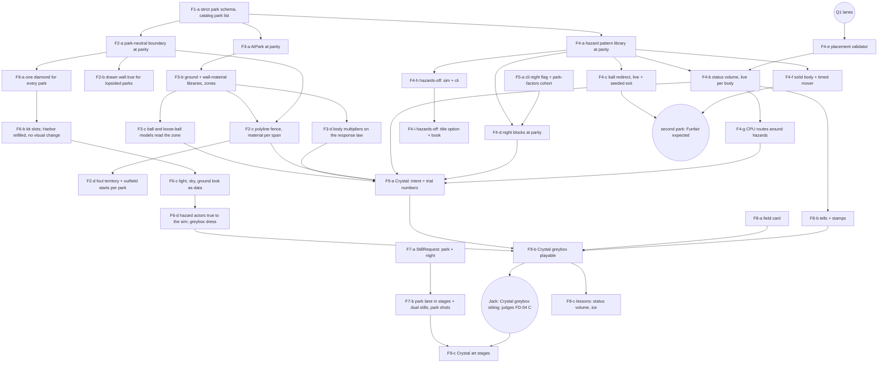

# Fields — implementation map and ledger

Tracker: [#814](https://github.com/jackguillet/grand-sluggers/issues/814). Design: [plan](plan-fields.md), [register](research/fields-decisions.json), [research](research-fields.md). Contract: [gameplay-spec.md](gameplay-spec.md) §0.3 (D21), §14, Appendix A.10, Appendix B.9. Audit baseline: `d0c6e12c` ([sim map](research/fields-code-map-sim.md), [presentation map](research/fields-code-map-presentation.md)).

This file orders the work. It does not reopen a decision and it selects no number. The register stays the record of what Jack accepted. A child issue is filed only when its contract is ready (plan rule 6); the rows below are a map, not thirty filed tasks.

## 1. What the audit found that sets the order

| # | Finding | Where | Effect on the order |
| --- | --- | --- | --- |
| 1 | The park loader drops unknown fields with no error. The rule tables refuse them. | `ContentValidation.cs:42-47`, `Rules.cs:111` | Make the schema strict **before** any child adds a park field, or a misspelled field silently plays Harbor. F1-a is first. |
| 2 | A match already plays on one derived table: `content.Rules.AtLevel(difficulty)`. | `Match.cs:98`, `Rules.cs:38` | `AtPark(park)` follows the same shape. No consumer has to learn a second way to find a number. |
| 3 | `Diamond`, `ParkDiamond` and `RunnerAi` read the process-wide `Rules.Default`. 118 call sites fall back to it. | `Diamond.cs:15-52`, `ParkDiamond.cs:15,24,420`, `RunnerAi.cs:82` | F3-a audits every flight and ground reader. A reader that falls back plays Harbor's air in another park and no test fails. |
| 4 | The foul wrap, rail and backstop are `HarborWall` literals for every park. #732 owns two of them (36 ft, 95 ft). | `FieldBounds.cs:105-188`, `HarborWall.cs:21-32,114,183` | F2-a moves them into data **at today's values** (the #711 move). It changes none of them and adds none to `trials/c80`. |
| 5 | The flight already clips against a polygon sampled from `FenceAt(park, bearing)`. | `FieldBounds.cs:133`, `AtBatResolver.cs:239` | A polyline fence is cheap if the fence stays one distance per bearing (§5 Q4). 16 callers keep working. |
| 6 | Every hazard is one test on the landing point. The slow is a play-wide flag read at 7 sites. | `Fielding.cs:69-90, 402-407`, `LivePlaySystem.Field.cs:1286,1570,1757,1831` | The pattern library lands at parity first (F4-a). The live touch test (F4-b) is a behavior change and re-reports S-29. |
| 7 | Eight status volumes sit on a running lane or a bag pad today (§5 Q1). Nobody notices, because no body touches a hazard. | probe in §5 Q1 | They must be resolved before F4-b makes them real. |
| 8 | The body effect (FD-04) scales the #718 response law. The shipped root has the law off (`accelSec` 0 / `brakeSec` 0). | `data/rules/fielding.json:31-32`, `trials/c80/rules/fielding.json:39-40` | The body effect, and the sitting that judges full traction, exist only on `trials/c80` today (§5 Q2). |
| 9 | A trial park must carry every key its shipped park carries. | `DataRoot.cs:280-341`, `CompactGeometryTests.cs:1039` | A new **required** park key lands in twelve files. Optional blocks that Harbor does not name cost nothing. Prefer optional blocks. |
| 10 | S-29 plays 35 of 50 games away from Harbor. | `AtBatScenarioTests.cs:690` | Every behavior child re-reports S-29 and the park factors, before and after. It never tunes to pass (FD-13). |
| 11 | Two diamonds are drawn. Five parks never draw the foul rail the ball hits. | `ParkView.cs:181-273`, `HarborKit.cs:86-99` | F6-a (one diamond for every park) waits for F2-a, because the kit must read the park-neutral boundary. |
| 12 | `StillRequest` cannot name a park or night. | `StillRequest.cs:15-34` | F7-a is small, has no dependency, and unblocks every later look. |

### Found by the first five children (September 22, 2026)

| # | Finding | Where | Effect |
| --- | --- | --- | --- |
| 13 | `HarborWall.HipHeight` was a `float`, so the clip polygon has always stood at `(double)4.2f`. Authoring 4.2 as a table double would have moved the polygon by 2e-7 ft. | `ParkBoundary.RailTopFt`; protocol row `float-const-widens-when-it-moves-into-data` | Every child that moves a `float` literal into data narrows once, named, and pins it (F2-c, F2-d, F3-b). |
| 14 | `RulesTable` copies list sections by hand; a clean rebase silently dropped F2-a's `Boundary` from `AtPark`, and every test stayed green. | `Rules.cs` `AtLevel` / `AtPark`; protocol row `derived-table-copy-drops-a-section`; a reflection test now asserts every untouched section is the same reference | Any new derived table or new section runs that test. |
| 15 | The resolved table did not reach the first flight: `AtBatResolver` / `FieldingResolver` are built with `content.Rules`. Inert while no park names air. | `Match.cs:107-108, 977` | F3-a2 (#838). Any park value waits for it. |
| 16 | Funfair's chompers do nothing on `trials/c80`: the three literal discs sit at 198–228 ft, outside the trial's ×0.70 fences. Crystal at night is 1.34 runs / 1.55 HR against Harbor on the shipped root. | `park-factors` cohort report in PR #834 | Findings, not targets (FD-13). F4-a moves the chompers into data; §5 Q9 covers Crystal's window. |
| 17 | `tools/game-feel-scale-probes --check` was already stale on `main` before F2-a; it seals `HarborWall.cs` and is #730's, not in CI. | PR #833 | Leave to #730. |
| 18 | The sibling worktrees share one scratchpad root, so a fixed scratch filename (`pr-body.md`) can be overwritten by another session. | PR #832 | Scratch files carry the PR number. |

## 2. Rails every child carries

- **Parity first (FR-06).** A rail child changes no behavior. It proves that with seed 7, S-29 and the Harbor cohorts unchanged, and with seals that move by hash only.
- **Evidence seals (FR-16).** CI hashes `Models.cs`, `Rules.cs`, `FieldBounds.cs`, `HarborWall.cs`, `BallFlight.cs`, `BattedBall.cs`, `AtBatResolver.cs`, `Fielding.cs`, `FlyCatch.cs`, `ParkDiamond.cs`, `Match.cs`, `LivePlaySystem.Field.cs`, `ContentValidation.cs`, `data/parks/harbor-diamond.json`, `flight.json`, `fielding.json`, `running.json`. Order: `dotnet run --project tools/game-feel-flight-probes -- --write`, then `python3 tools/compact-field-report.py`, then both `--check`.
- **Trace identity.** `PlayTraceIdentity` serialises the whole `Park` record. A new `Park` member moves every stored identity SHA in `docs/research/game-feel-3d-race-*.json` and `game-feel-702-baseline.json`. Say so in the PR and regenerate; do not hide the member from the identity.
- **`Park` is built positionally** in `tools/game-feel-flight-probes/Program.cs:44`. A new member has a default and goes last.
- **c80 parity.** A shipped park edit has its `trials/c80` twin in the same PR. `CompactGeometryTests` key equality stays green.
- **#730 / #732 numbers are banned** until those issues close: hazard radii, `pipeReachPadFt`, `emberNightFireMul`, `HarborWall.FoulOffset`, `flareStart`, `infieldLipFt`, the fielder starts. A fields child may move one into data at its current value. It may not change one.
- **Rules tables use named properties.** A `Dictionary` or a `List` bypasses the reflective validator and the JSON = code parity test. Ground, wall-material and hazard-type rows are named properties.
- **One seeded stream.** A child that changes the count or order of `_rng` draws reseeds every `AutoPlay` game. It re-reports S-29, never tunes.
- **Shared files with the pitching and hitting children (#803).** `Models.cs`, `Rules.cs`, `Match.cs`, `ContentValidation.cs` and the seals. One child at a time merges across both tracks; the later one rebases and regenerates.
- **Second client.** `src/GrandSluggers.Play` draws parks too (`WorldView.cs`, `Palette.cs`) and must keep building.
- **`unity/` is not in the solution.** Only `tools/unity-compile.sh` sees a Unity call site.
- **A stored double pins the platform.** Goldens store libm-free bits (#811). A child is done when `portable` CI is green on its final head.
- **Register.** Each child appends its issue and PR to `implementation_issues`, adds `validation_evidence`, appends `history`, and never writes `human_acceptance`. A number needs `trial-accepted` from Jack first.
- **Session kinds.** Sim and data = Gameplay. Unity, HUD, the book pair, lesson copy = Presentation. Blender and stills = Art. Separate PRs.
- **No park art** before that park's greybox sitting (FD-01, FD-17).

## 3. Dependency map

Four children have no dependency and touch different files: **F1-a**, **F5-a**, **F7-a**, and the docs. F1-a goes first because every other Gameplay child adds park data.

### F1 — Schema and catalog (Gameplay)

| Child | Scope | Decisions | Needs from Jack |
| --- | --- | --- | --- |
| **F1-a** #820 ✅ | Park files refuse an unknown field, the way rule tables do. Dead fields resolved: `notes` becomes a declared, rule-free member; `nightOnly`, `dayOnly` and the train's `periodSec` are removed from all twelve files (FD-11's night block and F4-f's mover row bring back what a park needs). The park list comes from the catalog, not from a literal in `ExhibitionPick`. The home-park map becomes data: a captain's home park is the park whose `faction` is his, else Harbor, which reproduces `Teams.HomeParkId` exactly. An unknown park id is an error, not Harbor. SF-02, SF-04 (sim half). No behavior change. | FD-01, FR-03, FR-04 | Nothing |

### F2 — Geometry owner (Gameplay, then Presentation)

| Child | Scope | Decisions | Needs from Jack |
| --- | --- | --- | --- |
| F2-a #826 ✅ | A park-neutral boundary type. The foul wrap, flare, rail height and backstop move from `HarborWall` literals to data at today's values; `FieldBounds` and the validator stop naming Harbor; the cache key carries every input. SF-08. #732's numbers move but do not change. | FD-07, FR-05 | Nothing |
| F2-b | The drawn wall stops mirroring right field onto left; `HarborWallTests` covers both sides of all six parks. SF-05. | FD-06, D15 | **§5 Q5**: near the pole the drawn rail ramps to the fence while the sim rail stays 4.2 ft. Which is the rule? |
| F2-c | The polyline fence: optional `fence.points` in FD-12 units, a height per point, a wall material per span; `FenceAt` reads it; the clip polygon keeps the vertices; the track, the poles and the drawn wall follow. The three-post circle is the default. SF-06, SF-07, SF-12. | FD-06, FD-12 | **§5 Q4**: the one-distance-per-bearing guardrail |
| F2-d | Optional per-park foul parameters and the three outfield starts; the default depth stays the #730 fraction rule. `Diamond.Positions` is process-wide today, so the starts need a match-scoped source. SF-09. | FD-07 | Nothing; values come with a park |

### F3 — Environment table (Gameplay)

| Child | Scope | Decisions | Needs from Jack |
| --- | --- | --- | --- |
| F3-a #827 ✅, F3-a2 #838 | `RulesTable.AtPark(park)` beside `AtLevel`. An optional `environment` block on a park; no park names one. Audit and fix every flight and ground reader that falls back to `Rules.Default`. SF-01. | FD-03, FR-01 | Nothing |
| F3-b | `grounds` and `walls` libraries as named rows (grass, dirt, ice, ash, …; padded, …), every row seeded with today's global numbers. Zones (infield dirt, outfield, track, apron) from existing geometry; `surface` becomes the zone map. SF-03. Behavior-identical. | FD-05, FR-02 | Nothing |
| F3-c | The flight reads the zone under the ball for roll and bounce, and the span's row for a carom. The overthrow and bobble models read the same row. SF-10, SF-11, SF-12, SF-14 on a fixture root with unequal rows. Shipped rows stay equal, so play is identical. | FD-03, FD-05 | Nothing |
| F3-d | Body multipliers on a ground row: start, brake, cut-back (response law), slide, overrun. All 1.0. SF-13. | FD-04 B | Nothing. Values come with Crystal (F9-a) |

### F4 — Hazard runtime (Gameplay; one Presentation child)

| Child | Scope | Decisions | Needs from Jack |
| --- | --- | --- | --- |
| F4-a | The pattern library at parity: a closed type table as named rows (pattern, acts-on, numbers); `ParkHazards` reads rows, not type strings; chompers become data instances; `pipeReachPadFt` and `emberNightFireMul` move under their rows at today's values. SF-03, SF-04. Same outcomes as today, rolls included. | FD-09, FR-08 | **§5 Q6**: the four inert types |
| F4-e | The placement validator on both roots. SF-23. | FD-19 | **§5 Q1** first |
| F4-b | Status volume, live: a per-body touch test in the tick, a duration, a typed event; the play-wide flag and the park's `drops.frozen` roll go. `ParkSlowRowsTests` is re-authored to the decision. SF-20, SF-22. **Behavior change**: re-report S-29 and park factors. | FD-08-R1, FR-07 | **§5 Q7**: the duration, and whether 0.45 stays |
| F4-g | The CPU route costs a volume and goes around a body; no foresight of a draw. SF-26. | FD-14 | Nothing |
| F4-d | Night blocks: Crystal's window, Ember's reach and Funfair's chompers move into `night` at parity. SF-25. | FD-11 | Nothing to move them. **§5 Q9** before Crystal's block is final |
| F4-h | Hazards off in the sim and the CLI: an empty instance list, nothing else. SF-24. | FD-10 | Nothing |
| F4-i | Presentation: the title option, the book pair, `HowToPlay`. | FD-10 | Placement on the title (at review) |
| F4-c | Ball redirect, live: the ball leaves at the entry and re-enters at the exit; the exit is a seeded draw and a typed event. SF-21, SF-27. With the second park. | FD-08, FD-08-R1 | Exit speed and heading as a trial |
| F4-f | Solid body and timed mover. SF-28. With the park that needs them. | FD-09 | **§5 Q8** for the catch stealer |

### F5 — Measurement (Gameplay)

| Child | Scope | Decisions | Needs from Jack |
| --- | --- | --- | --- |
| F5-a #828 ✅ | `cli match --night`. `--cohort park-factors [--table]` in `RaceCohort`: five S-29 pairs both ways, seeds 1–5, day and night, every catalog park, factors against Harbor; `--hazards off` waits for F4-h. SF-30. A report, not a gate. | FD-02, FD-13, FR-10 | Nothing now. **§5 Q10 / Q11** at tuning time |

### F6 — Field kit (Presentation)

| Child | Scope | Decisions | Needs from Jack |
| --- | --- | --- | --- |
| F6-a | Every park draws the one diamond from the geometry owner: bags, chalk, boxes, mound, dirt, the foul rail and backstop. The `ParkView` fallback diamond retires. Harbor does not change. `StarMeter` reads the geometry owner. | FD-16, FR-13 | A look at five parks (at review) |
| F6-b | Kit slots in `data/art/parks.json` with a validator; `cli art` lists each park's empty slots. Harbor fills them with no visual change. | FD-16 | Nothing |
| F6-c | Light, sky, fog, ground and wall colors as data chosen by the park, not by an id `if` chain. Same looks. | FD-16, FR-04 | Nothing |
| F6-d | Hazard actors by pattern, drawn at the sim's true size (the pad included). Greybox dress from data. The five per-park methods retire. | FD-16 | **§5 Q12**: the old primitive backdrops |

### F7 — Look gates (Presentation / Art process)

| Child | Scope | Decisions | Needs from Jack |
| --- | --- | --- | --- |
| F7-a #829 ✅ | `StillRequest` gains `park` and `night`; `tools/still-gate.sh` takes both. | FD-17, FR-14 | Nothing |
| F7-b | A park lane in `dcc-stages.json` and `dual-stills.json` and their validators; named park shots; park rows and a greybox-sitting checklist in `screenshot-gate.md`. `harbor_kit.py` constants pinned by test or read from data. | FD-17 | Nothing |

### F8 — Legibility (Presentation + Gameplay setup)

| Child | Scope | Decisions | Needs from Jack |
| --- | --- | --- | --- |
| F8-a | The field card from the resolved park; the per-id copy switch in `CarnivalFront` goes. | FD-15 | Icons and copy (at review) |
| F8-b | Tells and stamps from typed hazard events: a body tell for a status, a ball tell for a redirect. | FD-15, FR-15 | A look (at review) |
| F8-c | Lessons: one per pattern and per ground. A lesson names its park; a random hazard's lesson fixes its seed. Gameplay setup child plus Presentation child. SF-40. | FD-15 | The learning gate stays Jack's |

### F9 — Crystal Rink, the proving park

| Child | Scope | Decisions | Needs from Jack |
| --- | --- | --- | --- |
| F9-a | Crystal declares its intent, then names its differences as a scoped numeric trial: an ice outfield row, a glass-board wall material, its air, its body multipliers, its volumes off the lanes, its night block. | FD-18, FD-02, FD-13 | **§5 Q2** (where the numbers live) and **trial acceptance** |
| F9-b | Crystal plays as a greybox in the standalone (`local-player --trial`). | FD-17 | **The greybox sitting**, which also judges FD-04 C |
| F9-c | Art stages for Crystal. | FD-17, #37 | The look gate |

## 4. Scenario ids

The `SF-xx` block, reserved in GS Appendix B.9 (SF-01 … SF-14 environment and geometry, SF-20 … SF-28 hazards, SF-30 measurement, SF-40 lessons). Every id appears in a test method name (`SF01_…`). Free: SF-15 … SF-19, SF-29, SF-31 … SF-39, SF-41 upward. The pitching and hitting work uses `S-83 … S-89` and `S-107` upward; the two blocks do not meet.

Rows that change with the design: `ParkSlowRowsTests` (the play-wide slow becomes per body, F4-b), `NightTests` (three rules move, F4-d), `HarborWallTests` (both sides, then spans, F2-b / F2-c), the park rows in `MatchTests` (`InFreeze`, `WarpIfPipe`, billboards, clamber), `CompactGeometryTests` (key sets grow). A re-authored row cites the decision that changed it. S-29 is a guardrail that is re-reported, never tuned.

## 5. Questions that are Jack's

One at a time, in the order they start to block. **None blocks F1-a, F2-a, F3-a, F3-b, F5-a or F7-a.**

1. **Eight status volumes sit on a running lane or a bag pad.** FD-19 forbids that, and its scope says a failing hazard comes back to you. Found with the lane half-width 5 ft, bag pads 12 ft, home pad 18 ft, mound 9.2 ft from `ParkDiamond`:

   | Root | Park | Hazard | Place | Crosses |
   | --- | --- | --- | --- | --- |
   | shipped | Crystal Rink | `freeze_volume` | (40, 70) r 8 | first → second lane by 0.8 ft |
   | shipped | Crystal Rink | `freeze_volume` | (−45, 90) r 8 | second → third lane by 7.5 ft |
   | shipped | Ember Keep | `lava_pit` | (38, 78) r 10 | first → second lane by 7.0 ft |
   | shipped | Ember Keep | `lava_pit` | (−42, 96) r 10 | second → third lane by 7.4 ft |
   | c80 | Crystal Rink | `freeze_volume` | (−40, 80) r 5.6 | second → third lane by 5.7 ft |
   | c80 | Crystal Rink | `freeze_volume` | (7, 126) r 7 | second base's pad by 4.4 ft |
   | c80 | Ember Keep | `lava_pit` | (34, 69) r 7 | first → second lane by 4.8 ft |
   | c80 | Ember Keep | `lava_pit` | (−37, 85) r 7 | second → third lane by 5.7 ft |

   Funfair's cans and Canopy's barrels pass. Recommended: move each one outward along its own bearing until it clears the lane by its radius, keep its size, and let F9-a place Crystal's for play. Blocks F4-e, then F4-b.
2. **Where do a park's first numbers live?** Recommended: in `trials/c80` only. The body effect needs the response law, which is on only there; FD-13 says park numbers are trial anchors; and the sitting runs in a `local-player --trial` window. The shipped Crystal stays as it is until a single default exists. Blocks F9-a.
3. **How do you want to judge ground, air and wall numbers?** Recommended: as for the pitch shapes — a headless probe table first (same ball, two states), then you play them in the trial window, then accept. Blocks F9-a.
4. **The polyline guardrail.** One fence distance per bearing from home: notches, porches and alleys are legal; an overhang or a fence behind a fence is not. It keeps `FenceAt` a function, so the depth rule, the C80 scale, the clamp and the cameras keep working. Blocks F2-c.
5. **The rail near the foul pole.** The drawn rail ramps from 4.2 ft up to the fence from 95 ft out; the sim rail is 4.2 ft all the way, and #732 showed pulled balls scored foul for crossing it. Which one is the rule? This sits beside #732. Blocks F2-b.
6. **Statue, train, AC unit, tree.** They are validated types that do nothing. Recommended: declare them as a `decoration` pattern now (an honest no-effect row), and give each a real pattern when its park comes up. Blocks F4-a.
7. **The status volume's numbers.** How long a touch slows a body, and whether 0.45 stays (#730 owns 0.45's neighbors, not 0.45). A scoped trial. Blocks F4-b.
8. **The catch stealer.** A chomper makes an out with no glove. Keep it, change it to a ball redirect, or drop it? Blocks Funfair, not Crystal.
9. **Crystal's night.** Today: contact window × 0.85, on the at-bat, with no reference source. The reference blackout is a fielding-phase event that a batted ball triggers. Keep, replace, or drop? Blocks Crystal's night block in F9-a.
10. **The FD-02 band as numbers.** Bounds, seeds, cohort size, per-event bands. At tuning time.
11. **S-29's pool.** Six parks pooled, or Harbor only plus a park-factor check? At tuning time.
12. **The old primitive backdrops** (palace, ferris wheel, skyline, castle, trees). They are code chosen by park id, which FR-04 retires. Keep them as named greybox builders behind the backdrop slot, or draw greyboxes with no backdrop until art? Blocks F6-d.

## 6. Ledger

| Child | Issue | PR | Merged | Tested revision | Human gate |
| --- | --- | --- | --- | --- | --- |
| Foundation: research, maps, register, all 19 directions | #814 | #815 | `4dc31699` | `df08c631`: `portable` CI green; docs and one research tool; `cli art` OK; seed 7 unchanged | none |
| Spec reconciliation (D21, §0.3, §14, A.10, B.9), doc corrections, this map | #814 | #819 | `f88ee67a` | docs only | none |
| F1-a strict park schema; park list and home-park map from data | #820 | #831 | `248109da` | `af991e32`: 1838 / 1838, 731 / 731 c80 rows, seals hash-only, seed 7 and park factors identical | none |
| F2-a park-neutral boundary at parity (`boundary.json`, `ParkBoundary`) | #826 | #833 | `5a4d60f1` | `eb93f639`: 1856 / 1856, 749 / 749, seals hash-only, seed 7 identical; the `float` 4.2 rail kept bit-exact and pinned | none |
| F7-a `StillRequest` park + night; `still-gate.sh --park --night` | #829 | #830 | `21c00685` | `77936c34`: 1862 / 1862, 749 / 749, no seal moved; validated against the catalog after #820 removed the literal | none (no still captured; a compile is not a still) |
| F3-a `AtPark`, optional air `environment` block, at parity | #827 | #832 | `ae774c36` | `8255a9fa`: 1879 / 1879, 766 / 766, seals hash-only, seed 7 identical; identity SHAs unmoved (null is not serialised) | none |
| F5-a `cli match --night`; `park-factors` cohort (a report) | #828 | #834 | `3dcb0528` | `c2733a5e`: 1882 / 1882, 767 / 767, no seal moved; three cohorts byte-identical | none |
| F3-a2 the resolved park table reaches the resolvers (found by F3-a) | #838 | — | — | — | none |
