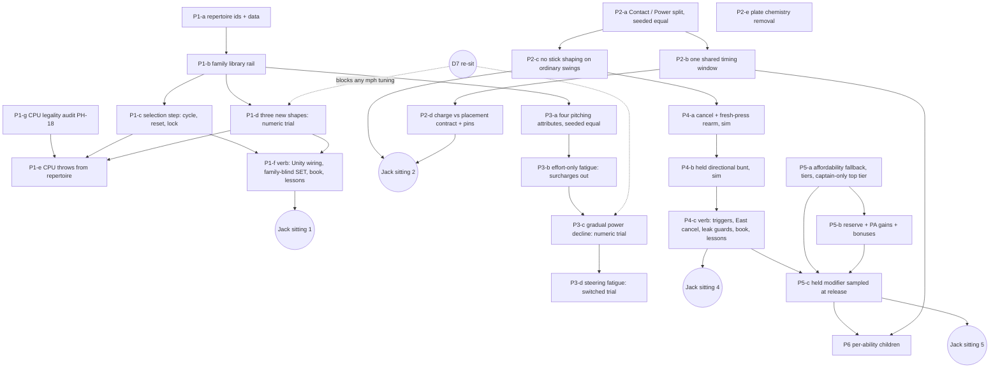

# Pitching and hitting — implementation map and ledger

Tracker: [#803](https://github.com/jackguillet/grand-sluggers/issues/803). Design: [plan](plan-pitching-hitting.md), [register](research/pitching-hitting-decisions.json), [research](research-pitching-hitting.md). Foundation PR #805 merged as `a9204a8c` on September 21, 2026. Audit baseline: `a9204a8c`.

This file orders the work. It does not reopen a decision and it selects no number. The register stays the record of what Jack accepted. A child issue is filed only when its contract is ready (plan rule 6); the rows below are a map, not twenty filed tasks.

## 1. What the audit found

Three read-only maps (pitching code, batting / fatigue / Star code, spec and teaching surface) were taken at `a9204a8c`. The findings that set the order:

| # | Finding | Where | Effect on the order |
| --- | --- | --- | --- |
| 1 | A pitch type is a free string plus a `Changeup` bool. Only `"changeup"` branches. Any other string flies as a fastball, silently. | `Models.cs:224-238`, `PitchFlight.cs:56`, `PitchTests.cs:103-110`, GS:400 | The family set must be closed and validated before a third family can exist. |
| 2 | No sim-side pitcher input exists. The SET state machine is Unity fields. The changeup is one poll on the release frame. | `AtBatDirector.cs:139-184, 324` | Selection, reset and the charge-start lock need a new pure sim step first. Unity then reads it. |
| 3 | `Controls.CyclePitch` (RB / Tab) already exists. The mound does not read it. | `Controls.cs:125` | No new binding code. The pitching seat is free in SET. |
| 4 | The shared screen shows the pre-charge selection today: aim tell, SET pose, CHANGE card, ball tint. | `AtBatDirector.cs:190, 221-234, 269-286`, `BroadcastHud.cs:18-22`, `BallView.cs:290` | PH-02-R5 / PH-06 need a family-blind SET. Presentation child. |
| 5 | The CPU pitcher is not inside human limits: solved endpoint aim (with height), instant full break, exclusive verbs. | `Match.cs:1129-1197` | PH-18 audit is its own child. "Pick a family" does not fix it. |
| 6 | Charge, the Bat rating, difficulty, three Star Pitches and one park all change the **timing** window today. | `AtBatResolver.cs:179-191`, `batting.json:2-12`, `cpu.json`, `star-skills.json:17,49,57` | PH-11-R1, PH-15-R7, PH-17 and PH-16-R1 all land on one formula. One shared window value is a number Jack accepts. |
| 7 | Normal movement while loading (PH-09-R1), match-long per-character fatigue with no swap recovery (PH-08-R2) and one Star pool per team (PH-16-R4) are already true. | `AtBatDirector.cs:164,392`, `Match.cs:49,943-950,46-47` | These need scenarios that pin them, not code. |
| 8 | Fatigue is a step at `tiredBelow`, with a random aim wobble. Surcharges are `homerCost` and `runCost` only; no hit surcharge exists. | `Match.cs:915-936,1494,1947` | PH-08-R3 is a small removal. The gradual curve and the wobble are a separate trial. |
| 9 | The sim never checks Star affordability. Stars are a North toggle. Costs are flat (1 / 2). Gains are events only. | `Match.cs:1980-1993`, `AtBatDirector.cs:156-157`, `stars.json` | The PH-16-R12 fallback must live in `Match`. |
| 10 | Bunt is West held plus a South release, judged on the swing clock. Direction is the stick. `SquareSec` carries no side. | `AtBatDirector.cs:161,390-397`, `AtBatResolver.cs:121-128` | The held bunt is a new contact test and a new typed fact for the defense. |
| 11 | LT is the item modifier. A third-side bunt hold carried past contact turns the first dash press into an item throw. East skips a Training lesson. | `Controls.cs:113-137`, `MatchDirector.cs:728`, `TrainingDirector.cs:87` | Leak guards are part of the bunt / cancel verb child, with scenarios. |
| 12 | Two outcome rolls remain at the plate: the phonyball whiff and the sour cheap foul pull. The tired wobble is a third roll on location. | `AtBatResolver.cs:66, 233-236`, `Match.cs:922-923` | Rulings needed in Phases 3 and 6. |

## 2. Rails every child carries

- **Evidence seals.** CI hashes `Match.cs`, `Rules.cs`, `Models.cs`, `AtBatFeel.cs`, `AtBatResolver.cs`, `ContentValidation.cs`, `StarSkillTable.cs`, `role-players.json`, `vale.json`, `brondo.json`, `star-skills.json`, `batting.json`, `table.json`, Unity `Controls.cs`, `AtBatDirector.cs`, `MatchDirector.cs`. Order: `dotnet run --project tools/game-feel-flight-probes -- --write`, then `python3 tools/compact-field-report.py`, then both `--check`. A behaviour-identical child must change hashes only.
- **One seeded stream.** Any change to the count or order of `_rng` draws in `CpuPitch` / `CpuSwing` reseeds every `AutoPlay` game. That child re-reports S-29 and S-27 before and after. It never tunes to pass.
- **Rules tables use named properties.** A `Dictionary` or `List` bypasses the reflective validator and the JSON = code parity tests (`Rules.cs:239-268`, `RulesTests.cs:36,48`).
- **c80 parity.** `trials/c80` overlays whole files. A new required field in `role-players.json` or a rules file needs the same row there.
- **Tutorial validator coupling.** `RoleTables` rows, `mechanics.json` and `lessons.json` move together or `cli tutorials` fails. A mechanic with no `RoleTables` row is invisible to the gate, so a new verb needs a row.
- **Second client.** `src/GrandSluggers.Play` compiles against the sim. A signature change must keep it building.
- **Unity reads `Rules.Default`** in `PitchFlight` calls (`AtBatDirector.cs:337,355,425`). A family table must be read through the match's table or a trial overlay diverges.
- **Register.** Each child appends its issue and PR to `implementation_issues`, adds `validation_evidence`, appends `history`, and never writes `human_acceptance`. Numbers need `trial-accepted` from Jack first.
- **Session kinds.** Sim and data = Gameplay. Unity wiring, HUD, book pair, lesson copy = Presentation. Separate PRs. The book pair (`HowToPlay.cs` + `docs/how-to-play.md`) moves in the PR where the couch verb actually changes.

## 3. Dependency map

### Phase 1 — ordinary pitch repertoire and selection

| Child | Kind | Scope | Decisions | Needs from Jack |
| --- | --- | --- | --- | --- |
| **P1-a** #807 | Gameplay | Closed family id set. `repertoire` on all 25 characters, shipped and c80. Validator. Register provenance test. No behaviour change. | PH-15-R1..R4, PH-02-R1/R2 | Nothing |
| P1-b | Gameplay | One family row schema in `pitching.json` (named rows). Fastball and Changeup rows carry today's exact numbers; flights bit-identical. `PitchCommand` carries a family; the `Changeup` bool and the silent fastball fallback go. Per-family stamina cost key replaces `changeupCost`, same value. Reconcile GS:400 and §4.3 first. | PH-02-R2, PH-03, PH-15-R1 | Nothing |
| P1-c | Gameplay | Pure sim selection step beside `ChargeButton`: cycle before arm, wrap, reset to Fastball each pitch and on a swap, lock on the arm edge, later cycle presses ignored. Same-tick rule written in the spec. Scenarios for every repertoire, both seats. | PH-02-R3/R4/R5 | Nothing. No pitcher cancel is added (PH-02-R3 leaves it unselected). |
| P1-d | Gameplay | Curveball, Slider, Sinker rows as a **scoped numeric trial**: units, conditions, rationale, headless evidence (crossing, drop, sweep by hand, air time). All speeds stay inside today's changeup–fastball envelope so D7 is untouched. | PH-02-R2, PH-03, PH-04 | **Trial acceptance.** See §5 Q1. |
| P1-g | Gameplay | PH-18 audit turned into code: CPU aims through legal inputs, accumulates break, may combine verbs as a human can. | PH-18 | Nothing to start; re-report S-29. |
| P1-e | Gameplay | CPU picks a family from its repertoire with the presses a human has. Mix columns become family weights (named). S-27, S-28, S-67 follow. | PH-15, PH-18 | Nothing; re-report S-29. |
| P1-f | Presentation | Mound reads `CyclePitch`; director builds the pitch from the locked family; West changeup retired; SET is family-blind (aim tell, pose, card, tint); three pitches shown in order with no active mark; book pair, `RoleTables`, `Scheme`, `ControlDiagram`; T-P03 reworked, cycle lesson added. | PH-02-R5, PH-06 | **Sitting 1**: both schemes, two pads. |

### Phase 2 — ordinary batting

| Child | Kind | Scope | Decisions | Needs from Jack |
| --- | --- | --- | --- | --- |
| P2-a | Gameplay | `contact` and `power` on every character, seeded from `bat`; resolver, CPU reads, `Teams`, CLI read the right one. Behaviour-identical. Reconcile GS:334. | PH-15-R5 | Nothing. Authored values later. |
| P2-b | Gameplay | One timing window for every hitter, swing type and difficulty: remove `chargeFrames` vs `slapFrames`, `framesPerContact`, `humanWindowMul` from the window. S-10 and S-30 rewritten. | PH-11-R1, PH-15-R7, PH-17 | **The one window value** (§5 Q2). Park night multiplier stays (not selected). |
| P2-c | Gameplay | Ordinary swings ignore stick spray and loft. Invariance scenario replaces S-13. CPU aim sigmas go (re-report S-29). Bunt direction stays on the stick until P4-b. T-B06 / T-B06-F retire with their lesson rows. | PH-12 | Nothing |
| P2-d | Gameplay | Charge narrows the spatial barrel only (already `chargeMul`); Contact scales the spatial barrel only. Pins for PH-09-R1. One sim helper for the drawn oval so Unity stops re-deriving it. | PH-11-R1, PH-15-R7, PH-09-R1 | Nothing |
| P2-e | Gameplay | Remove buddies-on-base widen and charge power. | PH-16-R14 | **Two edges** (§5 Q5). |
| P2-f | Presentation | Book pair, card bars for Contact / Power, difficulty copy. | PH-15-R5, PH-17 | **Sitting 2** |

### Phase 3 — pitching attributes and fatigue

| Child | Kind | Scope | Decisions | Needs from Jack |
| --- | --- | --- | --- | --- |
| P3-a | Gameplay | Velocity, Movement, Control, Endurance seeded from `pitch`; each reader takes the right one (mph, natural break, steer rate, pool). Behaviour-identical. | PH-15-R6 | Nothing |
| P3-b | Gameplay | Remove `homerCost` and `runCost`. S-25 rewritten. Pin PH-08-R2 (returning arm keeps fatigue). | PH-08-R3, PH-08-R2 | Nothing; re-report S-29. |
| P3-c | Gameplay | Gradual peak-power decline replaces the step. The random tired wobble needs a ruling against "no random misses". | PH-08, PH-08-R1, PH-05-R1 | **Trial acceptance; D7 first** |
| P3-d | Gameplay | Steering-correction fatigue behind a data switch, off on the shipped root. | PH-08-R1 (tentative) | Compare, then decide |

### Phase 4 — bunt and swing commitment

| Child | Kind | Scope | Decisions | Needs from Jack |
| --- | --- | --- | --- | --- |
| P4-a | Gameplay | `ChargeButton` gains cancelled and must-release states. Cancel before commit takes the pitch; the old hold's release cannot swing; no banked charge. Same-tick order written in the spec. | PH-13, PH-13-R1 | Nothing |
| P4-b | Gameplay | Bunt is a held side, latest press wins, changeable until contact, release-all withdraws, contact is geometric with no timed press. Side becomes a typed fact for the defense and the CPU sac bunt. Response curve is a trial. | PH-14-R1..R5 | **Trial acceptance** for the curve |
| P4-c | Presentation | `Controls` gains RT, J, L and the East cancel. Leak guards: LT into the item modifier, East into the Training skip and the dive. Editor gates, book pair, lessons. Both schemes, both hands, two pads. | PH-13-R1, PH-14-R5 | **LT ruling** (§5 Q4); **Sitting 4** |

### Phase 5 — Star resource and special-action contract

| Child | Kind | Scope | Decisions | Needs from Jack |
| --- | --- | --- | --- | --- |
| P5-a | Gameplay | `Match` checks affordability: unaffordable special = the ordinary action, no spend, a typed event. Cost tiers in data; top tier captain-only by validator. Missed Star Swing pays the ability's full cost. | PH-16-R3, R7, R8, R9, R12, R13 | Tier count and prices (trial) |
| P5-b | Gameplay | Usable starting reserve. Gain for both teams at the completed-plate-appearance seam (`NextBatter`, with the caught-stealing third-out edge named). Performance bonuses. | PH-16-R4, R5, R6 | Amounts (trial); captain-chemistry start (§5 Q5) |
| P5-c | Presentation | Held modifier, sampled at action release. Feedback for the fallback. Book pair, lessons. | PH-16-R10, R11, R12 | **Modifier binding** (§5 Q3); **Sitting 5** |

### Phase 6 — ability-specific effects

One child per reviewed ability or ability group, after P5. First: remove `batterWindowMul` from charmball, skullball and fogball with replacement effects Jack reviews (PH-16-R1); rule on the phonyball 40 % whiff roll; add an optional authored contact-area field for Star Swings (PH-16-R2). Each needs counterplay, geometry, data, validator and scenarios.

## 4. Scenario ids

Free: S-83..S-89 and S-101 upward. Letter suffixes split a row. Every id appears in a test method name (`S07_…`) and in GS Appendix B. Rows that must change with the design: S-04 (PH-18), S-10 and S-30 (window), S-13 (stick), S-19 (held bunt), S-25 (surcharges), S-27 and S-67 (repertoire). S-29 is a gate that is re-reported, never tuned.

## 5. Questions that are Jack's

One at a time, in the order they start to block. None blocks P1-a, P1-b or P1-c.

1. **How do you want to judge the three new pitch shapes?** Recommended: the numbers live in a trial overlay, you throw them in a `local-player --trial` window, and they move to the shipped table only after you accept. Blocks P1-d.
2. **The one shared timing window.** Today a slap has 9 frames and a charge has 7, plus 0.4 per Contact point. One value has to replace them. Blocks P2-b.
3. **The special modifier binding.** Today North / Q toggles. Blocks P5-c.
4. **LT as third-side bunt collides with LT as the item modifier.** Options: move the item modifier, or guard the hold across contact. Blocks P4-c.
5. **Two chemistry edges PH-16-R14 did not name:** the on-deck item offer, and starting Stars set by captain chemistry. Blocks P2-e and P5-b.
6. **The pale aim ring in SET** shows the crossing on the shared screen today. PH-06 says exact aim stays private. Keep, hide from the opponent's view, or remove? Blocks P1-f.
7. **Replacement effects** for the three timing-window Star Pitches, and the phonyball whiff roll. Blocks Phase 6.

## 6. Ledger

| Child | Issue | PR | Merged | Tested revision | Human gate |
| --- | --- | --- | --- | --- | --- |
| Foundation | #803 | #805 | `a9204a8c` | docs only | none |
| Phase 0 audit and this map | #803 | — | — | `a9204a8c` | none |
| P1-a | #807 | — | — | — | none (no player-facing change) |
