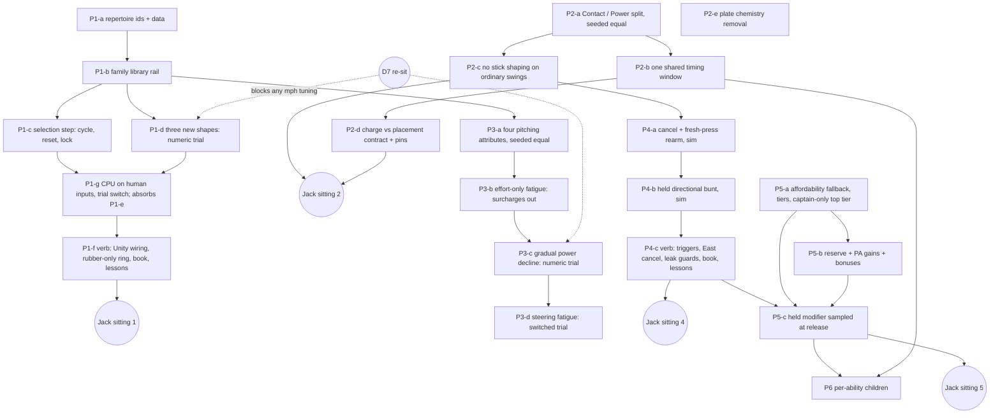

# Pitching and hitting — implementation map and ledger

Tracker: [#803](https://github.com/jackguillet/grand-sluggers/issues/803). Design: [plan](plan-pitching-hitting.md), [register](research/pitching-hitting-decisions.json), [research](research-pitching-hitting.md). Foundation PR #805 merged as `a9204a8c` on September 21, 2026. Audit baseline: `a9204a8c`.

This file orders the work. It does not reopen a decision and it selects no number. The register stays the record of what Jack accepted. A child issue is filed only when its contract is ready (plan rule 6); the rows below are a map, not twenty filed tasks.

## 1. What the audit found

Three read-only maps (pitching code, batting / fatigue / Star code, spec and teaching surface) were taken at `a9204a8c`. The findings that set the order:

| # | Finding | Where | Effect on the order |
| --- | --- | --- | --- |
| 1 | A pitch type is a free string plus a `Changeup` bool. Only `"changeup"` branches. Any other string flies as a fastball, silently. | `Models.cs:224-238`, `PitchFlight.cs:56`, `PitchTests.cs:103-110`, GS:400 | The family set must be closed and validated before a third family can exist. |
| 2 | No sim-side pitcher input exists. The SET state machine is Unity fields. The changeup is one poll on the release frame. | `AtBatDirector.cs:139-184, 324` | Selection, reset and the charge-start lock need a new pure sim step first. Unity then reads it. |
| 3 | `Controls.CyclePitch` (RB / Tab) already exists. The mound does not read it. | `Controls.cs:125` | No new binding code. The pitching seat is free in SET. |
| 4 | The shared screen shows the pre-charge selection today: aim tell, SET pose, CHANGE card, ball tint. | `AtBatDirector.cs:190, 221-234, 269-286`, `BroadcastHud.cs:18-22`, `BallView.cs:290` | PH-02-R5 / PH-06 need a family-blind SET. Presentation child. |
| 5 | The CPU pitcher is not inside human limits: solved endpoint aim (with height), instant full break, exclusive verbs. | `Match.cs:1129-1197` | PH-18 audit is its own child. "Pick a family" does not fix it. |
| 6 | Charge, the Bat rating, difficulty, three Star Pitches and one park all change the **timing** window today. | `AtBatResolver.cs:179-191`, `batting.json:2-12`, `cpu.json`, `star-skills.json:17,49,57` | PH-11-R1, PH-15-R7, PH-17 and PH-16-R1 all land on one formula. One shared window value is a number Jack accepts. |
| 7 | Normal movement while loading (PH-09-R1), match-long per-character fatigue with no swap recovery (PH-08-R2) and one Star pool per team (PH-16-R4) are already true. | `AtBatDirector.cs:164,392`, `Match.cs:49,943-950,46-47` | These need scenarios that pin them, not code. |
| 8 | Fatigue is a step at `tiredBelow`, with a random aim wobble. Surcharges are `homerCost` and `runCost` only; no hit surcharge exists. | `Match.cs:915-936,1494,1947` | PH-08-R3 is a small removal. The gradual curve and the wobble are a separate trial. |
| 9 | The sim never checks Star affordability. Stars are a North toggle. Costs are flat (1 / 2). Gains are events only. | `Match.cs:1980-1993`, `AtBatDirector.cs:156-157`, `stars.json` | The PH-16-R12 fallback must live in `Match`. |
| 10 | Bunt is West held plus a South release, judged on the swing clock. Direction is the stick. `SquareSec` carries no side. | `AtBatDirector.cs:161,390-397`, `AtBatResolver.cs:121-128` | The held bunt is a new contact test and a new typed fact for the defense. |
| 11 | LT is the item modifier. A third-side bunt hold carried past contact turns the first dash press into an item throw. East skips a Training lesson. | `Controls.cs:113-137`, `MatchDirector.cs:728`, `TrainingDirector.cs:87` | Leak guards are part of the bunt / cancel verb child, with scenarios. |
| 12 | Two outcome rolls remain at the plate: the phonyball whiff and the sour cheap foul pull. The tired wobble is a third roll on location. | `AtBatResolver.cs:66, 233-236`, `Match.cs:922-923` | Rulings needed in Phases 3 and 6. |

## 2. Rails every child carries

What a PR owes is [agent-rails.md](agent-rails.md) §1.2 (2026-09-22). Where a rail below asks for more, §1.2 wins: no local full suite, no reseal, no `trials/` twin, no register or ledger edit in a feature child. Balance runs on demand.

- **Evidence seals.** The seals hash `Match.cs`, `Rules.cs`, `Models.cs`, `AtBatFeel.cs`, `AtBatResolver.cs`, `ContentValidation.cs`, `StarSkillTable.cs`, `role-players.json`, `vale.json`, `brondo.json`, `star-skills.json`, `batting.json`, `table.json`, Unity `Controls.cs`, `AtBatDirector.cs`, `MatchDirector.cs`. A feature child does not reseal. A tuning PR or an evidence packet reseals, in this order: `dotnet run --project tools/game-feel-flight-probes -- --write`, then `python3 tools/compact-field-report.py`, then both `--check`.
- **One seeded stream.** Any change to the count or order of `_rng` draws in `CpuPitch` / `CpuSwing` reseeds every `AutoPlay` game. That child says so in the PR body and never tunes to pass. S-29 and S-27 are re-reported on demand (Actions → Full tests).
- **Rules tables use named properties.** A `Dictionary` or `List` bypasses the reflective validator and the JSON = code parity tests (`Rules.cs:239-268`, `RulesTests.cs:36,48`).
- **c80 parity.** On demand. `trials/c80` overlays whole files, so a new required field in `role-players.json` or a rules file is missing there until the trial is next used. If a breakage-suite test fails on the missing field, add that row and nothing more. Freeze, promote or retire C80 is open for Jack ([agent-rails.md](agent-rails.md) §1.3).
- **Tutorial validator coupling.** `RoleTables` rows, `mechanics.json` and `lessons.json` move together or `cli tutorials` fails. A mechanic with no `RoleTables` row is invisible to the gate, so a new verb needs a row.
- **Second client.** `src/GrandSluggers.Play` compiles against the sim. A signature change must keep it building.
- **`unity/` is not in the solution.** `dotnet build` and the test suite cannot see a Unity call site. Only `tools/unity-compile.sh` does, and a positional argument hides from a grep for the parameter name (#811, `StillCapture.cs`).
- **A stored double pins the platform.** `Math.Sin` differs by 1 ULP between macOS and glibc. A golden stores only libm-free bits and composes the rest on the running platform, still exact (#811). A child is not done until `portable` CI is green on its final head.
- **Unity reads `Rules.Default`** in `PitchFlight` calls (`AtBatDirector.cs:337,355,425`). A family table must be read through the match's table or a trial overlay diverges.
- **Register.** A child does not edit the register. One batched docs PR, at a phase checkpoint or when Jack asks, records Jack's answers and refinements and updates `implementation_issues`, `validation_evidence` and `history`. Nobody but Jack writes `human_acceptance`. Numbers need `trial-accepted` from Jack first.
- **Session kinds.** Sim and data = Gameplay. Unity wiring, HUD, book pair, lesson copy = Presentation. Separate PRs. The book pair (`HowToPlay.cs` + `docs/how-to-play.md`) moves in the PR where the couch verb actually changes.

## 3. Dependency map

### Phase 1 — ordinary pitch repertoire and selection

| Child | Kind | Scope | Decisions | Needs from Jack |
| --- | --- | --- | --- | --- |
| **P1-a** #807 | Gameplay | Closed family id set. `repertoire` on all 25 characters, shipped and c80. Validator. Register provenance test. No behaviour change. | PH-15-R1..R4, PH-02-R1/R2 | Nothing |
| P1-b #810 | Gameplay | One family row schema in `pitching.json` (named rows). Fastball and Changeup rows carry today's exact numbers; flights bit-identical. `PitchCommand` carries a family; the `Changeup` bool and the silent fastball fallback go. Per-family stamina cost key replaces `changeupCost`, same value. Reconcile GS:400 and §4.3 first. | PH-02-R2, PH-03, PH-15-R1 | Nothing |
| P1-c #812 | Gameplay | Pure sim selection step beside `ChargeButton`: cycle before arm, wrap, reset to Fastball each pitch and on a swap, lock on the arm edge, later cycle presses ignored. Same-tick rule written in the spec. Scenarios for every repertoire, both seats. | PH-02-R3/R4/R5 | Nothing. No pitcher cancel is added (PH-02-R3 leaves it unselected). |
| P1-d | Gameplay | Curveball, Slider, Sinker rows as a **scoped numeric trial**: units, conditions, rationale, headless evidence (crossing, drop, sweep by hand, air time). All speeds stay inside today's changeup–fastball envelope so D7 is untouched. | PH-02-R2, PH-03, PH-04, PH-20-R1 | **Trial acceptance** in the preview sitting (Q1 answered: trial window). |
| P1-g #823 (absorbs P1-e) | Gameplay | The CPU pitcher on human inputs, behind a switch in the `cpu` table: off on the shipped root (draws identical), on in `trials/pitch5`. Location by rubber walk only (no `AimX` / `AimY`); height is the family; family by presses over the pitcher's *selectable* slots with per-family weights per count row; charge and steer as modifiers; steer magnitude is what a held stick reaches in the air time; scatter becomes noise on the rubber. S-27, S-28, S-67 follow. Trial S-29 baseline re-reported. | PH-15, PH-18, PH-18-R1 | Sitting 1 judges the mix. |
| P1-f #825 | Presentation | Mound reads `CyclePitch`; director builds the pitch from the locked family; West changeup retired; SET is family-blind (aim tell, pose, card, tint); three pitches shown in order with no active mark; book pair, `RoleTables`, `Scheme`, `ControlDiagram`; T-P03 reworked, cycle lesson added. | PH-02-R5, PH-06, PH-06-R1 | Q6 answered: rubber-only ring. **Sitting 1**: both schemes, two pads. |

### Phase 2 — ordinary batting

| Child | Kind | Scope | Decisions | Needs from Jack |
| --- | --- | --- | --- | --- |
| P2-a #837 | Gameplay | `Contact` and `Power` on `Stats`, unauthored tracks `Bat` (the `Arm` / `Hands` pattern); the resolver and the CPU read the right one (§5.9 table); `Teams`, cards and CLI keep `Bat`. Behaviour-identical. | PH-15-R5, PH-15-R7 | **Authored values** are Jack's; nothing is authored yet. |
| P2-b #844 | Gameplay | `batting.window.shared` + `frames`: off shipped (bit-identical), on in `trials/pitch5` — one window for every hitter, swing and human rung; Star and park multipliers and the floor still apply. S-29 pitch5 1.56 / 2.08 → 2.02 / 2.32, re-reported not tuned. | PH-10-R1, PH-11-R1, PH-15-R7, PH-17, PH-20-R1 | Sitting 2 judges 9 frames. |
| P2-c #855 | Gameplay | `batting.geometryOnly`: off shipped, on in `trials/pitch5`. Ordinary swings ignore stick spray and loft; bunts and Star Swings keep the stick (Phase 6 reviews Star Swings, P4-b bunts). The CPU skips its two aim draws on ordinary swings under the switch. S-13 rewritten; S-128 … S-132. The in-zone read now takes the match's table, so trial cohorts run in-process (S-127). T-B06 / T-B06-F and the book copy retire when the shipped root flips. | PH-12, PH-18 | Its own sitting |
| P2-d | Gameplay | Charge narrows the spatial barrel only (already `chargeMul`); Contact scales the spatial barrel only. Pins for PH-09-R1. One sim helper for the drawn oval so Unity stops re-deriving it. | PH-11-R1, PH-15-R7, PH-09-R1 | Nothing |
| P2-e | Gameplay | Remove buddies-on-base widen and charge power. | PH-16-R14, PH-16-R15 | Q5a answered: the on-deck item offer goes too; items dormant. |
| P2-g | Gameplay | The CPU batter reads only what a human can see when it commits: decide at the commit instant from the trajectory as it stands, not from the final crossing (GS §3 vs §5.9). Behind a switch; shipped draws identical; S-04 and S-28 follow. | PH-18 | Re-report S-29. |
| P2-f #876 | Presentation | Book pair (one window, three pitches), title line, T-P03 fixed, T-P10 implemented. Card bars for Contact / Power wait until a value is authored. | PH-15-R5, PH-17 | Jack reads the book |

### Phase 3 — pitching attributes and fatigue

| Child | Kind | Scope | Decisions | Needs from Jack |
| --- | --- | --- | --- | --- |
| P3-a | Gameplay | Velocity, Movement, Control, Endurance seeded from `pitch`; each reader takes the right one (mph, natural break, steer rate, pool). Behaviour-identical. | PH-15-R6 | Nothing |
| P3-b | Gameplay | Remove `homerCost` and `runCost`. S-25 rewritten. Pin PH-08-R2 (returning arm keeps fatigue). | PH-08-R3, PH-08-R2 | Nothing; re-report S-29. |
| P3-c | Gameplay | Gradual peak-power decline replaces the step. The random tired wobble needs a ruling against "no random misses". | PH-08, PH-08-R1, PH-05-R1 | **Trial acceptance; D7 first** |
| P3-d | Gameplay | Steering-correction fatigue behind a data switch, off on the shipped root. | PH-08-R1 (tentative) | Compare, then decide |

### Phase 4 — bunt and swing commitment

| Child | Kind | Scope | Decisions | Needs from Jack |
| --- | --- | --- | --- | --- |
| P4-a | Gameplay | `ChargeButton` gains cancelled and must-release states. Cancel before commit takes the pitch; the old hold's release cannot swing; no banked charge. Same-tick order written in the spec. | PH-13, PH-13-R1 | Nothing |
| P4-b | Gameplay | Bunt is a held side, latest press wins, changeable until contact, release-all withdraws, contact is geometric with no timed press. Side becomes a typed fact for the defense and the CPU sac bunt. Response curve is a trial. | PH-14-R1..R5 | **Trial acceptance** for the curve |
| P4-c | Presentation | `Controls` gains RT, J, L and the East cancel. Leak guards: LT into the item modifier, East into the Training skip and the dive. Editor gates, book pair, lessons. Both schemes, both hands, two pads. | PH-13-R1, PH-14-R5, PH-14-R6 | Q4 answered: fresh press after contact. **Sitting 4** |

### Phase 5 — Star resource and special-action contract

| Child | Kind | Scope | Decisions | Needs from Jack |
| --- | --- | --- | --- | --- |
| P5-a | Gameplay | `Match` checks affordability: unaffordable special = the ordinary action, no spend, a typed event. Cost tiers in data; top tier captain-only by validator. Missed Star Swing pays the ability's full cost. | PH-16-R3, R7, R8, R9, R12, R13 | Tier count and prices (trial) |
| P5-b | Gameplay | Usable starting reserve. Gain for both teams at the completed-plate-appearance seam (`NextBatter`, with the caught-stealing third-out edge named). Performance bonuses. | PH-16-R4, R5, R6, R16 | Amounts (trial). Q5b answered: fixed and equal start. |
| P5-c | Presentation | Held modifier, sampled at action release. Feedback for the fallback. Book pair, lessons. | PH-16-R10, R11, R12, R17 | Q3 answered: LB held, Q on keyboard. **Sitting 5** |

### Phase 6 — ability-specific effects

One child per reviewed ability or ability group, after P5. First: remove `batterWindowMul` from charmball, skullball and fogball with replacement effects Jack reviews (PH-16-R1); rule on the phonyball 40 % whiff roll; add an optional authored contact-area field for Star Swings (PH-16-R2). Each needs counterplay, geometry, data, validator and scenarios.

### Sitting 2 — what was on the window (from #849) — passed September 22, 2026

- Under `trials/pitch5` every hitter, quick or charged, EASY / NORMAL / HARD, has one 9-frame window (±4.5 frames, 150 ms). The shipped root makes 45 distinct windows from 5 to 14.3 frames across the roster, both swings, nine bats and three rungs; the trial makes one.
- Charge and Contact still change the oval (`cursor.chargeMul`, `scalePerContact`); the timing half is gone. Look for: quick and charged feel the same timing; a low- and a high-Contact hitter time the same and differ in the oval only; the difficulty rung does not change the window.
- S-29 under the trial moved 1.56 / 2.08 → 2.02 / 2.32 (walks 0.98 → 0.76, balls in play +105 over 50 games, strikeouts flat). The home mean is back inside the shipped guardrail; no trial band is proposed.
- Charmball ×0.75 and crystal-rink night ×0.85 still multiply the window (PH-16-R18 removes the Star ones later).
- `Match.AutoPlay`'s in-zone read resolves the family against the process-wide table, so an in-process trial cohort cannot run; the CLI with `GRAND_SLUGGERS_TRIAL` is the cohort path. Whoever next touches `Match.cs` threads the match's table through it (S-127 pins the read).

### Notes carried to P2-b and P2-d (from #839)

- Two Contact-driven timing reads remain, both labelled: `AtBatResolver.ContactWindowFrames` (via `SwingWindowFrames`) and `Match.CpuSwing`'s `(11 − contact) × errorFramesPerBatStat`. P2-b removes them and rewrites `S122_TheTimingWindowFollowsContact_UntilP2bRemovesIt` and the sigma half of the CPU S-122 row, S-10 and S-30. `humanWindowMul` and the park night multiplier still enter `ContactWindowFrames`.
- `AtBatDirector.ShowCursor` still re-derives the oval with its own clamp + `SweetSpot.BarrelScale`; P2-d owns the one sim helper.
- `PlayTraceIdentity` bytes moved (two new serialized `Stats` properties); old traces still read.
- `tools/pitch-family-probes --check` is the one seal the `portable` job does not run and it drifted on main once already; adding it to CI is a small child of its own (debug-protocol row `pitch-family-seal-drifts-outside-ci`).

### Sitting 1 — what was on the window (from #824, #835) — passed September 22, 2026

- Under `trials/pitch5` walks fall from 2.86 to 0.98 per game and the S-29 home mean is 1.56 (shipped 1.90, floor 1.8): no pitcher, human or CPU, can miss high or low once height is the family (PH-03, PH-18). The legal levers (`scatterFtPerPitchStat`, `wasteOutFt`, weights on families that leave the zone by X) were not pulled. Jack decides whether the duel wants more balls.
- The CPU's body walks to its rubber at the hand's rate (1.6 units/s) and `pitcherReadySeconds` is 0.55, so a traverse over 0.88 units snaps the rest at the launch. Presentation only; the arm and the ball always agree. Look at it.
- Under the trial the CPU plans its pitch at the top of SET, ahead of the pickoff read's draws; a SET that ends in a pickoff discards the plan. Unity only, trial only.
- The pitcher card lists only the slots the active table authors (`FB · CH` on the shipped root for a changeup owner; three under the trial), because the cycle skips an unauthored slot and printing it would name a pitch no press reaches.
- The four `AtBatInputGate` cases (`cycle-once-changeup-pad1/pad2`, `cycle-after-arm-ignored`, `cycle-resets-each-pitch`) were written and compiled, never executed: personal Unity cannot batchmode. The sitting is the first run of the mound wiring.
- Book budget: the pad RB rides the LB / RB lozenge (a fourth callout overflows at 1024×768) and Spray left the pitch-swing page (it stays on the batting spread).

### Notes carried to P1-g and P1-f (from #821)

- `Match.CpuPitch` calls `PitchFlight.AimForCrossing` **before** `PreparePitch` stamps `Throws`, so a left-hander's sweep is compensated with the right-hander's sign. Harmless while the shipped sweep is 0; P1-g must stamp the arm before it solves, and must solve for the rubber, not for `AimX`.
- The crossing now carries the sweep. A ring drawn from `PitchFlight.Crossing` leaks the family before release; the rubber-only ring (PH-06-R1) is drawn from the rubber and mid-zone height.
- `PitchFlight.Release` uses one `releaseHandX` for both hands, so a left-hander releases from the right-hander's side. Reported, not fixed; fixing it moves a shipped flight and needs its own golden.
- No ordinary family crosses high. Every `dropFt` is at or below the fastball's. A riser would be a new role, not a number.
- The CPU batter still reads the final crossing at the plate plane (GS §5.9) while §3 says it commits before it; that is the batting half of PH-18 and belongs to Phase 2 as its own child (P2-g), not to P1-g.

### Notes carried to P1-f (from #813)

- `prevButton` is `_pitchButton` read **before** `TickChargeButton` overwrites it. `buttonStep` is the existing step local. `cyclePressed` is `Controls.CyclePitch`.
- `selectable` is `HumanPitches && _swapPick == null`. It is not the `accepting` expression: cycling before the pitcher-ready beat is legal.
- Reset in `BeginSet()` beside `_pitchButton = default`, and again when the swap pick confirms (that path does not re-enter `BeginSet`).
- `PlayerPitch` takes the family from the committed step. The West poll goes.
- The step never returns an unauthored id. The lock lives only while the charge is armed, so a skipped tick cannot strand it.
- P1-e: weight the CPU over *selectable* slots (`PitchSelection.IsSelectable`), not over 0 / 1 / 2, or it drifts to the fastball while rows are unauthored.

## 4. Scenario ids

Free: S-83..S-89 and S-134 upward (S-133 training families, #888; S-101 … S-106b selection, #812; S-107 … S-113 trial shapes, #818; S-114 … S-120 CPU pitcher, #823; S-121 … S-123 Contact / Power, #837; S-124 … S-127 shared window, #844; S-128 … S-132 stick switch, #855). Letter suffixes split a row. Every id appears in a test method name (`S07_…`) and in GS Appendix B. Rows that must change with the design: S-04 (PH-18), S-10 and S-30 (window), S-13 (stick), S-19 (held bunt), S-25 (surcharges), S-27 and S-67 (repertoire). S-29 is a gate that is re-reported, never tuned.

## 5. Questions that were Jack's — answered September 21, 2026

Asked one at a time, with options. Provenance and Jack's words are in the register. None of these is a passed playtest.

| # | Question | Jack's answer | Register | Unblocks |
| --- | --- | --- | --- | --- |
| Q1 | How to judge the three new pitch shapes | Trial window: numbers in a trial overlay, judged in a preview with the RB/Tab verb, promoted only after acceptance | PH-20-R1 | P1-d, then P1-e, P1-f |
| Q8 | CPU height: when the CPU pitches with human inputs only | With the new shapes, in the same trial; no interim flat CPU | PH-18-R1 | P1-g |
| Q6 | The pale aim ring in SET | Rubber-only ring at mid-zone height, hidden at release; full ring only in practice | PH-06-R1 | P1-f |
| Q2 | The one shared timing window | 9 frames at 60 Hz, total width: a trial start value (trial-accepted) | PH-10-R1 | P2-b |
| Q4 | LT bunt vs LT item modifier | Fresh press after contact; no binding moves | PH-14-R6 | P4-c |
| Q5a | The on-deck chemistry item offer | Remove it; items dormant until a non-chemistry source is accepted | PH-16-R15 | P2-e |
| Q5b | Starting Stars | Fixed and equal for both teams; amount is a trial number | PH-16-R16 | P5-b |
| Q3 | The special modifier | LB held on both seats, Q on keyboard, read at South release. Jack ruled out thumb buttons; RT collides with PH-14-R5. During the pitch LB stops being all-advance | PH-16-R17 | P5-c |
| Q7a | Charmball, Skullball, Fogball | Remove the window multipliers; speed and path only until each is reviewed | PH-16-R18 | Phase 6 first child |
| Q7b | Phonyball whiff roll | Remove the roll; the decoy path is the effect | PH-16-R19 | same child as Q7a |

Consequences for the map:

- **P1-d, P1-g, P1-e and P1-f form one trial stack.** Shapes, the legal CPU, the CPU repertoire mix and the verb PR are built on a trial overlay plus a preview branch, and Jack judges them in one sitting (sitting 1). Nothing in that stack merges to the shipped default before he accepts.
- **P2-b has its start value** (9 frames). It still re-reports S-29 and waits for the batting sitting.
- **P2-e grows**: it removes the buddies-on-base bonuses and the on-deck item offer, marks the item lessons blocked with an owning issue, and leaves item code and data dormant. A new tracker question owns the future item source.
- **P5-c binds LB** and reconciles gameplay-spec §3 (LB all-advance during the pitch) with the book pair.
- **Phase 6 starts with one removal child** (PH-16-R18 + R19), then one reviewed proposal per ability.

## 6. Ledger

Updated in one batched docs PR at a phase checkpoint or when Jack asks, not by each child ([agent-rails.md](agent-rails.md) §1.2).

| Child | Issue | PR | Merged | Tested revision | Human gate |
| --- | --- | --- | --- | --- | --- |
| Foundation | #803 | #805 | `a9204a8c` | docs only | none |
| Phase 0 audit and this map | #803 | — | — | `a9204a8c` | none |
| P1-a family ids + 25 repertoires | #807 | #809 | `9b625591` | `cbc94d5d`: 1777 / 1777 tests, 721 / 721 c80 rows, seals hash-only, seed 7 identical | none (no player-facing change) |
| P1-b family library table; `PitchCommand.Type` is the family | #810 | #811 | `d0c6e12c` | `7bf73a54`: 1790 / 1790 on macOS and Linux, 721 / 721 c80 rows, seals hash-only, seed 7 identical, golden flight test exact on both platforms | none (behaviour-identical) |
| P1-c sim selection step: cycle, Fastball reset, charge-start lock, self-healing lock | #812 | #813 | `42ee9d38` | `b1109f0a`: 1800 / 1800, 731 / 731 c80 rows, S-101 … S-106b, seals hash-only, seed 7 identical | none (mound not wired) |
| Decision round 2: ten refinements (register 38 → 48) | #803 | #817 | `52e51431` | docs only | none |
| P1-d Curveball / Slider / Sinker under `trials/pitch5`: sweep term, nullable rows, proposal, plots, evidence | #818 | #821 | `2887a72c` | `5c767988`: 1807 / 1807, 731 / 731 c80 rows, #811 golden unedited, seals hash-only, seed 7 identical shipped and under the trial, `portable` green | sitting 1; numbers are proposals; shipped root unchanged |
| P1-g CPU pitcher on human inputs behind `cpu.humanInputs` (S-114 … S-120; absorbs P1-e) | #823 | #824 | `776c80a2` | `db3a64a3`: 1817 / 1817, 731 / 731, seals hash-only, shipped seed 7 identical, `portable` green | sitting 1; shipped root unchanged |
| P1-f verb PR: RB / Tab on the mound, family-blind SET, rubber-only ring, CPU stick tick, book pair, lessons | #825 | #835 | `c1bd4b38` | `7ac8543c`: 1839 / 1839, 731 / 731, seals hash-only, seed 7 identical on both roots, `unity-compile.sh` OK, no Unity run, `portable` green | **sitting 1 passed** — Jack on window `main-d49c527351`, September 22, 2026: "trial was good." |
| P2-a Contact and Power as ratings of their own, seeded from Bat (S-121 … S-123) | #837 | #839 | `37b49e16` | `3206c2e1`: 1901 / 1901, 766 / 766 c80 rows, seals hash-only, seed 7 identical on both roots, `portable` green | none (no value authored; no player-facing change) |
| P2-b one shared timing window (9 frames) behind `batting.window.shared`, on in `trials/pitch5` (S-124 … S-127; S-10, S-30 rewritten) | #844 | #849 | `d49c5273` | `e331b7c1`: 1945 / 1945, 777 / 777 c80 rows, seals hash-only, shipped seed 7 identical, `portable` green | **sitting 2 passed** — same window and words |
| P2-c ordinary swings ignore the stick behind `batting.geometryOnly`, on in `trials/pitch5`; cross-root in-zone read repaired (S-128 … S-132; S-13, S-126, S-127 rewritten) | #855 | #865 | `c48fad54` | `e800fbeb`: 1995 / 1995 and 811 / 811 c80 rows (child and orchestrator, on the merged `c48fad54`), seals check clean, shipped seed 7 identical, `unity-compile.sh` OK, `portable` green. Merged by Jack before the orchestrator's review; verified after merge | its own sitting on `trials/pitch5` (not on the accepted window) |
| Acceptance of sittings 1 and 2 written to the register (13 decisions `human-accepted`, verbatim quote, scope) | #803 | this PR | — | docs only | recorded, not claimed |
| Promote the accepted duel trial to the shipped root (data + `Rules.cs` defaults for the parity rail; switches kept; `trials/pitch5` is now the P2-c stick trial only) | #860 | #871 | `00eed012` | `8b4470c3` (main merged in after #869; resealed hash + provenance only): 2035 / 2035, 820 / 820 c80 rows, seals clean, `unity-compile.sh` OK, `portable` green; shipped S-29 1.92 / 1.90 → 2.48 / 2.08, walks 2.86 → 0.80 | passed on the trial window; Jack may confirm the shipped build (window preview `00eed012` on `trials/pitch5`) |
| P2-f the book, lessons and title line describe the shipped duel; T-P03 pitched by hex (vale owns no changeup); T-P10 implemented (`third-slot-strike`) | #876 | #877 | `5aaf1426` | `f8eca1a5`: 2039 / 2039, 824 / 824 c80 rows, 104 lessons on both profiles, seed 7 identical, seals unchanged, `unity-compile.sh` OK, `portable` green | Jack reads the book and plays T-P03 / T-P10 |
