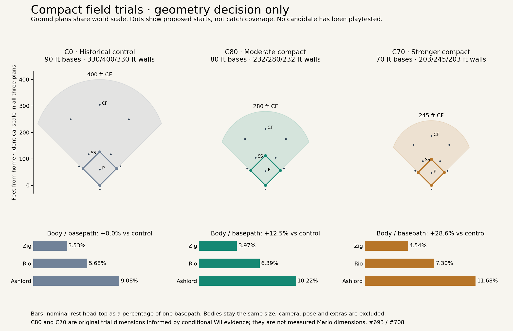

# Compact field proposal — first numerical decision

**Reference, not required reading** ([AGENTS.md](../AGENTS.md) "Start here"). Look up the sections your work touches.

**Continuing this research line in a new session?** Read the [research handoff](handoff-game-feel-693.md) first for the current direction, accepted anchors, worktree, evidence limits and next research action.

September 14, 2026. [#708](https://github.com/jackguillet/grand-sluggers/issues/708), under [#693](https://github.com/jackguillet/grand-sluggers/issues/693). **Gameplay research/documentation. No runtime tuning.** Stacked after the #702 measurement work at `59f3762` / draft [#707](https://github.com/jackguillet/grand-sluggers/pull/707).

**Accepted first trial: C80, an 80-foot diamond and 232 / 280 / 232-foot fences. Jack approved on September 14, 2026.** Compare C70, a 70-foot diamond with 203 / 245 / 203-foot fences, as the stronger alternative. Preserve character stature in both. C80 is an approved original spatial trial; C70 remains an unselected alternative. Neither is measured Nintendo geometry or approved shipping defaults.

This packet starts R3's numerical review. It supplies the coordinated spatial proposal, its race dependencies, analytical sensitivities and outstanding decisions. **It is not yet a complete implementable game contract.** Jack chooses meaningful gameplay decisions one at a time; the current arcade-fielding correction below removes the microscopic glove-geometry approval chain. Selecting a spatial trial does not approve all future tuning. R3 stays open until those quantities have also been reviewed together and validated.

Machine-readable [candidate inputs](research/game-feel-708-candidates.json), [derived arithmetic](research/game-feel-708-derived.json), and [reproduction script](../tools/compact-field-report.py) accompany this report. No compact profile has been simulated or played.

## Current direction — simple arcade fielding

**F693-02-arcade-fielding-simplification — directed by Jack on September 15, 2026.** This is a cartoon toy baseball game. **Use the character's explicit fielding range, ball trajectory and action readiness to resolve fielding; make the glove pocket face the ball visually. Do not simulate glove pocket/rim/back eligibility, detailed contact surfaces or contact normals.** This correction takes precedence over the historical glove/obstruction sections below.

The player still owns positioning and jump/action timing. Apply baseball legality and the approved difficulty/defensive-quality error rules at a qualifying gameplay opportunity. Routine fielding remains reliable. Preserve local bobbles, continuing deflections, the brief stun, reliable same-error recovery and special-hit exceptions. A visual wrist angle is not another skill check or failure roll.

**Visual responsibility:** authored motion should meet the ball convincingly with the pocket facing it. A mismatch is a presentation issue to fix, not permission to manufacture a miss or teleport the ball. Use the existing shared rig, authored takes and simulation clock. No new pose or collision engine is selected.

**Retired implementation requirements:** the contact-incidence calculation, concave glove collider, pocket/rim/back acquisition policy and geometry-dependent obstruction curve are superseded as runtime requirements. Their original decisions remain below as history. The 50–80% continuing speed bounds and shared vertical factor remain trial anchors; a detailed collider-driven interpolation is no longer required. Simple error-response selection and direction must still be reproducible, with no new severity lottery or tactical result assignment silently introduced.

**Keep useful feel work:** the previously recorded ball-response numbers remain authored trial anchors for later calibration, not measured Mario constants or shipping defaults. This correction does not implement or retune them. Reach dimensions, simplified response mapping, traits, coverage and full race validation remain open.

**Review process:** continue one decision at a time for meaningful player-facing tradeoffs. Consolidate hidden geometry and implementation choices into research/tuning work rather than asking Jack to approve each microscopic detail. That consolidation is now done below, in [the consolidated contract](#consolidated-simplified-fielding-contract) and [the reach accounting](#reach-and-coverage-accounting-for-c80); it identified one material tradeoff, `F693-02-catch-reach-envelope`, which Jack accepted the same day. No replacement glove microdecision is queued here.

No runtime, asset, merge or human gate changes. This is Jack's design direction, not a claim about Nintendo internals.

## Consolidated simplified fielding contract

**F693-02-arcade-fielding-validation — research complete, September 15, 2026.** This section is the single place the simplified contract is stated end to end. It introduces no new decision; every number below is an already accepted trial anchor, and the three plays are the representative cases the correction asked for. Nothing here has been simulated.

**A routine grounder to short.** Contact, then the accepted 0.25-second infield read, then pursuit through the accepted 0.20-second build-up toward 18 ft/s. The ball is fielded when it is inside that character's explicit catch range, the fielder is in an appropriate ready state and the play is legal. There is no handling roll, because a routine opportunity is reliable. The authored glove motion meets the ball with the pocket facing it; a bad wrist angle is a presentation defect to fix, not a miss. A clean pickup adds no generic pause, and the throw follows the accepted 0.30-second release and 0.90-second 80-foot flight.

**An awkward in-between hop.** The accepted first difficulty source, and the only one so far — a hard-hit label alone does not qualify. It opens the difficulty and defensive-quality error chance, trial `p = .10*D*(1-.80*H)` capped at 10%, with the D and H mappings still open, drawn once per genuine attempt on the seeded rail. On failure the outcome comes from the ball's own current motion and the simple gameplay contact context, not from a severity lottery. A hop that has already lost most of its travel leaves a local bobble: vertical speed zero at the actual contact position, horizontal speed `min(.20 × incoming, 6 ft/s)`, ground vertical retention .35, rebound ceiling 6 inches, settling when the next predicted rebound is 3 inches or less, 90% horizontal retention per ground impact and 6 ft/s² rolling deceleration. Direction is contact-led with uniform ±30° variation. The fielder takes the shared 0.40-second stun; the ball stays live, helpers stay live, and same-error recovery is reliable.

**A hard infield ball that escapes into the outfield.** Same gate, same single draw. When the contact leaves substantial motion, the ball keeps going: retain 50–80% of incoming horizontal speed, apply the same factor to signed vertical speed, then hand off to the shared ordinary batted-ball ground response. Direction is contact-led with uniform ±15° variation — narrower than the local bobble, not wider. This branch does **not** inherit the bobble's 6 ft/s cap, rebound ceiling or settling rule, and no outfield destination, minimum escape distance or extra base is assigned. The ball goes where its remaining motion takes it, and ordinary coverage decides the consequence. A ball that was never touched is not this: it earns no stun, no recovery protection and no deflection angle.

| | Status |
| --- | --- |
| Explicit character catch range, action readiness, baseball legality | Retained as the acquisition basis |
| Player-owned positioning and jump timing | Retained |
| Glove pocket facing the ball | Presentation responsibility only |
| Routine reliability, the qualified error chance, the three outcome kinds, the 0.40-second stun, reliable same-error recovery | Retained |
| Local bobble and continuing deflection trial numbers | Retained as authored trial anchors |
| Glove mesh collision, pocket/rim/back eligibility, contact-surface normals, the `r = .80 - .30*c` obstruction curve | Superseded; kept below as history |
| The exact simplified contact-to-outcome mapping | **Open**, and must stay reproducible with no new severity roll |
| Ordinary stand-up catch reach | Accepted as a 6-foot trial, below |
| Dive ownership/cost, Arm/Fielding split, covering profile, drag lever | Accepted trial directions; see decisions below |
| D/H mappings, simple response selection/direction, trigger speeds, full race calibration | **Open implementation dependencies**, see the plan |

**Reference comparison.** The two recorded plays in the [#701 comparison](research-game-feel-701-comparison.md) — the Wii shortstop grounder around 00:58 and the GameCube force-and-return around 03:10 — are both clean fielding. Neither reference packet contains a bobble, a deflection or a gap ball, so this contract's error behaviour has **no matched Wii or GameCube observation at all**, in either direction. A fresh attempt on September 15, 2026 reopened the Wii clip page and was abandoned in pre-roll advertising before any play was inspected; nothing was measured or inferred from it. What the existing clips do support is the shape the contract already assumes: a visible gather, a visible release and a visible travel, with the result readable as it happens.

## Reach and coverage accounting for C80

The spatial section warned that reach needs its own accounting. This is it, and it produces the next decision rather than settling it.

The current Harbor runtime gives a fielder a stand-up catch radius of `10 + 0.6 × Field` feet from [`data/rules/fielding.json`](../data/rules/fielding.json) — **13 feet at Field 5** — plus a 4-foot scoop pad, 8 feet of dive and 8 feet of jump. Those are shipped control-field numbers, not approved compact defaults and not measured Mario reach. They also contradict an accepted direction: `F693-02-character-catch-range` says displayed Fielding must not size the catch range, and `10 + 0.6 × Field` does exactly that. The stack cannot carry over unchanged whichever magnitude wins.

The infield starts scale with the basepath, so infield gaps shrink 11.1%. The outfield starts preserve their fraction of the fence radius at their own bearing, and the fence shrank 30% at center, so **the alley shrinks 30% while reach and pursuit do not shrink at all**. Adjacent starts fall from 122.98 to 86.08 feet between left and center.

Spending the accepted anchors — 0.40-second outfield read, 0.25-second infield read, 0.20-second build-up, 18 ft/s — on straight-line lateral interception between two neighbours gives the hang time at which they cover every point of the line between them, reach included:

| Gap | 13 ft (today) | 11.56 ft (scaled) | 8 ft | 6 ft | 0 ft |
| --- | --- | --- | --- | --- | --- |
| C0 left–center alley, 122.98 ft | 3.19 s | — | 3.47 s | 3.58 s | 3.92 s |
| **C80 left–center alley, 86.08 ft** | **2.17 s** | 2.25 s | 2.45 s | **2.56 s** | 2.89 s |
| C0 third–short hole, 58.41 ft | 1.25 s | — | 1.53 s | 1.64 s | 1.97 s |
| **C80 third–short hole, 51.92 ft** | **1.07 s** | 1.15 s | 1.35 s | **1.46 s** | 1.79 s |
| C80 short–second hole, 74.67 ft | 1.70 s | 1.78 s | 1.98 s | 2.09 s | 2.42 s |

This is straight-line arithmetic only. It excludes route curvature, ball height and hop, leading a moving target, dive and jump input, authored pose, wall and roll, character differences and assistance. It states a ceiling on what the defence can cover, **not a hit rate**: how many real batted balls fall in the open window depends on the pending flight budget. It is not a simulation.

Read carefully, it says three things. First, keeping today's absolute reach costs about a second of alley survival, from 3.19 down to 2.17. Second, **reach is a real but partial lever** — deleting reach entirely only recovers about 0.7 of that second, and a 6-foot envelope recovers 0.39 — because the dominant term is the narrower gap against unchanged 18 ft/s pursuit. Third, the honest comparison is gentler than the raw numbers look: the C80 outfield arc is nearer, so an alley ball also hangs less. A no-drag, same-launch-angle ball scales hang with the square root of carry, which would put the control-equivalent near 2.67 seconds rather than 3.19 — so the compact defence still gains roughly half a second, not a full one. That correction needs the flight budget to be more than arithmetic.

The infield row is the sharper warning. At 13 feet, two neighbouring infielders standing perfectly still already cover 26 of the 51.92 feet between third and short, and the hole is closed for anything taking 1.07 seconds or more to reach them. Ground balls through the left side are the single most common hit in baseball, and this is the setting that decides whether they exist.

Restoring the alley by slowing outfielders is not available: `F693-02-pursuit-speed` accepted one pursuit profile across positions, and it would take roughly 11 ft/s to match the control's alley closure. Outfield spread cannot do it either — matching C0's closure would need C0's absolute 123-foot gap, which does not fit inside a 232/280-foot fence without abandoning the lines. That leaves reach, the flight budget and the outfield starts as the levers, and reach is the one already queued for review.

### Accepted decision — re-author the catch reach

**F693-02-catch-reach-envelope — accepted by Jack on September 15, 2026.** Offered the three options above, Jack chose to **re-author the ordinary stand-up catch reach to roughly 6 feet** for a middle character on C80, over keeping today's absolute 13 feet and over scaling to 11.56. Reach becomes about what the visible glove covers from a planted stance — 7.5% of a basepath instead of 16.25% — which is the only option consistent with the accepted glove-meets-the-ball contract, since a 13-foot radius is about two and a half Rio head-heights and no authored glove reaches its rim.

On the coverage table that reopens the third-to-short hole from 1.07 to **1.46 seconds**, the short-to-second hole to **2.09**, and the alley from 2.17 to **2.56**. Routine plays are unaffected, because a routine fielder runs to the ball rather than reaching for it; what moves is the margins. Marginal plays that would be outs at 13 feet become hits.

**Accepted scope:** the ordinary stand-up magnitude only, as a trial anchor rather than a shipping default or a measured Mario reach. It does **not** select dive, jump, scoop-pad or ability reach — still +8 / +8 / +4 feet in the current runtime, and therefore now the dominant reach in the stack, which makes them the next thing to review. It does not select per-character variation either, beyond the already accepted rule that its source must be an explicit property and not displayed Fielding: `10 + 0.6 × Field` cannot survive this decision. No rules file, runtime behaviour, trait migration or human gate changes here, and full-race validation still has to report what the smaller envelope does to actual doubles, triples and infield singles.

**Reference limit:** no Wii or GameCube catch reach has been measured. Video supplies no world scale, so a reach figure cannot honestly be read from either reference; this decision has to be judged as an original game trial.

## Dive, jump and scoop reach after the six-foot decision

Re-authoring the stand-up radius to 6 feet only does what it was meant to do if the additions stacked on top of it are also accounted for. They are larger than the radius they extend, and the important question turned out not to be their size but **who owns them**. This section reads the current runtime; it proposes no runtime change.

| Addition | Rule | Who triggers it today | Effective reach on 6 ft |
| --- | --- | --- | --- |
| Stand-up radius | accepted trial | nobody — passive | 6 ft |
| Dirt scoop pad | `windowPadFt` 4 | **automatic**: a grounder inside the window is taken with no button | 10 ft |
| Dive | `diveReachFt` 8 | **automatic** when the seat's stick is neutral, and unconditionally for the CPU-driven glove; the East press only when the seat is actively steering | 14 ft |
| Jump | `jumpReachFt` 8 | the West press arms it | 14 ft |
| Loose-ball scoop | `looseScoopFt` 3.5 | automatic, and independent of catch radius | 3.5 ft |

Verified in [`FlyCatch.AutoDive`](../src/GrandSluggers.Sim/FlyCatch.cs) and its two call sites in [`LivePlaySystem.Field.cs`](../src/GrandSluggers.Sim/LivePlaySystem.Field.cs): the dead-stick branch fires behind `stick < stickTake`, and the CPU branch fires unconditionally, both performing the lunge themselves.

**Correction, recorded September 15, 2026.** An earlier draft of this section said that on a nine-player defence the seat steers one fielder while the other eight dive automatically. That is wrong about how the sim is built. There is exactly **one active glove**, `GlovePos`, driven by the seat's stick or by `ChaseGlove` assistance when the stick is dead, and handed to another position by `TryHandoffOutfield` / `TryHandoffLoose` as the play develops. The other fielders are positioned, not chasing. So the automatic dive was two real cases, not eight: a **human glove whose stick is neutral at that instant**, and the **entire CPU defence, unconditionally**, since the CPU branch always drives that one glove. The 14-foot finding and the accepted decision are unaffected — for the CPU side the automatic dive was unconditional, which makes the finding stronger rather than weaker. The coverage arithmetic is also unaffected: the two-neighbour model computes the nearest-fielder case, which is what the handoff produces.

Spending the same accepted pursuit anchors on those effective radii:

| Gap | 6 ft | 10 ft | 14 ft | *13 ft, the radius just removed* |
| --- | --- | --- | --- | --- |
| Left–center alley, 86.08 ft | 2.56 s | 2.34 s | 2.11 s | *2.17 s* |
| Third–short hole, 51.92 ft | 1.46 s | 1.24 s | 1.01 s | *1.07 s* |
| Short–second hole, 74.67 ft | 2.09 s | 1.87 s | 1.65 s | *1.70 s* |

**That last column is the finding.** A 6-foot stand-up radius with an automatic 8-foot dive gives **14 feet of passive coverage — more than the 13 feet the reach decision removed.** For any fielder the player is not personally steering, and for the whole CPU defence, `F693-02-catch-reach-envelope` would be cosmetic: the alley would close at 2.11 seconds instead of 2.17, and the third-to-short hole at 1.01 instead of 1.07. The intended relationship is also inverted, since each addition is larger than the radius it extends.

The jump is not part of this problem. It is already armed by an explicit press, so its 8 feet are earned, and the accepted normal-jump contract already governs its arc, takeoff ownership and air correction. The loose-ball scoop is independent of catch radius and is unaffected. The dirt scoop pad is automatic, but 4 feet of slack on a dirt hop is what that pad is for; it is worth revisiting only if 10 feet of automatic grounder pickup still looks wide after the dive is settled.

So the question was the dive, and it was a player-facing one rather than a number: **the dive is the defence's most visible highlight play, and today the game mostly makes it for you.** Jack's answer is below.

**Reference limit:** no Wii or GameCube dive reach has been measured, and video gives no world scale. Both references are understood to show automatic diving by fielders the player is not controlling, but that recollection is not a recorded observation in this packet and is not evidence here.

### Accepted decision — the dive is earned, and it costs something

**F693-02-dive-jump-scoop-reach — accepted by Jack on September 15, 2026.** Offered the three options above, Jack chose the strictest: *“Dive ever only on a press. But, there should be a ‘delay’ if you dive (before throwing or moving) so that dives are used as a last resort to reach a ball, not spammed on every play.”*

Two things follow. **The assistance dive is removed** — `AutoDive` must stop firing behind the dead-stick branch, so no fielder reaches the rim without someone choosing to. Passive coverage becomes exactly the accepted **6 feet** in the air and **10 feet** on the dirt, never 14, and an earned dive still reaches 14. And **a dive now carries a recovery delay before the diver can throw or move.** That is new behaviour rather than a retune: `DiveT` in the current runtime is only an arm window that widens the catch window and gates nothing, so there is no existing dive cost to adjust.

The delay is a cost of the dive itself, so it applies whether or not the ball was caught; whether the two cases cost the same is open, as are the duration, character variation and how it composes with the accepted 0.40-second handling stun. Jack raised earlier that Fielding might mean “a unique dive ability” — dive recovery is the most natural place for that to live, and it is recorded as a direction to discuss, not a selected mechanism. A dive that secures the ball still records the out; the delay is paid after the catch, not a reason to drop it. Routine clean catches and pickups keep their accepted zero added pause, and the dive is an explicit exception to that — consistent with the earlier readiness decisions, which all excluded dives by name.

**Accepted scope:** dive ownership and the existence of a commitment cost. No delay duration, rules-file value or runtime change is selected. The jump stays armed by the West press under the accepted normal-jump contract, the loose-ball scoop stays independent of catch radius, and the 4-foot dirt scoop pad is unchanged and still deferred.

**Named follow-ups.** `F693-02-dive-recovery-cost` carries the delay's numbers. `F693-02-cpu-dive-intent` carries the cost Jack accepted with his eyes open: with the assistance dive gone, **the entire CPU defence stops reaching the rim**, and so does a human glove whose stick happens to be neutral. Whether the CPU gets *deliberate* dive intent paying the same commitment cost, or genuinely never dives, needs its own contract rather than being settled by omission.

## Who dives now that nobody dives for free

The earned-only dive leaves two questions behind it. This section researches both and brings the larger one forward. No runtime change is proposed.

### The CPU has no press

The one-glove model above decides the shape of this. The CPU defence drives the same single `GlovePos` a seat would, through `ChaseGlove`, and today it reaches the rim entirely through `AutoDive`. Remove that and **the CPU defence has no dive at all** — not a weaker dive, none. There is no other path to the rim in the code.

What that is worth, on the accepted anchors:

| Gap | hang | earned dive, 14 ft | no dive, 6 ft |
| --- | --- | --- | --- |
| Left–center alley | 1.6 s | 18.5 ft open | 34.5 ft open |
| Left–center alley | 2.0 s | 4.1 ft open | 20.1 ft open |
| Short–second hole | 1.6 s | 1.7 ft open | 17.7 ft open |
| Third–short hole | 1.0 s | 0.5 ft open | 16.5 ft open |

The dive is worth a flat **16-foot band** of every gap — 8 feet either side of the hardest point — until the gap closes on pursuit alone. Against a CPU defence that cannot dive, that band is open on every play; against a seat that presses East, it is not. So this is not a small AI detail. It sets how hard the computer is to hit against, and it decides whether the opposing defence ever produces a highlight catch.

It is also the one place where a straight reading of the accepted direction and the intent behind it can come apart. *“Dive ever only on a press”* is about **the dive being a deliberate act with a cost**, not about the dive requiring a physical controller. A CPU that chooses to dive, can miss, and pays the same recovery delay honours that; a CPU that dives for free does not.

### Accepted decision — the CPU dives deliberately

**F693-02-cpu-dive-intent — accepted by Jack on September 15, 2026.** The CPU-driven glove gets deliberate dive intent: it chooses to dive, **it can miss**, and it pays the same recovery delay a seat pays. Same rules, different agency. Its dive reaches the same 14 feet a seat's does and no further. The assistance dive stays removed, so a human glove on a neutral stick still does not dive.

Jack explicitly did not take the option where the CPU dives only on balls it converts, and that exclusion is part of the decision: a CPU that never misses a dive is the automatic dive wearing a delay, and it would hand back the passive rim coverage the last two decisions removed while reducing the commitment cost to decoration. **A CPU dive that fails, and leaves the ball live, is a required behaviour rather than a defect.**

**Accepted scope:** that the CPU may dive deliberately under the same cost. It selects no intent policy — when the CPU spends a dive, the discipline not to spend it on a ball it could walk to, how far ahead it may look when deciding, and whether willingness varies with difficulty are all open under `F693-02-cpu-dive-intent-policy`. Lookahead is the line between a deliberate dive and a psychic one, and it needs an explicit budget rather than whatever the prediction code happens to expose. No rules-file value or runtime change is selected.

### The delay is the smaller question, but it has a shape

`F693-02-dive-recovery-cost` needs a duration, and the packet already has neighbours to sit it among: the accepted shared handling stun is **0.40 s**, ordinary retained-ball recoil runs **0.20 / 0.16 / 0.11 s** at Field 1/5/10, the normal-jump arc is **0.60 s**, and the existing `diveArmSec` window is **0.50 s**. A dive commitment that is meant to read as a last resort has to cost more than a recoil and land nearer the stun, and it has to be long enough that pressing East on a ball you could have walked to is visibly worse than walking to it.

Three parts of it are shape rather than magnitude, and they are worth settling together with the number rather than one at a time:

- Whether a **caught** dive costs the same as a **missed** one. Charging both is the simplest rule and the one the accepted direction already implies, since the delay is a cost of the dive rather than a penalty for failing. Charging the miss more would make the read sharper but risks double-punishing a play that already failed.
- Whether it **varies by character**. This is the most natural home in the whole packet for Jack's own remark that Fielding could indicate “a unique dive ability” — a defender whose dive recovery is short is meaningfully different to play with, without Fielding touching reach or glove positioning, both of which are already ruled out.
- How it **composes with the 0.40-second handling stun** when a dive both reaches the ball and fails its handling roll. The accepted rails say ordinary and special recovery from the same impact add; whether a dive delay and a handling stun add, overlap or take the longer of the two is unresolved.

None of those needs Jack to arbitrate a coefficient. They are worth consolidating into a single proposed trial once the CPU question is answered, because a CPU that dives changes what the delay has to be worth.

**Reference limit:** no Wii or GameCube dive recovery has been measured, and no dive frequency has been counted in either reference. Both are understood to let uncontrolled fielders dive, but that is recollection rather than a recorded observation in this packet and is not evidence here.

## What the dive delay has to be worth

`F693-02-dive-recovery-cost`, consolidated rather than brought forward one coefficient at a time. The packet already contains the anchor this needs, so the duration is a consequence rather than a taste call.

The accepted release and travel section carries an illustrative routine race: possession at 1.30 s, 0.25 s of player decision, the accepted 0.30 s release and 1.10 s of flight give a covered reception at **2.95 s** against the nominal **3.45 s** runner — a **0.50-second margin**. A dive delay is spent inside that margin, because it sits between possession and release. That turns Jack's instruction into arithmetic: *“dives are used as a last resort to reach a ball, not spammed on every play”* means a dive taken on a ball the fielder could have fielded standing should not still produce the out.

| Delay | Reception | Margin | An unnecessary dive is… |
| --- | --- | --- | --- |
| 0.20 s (recoil-sized) | 3.15 s | +0.30 s | still a comfortable out |
| 0.40 s (stun-sized) | 3.35 s | +0.10 s | still an out, barely |
| 0.50 s | 3.45 s | 0.00 s | a dead heat |
| **0.60 s** | **3.55 s** | **−0.10 s** | **a hit** |

**Proposed trial: 0.60 seconds.** It is the shortest value in the table at which the deterrent is unambiguous. A dead heat at 0.50 reads as *sometimes you get away with it*, which is an invitation to spam rather than a discouragement. It also sits above the 0.40-second handling stun, so a dive reads as a larger commitment than a bobble, and it happens to match the accepted 0.60-second normal-jump arc — a readability parallel rather than a justification, since a jump already pays its airtime the same way.

A **necessary** dive is unaffected by this reasoning. If the ball was at the rim the fielder had no standing play at all, so there was no out to lose; the dive converts a certain hit into a stopped ball and a shorter one. The cost only bites when the dive was not needed, which is the intent.

Three parts of the rule are shape rather than magnitude, and the packet answers two of them:

- **Caught and missed dives cost the same.** The accepted direction already says the delay is a cost of the dive rather than a penalty for failing. Charging the miss extra would double-punish a play that has already failed and would quietly reintroduce a failure lottery.
- **The delay and the handling stun overlap; take the longer, do not add.** If a dive reaches the ball and then fails its handling roll, adding gives 1.00 second, which is longer than anything else in the packet by a wide margin. The dive delay already represents being on the ground, and the stun's job — a visible reaction that costs time — is already done by it. **This departs from the additive precedent set for ordinary and special recovery from the same impact**, and is flagged here rather than buried so it can be rejected on sight.
- **Whether recovery varies by character is a real decision**, and it is below.

### The one open question — does the dive differentiate defenders

Jack raised earlier that Fielding could indicate “a unique dive ability, or make less errors.” Reach and glove positioning are both ruled out as things Fielding may touch, so dive recovery is the last natural home for the first half of that remark. Any variation must be driven by an explicit defensive trait, not the displayed Fielding number, exactly as the handling error chance is.

Putting it on the packet's house curve — the recoil factor's 5% per point — has a consequence worth seeing before choosing:

| | lowest quality | middle | highest |
| --- | --- | --- | --- |
| 5% per point | 0.600 s → a hit | 0.480 s → dead heat | 0.330 s → **comfortable out** |
| 2.5% per point | 0.600 s → a hit | 0.540 s → dead heat | 0.465 s → dead heat |

On the recoil curve the best defender recovers fast enough that an unnecessary dive is still a comfortable out, which hands that character back the spam the decision was meant to remove. If recovery varies at all, the curve has to be **narrower than the recoil curve** so even the best defender pays something real. That is why the two are one question rather than two.

### Accepted decision — a 0.60-second dive recovery on a narrow curve

**F693-02-dive-recovery-cost — accepted by Jack on September 15, 2026.** Dive recovery is **0.60 seconds** at the lowest defensive quality, narrowing **2.5% per quality point** to **0.465 seconds** at the highest. Jack chose character variation over a shared recovery with a named dive ability and over a shared recovery alone, so the dive is where the defensive rating finally earns its keep in ordinary play.

The curve is deliberately narrower than the recoil curve. Even the best defender only reaches a dead heat on a dive they did not need — never a comfortable out — so the deterrent survives all the way up the roster. Quality is supplied by an explicit defensive trait under the accepted summary architecture, never by the displayed Fielding number, exactly as the handling error chance is sourced.

The rest of the rule is as proposed. A caught dive and a missed dive cost the same, because the delay is a cost of the dive rather than a penalty for failing. When a dive reaches the ball and then fails its handling roll, the result is **the longer** of the dive delay and the 0.40-second stun rather than their sum — a deliberate departure from the additive precedent for ordinary and special recovery from the same impact, recorded here rather than buried. The CPU pays the same delay on the same curve, per the accepted deliberate-dive decision.

**Accepted scope:** the trial duration, its curve, and the two composition rules. No trait list or trait-to-quality mapping is selected, and the explicit defensive-trait migration — now consumed by both the handling error chance and this curve — still blocks implementation. It is queued as `F693-02-defensive-trait-mapping`.

**Reference limit:** no Wii or GameCube dive recovery has been measured and no dive frequency counted. The 0.60-second trial is derived from this packet's own accepted race anchors, not from either reference.

## Every job the Fielding number is doing

`F693-02-defensive-trait-mapping`. Two accepted decisions now consume “defensive quality” as an explicit trait — the handling error chance and the dive recovery curve — and neither can be implemented until those traits exist. This is the inventory that was required before implementation. It reads the current runtime; it proposes no runtime change.

A character has four ratings: Pitch, Bat, **Field**, Run. Every gameplay use of `Stats.Field`:

| Consumer | Current formula | What it actually governs | Status |
| --- | --- | --- | --- |
| `Fielding.CatchRadiusFt` | `10 + 0.6 × Field` | catch reach | **Superseded.** `F693-02-catch-reach-envelope` authored 6 feet and `F693-02-character-catch-range` bars Fielding from sizing reach. Needs an authored reach property. |
| `InPlay.ArmMul` | `0.85 + 0.03 × Field` | throw speed | **Accepted and Field-dependent** — `F693-03-long-throw-numbers` carries `armSpeedPerFieldPoint 0.03`. |
| long-throw comfortable range | `160 ft ± 5 ft per Field point` | arm range | **Accepted and Field-dependent** — same decision, `rangeFeetPerFieldPoint 5`. |
| `ChemistryTable.FieldingThrow` | `σ = (11 − Field) × 0.35 ft` | throw accuracy | Live. No accepted replacement. |
| `InPlay.KnockbackSec` | `(11 − Field) × 0.045` | retained-ball recoil | **Accepted and remapped** — `F693-02-recoil-field-factors`, 5% per point, 0.20 / 0.16 / 0.11 s. |
| `InPlay.Bobbles` | energy, `hands = Field + glove` | error chance | **Superseded** — `F693-02-ordinary-handling-error-chance`. |
| *new* handling error `H` | — | handling quality | Accepted; **waiting on a trait**. |
| *new* dive recovery curve | 2.5% per point | dive recovery | Accepted; **waiting on a trait**. |
| `InPlay.ThrowReactionSec` | `0.35 − 0.02 × Field`, × CPU multiplier | CPU throw delay | CPU-only. |
| `StealThrow.CpuReleaseSec` | `0.42 − 0.014 × Field`, × CPU multiplier | CPU catcher release | CPU-only. |
| `ClosePlay.CpuReactionSec` | `base + (10 − n) × per`, × CPU multiplier | CPU close-play reaction | CPU-only. |
| `Teams.Tools` | sum of four ratings | roster building | Not gameplay. |
| HUD and CLI | `F 5` | display | Display only. |

Four distinct jobs fall out, not one:

- **Arm** — throw speed, comfortable range, throw accuracy. Three consumers, and **two accepted anchors depend on it**.
- **Hands** — recoil duration, the handling error chance and dive recovery. Three consumers, and **three accepted decisions depend on it**.
- **Reach** — already leaving the rating entirely, by two accepted decisions.
- **CPU reaction** — three consumers, every one of them multiplied by the difficulty reaction multiplier.

Two of those deserve comment. The **CPU reaction** group is difficulty scaling wearing a character stat: the same number is scaled by `cpu.active.reactionMul` in all three places, so what it mostly expresses is how hard the computer is playing. Whether it should be trait-driven at all is worth settling during migration, but it is not a reason to keep any other job attached to the rating.

The **Arm** group is the finding. **The displayed Fielding number is simultaneously the arm rating and the hands rating.** A cannon-armed catcher with stone hands cannot exist today, and neither can a slick middle infielder with a noodle arm — both are ordinary baseball archetypes and both are exactly the kind of character a cartoon roster is made of. The accepted throw anchors sit squarely on the arm half of that number, which means the migration cannot quietly drop it: whatever replaces Field must keep feeding `0.03` per point of arm speed and `5` feet per point of range, or `F693-03-long-throw-numbers` breaks.

There is a migration-safe path through that. If an Arm rating is seeded at each character's current Field value, every accepted throw anchor evaluates identically on day one and the split costs nothing numerically — it only *allows* divergence later, when the roster is tuned deliberately. The same trick does not work for reach, which is why reach had to be re-authored rather than migrated.

### Accepted decision — Arm splits out

**F693-02-defensive-trait-mapping — accepted by Jack on September 15, 2026.** There are two defensive ratings. **Arm** is the throwing rating: throw speed `0.85 + 0.03 × Arm`, comfortable range `160 ft ± 5 ft per point`, and throw accuracy `σ = (11 − Arm) × 0.35 ft`. **Fielding** becomes the hands rating and finally means one coherent thing: recoil duration at 5% per point, the handling error chance quality term, and dive recovery at 0.60 seconds narrowing 2.5% per point. **Reach belongs to neither**, being an authored property under the two reach decisions.

Every character's Arm is **seeded at their current Field value**, so every accepted throw anchor evaluates identically the day the split lands. It is numerically free at that moment and only permits deliberate divergence afterwards — a cannon-armed catcher with stone hands becomes expressible, which it is not today.

Four knock-on effects are recorded rather than assumed:

- The content schema gains an Arm rating, validated 1–10 like the others, and existing character files need it or a seeded default.
- `Teams.Tools` sums Pitch + Bat + Field + Run for roster building. Adding Arm changes that sum and therefore team-building balance. **Whether Arm joins the sum is a deliberate choice, not an automatic one.**
- The HUD and CLI rows show B / P / F / R and gain an A. The displayed Fielding number now means hands only, which is a readability change for anyone used to reading it as general defence.
- The three CPU-only reaction timings still read Field. They are reaction rather than throwing, so the default is that they follow Fielding, but whether they should be character-driven at all stays open through migration.

**Accepted scope:** the architecture and which consumer belongs to which rating. No roster numbers, schema edit, migration code, `Teams.Tools` decision, HUD change or runtime change is selected. Those are queued as `F693-02-arm-rating-migration`.

**Reference limit:** no Wii or GameCube stat architecture has been inspected in this packet. Both games display per-character ratings, but nothing here establishes what their internals separate, and no claim is made about it.

## Flight budget — what C80 does to the ball

`F693-04-flight-budget`. Everything accepted so far describes what the defence *can* cover. This is what it has to cover. Figures come from the game's own model, cross-checked against `BallFlight.CarryFeet` on seven probes and agreeing within 0.7 foot; the counterfactuals vary only the drag constant in that same integrator.

### The model, stated plainly

Exit speed is `(61 + 3.7 × Power) mph` scaled by contact quality — slap 0.75 / 0.95 / 1.00 for sour, nice and perfect, charge 0.95 / 1.12 / 1.25 — then by star swing, on-base chemistry and the pitch factor. Launch is `16 + (Power − 5) + 2.5 if charged + 6 per foot of pitch height − 12 × stick`, with ±7° of noise, clamped to 3–52°. Flight is a 120 Hz Euler integration with gravity 32.174 and drag 0.0019.

Two details matter more than anything else here. **Carry and hang are decoupled:** `timeScale 1.65` stretches sample times without changing distance, so a fly travels its ballistic distance on a clock 1.65 times slower. And **liners are exempt** — `linerTimeScale 1.0` leaves anything under 22° at 74 mph or more on the real clock. That single split is what decides which balls the defence reaches.

### Finding one — C80 as specified is a home-run derby

Carry alone overstates this, because the 12-foot wall catches wall-scrapers. The honest measure is the ball's **height as it crosses the fence line**:

| Contact | Class | At the 232 ft pole | At 280 ft centre | |
| --- | --- | --- | --- | --- |
| perfect slap, lifted, Power 5 | fly | 10.8 ft | — | wall ball |
| **nice slap, neutral, Power 10** | **liner** | **17.1 ft** | — | **home run** |
| **perfect charge, lifted, Power 3** | **fly** | 37.6 ft | **12.2 ft** | **home run to centre** |
| perfect charge, neutral, Power 8 | liner | 43.0 ft | 33.1 ft | home run |
| perfect charge, lifted, Power 5 | fly | 60.8 ft | 44.5 ft | home run |
| perfect charge, lifted, Power 10 | fly | 108.7 ft | 108.9 ft | home run |

Two rows are the problem. A **Power-3 hitter** — the weakest bat on the roster — clears **centre field** with a charged perfect swing. And a **Power-10 hitter leaves the yard on ordinary uncharged contact**, on a line drive, with no lift at all. On the control field the same swings carry 296 and 269 feet against a 330-foot pole and a 400-foot centre: both comfortably in play. The compact park did not change the ball, and the ball is the thing that is now wrong.

### Finding two — the doubles engine survives, and it is the liner

Against the accepted C80 alley closure of 2.56 seconds at the accepted 6-foot reach:

- **The sampled flies hang 4.3 to 8.5 seconds.** This gives pursuit time, but does not guarantee catches; the lateral closure model omits radial travel, height, routing and actual acquisition.
- **The sampled liners hang 1.8 to 3.3 seconds.** Their shorter clock can create gaps, but catch and extra-base outcomes require full routes.

The clock split is a useful calibration lever, not proof of the doubles engine. The earlier claim that all in-park flies are caught and liners guarantee gap hits was too strong. Shorter carry changes both landing depth and hang; measure pursuit, acquisition, return throws and runner progress together.

### Finding three — this is the game's ball, not Harbor's

All six parks are still at control scale: poles 312–338 feet, centres 378–408, walls 8–12 feet. Drag, gravity and the exit table are global. Whatever is chosen applies to every park, and every park will need its own compact migration. That is an argument for fixing this in the ball rather than in one park's wall.

### The levers, with numbers

| | nice slap lift P5 | perfect charge lift P3 | perfect charge lift P5 | perfect charge lift P10 | nice slap neutral P10 |
| --- | --- | --- | --- | --- | --- |
| **today, drag 0.0019** | 230 ft | 296 | 344 | 451 | 269 |
| **drag 0.0040** | 180 | 221 | 248 | 304 | 206 |
| **exit × 0.80** | 164 | 217 | 256 | 350 | 195 |
| *control-field equivalent* | *in play* | *in play* | *pole homer* | *centre homer* | *in play* |

**Raising drag to 0.0040** shortens sampled carry without changing the exit table. It also changes grounder arrival speed, timing and bounce location. Keep it as the accepted trial and test those coupled effects; do not treat the infield as unchanged or infer an increase in doubles from carry alone.

**Cutting exit velocity by a fifth** changes the ball's initial speed directly. Both levers affect infield arrival and require full-race validation. Jack selected drag; this correction does not substitute the exit-velocity alternative.

**Raising the wall** is the cheapest and most visible, and it converts wall-scrapers into wall play, which serves the doubles goal directly. But it does nothing about a 451-foot drive or a 352-foot liner, so it trims the derby rather than fixing it. It is a good companion to a ball change and a poor substitute for one.

### Accepted decision — raise the ball's drag

**F693-04-flight-budget — accepted by Jack on September 15, 2026.** Ball drag rises from **0.0019 to a 0.0040 trial**. The exit table and the 12-foot wall are untouched.

The earlier conclusion confused open-field carry with clearance of a 12-foot wall. The versioned [flight inputs](research/game-feel-708-flight-inputs.json) and [production-model results](research/game-feel-708-flight-derived.json) now resolve actual C80 fence crossings at center and near both poles. Under the explicit still-air mean-launch inputs, P5 charged lift clears the near-pole wall and P10 charged lift clears center. **P5 Heat Swing carries about 282.4 feet but reaches the 280-foot center fence only about 3.0 feet high: it hits the wall.** No star-power increase or guaranteed-homer rule is selected to rescue the earlier claim. Individual special contracts remain separate.

**Grounder correction:** an 80-mph, 8-degree ball reaches 100 feet in **1.566 seconds** at drag .0019 and **1.752 seconds** at .0040. Its first bounce moves from **115.8 to 102.3 feet**. Thus the exit table is unchanged, but arrival timing, incoming speed, hop context and the complete defensive race can change. The fixture set also includes a slower ground trajectory and a hop candidate; these labels do not classify an acquisition as difficult. Record actual arrival relative to the fielder before applying the still-open difficulty mapping. Do not introduce separate grounder physics merely to preserve old arithmetic.

**Required coupling retained:** evaluate global drag with the compact park geometry, in one selectable trial beside the unchanged control. The earlier assertion that other parks become entirely homerless was not established by a small ordinary-contact probe set; stars, wind, launch, chemistry and pitch factors also matter. Keep the coordinated migration, without that unsupported justification.

**Accepted scope unchanged:** .0040 remains the authored drag trial, with the exit table and 12-foot Harbor wall untouched. No measured Mario coefficient, homer rate, doubles rate or gameplay gate is claimed. Further tuning must be based on complete races and visual review; a probe cannot approve shipping defaults.

### Reproduce the corrected evidence

Run `dotnet run --project tools/game-feel-flight-probes -- --check`. Use `--write` to regenerate after reviewing changed inputs or source. This calls production `BallFlight` and `FieldBounds` with in-memory rules and C80 park overrides; it does not edit runtime data or duplicate the integrator. The output records source hashes, first bounce positions/times, ground-station height and segment velocity on the play clock, actual fence-crossing outcomes, spray, and wall height. Separate regression cases guard against the two false claims above.

Run this **in addition to** `python3 tools/compact-field-report.py --check`; the arithmetic checker does not execute flight physics. These fixed probes are not a whole compact-game simulation. Required next validation includes routine grounders, awkward-hop opportunities and hard infield escapes alongside pursuit and throws, plus full gap/relay races and star/ordinary fence outcomes across actual input conditions.

## Coverage budget — who is at the bag when the throw lands

`F693-02-coverage-budget`. Its headline item, catch reach, is answered. What remains is whether a receiver is actually standing on the bag when the ball gets there on a field this size. Read from the runtime; no runtime change is proposed.

### Cover is a second locomotion system

A fielder going to a bag does not move the way a fielder going to a ball moves. `TickCoverAndBackup` steps every covering body, the cutoff and the backup through `StepFlat` at a flat **`cover.ftPerSec` of 28 ft/s** — no acceleration, no braking, no analog shaping, no character difference — beginning at `max(cover.startSec 0.23, the position's reaction lockout)` and stopping dead within `stopFt` 1.2 feet of the goal. Ball pursuit, by contrast, is the accepted profile: 18 ft/s, a 0.20-second build-up, a 0.10-second brake, proportional stick response and character speed differences.

So the same body runs **56% faster to a bag than to a ball**, starts instantly and stops dead. `F693-02-pursuit-speed` accepted *one ordinary pursuit movement profile per character across hit types and assigned fielding positions*. Cover obeys none of it. That is the decision this section exists to raise.

What it costs to fix, on C80:

| | 1B → 1st | 2B → 2nd | 3B → 3rd |
| --- | --- | --- | --- |
| today, flat 28 ft/s from 0.23 s | 0.54 s | 1.38 s | 0.54 s |
| accepted profile, starting at contact | 0.59 s | 1.89 s | 0.59 s |
| accepted profile with the 0.25 s read | 0.84 s | 2.14 s | 0.84 s |

The corner bags barely move — those fielders start almost on top of them. **Second base is the pressure point**, because the middle infielders start 38 feet away from it. The test is the double-play feed: shortstop fields, flips to second, and second base has to be occupied when the ball arrives 0.73 seconds after the command.

| | cover arrives | average ball, fielded at 1.30 s | quick ball, fielded at 1.00 s |
| --- | --- | --- | --- |
| today, flat 28 ft/s | 1.38 s | +0.90 s | +0.60 s |
| accepted profile, no read | 1.89 s | +0.39 s | +0.09 s |
| accepted profile with the read | 2.14 s | +0.14 s | **late by 0.16 s** |

Applying the accepted profile *with* its read delay breaks the quick double play — the throw beats the receiver to the bag. Applying it **without** a read delay does not, and there is a principled reason to drop the read: a covering fielder is not reading a ball. They are executing a known assignment to a fixed spot, and they know it at contact. The read exists to model *recognising where a batted ball went*, which is not what covering is.

### Three things that turn out not to be at risk

**The cutoff is fine.** It walks to the throw line at the same cover speed while the ball is in the air, and a fly hangs 4.3 to 8.5 seconds. Even at 18 ft/s the deepest reposition is about two seconds. The cutoff is never the thing that is late.

**The relay still beats the long throw.** On C80 the deepest throw is the centre-field wall to home, 280 feet: **4.80 seconds** direct with the accepted long-range penalty, against **4.00 seconds** for two 140-foot legs including a buffered command. The accepted relay design survives the shrink with 0.8 seconds to spare. (The control field's 400-foot equivalent is 10.20 seconds, which is why the penalty curve looks so severe there.)

**Receiver reach is now consistent.** `cover.radiusFt` is 6 feet — a throw is caught when it lands within 6 feet of its receiver. Before the reach decision a receiver had 6 feet of reach while the same character fielding a batted ball had 13. The accepted 6-foot stand-up reach has, incidentally, **harmonised them**. That is one fewer inconsistency in the contract and it should not be "fixed" back apart.

### One asymmetry worth naming

`CpuThrowReadySec` returns `max(throw arrival, the cover's walk)` — the comment calls it *a lob waits*. **The CPU will not throw to a bag before its receiver gets there.** A human seat has no such restraint: a player can fire to an unoccupied bag, and `cover.radiusFt` alone decides whether it is caught. Slowing cover therefore squeezes the human more than the CPU. It is not part of this decision, but it is the reason the margins above matter to a player and not to the computer.

### Accepted decision — covering bodies move like everyone else

**F693-02-coverage-budget — accepted by Jack on September 15, 2026.** Cover, cutoff and backup all inherit the accepted movement profile: **18 ft/s** with the 0.20-second build-up, the 0.10-second brake and character speed differences. They begin **at contact, with no read** — `cover.startSec` and the position reaction lockout stop gating a covering body. One body, one way of moving.

Dropping the read is justified rather than convenient. Covering is a known assignment to a fixed spot, and the fielder knows it the moment the ball is struck; the read exists to model recognising *where a batted ball went*, which is not what covering is. **This does not shorten the accepted pursuit reads.** A covering body that stops covering and starts chasing a live ball — an overthrow, say — is doing pursuit and takes the ordinary read.

Retained: `cover.stopFt` as the arrival tolerance, `cover.backupFt`, and `cover.radiusFt` at 6 feet, which now matches the accepted stand-up reach and should not be split back apart. The double-play feed keeps **+0.39 seconds** on an average ball and **+0.09** on a quick one, so the pivot becomes a real race rather than a formality.

**Correction.** An earlier draft of the options above said a Snap Throw would tighten that feed further. It would not. Snap Throw is a 0.22-second release after cleanly *receiving a teammate throw*, so it does not apply to the feed itself, which is thrown by the fielder who fielded a batted ball; it applies to the pivot onward to first, by which point the cover has already arrived. The case where a Snap Throw genuinely can outrun a walking cover is a **relay** — a cutoff receiving and snapping onward to a bag whose cover is still moving — and that is queued as `F693-02-throw-before-cover` alongside the human-versus-CPU asymmetry rather than assumed either way.

**Accepted scope:** movement for covering bodies. No rules-file edit, throw-wait rule, Snap Throw change or runtime change is selected.

**Reference limit:** no Wii or GameCube cover speed, cutoff placement or receiver timing has been measured. These are this game's own numbers against this game's own accepted anchors.

## Migration questions — 3a

The three questions standing between the decided contract and the parity slice. Two of them consolidate; the third is a real tradeoff and is put to Jack below. Read from the runtime; no runtime change is proposed.

### The diamond is not in data yet

Before any of it: `Diamond.First` is `(63.64, 63.64)` — a `static readonly` C# constant, alongside Second, Third and Home. **Basepath is not a park property**, so every park shares one infield and the C80 move is a single change rather than six. But it is currently a constant in a system, and R3's rule is that a geometry move first migrates values into the shared data owner and proves parity. **Moving the diamond into `data/` at today's values, changing nothing, is the first commit of the parity slice.** It is also the cheapest possible test of that rule: the entire suite must pass untouched.

### `F693-04-park-migration` — consolidated

Parks carry only fences, wall height, wind and hazards. Scaling every fence by **0.70**, Harbor's accepted centre factor:

| Park | Today | Wall | Compact | Centre / basepath |
| --- | --- | --- | --- | --- |
| canopy-yard | 312 / 378 / 318 | 12 | 218 / 265 / 223 | 3.31 |
| crystal-rink | 320 / 385 / 320 | 8 | 224 / 270 / 224 | 3.38 |
| ember-keep | 338 / 408 / 338 | 10 | 237 / 286 / 237 | 3.58 |
| funfair-park | 315 / 390 / 340 | 8 | 220 / 273 / 238 | 3.41 |
| **harbor-diamond** | 330 / 400 / 330 | 12 | **232 / 280 / 232** | 3.50 |
| rooftop-city | 318 / 388 / 322 | 12 | 223 / 272 / 225 | 3.40 |

Harbor keeps the accepted 232 / 280 / 232. A flat 0.70 would give it 231 at the poles; that one foot is rounding, not a design difference, and the accepted numbers win.

One scale for every park preserves each park's identity and their order — Ember Keep stays the biggest, Canopy Yard the smallest — where re-deriving each from Harbor's 2.9 / 3.5 / 2.9 ratios would flatten all six into the same stadium. **Wall heights do not scale.** Bodies did not shrink, and the accepted spatial contract deliberately froze Harbor's 12 feet; an 8-foot wall stays 8 feet and simply becomes a friendlier park, which is what it already is.

**Hazards have to migrate with the field.** Five parks place barrels, freeze volumes, lava pits, warp pipes, billboards and AC units at explicit `x` / `z`, and they split across the infield lip — Canopy Yard has three inside it and five on the grass. Leaving them at absolute positions would drift them relative to everything around them; an infield barrel would end up deeper into a shallower infield. They scale by the zone they sit in: the infield factor inside the lip, the fence factor beyond it. Some entries carry no `x` at all, so the migration is per hazard type rather than a blanket multiply, and it needs its own validator pass.

### `F693-02-arm-rating-migration` — consolidated

- **Schema and seeding.** Characters gain `arm`, validated 1–10 like the rest, seeded at each character's current `field`.
- **`Teams.Tools` excludes Arm, for now.** Tools is `Pitch + Bat + Field + Run` and feeds only `FillScore`, the roster auto-fill ranking, against chemistry at 80 / −40 / 10 and faction at 30. Adding Arm looks obviously right and **breaks parity on day one**: with Arm seeded equal to Field, including it double-counts defence and changes which players the auto-fill picks before anyone has authored a deliberate Arm value. Exclude it through the parity slice; revisit when real Arm numbers exist, as a roster decision rather than a migration one.
- **HUD and CLI gain an A.** The displayed Fielding number now means hands only. That is a readability change for anyone used to reading F as general defence, and it belongs to a presentation child rather than this slice.
- **The CPU reaction group follows Fielding.** `InPlay.ThrowReactionSec`, `StealThrow.CpuReleaseSec` and `ClosePlay.CpuReactionSec` are reaction rather than throwing, so Fielding is the right home. All three are already multiplied by `cpu.active.reactionMul`, so what they mostly express is difficulty; whether they should be character-driven at all is a difficulty question, not a migration one, and it stays open.

### `F693-02-cpu-dive-intent-policy` — the real question

The CPU does not need new prediction machinery. `FieldingPursuit.Plan` already returns a `Route` carrying **`MissFt`**, how many feet short the glove will be at the meeting point, and `CanTakeInAir` already compares it against the catch window. A dive decision is exactly that quantity: dive when the route falls short, but by no more than the dive adds.

Nor is lookahead the problem it looked like. The planner already routes against the **complete trajectory** for ordinary pursuit — that is shipped, accepted behaviour. Giving the dive the same information is consistent; giving it *less* would be the odd choice. And the project already has an idiom for when to commit: the #640 rundown throws *at the last makeable moment*, never early. A dive should commit the same way.

What that leaves is the part Jack's decision actually turns on. If the CPU dives exactly when `MissFt` is inside dive reach, computed from the true future path, then **the dive essentially always reaches**, and the only way it fails is the handling roll. That is uncomfortably close to the convert-only option Jack explicitly declined, wearing a delay. A CPU dive that misses has to be able to happen for real, not just in principle.

#### Accepted decision — the CPU dives on the live ball

**F693-02-cpu-dive-intent-policy — accepted by Jack on September 15, 2026.** The CPU dive decision reads **where the ball is and how it is moving at the instant it commits**, not the resolved future path the route planner holds. It still commits at the last makeable moment, following the #640 rundown idiom.

So a ball that changes after the commitment beats the dive — a late bounce, a carom, a deflection off another glove. **A CPU dive misses because the world moved, not because a roll said so**, which is what the arcade contract asks for everywhere else in this packet. The wrong-footed look that produces is deliberate, and it can only be judged on screen.

**Boundary:** this changes the dive decision only. Ordinary CPU pursuit keeps `FieldingPursuit.Plan` and its complete-trajectory route, and nothing here may slow or degrade chasing. The CPU continues to pay the same recovery delay on the same curve and to reach the same 14 feet as a seat.

A run that produces no such misses means the predicate is reading too much, and that is the check worth writing first. The exact predicate, and whether CPU dive willingness varies with difficulty, remain open; the latter is a difficulty question rather than a contract one.

## Accepted decision — lead spatial trial

**F693-02-spatial-trial — accepted by Jack, September 14, 2026:** C80 leads the subsequent numerical design and prototype. Jack replied “approve.” to the recommendation, which explicitly reserved running and throwing times for separate review. Character sizes stay unchanged. This does not accept the remaining runtime coefficients or pass a human gate.

- **C80, recommended:** 80-foot basepaths, 53.78-foot mound distance, 232 / 280 / 232-foot fences. The basepath is 11.1% shorter and center field 30% closer than the historical control. Unchanged bodies are 12.5% larger relative to the basepath. This makes a substantial outfield change while making the smaller of the two infield changes.
- **C70, stronger compact alternative:** 70-foot basepaths, 47.06-foot mound distance, 203 / 245 / 203-foot fences. The basepath is 22.2% shorter and center field 38.75% closer. Unchanged bodies are 28.6% larger relative to the basepath. This offers a stronger toy-like proportion, with more pressure on infield spacing, catch coverage, footwork and short-throw readability.
- **C0, historical control:** 90-foot basepaths, 60.5-foot mound, 330 / 400 / 330-foot fences. Retain it as the measured comparison, not as an assertion that its current feel is correct.

C80 is recommended because it delivers most of the proposed outfield compression while making a smaller simultaneous change to the infield/body relationship. That is a design judgment about calibration risk, not evidence that C80 is more faithful to Mario. C70 remains a meaningful comparison if C80 still looks too spread out. Neither is guaranteed to work, and the final dimensions may move after full-race tests and Jack's sitting.

The proposed choice includes the coherent spatial conventions below for a trial. It does **not** pass the human look/play gate, settle exact visual ball size, choose a pursuit penalty, authorize a game build with incomplete tuning, or select every later number by implication.

## What the Mario comparison can establish

The [Wii field survey](https://www.reddit.com/r/MarioSuperSluggers/comments/xdvwn9) reports one Pianta taking 3.65 seconds from third to home and 10.49 / 12.86 / 10.51 seconds from the three wall locations to home. Equal effective speed gives conditional wall/basepath ratios of approximately **2.874 / 3.523 / 2.879**. The proposed **2.9 / 3.5 / 2.9** rounds that pattern. The original author's absolute feet assume a 90-foot basepath; that assumption is not a measurement. Fielding versus baserunning speed, route, acceleration and input uncertainty could change the inferred ratio. We have not independently repeated the experiment. The [#701 geometry packet](research-game-feel-701-geometry.md) retains sensitivity cases rather than treating the ratio as exact.

The [GameCube coordinate account](https://www.reddit.com/r/MarioBaseball/comments/nt2n3v) reports roughly 100 units to center and 18.4 to the mound. The later stadium survey uses meters, but its independence from the earlier report is unverified. Project Rio exposes useful memory addresses, not the actual stock base coordinates in the inspected header. Neither source establishes a matched Wii/GameCube body/basepath scale. Therefore this packet does not select 80 or 70 feet by converting a purported Mario stature. Both basepaths are authored exploration points.

The [Wii play around 00:58](https://www.youtube.com/watch?v=3-5aQh-fxZk&t=58s) has previously annotated throw flight of **0.99–1.21 seconds**. The [GameCube force/return attempt around 03:10](https://www.youtube.com/watch?v=fdtUfRUjyAY&t=190s) distinguishes release, SAFE, reception and reset. Those clips support keeping event phases visible; they do not supply a common speed coefficient because distance, character, input and ability conditions are unmatched. See the [full comparison and annotations](research-game-feel-701-comparison.md).

Additional discovery leads during #708 were the original [Project Rio stadium mapping post](https://www.reddit.com/r/MarioBaseball/comments/suzucf) and [relative wall heights post](https://www.reddit.com/r/MarioBaseball/comments/svxabc). Search exposed their titles, but direct retrieval failed and their diagrams were not inspected. They are **excluded from numerical support** here; no value has been read from them or inferred from their titles.

Jack's accepted reference policy remains: Wii leads provisional visual readability; GameCube cross-checks mechanics. Both have been considered, but matched world geometry and full-race numerical fidelity remain unresolved. The proposal must be judged as an original game trial until stronger evidence exists.

## Spatial contract proposed for the trial

Use feet, home at `(0,0)`, +Z toward center, +X toward first. Preserve a 90-degree fair wedge. Fit the existing circular fence arc through the left, center and right posts; do not interpolate two straight segments into a pointed center field. Both compact candidates share wall/basepath ratios 2.9 / 3.5 / 2.9, versus the control's 3.6667 / 4.4444 / 3.6667. They differ in field size relative to the unchanged toys.

For the first migration, preserve the control's rounded bag centers exactly: `(63.64,63.64)`, `(0,127.28)`, `(-63.64,63.64)`. Trial centers multiply these by `B/90`, with home fixed. Thus the nominal basepath and coordinate-derived distance differ slightly, as they already do in the control; changing coordinate precision is not hidden inside a parity migration. Scale mound distance by the same factor, provisionally retaining Harbor's mound/basepath relationship. Keep the plate, batter/stance and catcher group at their current local scale. Moving the mound must preserve the existing D7 pitch-flight durations; it cannot silently speed up the pitch.

For initial defensive starts, multiply 1B/2B/3B/SS positions by `B/90`; pitcher follows the mound and catcher stays at Z = −15 feet. For LF/CF/RF, preserve bearing and the current starting-radius / fence-radius-at-that-bearing fraction. This lets outfield starts follow the actual arc rather than borrowing the infield shrink factor. All nine resulting coordinates are in the derived dataset. CF starts at Z = 305 / 213.5 / 186.8125 feet for C0 / C80 / C70. Starts remain a calibration variable; these trial positions are not evidence of balanced interception.

Preserve the **12-foot wall height** initially. Lowering both wall height and wall distance would add another home-run/rebound variable. This preservation is a control choice, not a claim about Mario's walls. Keep body size, equipment, 4-foot visible bags, 10-foot dirt path widths, 12-foot bag pads, 18-foot home pad, 15-foot warning track and 36-foot foul apron at their current sizes for comparison. Scale the inner grass diamond and rear dirt-arc radius by `B/90`; keep the mound's local shape and height. A later kit task must verify joins, fair/foul coverage, collision/dress agreement and clearances. These documentation diagrams do not edit the park or certify its geometry renders correctly.

Preserving toy-related lengths while reducing field distances is deliberate: uniformly shrinking everything would leave the desired proportions unchanged. In C80, Rio's nominal 5.108-foot head-top is **6.39%** of a basepath; in C70 it is **7.30%**, versus **5.68%** in C0. Ashlord is **10.22% / 11.68%**, versus **9.08%**. The dataset includes every captain. These are rest markers from the [#701 proportions audit](research-game-feel-701-proportions.md), not measured animated bounds or projected screen heights.

**Reach needs its own accounting.** For example, leaving a 13-foot catch-assist radius unchanged changes its basepath fraction from 14.44% to 16.25% or 18.57%. That can erase gaps even with slower pursuit. Separate physical body/glove reach, catch assistance, scoop thresholds, tag reach, cover eligibility and bag occupancy. Neither multiplying all radii by `B/90` nor leaving them all untouched is approved by this spatial choice. Record the coverage change before accepting the complete runtime contract. Moderate drawn-ball assistance must not enlarge those judgments.

## Accepted decision — runner elapsed pace

**F693-05-runner-clock — accepted by Jack on September 14, 2026.** Preserve the existing runner elapsed pace as the C80 calibration anchor. Jack replied “approve.” to the approximately 3.45-second ordinary first-base pace, with current stat differences and dash. For a middle-speed Run-5 character without dash, that means a nominal **2.95 seconds per straight basepath**, plus the existing **0.5-second batter startup**: approximately **3.45 seconds from contact to first** in the simplified model. The historical S-31 projection is 3.458 seconds because actual paths and starting geometry matter. These are not measured C80 results.

On an 80-foot path, maintaining that interval reduces ordinary linear speed from 30.51 to **27.12 ft/s**. The alternative is keeping current feet per second: the same simplified first-base race drops to **3.12 seconds**, removing about **0.33 seconds** from the defense's total opportunity. That may feel more hectic and leaves less time for the visibly registering release/travel Jack wants. Preserving elapsed time gives us a stable starting race while shrinking the field; it does not prove defense is balanced or guarantee extra bases.

Preserve current stat differences and the explicit dash schedule for this comparison. Rounding, slide/reversal geometry and resulting multi-base arrival times still require full traces. This decision does not select fielding speed, slow a runner to rescue one out, introduce a new stamina mechanic or approve exact animation cadence. Later runner changes must return with evidence and a named decision.

The [Wii survey](https://www.reddit.com/r/MarioSuperSluggers/comments/xdvwn9) reports **3.65 seconds for Pianta from third to home**, but its starting/input protocol is not a matched ordinary Run-5 first-base test. GameCube's community running-mechanics research describes acceleration, dash and stamina; the inspected evidence does not establish a matched middle-speed elapsed target for both titles. We should not label 3.45 seconds a measured Mario match. The recommendation is a provisional Harbor calibration anchor to compare with stronger reference and standalone evidence.

**Accepted scope:** the running timing anchor only. Throw and fielding budgets remain separate decisions; exact path arrivals and standalone acceptance remain open.

## Coordinate time with space

The two compact candidates should be compared against the **same intended elapsed pace**, so the spatial preference does not accidentally become a choice between a fast and slow game. Jack has accepted today's runner elapsed pace as that calibration anchor. The compact game has not yet been simulated; actual path arrivals remain to be validated.

At present, a Run-5 runner has a nominal 2.95-second bag interval, before batter startup, rounding and other path effects. Keeping that interval makes straight running speed **30.51 / 27.12 / 23.73 feet per second** across C0 / C80 / C70. That preserves the distance/time relation without making a smaller diamond automatically faster. The observed S-31 projected first arrival is 3.458 seconds, not exactly `2.95 + 0.5`; use actual runner paths and contact/arrival marks. Preserve character differences and explicit dash behavior during comparison, then review any proposed change openly.

**Jack's compact-field/slower-pursuit observation is mathematically sound, but only for the matched distance.** A constant-speed center fielder covering the control's remaining 95 feet to its center wall at 18.3 ft/s takes 5.191 seconds. At the proposed starts, C80 has 66.5 feet remaining and C70 58.1875 feet. Speeds of **12.81 / 11.21 ft/s** preserve that simplified rear-chase time.

Those speeds are **sensitivities, not selected profiles**. To preserve an equally scaled routine infield chase instead, the control's 30.5 ft/s would become **27.11 / 23.72 ft/s**. Applying the outfield-derived sensitivity to the infield would make the same proportionally scaled infield chase about **2.116 times as long**. The control currently gets two different responses through its class/position modifiers; Jack's accepted common-profile direction removes that shortcut. Read, starting position, ball arrival, reach and speed must be solved together. Acceleration and moving interception make the actual problem more complex. No constant-speed arithmetic here proves the new game will work.

This is why the next implementation cannot simply shrink the park and slow every character. It must expose the routine-grounder and deep-gap races at once. Preserve responsive control; do not manufacture a triple through extra frozen time, automatic awards or a hidden outfielder-only speed rule.

## Accepted decision — ordinary throw release

**F693-03-release-clock — accepted by Jack on September 14, 2026.** Jack replied “approve” to **0.30 seconds from an accepted ordinary throw command to ball release** as the trial baseline for a clean possession with an ordinary Field-5 character. The throwing motion begins immediately; the interval is visible transfer/throw motion, not an idle input delay. Ball flight starts at release and will be reviewed in the next decision. A quarter-to-third-second action is a design exploration, not evidence of proven couch readability; the proposed baseline is specifically 0.30 seconds.

The current authored [throw clip](../data/art/clips.json) and [baseball take](../data/art/baseball-takes.json) place Release at **0.18 seconds** in a **0.40-second take**. Those are asset timings, not a measured command-to-live-release delay. The simulation currently begins a throw without a distinct release phase and linearly samples the ball over the `.22 + distance/speed` duration. Increasing the take marker alone would make the body and live ball disagree. The sim must own the release event; the existing animation pipeline must map to it. Do not implement a C# pose or bake a new take in this gameplay research task.

The [Wii grounder clip](https://www.youtube.com/watch?v=3-5aQh-fxZk&t=60s) and [GameCube return throw](https://www.youtube.com/watch?v=fdtUfRUjyAY&t=193s) show a useful gather/release action in the retained #701 annotations. Neither gives a known controller-command timestamp. Wii possession-to-release includes unknown human hesitation; GameCube's broad gather/release bracket is not a measured windup. Re-fetching those video pages failed during this update; no new frame measurement is claimed. **0.30 seconds is an authored Harbor trial informed by the desired readable action, not a measured Mario duration.**

Compared with the authored 0.18-second release marker, 0.30 seconds gives the ordinary action 0.12 seconds more time to register. Keeping the shorter marker is the more immediate alternative; extending toward a half second is the more deliberate alternative but consumes more of the defensive race. This decision selects only the baseline release interval: character/ability adjustments, input buffering before possession, pickup recovery, movement planting and follow-through lockouts remain separately specified work, not implicitly approved penalties. Human deliberation before pressing is also separate.

For context, an **illustrative, unimplemented** routine race could be possession at 1.30 s + 0.25 s player decision + 0.30 s release + 1.10 s flight = covered reception at **2.95 s**, leaving **0.50 s** against a nominal 3.45-second runner. The runner and release anchors are accepted; the other illustrative quantities are not targets. A receiver must actually cover and receive. This sum excludes overlapping read/pursuit by starting at possession and proves arithmetic only.

Conversely, naively adding 0.30 s to the historical Harbor fixed-grounder's 3.217-second reception gives **3.517 s**, beyond the nominal runner anchor. That is a warning against adding delays in isolation, not a prediction for the new geometry. Complete pickup/release/travel/coverage calibration must satisfy reliable routine defense without changing the accepted runner anchor to rescue one fixture. A relay pays the appropriate release on each actual throw, and therefore requires its own full-race check.

**Accepted scope:** a visible 0.30-second ordinary release baseline with immediate motion onset. Ball travel remains the next separate decision; special/stat release adjustments, buffering and recovery rules are not selected by this approval.

## Accepted decision — ordinary infield ball travel

**F693-03-travel-clock — accepted by Jack on September 14, 2026.** Jack replied “yes” to **0.90 seconds of flight over an 80-foot basepath** for an ordinary neutral Field-5 arm, after the accepted 0.30-second release. That makes the command-to-target interval **1.20 seconds**, excluding time spent deciding before pressing and any uncovered-receiver delay. Motion begins at the command; flight begins at release. Do not add the historical `.22` intercept as another hold.

For ordinary infield throws, propose proportional travel time: `flight seconds = horizontal distance × 0.90 / 80`, equivalent to **88.89 horizontal ft/s** for the baseline arm. A 40-foot feed travels for **0.45 s** (0.75 s including release); an 80-foot throw **0.90 s** (1.20 s total); a 100-foot throw **1.125 s** (1.425 s total); a 120-foot cross-diamond throw **1.35 s** (1.65 s total). These are authored arithmetic examples, not measurements of C80. The example distances do not define a new hard range cutoff. Retain character arm differences; neutral examples do not flatten strong and weak arms or approve altered chemistry/abilities.

This is a numerical starting relationship for implementation once accepted, not a separate timer for each bag, thrower position, hit type or seat. The same eventual throw model must predict and step the ball. Target arrival does not grant an out: the receiver must actually possess it with legal coverage, and tags still require the proper geometry. The ball's drawn size/trail and throw arc must make the motion readable without changing its event times or catch reach.

The recommendation aims to preserve the visibly registering travel Jack wants without spending excessive defensive time after the approved release. The historical control spends **1.12 s** sampling a neutral 90-foot throw, including its `.22` duration intercept. C80's accepted trial 80-foot throw spends **1.20 s** from command to target, divided into 0.30 s visibly in hand and 0.90 s traveling. This comparison is analytical and does not mean identical possession-to-out times.

The retained [Wii observation](research-game-feel-701-comparison.md#timing-observations-not-tuning-values) brackets one ordinary-looking release-to-reception at **0.99–1.21 s**. The proposed 100-foot example falls in that interval, but the video's throw distance, stats and input conditions are unmatched. This overlap is an orientation check, **not evidence that the proposed velocity matches Mario**. The GameCube return throw's broader event brackets also do not establish an ordinary speed curve. No new footage measurement is claimed here; this is an authored trial anchor using the earlier comparison.

For a hypothetical 100-foot routine throw: possession at 1.30 s + human decision 0.25 s + release 0.30 s + flight 1.125 s = covered reception at **2.975 s**, **0.475 s before** the nominal 3.45-second runner. Pickup, player-decision and margin numbers in that example are not accepted targets, and it has not been simulated. Real possession/coverage traces must establish whether reliable ordinary defense survives. A late pickup must remain capable of losing the race.

A **0.70-second** 80-foot flight would give more time to the defense but make the ball harder to follow. **1.10 seconds** would make travel more deliberate but cost another 0.20 seconds per 80 feet of the defensive race. The recommendation sits between these authored alternatives; none is a measured reference percentile.

**Long throws and relays remain the next decision.** Do not extrapolate the infield rate as an approved whole-field curve. With equal arms, a collinear relay at one constant speed has the same total flight distance plus another release; it cannot be made useful simply by splitting the line into two segments. The existing `onTheFlyFt` reach and cutoff behavior must be reviewed against the compact field before selecting long-range travel, range or relay benefits. Preserve player ownership of both legs; do not award an automatic extra base, auto-out or arbitrary relay speed bonus. This approval would choose the infield travel anchor only.

**Accepted scope:** 0.90 seconds over 80 feet, proportional ordinary infield travel for the neutral middle arm, with character arm differences preserved. Long-throw range/pace and relay behavior remain separate; no whole-field curve or human gate passes from this approval.

## Accepted direction — long throws and relay usefulness

**F693-03-long-throws — accepted by Jack, September 14, 2026.** Jack replied “absolutely agree” and explicitly added that **character chemistry can come into play here**. Keep direct throws available while giving very long throws **moderate, smooth, arm-dependent loss of pace**. A well-positioned relay should sometimes beat a very long direct throw after paying its actual catch, decision and visible release cost. Strong arms should still make useful direct throws; a short throw or poorly positioned relay should not automatically benefit from using a cutoff. The next numerical review will select comfortable range and the amount of long-range slowdown. Neither is chosen here.

This preserves Jack's desired live doubles/triples/relays in the compact park through the actual ball/runner race. It adds no random long-throw failure, guaranteed extra base or unconditional relay boost. Ordinary short/medium throws retain the accepted infield anchor. Long-range behavior must transition continuously, be visible in the ball's arc/velocity, and use one shared prediction/stepping model for both seats. Do not abruptly slow the ball at a field boundary or change its clock based on assigned fielding position.

**Existing behavior is narrower than the spec shorthand suggests.** The audited [CPU cutoff selector](../src/GrandSluggers.Sim/LivePlaySystem.Field.cs) uses the same **200-foot** `onTheFlyFt` threshold for every arm; the range test does not use Field stat. Its CPU forecast and route go through the selected cutoff beyond that threshold. Human `BeginPlayerThrowOrCommit` has an explicit cutoff-input branch and otherwise throws directly to the bag; do not claim all current human throws beyond 200 feet are forcibly relayed. [InPlay.CutoffFor](../src/GrandSluggers.Sim/InPlay.cs) finds a candidate along the throw line; it does not prove the body has already reached that projected position. Actual receiving geometry must remain authoritative.

In C80, the proposed CF start is **213.5 feet from home**, while LF/RF starts are about **191.4 feet** away. A flat 200-foot threshold would classify nearby outfield starts differently before considering the arm, actual retrieval spot or target bag. Those are geometry observations, not evidence that 200 feet is the right compact-field range. The implementation should make CPU choices follow the same direct/relay arrival model offered to a human, rather than use a routing switch as a substitute for ball behavior.

**Why the relay needs a real advantage:** extrapolating the infield speed to a hypothetical 240-foot straight throw gives 2.70 s flight + 0.30 s release = **3.00 s**. Two collinear 120-foot throws at the same speed require 2.70 s total flight + 0.60 s in two releases; allowing an *illustrative, unapproved* 0.20 s between reception and the second command makes **3.50 s**. Thus the direct throw would need more than **0.50 s additional flight time** for that relay to win. This is a break-even demonstration, not the accepted long-range curve, a relay decision-time target or a candidate simulation. Real positioning, arms, coverage and user hesitation may erase the gain. Relays must pay their real second release.

The alternative is to keep direct flight at one proportional speed and preserve relay use through a range rule that routes long throws through a cutoff. That is easier to bound but gives distance a hard routing role; it is less consistent with a meaningful direct-versus-relay choice. The recommendation instead makes the tradeoff visible: try the long throw with a strong arm, or use a well-placed cutoff to keep the return sharp. The subsequent long-throw direction approval selects the recommendation; it was not implied by the earlier infield-travel decision.

**Mario comparison:** Nintendo's [Wii booklet, printed page 10](https://www.mariomayhem.com/downloads/mario_instruction_booklets/Mario_Super_Sluggers_-_ML1_Manual_-_WII.pdf) describes selecting a cutoff with the Nunchuk and separately describes a high-speed buddy toss. Nintendo's [GameCube booklet](https://www.gamesdatabase.org/Media/SYSTEM/Nintendo_GameCube/Manual/formated/Mario_Superstar_Baseball_-_2005_-_Nintendo.pdf) describes holding L with A for a cutoff play. These original booklets support retaining a deliberate cutoff verb in both games. They do **not** establish that ordinary throws use this proposed arm-dependent slowdown, nor provide a usable numerical range. The community throwing-mechanics page could not be retrieved in this pass; its search excerpt is not used to select coefficients. Keep the proposed Harbor behavior distinct from verified Mario mechanics and from special buddy/laser effects.

**Control ownership remains a separate concern.** Current §8.7 describes an armed human relay continuing automatically, while D19 requires human ownership of both double-play legs. This physics decision does not silently decide whether an armed route is one command for a chain or whether a new press is needed at the cutoff. Preserve the existing controls during research; review the continuation/retarget/hold contract explicitly before implementing a changed relay. Any couch-verb change belongs in the book and its matching presentation owner.

The acceptance fixtures must compare direct and cutoff paths from the same deep pickup, cover and runner state; include a weak and strong arm, a misplaced or late cutoff, a short throw where relaying loses, and explicit special throws. Log each actual command, release and reception. A full relay beating a direct throw in one idealized calculation is not a passed gameplay gate.

**Accepted scope:** moderate arm-dependent loss of pace at long range, direct choice preserved, and chemistry explicitly part of the direct-versus-relay comparison. Exact comfortable range, timing curve, chemistry modifiers and relay control rules remain separate decisions. This selects no universal relay advantage or human gate pass.

## Accepted decision — chemistry on direct and relay throws

**F693-03-good-chemistry — accepted by Jack on September 14, 2026.** Jack approved retaining Harbor's existing **1.30× good-chemistry travel-speed bonus**, applied to each **actual thrower–receiver pair**, with the ordinary **0.30-second release unchanged**. A good outfielder/cutoff relationship affects the first leg; the cutoff/catcher relationship independently affects the return home. A compatible direct pair gets the same benefit. Do not add a separate bonus merely because the ball has passed through a relay.

For the approved 80-foot ordinary baseline, good chemistry changes flight from **0.90 to 0.692 s**, giving **0.992 s including release**, versus **1.20 s** for the neutral pair. A 30% increase in travel speed is a 23.1% reduction in flight time, not 30% off the entire command-to-reception action. The player still sees transfer and release. Chemistry does not make the receiver ready or guarantee a catch.

**Current source audit:** [ChemistryTable.FieldingThrow](../src/GrandSluggers.Sim/ChemistryTable.cs) reads `goodSpeedMul = 1.30` from [fielding rules](../data/rules/fielding.json). [Match.ThrowBetween](../src/GrandSluggers.Sim/Match.cs) resolves the actual pair and [FieldAbilities.ApplyThrow](../src/GrandSluggers.Sim/FieldAbilities.cs) multiplies arm and ability factors. Both bag and cutoff execution paths call `ThrowBetween` for their actual receiver. Current CPU direct/relay time estimates instead call `ArmOnly`; the calibrated predictor needs the same deterministic good-pair factor as execution. Do not call the random accuracy-producing resolver while comparing routes; route evaluation must neither consume gameplay RNG nor know a future random miss. This is an implementation requirement for the later coherent sim child, not a repair performed here.

The existing bad-chemistry path separately uses a 20% chance of a slow lateral miss, with normal arm-dependent accuracy also present. That is baseline behavior, **not newly approved** by accepting chemistry's relevance or by choosing the good-pair multiplier. Its compatibility with reliable routine defense and the desired negative-chemistry experience belongs in a separate decision. Explicit Laser/Snap effects likewise remain separate from ordinary chemistry; do not silently stack a new range reward on top of each existing speed modifier.

**Pair choice can change the best route.** In the same hypothetical 240-foot straight-distance example with equal arms and no long-range loss: a neutral direct throw takes **3.000 s**; a neutral two-leg relay with the illustrative 0.20-second extra command gap takes **3.500 s**. Giving only one relay leg good chemistry yields **3.188 s**; giving both legs good chemistry yields **2.877 s**. A compatible direct pair takes **2.377 s**. Thus two compatible relay pairs can beat a neutral direct pair in this simplified example, but a good direct pair still wins. The multiplier applies once per leg, not 1.30 squared to the whole chain. These are counterfactual calculations to isolate chemistry, not a selected long-range curve or proof of real relay balance.

This gives lineup relationships a role without making chemistry mandatory for sound baseball. Neutral teams must still have meaningful deep relays and reliable routine defense. Good chemistry can improve either choice; a misplaced cutoff, weak receiving arm or late command can still lose the race. Compare neutral, one-good-leg, both-good-legs and good-direct-pair cases with identical positions and runner states when validating the complete profile.

**Interaction with long range:** propose applying chemistry once to the otherwise-calibrated flight duration (`good duration = unboosted duration / 1.30`), leaving the ordinary release and geometry intact. Long-range loss remains present; chemistry does not separately extend an unlimited hard range or erase the penalty. The underlying range/pace curve is still pending. If combined chemistry and special abilities make travel unreadable, return with that measured case before changing the approved neutral anchor or silently inventing a cap. Trace arm, pair chemistry and ability factors separately, along with actual event times.

**Reference boundary:** the [Wii booklet](https://www.mariomayhem.com/downloads/mario_instruction_booklets/Mario_Super_Sluggers_-_ML1_Manual_-_WII.pdf) supports chemistry's role in buddy actions and errors qualitatively. The newly indexed GameCube community throwing-mechanics excerpt describes situational speed categories and special-throw uncertainty; the page itself could not be retrieved in this update. It does not justify calling 1.30 a universal Nintendo chemistry law. The recommendation's number comes from the inspected Harbor code and is being explicitly reviewed against the new neutral timing. Do not treat the older teardown's approximate chemistry summary as a replicated measurement.

**Accepted scope:** retain the 30% good-pair travel-speed bonus, once per actual thrower–receiver leg, equally for direct and relay throws, with the ordinary release unchanged. No extra relay-chain or range bonus. Negative chemistry, special interactions and actual full-race validation remain separate.

## Accepted decision — comfortable range and long-throw timing

**F693-03-long-throw-numbers — accepted by Jack on September 14, 2026 as the ordinary long-throw trial profile.** Jack approved **160 feet of comfortable range for a middle arm (Field 5)**, two C80 basepaths. Vary that by **5 feet per Field point**, giving **140 feet at Field 1** and **180 feet at Field 9**. Beyond that distance, smoothly add flight time: **0.15 s at 40 feet beyond range, 0.60 s at 80 feet beyond, and 1.35 s at 120 feet beyond**, before the accepted chemistry adjustment. This is not a maximum throw distance or a mandatory cutoff threshold.

The accepted ordinary trial model is `R = 160 + 5*(Field-5)` feet, `v = (80/0.90)*(0.85+0.03*Field)` ft/s, and `flight = distance/v + 0.60*(max(0,distance-R)/80)^2` seconds. The existing arm-speed mapping is retained as the baseline and the new range mapping is explicit. Good chemistry divides the entire flight duration by **1.30** once; it changes neither R nor the **0.30-second ordinary release**. There is no additional `.22` hold. Both duration and its slope are continuous at R, so the curve introduces no hard switch at the comfortable distance. This describes total travel time; the eventual continuous ball trajectory must realize that time rather than append an invisible pause.

This is an **authored Harbor trial profile**, not measured Nintendo range or a compact-game simulation. The 160-foot choice protects ordinary infield throws while bringing long-range tradeoffs inside the approved 232/280/232-foot park. The 0.60-second penalty is chosen to make an ideal neutral relay only slightly faster around 240 feet, after paying its actual second release. It is a concrete candidate for review, not proof that all reference or scoring targets can be satisfied.

**Middle arm, neutral chemistry — command to target, including release:** 160 feet takes **2.10 s**, 200 feet **2.70 s**, 240 feet **3.60 s**, and 280 feet **4.80 s**. A 240-foot direct throw is longer than a single runner's ordinary first-base race, but a real deep-hit race includes its own retrieval time and multi-base runner state; do not compare unrelated starting moments to declare safe or out.

**Ideal 240-foot relay:** two 120-foot middle-arm throws take **3.30 s** in flight/releases, or **3.50 s** with the same *illustrative, unapproved* 0.20-second decision gap at the cutoff. Against the 3.60-second neutral direct throw, that gives only **0.10 s** advantage; an off-line or hesitant relay can readily lose. At 280 feet, two ideal 140-foot legs plus that gap take **3.95 s**, versus 4.80 s direct. Every leg still needs actual reception, and a midpoint receiver is an analytical convenience, not the field's actual formation.

**Arm strength matters:** at 240 feet, a Field-1 neutral direct throw takes about **4.31 s**, while a Field-9 direct throw takes about **3.05 s**. If that strong outfielder instead throws through a middle-arm midpoint cutoff, the illustrative relay takes about **3.36 s**: direct wins. Do not apply a generic outfielder penalty or give all arms the same long-range threshold.

**Chemistry can change the choice:** at 240 feet, a middle-arm direct throw to a compatible receiver takes about **2.84 s**. Two compatible midpoint relay legs take about **2.88 s** including the illustrative gap, so the direct throw narrowly wins. A neutral direct pair versus two good relay pairs instead favors the relay. Good chemistry is applied to each pair once; it does not compound into a whole-chain multiplier or erase long-range loss. The derived dataset records neutral/first-leg-good/second-leg-good/both-good/direct-good comparisons for weak, middle and strong throwers over ten distances, using a middle-arm cutoff.

The alternatives hold the same curve strength while moving the middle-arm comfortable range: **140 feet** makes relay incentives arrive earlier, while **180 feet** keeps more direct throws firm. The recommendation is **160 feet** as the middle trial, with the explicit arm and chemistry relationships above. Final dimensions and continuous standalone feel remain open.

**Validation limits:** the midpoint relay starts ready, holds no pickup cost, and assumes equal path splits; its .20-second decision gap is not a new input delay or automatic-relay rule. Actual cutoff placement, movement, covers, runners and both seats must be tested. The broader mixed-park cohort is also required: an ordinary curve calibrated around a 280-foot Harbor wall may over-penalize returns in deeper parks. Do not fix that with a hidden per-park timing exception. Negative chemistry is accepted below; special throws and relay controls remain pending, and no runtime curve is activated by this documentation.

**Accepted scope:** the 160-foot middle range, 5-foot-per-Field-point variation, quadratic extra flight time and previously selected arm/chemistry relationships, for the first trial. The full game has not been simulated or accepted; special/negative chemistry, actual relay controls, movement/coverage and other calibration work remain open.

## Accepted decision — bad chemistry and routine reliability

**F693-03-negative-chemistry — accepted by Jack on September 14, 2026.** Jack answered yes to replacing bad chemistry's extra random off-target throw with a **predictable 10% reduction in travel speed** for that actual pair. Use `bad flight = otherwise-calibrated flight / 0.90`, including the selected long-range contribution once. Preserve the **0.30-second ordinary release**; add no hesitation animation, recovery lockout or chemistry-only lateral miss. This is an explicitly accepted change to the target chemistry rule; runtime migration remains pending.

At 80 feet, the middle-arm neutral flight of **0.90 s** becomes **1.00 s** for a bad pair, or **1.30 s including release**, compared with 1.20 s neutral and approximately 0.99 s good. At 240 feet, the accepted middle-arm neutral flight is **3.30 s**, which becomes **3.667 s** for a bad pair, or **3.967 s including release**. Thus the penalty remains modest on an ordinary infield throw but can change a close long-range direct/relay choice. A 10% speed reduction means 11.1% more flight time; do not apply 10% to the full action or shorten release to compensate.

**Current behavior:** [ChemistryTable.FieldingThrow](../src/GrandSluggers.Sim/ChemistryTable.cs) has a **20%** bad-pair slant chance. On activation it uses **0.70× speed** and a **10–14-foot lateral miss**; otherwise the normal accuracy result applies. Two independently executed bad-pair legs have a **36% chance that at least one slant activates** (`1 - 0.8²`). That probability is not the probability of an error or run: actual ball and receiver geometry still decide whether it is caught. Removing this additional branch would not remove the existing general Field-dependent accuracy distribution, bobbles, star effects or uncovered-receiver consequences. Those remain separately governed and require calibration.

The recommended predictable penalty makes bad relationships visible in lineup and routing decisions without adding an extra surprise to an otherwise correctly commanded throw. It reduces party-style volatility. The alternative is to **retain occasional slower/off-target throws** and review their probability/severity, keeping a chance of a dramatic misthrow even on a correct input. Reliable routine defense does not logically forbid bad-pair exceptions; both are coherent design choices. The recommendation favors predictable consequences in the ordinary game while retaining special-effect chaos separately.

**Explicit Mario deviation:** Nintendo's [Wii booklet, printed page 14](https://www.mariomayhem.com/downloads/mario_instruction_booklets/Mario_Super_Sluggers_-_ML1_Manual_-_WII.pdf) describes bad chemistry sometimes sending throws off target. That primary description supports the occasional-misthrow alternative; it does not support claiming this predictable 0.90× proposal is Mario's mechanism. The existing Harbor 20% chance, speed factor and miss distances are code observations, not verified Wii coefficients. Jack explicitly accepted this difference; it is not a claim of reference fidelity.

During implementation, update the governing §8.5 chemistry rule and the eventual player-facing explanation alongside the coherent implementation. CPU predictions must use the deterministic bad-pair factor without sampling future accuracy. Removing RNG calls also changes the later seeded random stream: preserve/version the old trace identity and compare complete new cohort results, rather than claiming unrelated seeded plays must remain identical. Bad chemistry is checked once for each actual pair; no whole-relay penalty is added. Neutral and good relationships retain their approved treatment.

**Accepted scope:** a 0.90× travel-speed factor once per actual bad pair replaces chemistry's extra random slant. Ordinary release and general accuracy remain separately governed. No runtime tuning or human gate passes from this approval.

## Accepted decision — ownership of the onward relay throw

**F693-03-relay-ownership — accepted by Jack on September 14, 2026.** Jack approved **one deliberate throw command per human-controlled leg**, with an early-input buffer for the next receiver. Sending the ball to the cutoff authorizes that first throw. The cutoff holds unless the player separately commands the onward throw; choosing a target alone is not permission to throw. A second press can be made shortly before reception so a clean relay need not depend on hitting the exact catch moment. The buffer duration and cancel-button mapping still require review.

For example, the player sends a deep return to the cutoff toward home. While it travels, they can command home for the next leg, switch the intended target to third, or leave the cutoff holding. A queued onward command can be canceled or retargeted before the receiver begins the release motion. Once that motion starts, its target is committed. Holding the original throw button must not generate another command. Each buffered command belongs to one expected receiver in the current play; a missed catch, changed receiver, play end or seat-ownership change clears it rather than producing a surprise later throw.

**Existing behavior:** in [LivePlaySystem.Field](../src/GrandSluggers.Sim/LivePlaySystem.Field.cs), `BeginPlayerThrowOrCommit` copies an explicitly armed bag into `_relayBag` when sending to the cutoff. After reception, the human branch immediately calls `BeginThrowToBag` for that remembered bag. If no bag was explicitly armed, it holds instead. §8.7 summarizes automatic armed-route continuation. Thus this proposal changes an existing convenience; it is not merely documenting current behavior. D19's requirement that humans own both double-play legs motivates a common rule for cutoff returns and double plays.

**Why recommend it:** the player can react to a runner stopping, take the safer out, or hold the ball. The cost is another deliberate input on an onward throw. The alternative is to retain one-command armed-route continuation, which is easier to execute but commits the route earlier. Buffering is intended to retain a smooth catch-and-throw rhythm without making the second choice automatically. A ready buffered throw still pays the accepted **0.30-second ordinary release after secure possession**, plus any real recovery; no free transfer or fixed .20-second decision penalty is introduced. The earlier .20-second relay examples remain illustrative. Actual input timing, covers, arms and chemistry determine the race.

**Mario comparison and limits:** the [Wii booklet, printed page 10](https://www.mariomayhem.com/downloads/mario_instruction_booklets/Mario_Super_Sluggers_-_ML1_Manual_-_WII.pdf) describes a cutoff choice when throwing with Nunchuk controls; the [GameCube booklet's fielding controls](https://www.gamesdatabase.org/Media/SYSTEM/Nintendo_GameCube/Manual/formated/Mario_Superstar_Baseball_-_2005_-_Nintendo.pdf) also identify throwing to the cutoff. These passages establish the routing verb, not the exact onward-command, early-input or cancellation contract. The recommendation is an authored control choice; matched input-visible reference capture would be needed to claim exact Mario behavior.

Implementation must use one shared human throw-ownership contract for either defensive seat, with pad and keyboard equivalents, while CPU defense still chooses its own throws. Falsify with armed-route dead stick, one buffered press, late press, hold/cancel/retarget, missed reception, changed receiver, double-play continuation and CPU cases. Update §8.7 and the shared input contract alongside implementation, with `docs/how-to-play.md` and `HowToPlay.cs` changed together by the presentation owner. This research does not change couch controls.

**Accepted scope:** one deliberate command per human relay leg, with early-input buffering, hold without a command and cancel/retarget before onward release motion. Exact buffer duration and cancel mapping remain pending. This supersedes automatic armed-route continuation as the target design, not current runtime behavior.

## Accepted decision — Snap Throw as a quick transfer

**F693-03-snap-throw — accepted by Jack on September 14, 2026.** Jack approved replacing Snap Throw's **1.22× universal flight-speed boost** with a **0.22-second release after cleanly receiving a teammate's throw**, compared with the accepted 0.30-second ordinary release. This gives the ability a quick-transfer role on relays and double plays. Flight keeps the ordinary arm, long-range and pair-chemistry rules; no additional speed, range or accuracy bonus. Initial ground pickups, batted-ball catches and loose-ball recoveries retain the ordinary release.

The benefit belongs to the uninterrupted possession that began with a clean teammate throw reception. A later deliberate command during that possession can still use it; there is no new exact-timing challenge. Dropping or bobbling the ball clears eligibility. Required catch, tag or slide recovery must finish before the release begins. Neither this ability nor an early queued input skips recovery, grants possession or commands the next leg automatically. Keep the accepted command-per-leg control contract.

**Current implementation and roster:** [FieldAbilities.ThrowMul](../src/GrandSluggers.Sim/FieldAbilities.cs) applies the [1.22× coefficient](../data/rules/fielding.json) to every throw from a Snap Throw character, multiplying arm and chemistry. It does not distinguish the way possession began or shorten an independently modeled release. The existing holders are Vale, Frost, Pip and Pewter; [Vale's actual Field stat is 8](../data/characters/vale.json). This proposal retains those assignments and the ability id, while changing its mechanical role. Laser's activation and speed/chemistry stacking will be reviewed separately next.

**Trial arithmetic:** for a hypothetical Field-5 ability holder returning an 80-foot throw, neutral command-to-target time becomes **1.12 s instead of 1.20 s**; good chemistry gives **0.912 s instead of 0.992 s**; bad chemistry gives **1.22 s instead of 1.30 s**. Flight is unchanged within each comparison, and Snap Throw saves exactly **0.08 s** per eligible release. Vale's Field-8 neutral 80-foot example is approximately **1.046 s instead of 1.126 s**. These compare ability on/off within the new trial, not old-game versus new-game outcomes. A real reception/out still requires geometry.

**Tradeoff:** the ability gets a distinct transfer advantage while ordinary travel remains readable. It is also a substantial reduction from a universal 22% flight-speed boost, particularly on long throws and initial pickups. Character balance must be checked explicitly; this is not a balance-preserving conversion. Retaining a universal flight-speed boost is the alternative if a broadly stronger arm is the intended character identity. The 0.22-second proposal is a moderate 0.08-second saving with visible motion, not an instantaneous return or a measured Nintendo coefficient.

**Reference basis and limits:** Nintendo's [GameCube booklet](https://www.gamesdatabase.org/Media/SYSTEM/Nintendo_GameCube/Manual/formated/Mario_Superstar_Baseball_-_2005_-_Nintendo.pdf) lists Quick Throw for Peach and Daisy. The [original character guide by k_pflipsen](https://gamefaqs.gamespot.com/gamecube/925314-mario-superstar-baseball/faqs/45143) describes quickly throwing after fielding and its usefulness in relays and double plays. Those primary passages support the role but do not establish a 0.22-second duration or the exact received-throw-only trigger. The proposed trigger and number are explicit Harbor choices. No matched Wii/GameCube ability-timing capture has been measured; do not claim exact cross-game equivalence.

Implementation must distinguish possession source in a shared system, cover clean receptions versus grounders/flies/loose recoveries, retain ordinary accuracy and recovery, and synchronize the authored release marker with the sim. Test both human seats, buffered and delayed commands, chemistry/arm combinations and per-character balance after removing the universal multiplier. Update the ability data, spec and systems catalog coherently, with matching motion/book changes through their owners. Runtime remains unchanged during research.

**Accepted scope:** 0.22-second release after clean teammate-throw reception, replacing the universal flight-speed bonus; ordinary release for batted-ball catches and ground/loose pickups, with the described possession/recovery limits. Chemistry continues to affect flight only. This is a trial definition, not tested character balance or runtime deployment.

## Accepted decision — Laser as a home-plate specialty

**F693-03-laser-throw — accepted by Jack on September 14, 2026.** Jack approved a **25% travel-speed bonus on actual throws home when a live runner is on third or between third and home**, replacing Laser's current universal 45% bonus. Keep the **0.30-second ordinary release**. Chemistry applies once to the actual pair, and arm strength plus the selected long-range curve still matter. This defines a scoring-play specialty; it does not authorize an automatic throw, catch or out.

At release-motion start, check that the thrower has Laser, the actual leg targets home, and a live unresolved runner is on third or on the third-home path segment, advancing or returning. Exclude scored and retired runners. Lock that activation for the throw; runner reversal or scoring must not change ball speed mid-flight. An early queued command does not lock eligibility before the throw starts. A leg to a cutoff gets no Laser bonus merely because the intended final destination is home. A Laser holder throwing the actual next leg home can activate it, with the actual receiver's chemistry.

**Current implementation:** [FieldAbilities.ThrowMul](../src/GrandSluggers.Sim/FieldAbilities.cs) returns the [1.45× Laser multiplier](../data/rules/fielding.json) without target or runner context. The existing holders are Brondo, Boom, Hex and Nugget; [Brondo's Field stat is 3](../data/characters/brondo.json). Keep those ids and assignments. The proposal changes both the eligible situations and strength; it is a meaningful balance reduction from today's universal ability, not a behavior-preserving refactor.

**Stacking and readability:** take the accepted ordinary neutral flight, divide once by the actual pair factor (1.30 good / 1.00 neutral / 0.90 bad), and divide by **1.25** when Laser is eligible. Add release separately. Good chemistry plus Laser gives **1.625× travel speed**, not 1.55×; bad chemistry plus Laser gives 1.125× relative to neutral ordinary. Comfortable range does not change, and the long-range contribution remains in the full flight before division. No extra chain bonus, shortened release, guaranteed accuracy or catch-radius increase.

For a hypothetical middle arm throwing home over **80 feet**, command-to-target takes **1.02 s with neutral Laser**, compared with ordinary 1.20 s. With good chemistry it takes about **0.854 s**, compared with ordinary good-pair 0.992 s. At **240 feet**, neutral Laser takes **2.94 s**, compared with ordinary 3.60 s; good-pair Laser takes about **2.331 s**. The actual Field-3 Brondo example at 240 feet is about **3.205 s neutral Laser**, compared with **3.932 s ordinary**. These are arithmetic comparisons within the trial, not old/new game measurements, and actual receiver coverage remains required. The dataset includes neutral/good/bad cases at both distances plus Brondo's arm.

**Why this scope:** it leaves a strong throwing identity for attempts to stop a run while reducing the ability's effect on ordinary bag-to-bag races and cutoff feeds. It can still change whether to throw home directly or relay through a specialist. The cost is less general usefulness for its holders, and even a 25% bonus stacked with good chemistry could crowd out tag-up opportunities; that must be measured. Keeping a universal arm-speed bonus is the alternative if broad throwing strength is preferred. Review sacrifice flies, runner reversals, close plays and scoring alongside the full compact-field profile.

**Reference basis and limits:** the [original GameCube character guide by k_pflipsen](https://gamefaqs.gamespot.com/gamecube/925314-mario-superstar-baseball/faqs/45143), Laser Beam section, describes fast throws home when a runner is at/past third and notes outfield and relay uses. That supports the tactical role, not the proposed 1.25× coefficient, exact runner-state boundaries or stacking. The [Wii booklet](https://www.mariomayhem.com/downloads/mario_instruction_booklets/Mario_Super_Sluggers_-_ML1_Manual_-_WII.pdf) does not specify Laser in its retrieved text. No matched Wii/GameCube Laser timing/activation capture has been measured. The number and precise activation contract are authored trial choices, not a verified Mario hybrid.

Implementation needs one shared throw context for target, runner state, thrower ability and pair relationship, used by trajectory and deterministic CPU prediction. Keep one command per human leg. Falsify eligible/ineligible destinations, runner states and queue/release boundaries, actual relay legs, both seats, weak/strong arms, chemistry, uncovered receivers and sacrifice-fly races. Synchronize the data, spec and systems catalog, with visible feedback through the presentation owner. No runtime or character change is made in this research step.

**Accepted scope:** 1.25× travel speed on eligible actual throws home, using the stated live-runner and release-start snapshot rules, ordinary release and pair chemistry. No bonus on a cutoff feed or entire chain. This replaces the universal 1.45× ability as the trial target; implementation and character/scoring/feel validation remain open.

## Accepted decision — how long an early throw press remains valid

**F693-03-input-buffer — accepted by Jack on September 14, 2026.** Jack approved **0.25 seconds of active play time** for an early onward-throw command. When the intended receiver becomes ready within that window, begin release motion immediately. Ready means actual secure possession plus completion of required recovery. If the command gets older than the window before readiness, discard it; the player needs a fresh press. A press from an already-ready fielder starts immediately. This is input tolerance, not an added wait or a shortened release.

For a clean reception with no extra recovery, a press **0.20 s before the catch** works: ordinary release begins at the catch, and the ball leaves **0.30 s later** (or **0.22 s for eligible Snap Throw**). A press **0.30 s before the catch** expires first. If the first example instead requires **0.10 s recovery after the catch**, the total wait is .30 s and that command also expires; buffering cannot bypass recovery. A missed reception or bobble clears the pending command outright. Exact recovery coefficients remain separate calibration work.

**What this chooses:** a maximum input age measured to release-motion start, not to ball release. Once consumed, expiry cannot interrupt the throwing motion. A command valid at exactly .25 s may execute; a later one may not. Use simulation time and timestamped input rather than rendered frame counts; pause does not age the queue, but actual play-time recovery does. A new deliberate throw press replaces the one pending command and refreshes its timestamp. Holding a button or changing the target alone does not refresh it. Cancel/invalidation wins over release eligibility at a shared boundary.

Preserve the accepted receiver/play/seat binding and one-command-per-leg rule. A missed catch, changed receiver, lost possession, seat change or play end clears the command. The scoped trial covers onward throws after teammate receptions and short recovery, including double-play returns. It does not silently remap catch/dive/batting buttons or authorize pre-contact throw queues. Exact cancel and retarget controls, plus visible queued-target feedback, are the next separate decision.

**Why .25 s:** it gives a deliberate early press room to count without storing an old intention throughout a long incoming throw. The **.15 s alternative** is tighter and more demanding; **.40 s** is more forgiving but retains stale intent longer. No window has been playtested. Compare cancellation, changed runner intentions and receiver recovery as well as successful fast relays. An expired press needs legible feedback; hidden expiry must not make the controls feel broken.

**Current-code audit:** [LivePlaySystem.Field](../src/GrandSluggers.Sim/LivePlaySystem.Field.cs) advances an active throw and returns before normal held-ball command dispatch; the human cutoff reception branch can automatically begin the remembered armed throw. The inspected path has no duration-based onward-command buffer. Its existing `SouthDown`/`Cutoff` inputs and bag arming are not this proposed queue. Implement a shared input owner, not a cutoff-only branch that other receptions must duplicate.

**Reference limits:** the [Wii throwing instructions](https://www.mariomayhem.com/downloads/mario_instruction_booklets/Mario_Super_Sluggers_-_ML1_Manual_-_WII.pdf) and [GameCube fielding controls](https://www.gamesdatabase.org/Media/SYSTEM/Nintendo_GameCube/Manual/formated/Mario_Superstar_Baseball_-_2005_-_Nintendo.pdf) establish throw/cutoff verbs but do not give an early-input duration. The quarter-second value is an authored trial, not a measured Mario window. Reference fidelity and final responsiveness need actual play observation.

Falsify before/at/after-expiry inputs at different frame/step rates, already-ready commands, mandatory recovery, misses/bobbles, held versus fresh presses, cancel/retarget boundaries and both human seats. Extend existing traces with queue/replace/expire/cancel and actual release eligibility. No runtime control changes or human acceptance occur in this documentation step.

**Accepted scope:** 0.25-second maximum command age to release-motion readiness, immediate execution when ready, expiry otherwise, and the described recovery/invalidation/one-command limits. This selects numerical input tolerance; cancel mapping and queued-target feedback remain the next decision. Runtime and human responsiveness acceptance remain open.

## Accepted decision — cancel and retarget a queued throw

**F693-03-throw-cancel — accepted by Jack on September 14, 2026.** Jack approved a fresh **RB / right-shoulder press** to cancel a queued defensive throw, with **period (`.`)** as the keyboard equivalent. Use the existing **D-pad / 1–4 bag selection** to change its target before release motion begins. Cancel clears the pending command while retaining the selected bag; it takes another deliberate throw press to throw. Retargeting alone neither issues a throw nor refreshes the accepted .25-second buffer.

For example, queue home as the cutoff receives the ball. If the runner stops, press RB to keep possession, or select third while the command is still valid to redirect the forthcoming throw. Once the release motion starts, that throw is committed. Canceling the onward command does not stop the incoming ball, pause the play or stop fielder movement. A fresh cancel press wins over a simultaneous throw, retarget or release-eligibility event; merely holding RB before the queue exists does not repeatedly cancel later commands.

**Input conflicts are real:** [Controls.cs](../unity/Assets/Scripts/Runtime/Controls.cs) maps RB / period to offensive all-return, RB to pitch cycling, and Charge+RB to item input. [InPlayDirector.FieldInput](../unity/Assets/Scripts/Runtime/InPlayDirector.cs) passes the item input into [the fielding path](../src/GrandSluggers.Sim/LivePlaySystem.Field.cs), where it can participate in a buddy toss. RB is therefore not globally unused. The proposed cancel is contextual: while a defensive queue exists, consume the fresh press as cancel before dispatching those conflicting defensive item actions. Preserve offense, SET and no-queue role behavior. Use a typed defensive cancel command rather than interpreting the runner's AllReturn flag as a defensive action. Either human defensive seat gets the same contract; the opponent's RB cannot cancel it.

**Feedback belongs with the verb:** the existing target indicator should distinguish **selected only** from **throw queued** with a shape or label as well as color. Cancel and expiry remove the queued state immediately while leaving the selected bag visible. Retarget updates the queued target without extending its timer. This is a semantic feedback requirement, not an approved pixel layout, extra panel or modal. Book and HUD implementation remain with the presentation owner.

**Tradeoff and reference limits:** this adds one contextual shoulder-button use, but leaves East/G for dive/dash and another throw press for replacing/refreshing a queued command. A second-press toggle would conflict with that accepted refresh behavior; mapping cancel to East would compete with movement. The binding is authored for Grand Sluggers' existing scheme. The cited [Wii throwing instructions](https://www.mariomayhem.com/downloads/mario_instruction_booklets/Mario_Super_Sluggers_-_ML1_Manual_-_WII.pdf) do not establish a matching queued-cancel binding; do not present this as a verified Mario control.

Falsify queued versus no-queue input, a held shoulder versus a new press, same-tick cancel/throw/retarget/item, cancel at readiness/expiry, target changes without timer refresh, both seats, offense isolation, SET behavior and post-commit attempts. Recompute the outgoing throw's actual receiver/chemistry/ability context when its target changes; a target change does not move possession to another body. Implement in the shared input owner and update `docs/how-to-play.md` with `HowToPlay.cs` in the same coherent control change. No couch input is changed by this research commit.

**Accepted scope:** contextual RB / period cancel, existing bag-selector retargeting without refreshing input age, selected-only versus queued feedback, and the described precedence/seat/commitment limits. Runtime mapping and book/HUD delivery remain pending.

## Accepted decision — ordinary pursuit top speed

**F693-02-pursuit-speed — accepted by Jack on September 14, 2026.** Jack approved **18 ft/s for a Run-5 fielder** as C80's first ordinary pursuit top-speed trial. Preserve the existing relative speed differences by scaling the existing curve: `speed = (21 + 1.9*Run) * (18/30.5)`. This gives approximately **13.51 ft/s at Run 1**, **18 at Run 5**, and **22.49 at Run 9**. Apply the same ordinary profile to a character across positions and hit classes, as already accepted. This is top speed after eligibility and acceleration; read duration, acceleration/braking, dash/status and coverage remain subsequent decisions.

**Why this is coupled:** the current [FieldingResolver.ChaseSpeedFt](../src/GrandSluggers.Sim/Fielding.cs) uses Run-5 base **30.5 ft/s**, OF non-grounder **18.3 ft/s**, and IF non-grounder/non-liner **13.725 ft/s**. C80 scales the infield by 80/90 and center depth by .70. Preserving old grounder infield travel time suggests **27.11 ft/s**, whereas preserving the old center-fielder-to-wall air-pursuit time suggests **12.81 ft/s**. Those sensitivities cannot both become one ordinary speed. The old modifiers have already been rejected as the target design; do not hide them in acceleration or position-specific penalties.

**Why start at 18:** it is near the existing outfield non-grounder speed and between the two incompatible time-preserving sensitivities. It is a judgment about a trial balance, not an optimization result. At full speed, a middle fielder covers **16 feet in .89 s**, **30 feet in 1.67 s**, and **60 feet in 3.33 s**, before read/acceleration/reach/pickup effects. Slower ordinary travel should leave room for play in the compact space, while the separately accepted quick corrections and brief acceleration keep input responsive. Those response numbers are not chosen by this top-speed recommendation.

**Do not claim equal chase time:** C80's initial CF-to-wall gap is **66.5 ft**, versus the old **95 ft**. At 18 ft/s, that is **3.69 s** of straight travel, versus **5.19 s** at the old OF air speed. Deep retrieval is therefore still quicker in this simplified comparison despite the lower base speed. Conversely, a hypothetical 18-foot old infield pursuit becomes 16 feet in C80: **.59 s** at old ground speed versus **.89 s** at the trial speed, about **.30 s slower** before any other events. These are sensitivity examples, not trajectories or predictions of an out. Both effects must enter the full ball/runner budget.

The **16 ft/s alternative** gives 1.875 s over 30 feet and 4.156 s for the CF gap, increasing deep-hit room but costing more routine infield time. **20 ft/s** gives 1.50 s and 3.325 s, helping routine coverage while pressuring deep-hit opportunities. The recommended 18 is the middle exploration point. Accepted runner elapsed times, field dimensions and throw coefficients are not changed to make these examples pass. If the full profile fails, show the measured conflict rather than quietly enlarging the outfield, giving automatic outs or restoring hidden field-position speed changes.

**Reference limits:** the [Wii Pianta field survey](https://www.reddit.com/r/MarioSuperSluggers/comments/xdvwn9) reports running times but assumes 90-foot bases and does not establish matched fielding/baserunning speed. The [GameCube/Wii movement audit](research-game-feel-701-movement.md) also lacks a verified common Run-to-world-speed calibration. Thus **18 ft/s is authored**, not a measured Nintendo coefficient. The accepted Wii visual lead and GameCube mechanics cross-check remain in force; exact movement feel needs controlled reference capture and the standalone human gate.

Before implementation, inspect every consumer of ordinary pursuit speed, including carrying the ball, manual/assisted transitions, cutoff/backup and receiver cover. Their behavior must not change incidentally because they share a helper. Preserve explicit ability/dash/status distinctions while reviewing their actual coefficients separately. Test routine infield and deep-gap/wall races, short flies and hard liners, low/high Run characters, both seats and scoring cohorts together. Ball flight, read, acceleration and pickup/coverage remain material open quantities; this speed alone cannot prove doubles, triples or reliable routine defense survive.

**Accepted scope:** ordinary Run-5 pursuit top speed 18 ft/s, preserving relative Run differences with the stated formula and the accepted common per-character profile. Read, acceleration/braking, dash/status and coverage remain separately reviewed. The full compact game has not been simulated or accepted.

## Accepted decision — outfield post-contact read

**F693-02-outfield-read-clock — accepted by Jack on September 14, 2026.** Jack approved **0.40 seconds from bat contact** as the base outfield pursuit read, replacing the current **0.83 seconds** for LF/CF/RF. The fielder visibly reads the hit, then ordinary pursuit becomes eligible. This delay starts at contact, not at the camera cut, and no extra camera-completion wait is added. Infield, pitcher and catcher timings are the next separate decision.

**Why .40:** Jack already chose a brief visible read followed by responsive movement. The current outfield delay is long enough to leave the glove waiting after the nominal .42-second fielding-view cut. A .40-second trial retains a beat without that additional post-cut interval. The numerical proximity to .42 is not a synchronization rule: sim eligibility must remain independent of camera duration, frame rate and presentation. The read needs a visible reaction through the existing authored motion system; an apparently ignored stick is not sufficient presentation.

**This changes the race:** eligibility is **.43 s earlier**, which alone permits up to **7.74 additional feet at the accepted 18 ft/s top speed**, before accounting for acceleration and actual paths. Adding the read to the earlier constant-speed CF-to-wall sensitivity gives about **6.02 s historically** (.83 + 95/18.3) versus **4.09 s for C80's proposed combination** (.40 + 66.5/18). These are not simulated chase/catch times. They show why smaller space plus shorter read does not automatically preserve doubles and triples, even with slower base movement. Validate ball paths, starts, carry/roll, pickup and relay choices together; do not rescue deep hits with a larger park or an extra invisible freeze.

The **.30-second alternative** yields earlier control but less of a read and more recovery time. **.50 seconds** gives a longer beat at the cost of response. The recommended .40 is an authored first trial. Exact acceleration and braking remain pending; eligibility is not instant full speed.

**Existing eligibility rails to preserve:** [FieldingResolver.ReactionLockouts](../src/GrandSluggers.Sim/Fielding.cs) and [LivePlaySystem.ReadyAt](../src/GrandSluggers.Sim/LivePlaySystem.Field.cs) distinguish the human-owned glove from other CPU-driven bodies. The human glove uses base timing even with neutral-stick assistance; CPU bodies apply the existing difficulty mechanism. Preserve that ownership structure while keeping current CPU multipliers as baseline assumptions pending difficulty validation. Keep the existing airborne cap at the ball's hang/first-ground time so exceptionally short airborne plays do not add a post-landing read; grounders gain no new cap. Switching selection does not restart or erase the contact-clock timing. A held direction can take effect when the glove becomes eligible without requiring a fresh stick edge.

This is an ordinary pursuit gate, not a new universal action freeze. Current dive movement, jump/catch windows, cover movement and direct possession have distinct paths; audit them before calibration and do not silently delay every catch until .40. No ball freeze, possession grant or new discrete-action buffer is selected. The approved .25-second onward-throw buffer remains a separate input rule.

**Mario comparison:** the [retained GameCube community timing table](https://mariobaseball.miraheze.org/wiki/Fielding_Mechanics?oldid=410), documented in the [movement audit](research-game-feel-701-movement.md), reports 50-frame outfield eligibility and a 25-frame view change. At an assumed 60 Hz those are about .833 and .417 s. The original revision failed fresh retrieval; a current [Fandom search excerpt](https://mario-superstar-baseball.fandom.com/wiki/Fielding_Mechanics) still exposes 50/50 outfield entries. These are community reports, not our independently measured stock capture. The proposed .40 deliberately shortens that reported outfield read. Wii's corresponding interval remains unmeasured; no exact Nintendo match is claimed.

Falsify held input and glove switching, grounder/liner/fly/pop/wall cases, the hang cap, both seats and CPU difficulty, and actual first displacement after eligibility. Trace these separately from camera and catch events. Deep-hit opportunities and each scoring cohort remain required. This research activates no sim or camera change and passes no human gate.

**Accepted scope:** 0.40-second base outfield pursuit read from contact, retaining the stated contact-clock ownership and existing airborne cap, without an additional camera wait. This does not select infield/pitcher/catcher timings, a blanket action lockout or acceleration. Runtime and human acceptance remain pending.

## Accepted decision — the four base infielders' read

**F693-02-infield-read-clock — accepted by Jack on September 14, 2026.** Jack approved **0.25 seconds from contact** for ordinary pursuit eligibility at **first base, second base, shortstop and third base**. The four base infielders get a common brief read, while pitcher and catcher timings remain separate next decisions. The outfield stays at its accepted .40-second base read; every character retains the accepted common pursuit-speed curve once eligible.

**Current comparison:** [the reaction table](../data/rules/fielding.json) gives 1B **.27 s**, 2B **.25 s**, SS **.28 s**, and 3B **.30 s**. A common .25 keeps second unchanged and advances the others by only .02–.05 s. At the accepted middle-speed top speed, that is at most **.90 ft** of extra opportunity for third, **.54 ft** for shortstop and **.36 ft** for first, before acceleration/path effects. The infield read would end **.15 s before the outfield's**, equivalent to 2.7 ft at full 18 ft/s. These are timing sensitivities, not extra guaranteed catch reach or simulated outcomes.

**Why .25:** infield plays need a prompt response to nearby contact. It preserves a brief beat while avoiding small hidden differences among the four base positions. It does not compensate for all of the slower pursuit trial: the earlier hypothetical shortstop chase grew by about .30 s from geometry/speed alone, and this read change recovers only .03 s. Full ball trajectory, pickup, release and cover calibration still must deliver reliable ordinary outs. Hard liners continue to reward prior positioning and need not become reachable after a late reaction.

The alternative is to retain the individual .25–.30-second delays for finer positional differentiation. A common .30-second read would give a longer beat but reduce response time for all four relative to the recommendation. Pitcher delivery recovery, comebackers and catcher plate/bunt duties are sufficiently different that this choice does not silently set their values; those remain next in the queue.

**Preserve eligibility semantics:** use contact-clock timing, the existing airborne hang cap, and the human-owned versus CPU-driven read structure described above. An already-held direction can act when eligible; switching gloves does not create a fresh read. Keep CPU multipliers as declared baseline assumptions pending difficulty validation. This is ordinary pursuit timing, not an instruction to delay catches/jumps, grant possession at the deadline or reset cover starts. Audit those paths separately.

**Reference and camera limits:** the [retained GameCube movement report](research-game-feel-701-movement.md) records community values of 16/15/17/18 frames for 1B/2B/SS/3B, or approximately .267/.250/.283/.300 seconds at an assumed 60 Hz. It is not independently verified stock footage; fresh targeted search did not recover those four rows, and Wii's matching interval is still unmeasured. A common .25 is an authored simplification near that reported range, not an exact Nintendo timing table. The current nominal .42-second fielding-view cut occurs after these infield eligibility times already. Do not extend the sim read to wait for the camera. Early field action and the controlled glove must be legible through the separately owned presentation work; no camera duration is selected here.

Falsify each base position on routine grounders, hard liners and short pops, held input, switches, airborne cap, manual/assisted movement and both seats. Measure actual displacement and possession in complete races, not eligibility alone. Keep pitcher/catcher values out of this approval. No runtime or camera change occurs in research.

**Accepted scope:** shared 0.25-second base pursuit read from contact for 1B/2B/SS/3B, with the stated contact-clock/airborne-cap/ownership semantics. Pitcher and catcher remain separate. No runtime or human gate passes from this approval.

## Accepted decision — pitcher post-contact read

**F693-02-pitcher-read-clock — accepted by Jack on September 14, 2026.** Jack approved **0.35 seconds from contact** for the pitcher's base ordinary pursuit read. This is **0.10 s later** than the accepted base-infielder read and **0.07 s earlier** than the current pitcher value of .42. It leaves a modest extra transition from delivering the pitch while avoiding a long wait to pursue nearby contact. Catcher timing follows separately.

**What changes and what does not:** [the current reaction table](../data/rules/fielding.json) and [FieldingResolver](../src/GrandSluggers.Sim/Fielding.cs) provide the .42-second pitcher deadline; [the live initialization](../src/GrandSluggers.Sim/LivePlaySystem.Field.cs) starts the read at contact. The inspected path has no separate pitcher-delivery recovery timer to add. Use the same contact-clock, human/CPU ownership, held-input and airborne-cap structure as the other read decisions. The value governs ordinary pursuit; it is not a new rule that a ball hitting the glove before .35 cannot be caught, nor a guarantee that a hard comebacker will be caught afterward. Catch, dive and action eligibility remain explicit geometric/state checks.

Do not append .35 after the pitching animation finishes or after the fielding camera appears. The authored delivery-to-field transition must agree with physical readiness in the existing motion system. If a real action constraint remains, record its readiness separately and use the later prerequisite rather than blindly summing timers; any new fixed recovery parameter requires separate review. D7 pitch pacing, pitch flight, mound placement and catcher duties are outside this choice.

**Bunts need a real check:** [BuntDefense](../src/GrandSluggers.Sim/BuntDefense.cs) already gives a squared bunt an explicit formation response and uses live routes for P/C/corner pickup. Keep the same base pitcher read on bunts and ordinary hits, retaining that formation system. Audit its chase-speed consumers with the new 18 ft/s trial; do not compensate with a special pitcher teleport, automatic pickup or hidden bunt-only speed. The ball, glove and runner still decide the play.

At the middle fielder's full trial speed, the .07-second reduction adds only **1.26 feet of potential pursuit** before acceleration and actual interception. It is a modest opportunity change, not proof of routine outs or bunt balance. A **.30-second alternative** is closer to the base infielders and leaves less transition time; retaining **.42** preserves the old delay and stays nearer the reported GameCube value but gives less pursuit opportunity. Recommend .35 as the first authored trial.

**Reference limits:** the [retained GameCube movement audit](research-game-feel-701-movement.md) reports 25 frames for the human pitcher read, approximately .417 seconds at an assumed 60 Hz. This is community timing, not independently captured stock input/motion evidence. Wii's corresponding pitcher timing remains unmeasured. A .35-second value deliberately shortens the report and is not presented as an exact Mario match.

Falsify ordinary and hard comebackers, bunts, short pops and fouls; multiple captains and both supported throwing hands; held input and switches; either human defensive seat and CPU difficulty. Trace read eligibility, any actual delivery/action constraint, first displacement, pickup and full runner/throw races. Presentation must show a readable delivery-to-field transition without becoming the sim clock. No runtime changes or human acceptance occur in this research step.

**Accepted scope:** 0.35-second base pitcher pursuit read from contact with the described ownership/cap and delivery/camera boundaries. Preserve geometric catches and existing bunt formation; no extra fixed follow-through timer or immunity. Catcher timing and runtime/human validation remain open.

## Accepted decision — catcher post-contact read

**F693-02-catcher-read-clock — accepted by Jack on September 14, 2026.** Jack approved **0.45 seconds from bat contact** for the catcher's base ordinary pursuit read, replacing today's **0.67 seconds**. This leaves **.10 s more than the accepted pitcher read** and **.20 s more than the base infielders**, giving the crouch-to-field transition a visible beat while allowing earlier pursuit of nearby batted balls. Numerical acceleration/braking follows after the read decisions.

**Limit this to batted contact:** [reaction.catcherSec](../data/rules/fielding.json) feeds the contact-clock movement-read path. [BeginRunnerPlay](../src/GrandSluggers.Sim/LivePlaySystem.Field.cs) separately seeds catcher possession and schedules `RollCatcherRelease` on a steal. Receiving a fielding throw at home and tagging a runner also use their own geometry/action paths. Do not add a .45-second read to those plays or to receiving a pitch. The separate catcher steal-release clock still needs reconciliation with the combined throw contract before implementation; this read approval does not accept its current numbers.

**Motion and input:** begin the timer at contact, not after the catcher stands or the view changes. The authored crouch-to-pursuit transition must agree with physical eligibility; do not add a second invented rise timer. Any real action prerequisite must be traced separately rather than blindly added. Preserve contact-clock switching, held-direction response, existing airborne hang cap and human/CPU ownership semantics. This remains ordinary pursuit eligibility, not a new universal catch/jump/tag freeze.

**Bunt and pickup consequences:** retain the existing [BuntDefense](../src/GrandSluggers.Sim/BuntDefense.cs) formation and actual P/C/corner routes. The accepted trial preserves the catcher/home group instead of scaling its starting depth with the basepaths; do not move the catcher forward or enlarge pickup reach to rescue a race. Reducing the read by **.22 s** yields up to **3.96 feet** of movement opportunity at Run-5 top speed before acceleration and ball-path effects. But the slower pursuit still matters: an illustrative unchanged **15-foot** chase gives read plus top-speed travel of **1.16 s historically** (.67 + 15/30.5) versus **1.28 s in this trial** (.45 + 15/18). That is not a simulated bunt or a selected pickup location. It shows why earlier eligibility does not automatically make the whole play faster.

The **.40-second alternative** gives earlier movement with the same base read as the outfield; **.55 seconds** retains more of today's catcher beat but delays pursuit. Recommend .45 as a moderate first trial, with short pops, bunts, fouls and actual crouch-to-field motion assessed together. No guaranteed pickup or automatic bunt out follows from this number.

**Reference limits:** the [retained GameCube movement audit](research-game-feel-701-movement.md) reports 40 frames for the catcher, about .667 seconds at an assumed 60 Hz. This is community timing, not independently measured stock footage; Wii's catcher read remains unmeasured. The .45-second recommendation deliberately shortens that reported delay and is an authored trial rather than an exact Mario match.

Falsify slow/fast catchers, squared/late bunts, short pops, foul balls, held input and switches, both human seats and CPU difficulty. Verify that steals, received home throws and tag plays acquire no new read delay. Trace readiness, first displacement, pickup and complete runner/throw races with the actual authored transition. No runtime or presentation changes occur in this research step.

**Accepted scope:** .45-second base catcher pursuit read after batted contact, with the stated motion, ownership and play boundaries. No new wait on pitch receiving, steal throws or home receptions. Runtime and human validation remain open.

## Accepted decision — ordinary pursuit acceleration

**F693-02-pursuit-acceleration — accepted by Jack on September 14, 2026.** Jack approved a **linear 0.20-second build-up from rest to ordinary full running speed**, starting as soon as movement is eligible and requested. This gives the already-approved brief build-up a concrete first trial. At full intent, every character takes the same .20 seconds to reach their own accepted top speed; faster characters still cover more ground. Do not introduce a new agility stat, position penalty or heavyweight exception.

**This is moving time:** a Run-5 fielder reaches 9 ft/s after .10 seconds and 18 ft/s after .20. They move .45 feet in the first .10 seconds and 1.80 feet over the full ramp. An instant 18-ft/s start covers 3.60 feet in .20 seconds, so this costs **1.80 feet**, equivalent to **.10 seconds** on a sufficiently long straight chase. A full-intent 16-foot chase from rest takes **.989 seconds instead of .889**, before read, turns, reach and pickup. This small cost matters on routine infield races; it does not justify changing the accepted runner clock or enlarging the field.

Use `v(t)=V*min(t/T,1)` with `T=.20`; integrated distance is `V*t*t/(2*T)` during the ramp and `V*(t-T/2)` afterward. Run 1/5/9 covers about **1.35/1.80/2.25 feet** during their respective ramps. With held intent, an uncapped read and a stationary start, full speed arrives .45 seconds after contact for the base infielders, .55 for the pitcher, .60 for outfielders and .65 for the catcher. Movement begins at each read deadline, not at those full-speed times. Existing airborne caps and later input alter these examples.

**Keep the clocks and ownership honest:** do not precharge acceleration while read-gated or while there is no movement intent. An already moving glove retains its physical movement state when selected or handed between manual and assisted control; selection must not grant full speed or restart a launch. Existing neutral-stick assistance can request movement, so releasing the stick is not a universal stop. This choice defines the full-intent start; partial-stick transitions, braking, 90-degree corrections, reversals, dash/status, carrying and coverage are separately reviewed next. Existing analog target mapping is not replaced by a new input scheme.

**Current implementation and the rail:** the [retained movement audit](research-game-feel-701-movement.md) and re-inspected [live pursuit paths](../src/GrandSluggers.Sim/LivePlaySystem.Field.cs) currently apply stick times speed times dt or `StepToward`, with no ordinary physical acceleration ramp. [FieldingPursuit](../src/GrandSluggers.Sim/FieldingPursuit.cs) predicts using constant speed. The new response must be one shared sim model for route/intercept prediction and actual stepping, carrying current physical velocity and integrating read/ramp boundaries consistently across step sizes. Smoothing only the rendered facing cannot establish this physical behavior. Authored feet and body motion must represent the movement without adding a camera or clip delay.

**Mario comparison and limits:** the re-opened official [GameCube booklet](https://www.gamesdatabase.org/Media/SYSTEM/Nintendo_GameCube/Manual/formated/Mario_Superstar_Baseball_-_2005_-_Nintendo.pdf) and [Wii booklet](https://www.mariomayhem.com/downloads/mario_instruction_booklets/Mario_Super_Sluggers_-_ML1_Manual_-_WII.pdf) describe fielding controls, including movement and dash, but their fielding passages do not supply a calibrated acceleration curve. The retained community research distinguishes fielding and baserunning mechanics; it does not establish a matched stock ordinary-fielding ramp for both games. **.20 seconds and a linear ramp are authored trial choices**, not Mario measurements. Ordinary video without known controller input cannot establish input-to-motion latency; paired reference captures remain needed to validate the resemblance.

**Alternatives:** .10 seconds gives a sharper launch and half the straight-line start cost; .30 makes the build-up more pronounced and costs .15 seconds once beyond its ramp distance. Recommend .20 to retain a small readable build-up without making compact-field adjustment cumbersome. Braking and turning are the next individual decisions, not implicitly set to .20.

Falsify start and arrival traces for slow/middle/fast characters, both seats and schemes, CPU/manual/assisted pursuit, different hit classes and field assignments. Verify prediction versus stepping, eligibility boundaries, early/late input and switching without a speed reset. Then assess real routine grounders, hard liners, bunts, short pops and gap/wall/relay races, including motion readability and each scoring gate. These calculations are not a simulated candidate or a human feel pass.

**Accepted scope:** linear .20-second full-intent start from rest, beginning physical movement when eligible, same duration across characters at their respective speeds. Selection preserves existing movement state. Braking, turning and other response quantities remain separately reviewed; no runtime or human gate passes here.

## Accepted decision — ordinary pursuit braking

**F693-02-pursuit-braking — accepted by Jack on September 14, 2026.** Jack approved a **linear stop from ordinary full speed in .10 seconds**, half the accepted acceleration duration. This gives fielders a small settling step while keeping overshoot modest. Apply the same full-speed stopping duration across characters, positions and hit classes; each character's braking magnitude is their own ordinary top speed divided by .10. At a lower starting speed the same braking magnitude stops them sooner.

**What that means:** Run-5 at 18 ft/s stops in .10 seconds over **.90 feet**. At half speed (9 ft/s), the same brake stops in **.05 seconds over .225 feet**. Run 1/5/9 full-speed runout is about **.676/.900/1.124 feet**. For top speed `V`, starting speed `u` and `T=.10`, use `b=V/T`, `stopTime=u/b`, `stopDistance=u*u/(2*b)`, and `v(t)=max(0,u-b*t)`. Do not keep integrating past zero. These are straight-line arithmetic, not measured catches.

**Apply it to the active movement intent:** the re-inspected [FieldAssist](../src/GrandSluggers.Sim/FieldAssist.cs) continues pursuit on neutral stick when the glove has no ball and is not throwing. Releasing the stick must therefore not become a new universal stop command. Braking applies when the active ordinary movement intent actually requests rest, including settling at an assisted route's destination. Preserve the fielder's physical state across selection or manual/assist changes. The existing .20-second handoff coast in [LivePlaySystem.Field](../src/GrandSluggers.Sim/LivePlaySystem.Field.cs) is a separate transition that still needs review; do not silently approve it, stack it onto .10, or replace it without reconciling that contract.

**Plan the arrival:** [StepToward](../src/GrandSluggers.Sim/Fielding.cs) currently caps a constant-speed step at the destination and stops within its existing tolerance. With physical braking, an assisted route that needs to settle at a fixed point must plan braking before arrival. Prediction and actual movement must share current velocity, stopping distance and short-route behavior; a short route may never reach top speed. Do not run full-speed to the target and snap still, teleport backward after overshooting, enlarge reach or add a .10-second wait after arrival. A late manual correction or changing destination can still leave insufficient stopping room; preserve that geometry. No new arrival tolerance is selected here.

An illustrative **16-foot rest-to-rest** route at Run-5 with the accepted .20 start and proposed .10 stop takes **1.039 seconds**, versus .889 for instant start/stop, excluding read and actions. The acceleration and braking occupy 2.70 feet combined, so this example has room to reach full speed. It illustrates a .15-second total motion cost, not an extra .10-second delay appended to every ball pickup.

**Keep catches live:** braking is not a new rule that catches, scoops or jumps must wait until the body is stationary. Their geometry and action eligibility stay explicit. Throw plants, pickup recovery, carrying, dash/status and coverage remain separate; turning/reversal is the next decision. Authored footfalls and settling should reflect physical movement without adding clip or camera delays.

**Mario comparison:** the official [GameCube fielding controls](https://www.gamesdatabase.org/Media/SYSTEM/Nintendo_GameCube/Manual/formated/Mario_Superstar_Baseball_-_2005_-_Nintendo.pdf) and [Wii fielding controls, printed page 10](https://www.mariomayhem.com/downloads/mario_instruction_booklets/Mario_Super_Sluggers_-_ML1_Manual_-_WII.pdf) were re-inspected. They describe movement/dash and control behavior without a numeric braking curve. Neither title has an independently timed ordinary fielding stop in our evidence packet. **.10 seconds and constant deceleration are authored trial choices**. Separate actual ground displacement from rendered facing, and capture known input/release timing before claiming Nintendo-equivalent stopping.

**Alternatives:** .05 seconds gives .45 feet of Run-5 runout and a sharper settle; .15 gives 1.35 feet and a more pronounced stop. Recommend .10 for the approved light movement weight and little residual drift. Validate full/partial-speed stops, short routes, moving targets and replanning, both human seats and schemes, CPU/assistance, routine grounders, bunts, short pops and gap/wall races. Check prediction/stepping parity across step sizes and no selection/coast double application. Actual motion readability and all scoring/play gates remain open.

**Accepted scope:** linear .10-second full-speed ordinary stop, shorter stopping time from lower speed, and planned assisted arrival. Preserve assistance and moving-catch eligibility; no extra post-arrival wait. Turning/reversal and other states remain separately reviewed, with runtime and human validation pending.

## Accepted decision — full pursuit reversal

**F693-02-pursuit-reversal — accepted by Jack on September 14, 2026.** Jack approved that a **full opposite-direction command** uses the accepted brake and start consecutively: **.10 seconds to stop from ordinary full speed, immediately followed by .20 seconds to reach full speed in the new direction**. No extra pivot pause. This makes a wrong first step carry a modest physical cost while preserving prompt response. This decision covers the 180-degree boundary; angled course corrections come next and do not automatically inherit a full stop.

**The player feels the response immediately:** the fielder starts braking when the new movement intent arrives. At Run-5 they continue **.90 feet the wrong way**, begin moving back after .10 seconds, and reach full opposite speed at .30 seconds. During that acceleration they cover **1.80 feet back**, so at .30 they are .90 feet beyond the command position in the newly requested direction. They cross the command position at about **.241 seconds**. A half-speed initial run stops in .05 seconds over .225 feet and reaches full opposite speed at .25 seconds. These are clean straight-line arithmetic, not a catch prediction or a new .30-second input lock.

Choose the original direction as positive. With `V` as ordinary top speed, `Tb=.10`, `Ta=.20`, velocity is `V*(1-t/Tb)` during braking, then `-V*(t-Tb)/Ta` during acceleration, then `-V`. Position during braking is `V*t-V*t*t/(2*Tb)`, followed by `V*Tb/2-V*(t-Tb)^2/(2*Ta)` through the acceleration phase. Same full-speed durations across characters; Run 1/5/9 has about **.676/.900/1.124 feet** of wrong-way runout. Existing speed differences remain meaningful without an added heavyweight pivot penalty.

**Keep it interruptible:** use the current movement intent and physical velocity each step. If the player changes their mind during braking or acceleration, respond from that current state; do not force a queued stop/pivot/run sequence to finish. Selection and manual/assist changes do not reset velocity or the contact read. Neutral stick continues to resolve through the existing assistance policy. Partial-stick, angled-turn and handoff-coast reconciliation remain explicit next work before the movement contract is implementable.

**Implementation and action boundaries:** the [live ordinary movement](../src/GrandSluggers.Sim/LivePlaySystem.Field.cs) currently follows stick displacement without physical momentum. [BodyFacing](../src/GrandSluggers.Sim/BodyFacing.cs) explicitly describes its heading response as presentation only. Its rendered turn must not be treated as the simulation's pivot timer. Prediction and actual stepping need the same current-velocity model, with consistent integration at zero velocity and full opposite speed. Authored motion must reflect this response without adding a clip/camera delay. Catch and pickup eligibility remain geometric; no requirement to complete the reversal before a ball can be caught.

**Mario comparison:** the retained official [GameCube fielding controls](https://www.gamesdatabase.org/Media/SYSTEM/Nintendo_GameCube/Manual/formated/Mario_Superstar_Baseball_-_2005_-_Nintendo.pdf) and [Wii fielding controls](https://www.mariomayhem.com/downloads/mario_instruction_booklets/Mario_Super_Sluggers_-_ML1_Manual_-_WII.pdf) do not establish a physical reversal curve. Our [movement evidence](research-game-feel-701-movement.md) has no independently timed matched 180-degree reversal from either game. **.30 seconds is derived from the approved Harbor brake/start trials**, not a measured Nintendo timing. A rendered body turn, without known input and ground-position tracking, cannot establish this resemblance.

An **instant velocity flip** would be more immediate but discard momentum and its wrong-step cost. An **additional planted pivot pause** would make reversals more committed but add a delay beyond the approved response. Recommend the existing brake/start sequence without that extra pause. Validate world axes/diagonals, slow/fast characters, changed intent mid-response, variable time steps, CPU and both human seats/schemes. Use short-pop misreads, bunts, hard liners and rolling-ball replans to inspect actual races and readable footwork. No reference match, runtime result or human gate passes from this proposal.

**Accepted scope:** full reversal uses the accepted .10-second brake then .20-second acceleration, with no extra pivot pause or uninterruptible sequence. Current physical state remains authoritative on changed intent. Angled corrections, runtime and human validation remain open.

## Accepted decision — angled pursuit corrections

**F693-02-pursuit-angled-turn — accepted by Jack on September 14, 2026.** Jack approved a **continuous slowdown-and-redirect response using the accepted brake/start rates**. Small corrections preserve most of the running speed; sharp corrections lose more speed and flow continuously into the accepted full reversal. Do not force a complete stop at every change of heading or introduce an angle where the behavior suddenly changes.

For a sustained new direction from ordinary full speed, a **45-degree turn completes in .115 seconds**, with a minimum speed of **92.4%**; a **90-degree turn completes in .212 seconds**, dipping briefly to **70.7%**. A 120-degree correction takes .260 seconds and dips to 50%; the exact 180-degree case remains the approved .300-second reversal through zero. These minima occur during the turn, not as lasting speed penalties. Response begins as soon as the new intent is eligible; these durations are time to reach the requested velocity, not an input delay.

**One physical rule:** let current velocity be `p`, requested velocity `q`, ordinary speed cap `V`, and `e=(q-p)/|q-p|`. Move along the straight segment between those velocities. This curves the actual ground path; it does not teleport or interpolate the body directly to a destination. The speed-minimum location along that segment is `s0=clamp(-dot(p,e),0,|q-p|)`. Change velocity at magnitude `V/.10` up to that point, then `V/.20` afterward, without dwelling. If the velocities already match, do nothing. Integrate physical position from the changing velocity, splitting at phase/end boundaries as needed. Recompute from the current state when intent changes rather than committing to a fixed turn sequence.

For equal full-speed endpoints separated by angle `theta`, the first phase takes `.10*sin(theta/2)`, the second `.20*sin(theta/2)`, and minimum speed is `V*cos(theta/2)`. This recovers the accepted start, stop and reversal in one response model. With both endpoint speeds at or below the ordinary cap, all intermediate velocities also stay within that cap. The rule depends on relative directions, not world axes, so diagonal movement cannot gain a per-axis advantage. Partial-stick target mapping/transitions remain a subsequent decision; this proposal reviews full-intent angled corrections and their continuity.

**Real route consequences:** at Run-5, a clean right-angle correction travels about **1.59 feet in the old direction and 2.23 feet in the new direction** by completion. It therefore rounds a corner instead of turning at a point. These are integrated straight-velocity-segment calculations on open ground, not a candidate interception or an approved catch radius. Existing [pursuit prediction](../src/GrandSluggers.Sim/FieldingPursuit.cs) and [actual movement](../src/GrandSluggers.Sim/LivePlaySystem.Field.cs) must share this current-velocity response; a constant-speed predictor would misstate the opportunity after route changes. Assisted arrival must still plan the accepted braking before settling.

**Keep control and catches responsive:** no pivot lock, renewed read timer or velocity reset on selection or manual/assist handoff. Neutral stick retains assistance. Catch/pickup eligibility stays geometric while the fielder turns; completing alignment is not a new catch prerequisite. [BodyFacing](../src/GrandSluggers.Sim/BodyFacing.cs) is presentation and must not supply an extra physics turn timer. Authored feet and facing must follow the actual route. Dash/status, carrying/coverage and existing handoff coast still need separate review.

**Mario evidence:** re-opened official [GameCube](https://www.gamesdatabase.org/Media/SYSTEM/Nintendo_GameCube/Manual/formated/Mario_Superstar_Baseball_-_2005_-_Nintendo.pdf) and [Wii](https://www.mariomayhem.com/downloads/mario_instruction_booklets/Mario_Super_Sluggers_-_ML1_Manual_-_WII.pdf) fielding passages document controls without a physical angled-turn curve. The [retained movement audit](research-game-feel-701-movement.md) has no matched known-input captures establishing either title's angle timing or speed retention. This velocity rule and its numbers are **authored trial choices derived from the approved Harbor anchors**, not measured Mario values. Validate physical ground displacement and known input independently of rendered body yaw.

**Alternatives:** keeping full speed through every angle gives sharper routes but removes this speed cost and needs a separate way to reconcile the accepted stop at reversal. Stopping before every correction penalizes small adjustments under a fly. Recommend the continuous middle option. Falsify near-zero/45/90/120/near-180 angles, rotation and mirroring, changed intent during both phases, variable step sizes and speed-cap continuity; then actual short-pop/liner/bunt corrections, rolling-ball replans, fly alignment and gap/wall races for both seats/schemes and CPU. No simulation or human gate is passed by this arithmetic.

**Accepted scope:** the continuous angled correction through the documented velocity response, with progressively greater speed loss toward the approved full reversal. No angle threshold, command lock or catch-alignment prerequisite. Partial-stick/transition details, runtime and human validation remain open.

## Accepted decision — fine analog pursuit

**F693-02-pursuit-analog-response — accepted by Jack on September 14, 2026.** Jack approved **linear proportional speed across the stick's usable range beyond neutral**: small deliberate tilt requests slow placement, half active travel requests half ordinary speed, and full travel requests full speed. Use radial direction and magnitude so equal tilt gives equal requested speed in every direction. This supports gentle adjustments under a fly without requiring a separate walk button. The size of the neutral region and assistance transition are the next decision, not accepted by this shape choice.

For a calibrated pursuit vector `w`, let `m=min(|w|,1)` and let `z` be the separately reviewed neutral radius. Outside neutral, use `f=clamp((m-z)/(1-z),0,1)` and requested velocity `normalize(w)*f*V`. Here `V` is the character's ordinary speed cap. **Half active travel means halfway from the neutral boundary to full tilt**, not necessarily half the raw physical stick travel. At Run-5, quarter/half/full active travel requests **4.5/9/18 ft/s**. `z` was unresolved at the shape decision and is now .15 under the separately accepted neutral-boundary decision below.

**Target speed uses the approved physical response:** along a fixed direction, rest to half speed takes **.10 seconds** and covers .45 feet; full to half speed takes **.05 seconds** and covers .675 feet; half to full takes .10 seconds over 1.35 feet. These are arithmetic at the accepted character acceleration/braking rates, not whole-play measurements. Do not instantly scale existing velocity by the stick fraction or restart a fixed .20-second ramp with each adjustment. The shared response also governs changed direction and pursuit prediction.

**Neutral still means the existing assistance policy:** [FieldAssist](../src/GrandSluggers.Sim/FieldAssist.cs) may keep pursuing on a neutral stick. This proposal does not turn stick release into a universal stop. Once a deliberate small tilt owns manual movement, it must remain a stable fine-movement request rather than be learned away as drift. Numerical entry/exit thresholds, hysteresis and drift calibration need their own review. Changing manual/assisted intent preserves actual physical velocity.

**Current input audit:** [Controls](../unity/Assets/Scripts/Runtime/Controls.cs) reads stick axes through [StickPlay](../src/GrandSluggers.Sim/StickPlay.cs), whose `Live` and `Mix` discard individual axis values below .32. `Pad.Tick` can recenter a steady input inside its .45 radial region after .12 seconds. Separately, [fieldAssistStick=.35](../data/feel/table.json) uses `|x|+|y|` to gate manual pursuit, and [live movement](../src/GrandSluggers.Sim/LivePlaySystem.Field.cs) directly multiplies axis components by speed. These layers do not implement a smooth active radial range; simply applying the proposed formula afterward cannot recover input detail already discarded. Those values are inspected baselines, not newly approved thresholds. Audit upstream device/Unity processing too; do not assume the exposed axes are unprocessed hardware values.

**Implementation rail:** retain the existing input owner and provide a contextual pursuit vector that preserves deliberate analog detail before destructive filtering. Apply magnitude shaping once; avoid stacked deadzone remaps or a new input toolkit. Keep held-at-SET and drift protection with an explicitly reviewed calibration policy rather than globally removing them to enable fine movement. Compose direction/magnitude and cap total speed once so keyboard diagonals cannot exceed cardinals. Keyboard remains full-intent movement; no new walk modifier is selected. Player-1 mouse input requires the same pursuit contract with its own input validation. Base selection, throwing aim and pitch controls must not accidentally inherit this pursuit-specific speed shaping.

**Mario evidence:** the inspected official [GameCube](https://www.gamesdatabase.org/Media/SYSTEM/Nintendo_GameCube/Manual/formated/Mario_Superstar_Baseball_-_2005_-_Nintendo.pdf) and [Wii](https://www.mariomayhem.com/downloads/mario_instruction_booklets/Mario_Super_Sluggers_-_ML1_Manual_-_WII.pdf) fielding passages describe stick movement without a numeric tilt-to-speed curve. No matched known-input amplitude measurements establish either game's response. **Linear active-range shaping is an authored trial**, not a verified Mario value. It serves the approved responsive movement direction, while exact resemblance still needs reference and standalone validation.

Alternatives are **full speed whenever outside neutral**, losing fine positioning, or **unremapped magnitude beyond a hard cutoff**, which starts at a nonzero requested speed and omits part of the slow range. Recommend the linear active range. Validate steady gentle tilt, radial consistency, no compounded input speed, rest/half/full transitions, both human pads, keyboard/mouse and noisy/off-center inputs. After the next boundary decision, test neutral assistance and handoffs explicitly, then fly alignment, short pops, grounder approaches and actual catch/pickup races. No new catch radius, production input change or human gate pass follows from this proposal.

**Accepted scope:** linear proportional speed over the active radial stick range, through the accepted physical response, with deliberate fine input preserved and neutral assistance retained. Numeric boundary and calibration remain separate; no runtime or human gate pass.

## Accepted decision — neutral and manual pursuit boundary

**F693-02-pursuit-neutral-boundary — accepted by Jack on September 14, 2026.** Jack approved **manual pursuit at .20 calibrated radial stick tilt and a return to assistance at .15 or below**, retaining the current movement owner in between. This small ownership band prevents tiny thumb movements from repeatedly switching between the player and assistance. It is a state boundary, with no added time delay. These are authored starting values to test on actual pads, not measured Mario thresholds.

**Exact behavior:** once the pursuit input is armed, `m>=.20` enters manual control, `m<=.15` exits it, and `.15<m<.20` keeps the previous owner. With no prior owner, the band defaults to assistance. After tilting to .20, easing back to .18 keeps manual control; after releasing to .15, moving back to .18 stays assisted until .20 is reached. Apply this per defensive seat/device and retain it through a glove switch, while keeping each fielder's actual physical velocity. Calibration/arming and new device binding are the next decision; do not silently replace those lifecycle protections here.

**Connect the approved analog shape:** propose `.15` as the speed-remap origin: while manual, `f=clamp((m-.15)/.85,0,1)` and requested speed is `f*V`. At entry .20, Run-5 requests about **1.06 ft/s**, or 5.88% full speed. Once manual owns movement, .18 requests about **.64 ft/s** for fine placement. Half the usable active range is `.575`, requesting 9 ft/s; a calibrated magnitude of .50 requests about 7.41 ft/s. The same .18 while assisted does not cap the assistant to .64: assistance uses its own existing route intent. These are requested speeds through the accepted acceleration/braking response, not instantaneous physical changes. The analog proposal's `neutralRadius` is now .15 under this separately accepted boundary decision.

**Neutral can keep the fielder moving:** returning to assistance is not a stop command. [FieldAssist](../src/GrandSluggers.Sim/FieldAssist.cs) may keep pursuing a ball, and that intent transition preserves actual velocity. Human throw ownership stays intact. The ownership gap may deliberately produce a small requested-speed jump at entry or an assisted route change at exit; trace those transitions and assess their feel rather than claiming the owner switch itself is continuous. Physical velocity must remain continuous under the approved movement response.

**Define the input coordinate once:** `.20/.15` is measured on a calibrated, centered and normalized pursuit vector **before its intentional neutral/speed remap**. It is not a raw sensor value or an assumed percentage of literal thumb displacement. Unity's [Input System processor documentation](https://docs.unity3d.com/Packages/com.unity.inputsystem@1.11/manual/Processors.html#processors-on-controls) explains that `ReadValue` applies control processors and `ReadUnprocessedValue` bypasses them; gamepad sticks may already have deadzone processing. Audit the actual device/layout and axis/vector reads rather than infer the effective curve from API names. Do not stack these thresholds after another destructive deadzone or apply them to a differently scaled coordinate.

The [current input audit](#accepted-decision--fine-analog-pursuit) found per-axis .32 filtering, a separate .35 L1 ownership threshold, and steady-input recentering in [StickPlay](../src/GrandSluggers.Sim/StickPlay.cs). Those baseline values are not preserved as pursuit thresholds by this proposal. Use the existing input owner with a contextual pursuit path; leave base aim, throw/pitch controls and their protections intact. A steady intentional manual tilt must not be relearned as drift. Exact drift/center learning and held-at-SET behavior follow next, so this decision alone does not prove that all resting controllers stay inside .20. Keyboard/mouse input needs its own parity checks rather than blindly inheriting a hardware-stick threshold.

**Reference and tradeoff:** the [GameCube](https://www.gamesdatabase.org/Media/SYSTEM/Nintendo_GameCube/Manual/formated/Mario_Superstar_Baseball_-_2005_-_Nintendo.pdf) and [Wii](https://www.mariomayhem.com/downloads/mario_instruction_booklets/Mario_Super_Sluggers_-_ML1_Manual_-_WII.pdf) evidence supplies no matched numeric threshold or ownership-band measurement. `.15/.10` would take control earlier with less drift cushion; `.25/.20` would leave more neutral travel and require a stronger tilt. Recommend `.20/.15` as the first balance between deliberate control and a stable neutral region, subject to real controller traces and playtesting.

Validate exact boundaries, noisy traces that stay within the band, cardinal/diagonal equality, both pads, steady fine tilt and neutral assistance. Selection must not reset intent ownership or body velocity; changes in binding/arming need separate lifecycle tests after that review. Include actual fly alignment, short pops and pickup races, upstream processing and other-verb regressions. The report checks only state/target arithmetic; no production input, runtime simulation or human gate changes here.

**Accepted scope:** .20 manual entry / .15 assisted exit on the documented calibrated radial coordinate, retained ownership in between, and manual speed remapped from .15. Calibration/arming and runtime/human validation remain open.

## Accepted decision — stable controller calibration

**F693-02-pursuit-calibration-policy — accepted by Jack on September 14, 2026.** Jack approved **establishing a released-stick center outside live baseball and keeping it fixed through the match**. Each bound controller uses its own valid profile. If drift becomes a problem, let the player explicitly recalibrate while paused. Do not silently relearn a new center from a steady input during play; that could make a deliberate gentle tilt gradually disappear or change the effective movement range.

**Before and during play:** use a validated device calibration or a clear non-live release-stick step before that controller first drives pursuit. Retain its profile through pitches, side changes, glove switches and pauses. Never assume a still stick is released, reset its center every SET, or copy a profile because controller indices reordered. Reconnecting the same identified device may retain its profile; a replacement needs its own. Arming and held-at-SET behavior are the next individual review, so preserving the center does not authorize accepting stale held input after a device or context transition.

**Recovery is explicit:** a player requests recalibration while paused, receives an on-screen release-stick instruction, and valid samples atomically replace that device's profile. If sampling fails, keep the previous valid profile. Do not silently widen the accepted .20/.15 thresholds, learn a large held offset as center or trigger calibration during a live ball. Exact sample duration, permissible offset/noise bounds and the final couch UI still need concrete review before implementation. This proposal chooses where calibration is allowed and who controls it, not those quantities.

**Audit correction:** [StickPlay.Mag](../src/GrandSluggers.Sim/StickPlay.cs) computes Euclidean magnitude, so its .32 center and .45 recenter regions are **already radial**. Earlier packet prose incorrectly called the .45 region L1; that description is corrected. Its stillness comparison sums absolute axis changes, while [FieldAssist](../src/GrandSluggers.Sim/FieldAssist.cs) separately uses an L1 takeover test. `Pad.Tick` may update center continuously inside the .32 region or after .12 seconds of stillness inside .45. The concern remains live learning of intended small input; no accepted design choice changes because of the terminology correction.

**One consistent coordinate:** [Controls.CatchPlay](../unity/Assets/Scripts/Runtime/Controls.cs) invokes pad `Catch` at SET/new-verb boundaries, and `Tick` keeps feeding pad learning. The calibration samples use `leftStick.ReadValue()` as a vector, while movement's `RawX/RawY` read child axes. Unity's [processor contract](https://docs.unity3d.com/Packages/com.unity.inputsystem@1.11/manual/Processors.html#processors-on-controls) means those paths need an actual layout/processor audit before treating them as the same coordinate. Center acquisition and pursuit input must share a documented coordinate and range normalization, with the accepted radial speed remap applied once. Keep the existing input owner and preserve unrelated aiming/pitch protections contextually.

With an established profile, a steady live .18, .20 or .40 calibrated tilt must not alter center merely because enough time passes, assistance takes over or the camera changes. Noise is handled by the accepted neutral ownership band and the separately reviewed device calibration. The alternative of continual adaptation may hide drift but can consume deliberate input; never allowing recalibration would leave offset hardware without a recovery path. Recommend fixed live calibration with explicit non-live recovery.

**Reference support and limits:** the [GameCube booklet, controller neutral-position reset](https://www.gamesdatabase.org/Media/SYSTEM/Nintendo_GameCube/Manual/formated/Mario_Superstar_Baseball_-_2005_-_Nintendo.pdf) warns that powering on with a displaced stick can establish the wrong neutral and describes an explicit reset with controls released. That supports the released-center principle. It does not establish our proposed match-long calibration scope or a modern controller sample protocol, and matching [Wii](https://www.mariomayhem.com/downloads/mario_instruction_booklets/Mario_Super_Sluggers_-_ML1_Manual_-_WII.pdf) live center-learning behavior is unverified. This remains an authored input-reliability policy; the Unity source explains processing, not suitable calibration thresholds or proof of device behavior.

Validate steady input and rest noise, same-device reconnect versus replacement, failed sampling, two independent pads and controller reordering. Test actual vector/axis processing and retain deliberate fine control through pitches and fielding switches. Any new calibration action requires couch-readable presentation and synchronized HowToPlay/book work in its own implementation scope. No runtime input, UI, numerical sample rule or human gate changes in this research step.

**Accepted scope:** fixed per-device pursuit calibration through live baseball, established from released controls outside play and explicitly recalibrated while paused when needed. No live learning. Sample criteria, arming, runtime and human validation remain open.

## Accepted decision — pursuit readiness and held direction

**F693-02-pursuit-arming — accepted by Jack on September 14, 2026.** Jack approved **one neutral check when a controller enters a defensive role, is bound/recovered, or is successfully recalibrated**, then retain pursuit readiness through that defensive half. A calibrated stick at **.15 or below** satisfies the check; an already-neutral controller can qualify immediately, with no extra timed dwell. A valid calibration is required first. This uses the accepted neutral coordinate without selecting new calibration sample criteria.

**Keep deliberate direction through the play:** once ready, do not require a fresh release between pitches, when the bat contacts the ball, at camera cuts or on a glove switch. Direction already held at contact becomes movement when the position's accepted read and action eligibility permit. It cannot bypass that read. A normal pause/resume with the same valid connected controller also retains readiness. Entering a new defensive role is different: check neutral so an old batting/menu direction does not become unintended fielding input.

**Recovery must be visible:** off-center entry/reconnect remains in the existing non-live ready/recovery flow with a seat-specific release-stick instruction. Do not resume a live ball while quietly suppressing that player's steering. The current [device recovery](../unity/Assets/Scripts/Runtime/MatchDirector.cs) freezes the match when a bound device is missing and remembers whether it was already paused. Extend readiness to include valid calibration and neutral, then preserve that resume policy: formerly running play may resume; a match already paused stays paused. Pressing a join/confirm button cannot stand in for neutral, and its command must not spill into live baseball.

**Separate input readiness from calibration and movement:** observing neutral arms pursuit without relearning the center. Retain state per bound seat/device and defensive-role epoch, not a mutable controller index. Changing the glove preserves input readiness and each body's physical velocity. A different controller needs its own valid profile; reconnecting the same device still checks neutral. The accepted .20-entry/.15-exit manual/assistance state then applies normally.

**Current code audit:** [Controls.BeginMatch and CatchPlay](../unity/Assets/Scripts/Runtime/Controls.cs) initialize pad guards; [AtBatDirector.BeginSet](../unity/Assets/Scripts/Runtime/AtBatDirector.cs) calls `CatchPlay` each pitch, and device recovery calls it after reconnect. [StickPlay.Pad.Catch](../src/GrandSluggers.Sim/StickPlay.cs) resets center-seen state based on current input. Pursuit readiness therefore needs its own retained state inside the existing input architecture. Do not remove all `CatchPlay` protections: pitch, batting, base aim and held keyboard safeguards have separate semantics. [Seats](../src/GrandSluggers.Sim/Seats.cs) remains authoritative for actual device ownership and recovery pause intent.

**Reference limit:** the [GameCube booklet](https://www.gamesdatabase.org/Media/SYSTEM/Nintendo_GameCube/Manual/formated/Mario_Superstar_Baseball_-_2005_-_Nintendo.pdf) supports released controls for correct neutral calibration, but does not establish this defensive-half arming policy. Neither it nor our [Wii evidence](https://www.mariomayhem.com/downloads/mario_instruction_booklets/Mario_Super_Sluggers_-_ML1_Manual_-_WII.pdf) provides a matched held-direction/SET/reconnect protocol. This is an authored continuity choice, with exact reference resemblance still unverified.

Requiring release every pitch would guard more transitions but could suppress a direction the player is intentionally holding. Accepting held input immediately after reconnect would avoid the neutral step but risk unintended steering. Recommend neutral at role/device/calibration boundaries, retained readiness within normal defense. Validate held input through SET/pitch/contact, both human seats, invalid profiles, exact .15, off-center reconnect, role swaps and ordinary pause. The existing running-versus-paused recovery contract and actual sim state must remain correct. Couch instructions and book changes belong to implementation, with no runtime/UI or human gate pass here.

**Accepted scope:** valid calibrated neutral once at defensive-role/device/recalibration boundaries, no added dwell, retained readiness within the half and held direction honored at the read deadline. Preserve recovery pause semantics and other verb guards. Numerical sample criteria are accepted separately below; runtime and human validation remain open.

## Accepted decision — calibration sample acceptance

**F693-02-pursuit-calibration-samples — accepted by Jack on September 14, 2026.** Jack approved a **.50-second released-stick sample window**, accepting a mean center offset of at most **.10 radial units** and maximum variation of **.02 radial units around that mean**. These are 10% and 2% of the normalized device input range, not literal thumb-distance measurements. This permits modest center bias while rejecting a large displacement or unstable sample. It is an authored preset to exercise on real pads, not a measured hardware distribution.

**The window belongs only to calibration:** it runs when establishing a profile or explicitly recalibrating outside live baseball. It is not added to the already-approved one-sample neutral readiness check, every pitch or an ordinary reconnect that retains valid calibration. Use a monotonic input/non-live clock while the baseball sim remains paused. Valid observations must span the full .50 seconds; stalled processing or copied cached samples cannot fabricate a stable window. Identical readings from active input sampling can still be valid.

For normalized device-coordinate vectors `p[i]`, before learned-center subtraction or pursuit deadzone shaping, compute arithmetic mean `c`. Accept only if `|c|<=.10` and every `|p[i]-c|<=.02`, with the full valid duration observed. Both limits are inclusive and radial. Check the entire window, not just the difference between adjacent samples, and do not trim excursions merely to pass. Acquire the same documented coordinate used by pursuit, as required by the [calibration policy](#accepted-decision--stable-controller-calibration). Rest samples estimate center only; they cannot establish axis endpoint or range scale.

**Concrete cases:** a center at .06 with samples varying by .01 passes; a steady center at .11 fails the offset bound; variation of .03 around .06 fails stability; .40 seconds of otherwise good observations is too short. A center exactly .10 with maximum .02 deviation is at the inclusive limits. By the triangle inequality, any accepted sample is at most .12 from nominal center before correction and .02 from the corrected center, leaving .13 below the accepted .15 arming radius. These synthetic examples validate arithmetic, not real device performance or a required six-sample polling cadence.

**Failure keeps the last valid profile:** show a release-stick instruction, collect and validate, then adopt the new center atomically. If a window fails or is interrupted, restart candidate sampling without altering a previous valid profile. If no valid profile exists, the device remains outside live readiness until calibration succeeds; use the existing recovery choices rather than accept a bad center or widen .20/.15 silently. Stillness alone cannot prove the thumb is released. A genuinely small held offset may satisfy numeric bounds, which is why the explicit released-control instruction and bounded correction remain necessary.

**Why these bounds:** .50 seconds is brief enough for a requested calibration while providing more elapsed evidence than an instant center capture. .10 caps how much offset the game learns; .02 bounds noise around it well inside the neutral zone. A .25-second window reduces setup waiting but offers less evidence; one second offers more evidence at greater setup cost. These limits may reject some worn controllers; test the actual supported pads before calling hardware behavior accepted, and bring measured failures back rather than silently relax the preset.

**Reference limit:** the [GameCube booklet](https://www.gamesdatabase.org/Media/SYSTEM/Nintendo_GameCube/Manual/formated/Mario_Superstar_Baseball_-_2005_-_Nintendo.pdf) instructs released controls for neutral reset; its reset gesture duration does not establish the right modern sample window. Neither that source nor our [Wii evidence](https://www.mariomayhem.com/downloads/mario_instruction_booklets/Mario_Super_Sluggers_-_ML1_Manual_-_WII.pdf) supplies .50/.10/.02. The [Unity processor contract](https://docs.unity3d.com/Packages/com.unity.inputsystem@1.11/manual/Processors.html#processors-on-controls) supports auditing the input coordinate, not these numerical acceptance choices.

Validate exact/just-outside bounds, diagonal offsets, slow wandering, jitter and stalled sampling; paused-clock handling; same/replacement device identity and failed calibration preserving the old profile. Then check full range, fine movement and .20/.15 ownership on actual controllers for both seats. Couch-readable retry/success belongs to implementation. No new runtime/input/UI change, hardware measurement, candidate race or human gate pass occurs here.

**Accepted scope:** the .50-second calibration window with inclusive .10 center-offset/.02 maximum-deviation bounds, complete valid sampling and prior-profile preservation on failure. It does not add routine arming delay. Real hardware, runtime and human validation remain open.

## Current dash revision — passive ball-carrier ability

**F693-02-ball-dash-carrier — accepted by Jack on September 14, 2026.** Jack clarified that dash should apply automatically only to a character with the ability while holding the ball. Jack then approved the 20% passive carrier trial. This supersedes the previously accepted universal sprint scope and the two-second approval he gave immediately before the correction. Preserve their history below; **do not continue the sprint recovery decision or implement that earlier scope**. Other accepted anchors remain intact.

**Accepted rule:** Ball Dash is a passive **1.20x ordinary carry-speed trial**, active only for an ability holder with secure live-ball possession. No activation button, burst timer, stamina or cooldown. Before possession, everyone uses their ordinary pursuit profile; baserunning's separate mash rule stays as approved. Jack explicitly approved twenty percent for this carrier scope; it is an authored trial, not a measured Mario multiplier.

This preserves compact-field gap opportunities because the bonus cannot help reach an unpossessed ball. Once a catch/pickup is secure, it gives the character a distinct carry-to-bag, tag or rundown strength. **The balance risk moves to carrying versus throwing:** check unassisted forces and runner escapes as well as relay use. Do not promise that every rundown is catchable. The ordinary carry base is now separately accepted equal to pursuit: Run-5 18 ft/s, or 21.6 with Ball Dash. Carry response remains pending.

**Mario distinction:** community descriptions of [Ball Dash in both games](https://www.mariowiki.com/index.php?title=Ball_Dash&oldid=4496633), also described by [Mario Wiki](https://mario.fandom.com/wiki/Ball_Dash), associate the ability with holding the ball. That is distinct from the ordinary fielding dash controls in the Nintendo manuals used for the earlier sprint proposal. These descriptions support the mechanic identity, not measured 20% speed, exact transitions or timer behavior. The earlier research addressed ordinary sprint and did not establish this ability's numerical behavior.

**Implementation rail:** eligibility is the actual character ability plus authoritative secure live-ball ownership, not selected glove, intended receiver or proximity. No bonus for a bobble, loose ball or ball in flight. It affects available carrying/tagging locomotion only, never the pitch delivery, throw animation, catch radius or pickup. Losing/releasing the ball removes the boosted movement target with shared physical response rather than a velocity snap. Same rule for both human seats and CPU. Player-owned movement/throws remain deliberate; outs still require geometry. [CPU carry/throw forecasts and live movement](../src/GrandSluggers.Sim/LivePlaySystem.Field.cs) must consume the same effective speed; changing manual movement alone would make CPU decisions wrong.

**Roster and control audit:** all 25 current [character records](../data/characters) were checked; none assigns a Dash/Ball Dash ability, and [FieldAbilities](../src/GrandSluggers.Sim/FieldAbilities.cs) has no carry-speed modifier. Choose holders and ability-slot tradeoffs explicitly later. The existing universal East/G dash path and [couch instructions](how-to-play.md) describe another behavior; replacing them requires coordinated simulation and later presentation/book work. This research revision edits none of those runtime/roster/help files.

**Review boundary:** carrier scope/bonus and ordinary carry speed are accepted; resolve movement response next, then recovery, coverage and roster allocation. The old sprint duration/cooldown branch is superseded. Validate eligibility, both seats/CPU, pickup/release transitions, tags/rundowns, short forces and carry-versus-relay races; preserve independent scoring and human gates. No candidate has been simulated.

**Accepted scope:** passive 20% Ball Dash only for ability holders securely carrying the ball, without activation input or burst/recharge. Universal fielding sprint is superseded. Ordinary carry base is accepted separately below; response, holders, runtime and human validation remain open.

## Accepted decision — ordinary carrying speed

**F693-02-ordinary-carry-speed — accepted by Jack on September 14, 2026.** Jack approved **ordinary carrying top speed equal to the character’s ordinary pursuit top speed**, with no generic possession penalty or bonus. Run-5 therefore carries at **18 ft/s**, or **21.6 ft/s** with the accepted Ball Dash ability. Run 1/5/9 ordinary carry is about 13.51/18/22.49 ft/s; eligible Ball Dash is 16.22/21.6/26.98. No characters have been assigned the ability yet.

**Why:** a secure pickup should not introduce an unexplained general slowdown. The same base lets players learn a character’s field movement while Ball Dash remains a distinct possession advantage. A 10% carry penalty would instead give Run-5 16.2 ft/s ordinary and 19.44 with Ball Dash; that could favor throws more strongly but adds a state-dependent slowdown and burdens short unassisted plays. Recommend the 1.0 ratio first, then test actual races.

For a **40-foot** straight route at steady speed, ordinary carry takes **2.222 seconds** and Ball Dash **1.852**. The accepted neutral Field-5 throw model gives **.30 release + .45 flight = .75 seconds** over the same distance. These are component sensitivities: a throw still needs a real covered receiver, while carries need actual movement, bag or tag geometry. Pickup, thinking, acceleration/turn/brake, receiver recovery and catch are excluded. This supports testing carry as a short-play choice while throwing covers distance; it does not decide an out or select a CPU threshold.

**Code audit:** [WalkGloveTo and CpuWalkSec](../src/GrandSluggers.Sim/LivePlaySystem.Field.cs) use the base pursuit-speed overload. The manual WalkGloveWithStick path passes a retained Preview when not loose; the [position/preview overload](../src/GrandSluggers.Sim/Fielding.cs) can apply legacy air-class modifiers from that preview. Do not assume current manual/CPU carrying is already equivalent. The implementation must use an explicit shared carry context for movement, CPU forecasts and traces, and verify grounder/fly/liner possession identically. Do not patch one overload in isolation from the agreed coherent calibration.

**Scope and response:** choose carrying top speed only. Preserve actual velocity and existing movement eligibility on possession changes; carrying is not a fresh contact-read timer or permission to move during an unavailable animation. Exact carrying/ability acceleration, braking, turns and pickup/throw recovery remain separate. Off-ball coverage, baserunning and ability/status stacking are not selected here. No universal East/G speed boost survives the accepted replacement.

**Reference limit:** the [Ball Dash reference](https://www.mariowiki.com/Ball_Dash) supports a distinct carrier ability, not a measured 1.0 ordinary carry/pursuit ratio or our absolute speeds. The ratio is an authored consistency trial; matched stock carry-versus-pursuit measurements remain open.

Validate speed ratios across characters and seats, possession eligibility, former air-preview cases, shared carry/throw prediction, short unassisted forces, tags/rundowns and long carry/relay choices. Keep independent scoring and standalone human gates. No runtime tuning or candidate simulation occurs here.

**Accepted scope:** ordinary carrying top speed equals ordinary pursuit top speed, with eligible Ball Dash multiplied by 1.20. Carry response, recovery, coverage, roster and human validation remain open.

## Accepted decision — carrying movement response

**F693-02-carry-movement-response — accepted by Jack on September 14, 2026.** Jack approved **the same acceleration, braking and continuous turning law while carrying**, with rates based on the character’s **unboosted ordinary speed**, including during Ball Dash. The ability raises the speed target by 20%; it does not also grant stronger acceleration or brakes. This extends the accepted physical movement rule rather than creating a separate carry controller.

**What it feels like:** ordinary carrying retains .20 seconds from rest to full speed and .10 seconds from full speed to rest. At Ball Dash speed, those become **.24 and .12 seconds**; a full reversal becomes **.36 seconds**, compared with ordinary .30. The slight extra stopping/turning time makes faster travel consequential without adding a pivot pause, fatigue or activation delay.

At Run-5, ordinary speed is 18 ft/s, Ball Dash 21.6, acceleration **90 ft/s²** and braking **180 ft/s²**. A full Ball Dash start covers **2.592 feet**; stopping from its peak covers **1.296 feet**. Turning 45 degrees at that peak takes about **.138 seconds**, and 90 degrees **.255**, with the same proportional minimum speeds as the accepted pursuit turn curve. These assume available movement and a fixed requested direction, not a completed tag or catch.

**Possession changes:** when a non-Dash character picks up the ball, unchanged direction/input does not change its velocity target or restart its acceleration. An eligible Dash carrier raises the target smoothly: going from ordinary full speed to Dash full speed takes **.04 seconds** under this rule. If possession is lost while free locomotion remains available, returning from 21.6 to 18 takes **.02 seconds**, adding .036 feet beyond an instant clamp over that transition. These are physical consequences, not added timers. Recompute from actual velocity if intent changes; do not reset it on pickup, reception or glove selection.

**Important boundary:** those acquisition/loss examples assume locomotion is allowed. They do not authorize moving during a throw, erase pickup/recoil recovery, require stopping for every catch/tag or introduce dead-stick auto-carry. No acceleration precharge during barred movement. Existing [manual Throwing and CPU RecoilT gates](../src/GrandSluggers.Sim/LivePlaySystem.Field.cs) and recovery behavior need explicit shared treatment in the remaining contract. The accepted response is not yet implemented; current manual displacement and CPU [StepToward](../src/GrandSluggers.Sim/Fielding.cs) remain direct/constant-speed paths.

**Exact rule:** reuse the accepted straight segment in velocity space from actual `p` to requested `q`, braking along it while speed decreases and accelerating after its speed minimum. Use `a=V/.20`, `b=V/.10`, where `V` is ordinary character speed; the target cap is `V` or eligible `1.20V`. Integrate at phase boundaries. The same law handles partial-speed adjustments, angled turns and full reversal without axis or angle special cases. Prediction and stepping must share physical state, target and eligibility for both seats and CPU.

**Alternative:** scaling acceleration/braking up by 20% would keep boosted start/stop at .20/.10 and reversal at .30. That gives the ability an additional response-rate advantage. Recommend unchanged base rates as the first trial. These values extend our authored movement rules; the Mario sources do not establish these acceleration or possession-transition numbers.

Validate ordinary and boosted start/stop/turn boundaries, changed intent, possession transitions, exact frame subdivision, pickup/throw eligibility and prediction parity. Then test short carries, moving catches, tags/rundowns and relays with actual recovery and geometric outcomes. Ability allocation, status, off-ball coverage, independent scoring and standalone acceptance remain open. No runtime or candidate simulation changes here.

**Accepted scope:** use the shared ordinary response law while carrying, with acceleration/braking based on unboosted character speed. Ball Dash changes the target cap only; preserve actual velocity through eligible possession changes. Recovery/eligibility, coverage, roster and human validation remain open.

## Accepted decision — clean ground-pickup readiness

**F693-02-clean-ground-pickup-readiness — accepted by Jack on September 14, 2026.** Jack approved **zero added pause after a routine clean ground pickup becomes securely possessed**, provided no exceptional recovery is active. The fielder continues eligible carrying movement from actual velocity, or a valid deliberate/buffered throw starts its already-approved **.30-second release** immediately. This is readiness after acquisition, not an instant pickup or instant throw.

**Why:** a routine scoop should flow into the player’s next action without an extra generic plant/reset delay. The actual pickup must still visibly register, and the throw still has its release motion. Adding a mandatory pause to every clean scoop would slow both carrying and ordinary infield races, even when the fielder is already moving appropriately. No new pause is recommended merely to make an animation finish.

**Exact scope:** clean grounded batted-ball and live loose-ball pickups with authoritative secure possession, fair/foul resolved and no active recoil, bobble, dive or other recovery. No increased scoop radius, guaranteed catch or earlier possession mark. Resolve loss/bobble/cancel/invalidation before queue consumption and Ball Dash eligibility at the same boundary. Air catches and landings, teammate receptions, exceptional recovery, and movement during a committed throw remain separate decisions. Secure possession alone is not proof that recovery has finished.

**Command examples:** if secure possession occurs at 1.00 seconds, a throw pressed at .80 remains within the accepted .25 buffer: release starts at 1.00 and the ball leaves at 1.30. A press at .70 has expired and causes no throw. A fresh press at 1.05 starts release then, with ball separation at 1.35. These are synthetic readiness examples with no other recovery; ground pickups do not qualify for Snap Throw. With no command the player keeps possession and owns the movement/throw choice.

**Current audit:** [TakeBall, TakeBattedBall and ArmRecoil](../src/GrandSluggers.Sim/LivePlaySystem.Field.cs) distinguish simple secure acquisition from a batted-ball pickup that can bobble or retain the ball with recoil. [InPlay.KnockbackSec](../src/GrandSluggers.Sim/InPlay.cs) and [fielding recovery data](../data/rules/fielding.json) still govern baseline energy/Field-dependent recovery. The inspected knockback threshold is 72 with up to .55 seconds; bobble threshold is 78 and fumble time .58. These are baseline observations, not new approvals or physical energy units. Do not erase that whole system by labeling every held ball “clean”; its calibration remains open.

**Motion and system rail:** secure possession must agree with the visible glove/ball contact. Author the routine scoop to flow into carrying or the release, with no hidden animation-tail wait added after readiness. Preserve actual velocity and existing movement eligibility; no fresh contact read, acceleration reset, precharge or permission to run during a throw. The same readiness state drives movement, throw buffering, CPU decisions and traces for both seats. This is research; no animation, runtime or help code changes here.

**Evidence limit:** zero extra post-possession wait is an authored responsiveness trial, not a matched Mario measurement. Acquisition timing and recovery thresholds remain separate from the already accepted release clock. Validate routine versus exceptional pickups, event ordering, queue expiry/cancellation, both seats/CPU, Ball Dash eligibility and real pickup/throw visuals; then full grounder, force and relay races, independent scoring and standalone human acceptance.

**Accepted scope:** zero generic post-possession pause for routine clean ground pickups with no exceptional recovery. Preserve visible acquisition, secure ownership, deliberate commands, queue expiry and ordinary .30-second release. Other recovery and human validation remain open.

## Accepted decision — retained-ball ground-pickup recoil basis

**F693-02-ground-pickup-recoil-basis — accepted by Jack on September 15, 2026.** Jack approved determining exceptional recovery from **the ball’s actual incoming speed at the pickup and the fielder’s Field rating**, rather than its original hit speed/contact-quality label. Keep a visible reaction for a hot ball the fielder holds; a ball that has slowed into the routine region gets the approved clean pickup. This selects the cause of recoil, not its numerical threshold or duration.

**Why this matters:** a hard hit can lose speed through ground travel and wall contact. [Current InPlay.Energy/KnockbackSec](../src/GrandSluggers.Sim/InPlay.cs) uses original exit speed multiplied by a contact-quality factor, then Field-dependent timing. It does not measure what reaches the glove. The same initial hit can therefore carry its recoil calculation into a much slower pickup. Actual arrival ties the reaction to the play the user sees and lets our eventual bounce/roll calibration matter.

**Deterministic rule:** at fixed Field, lower arrival speed cannot cause more ordinary recoil; at fixed arrival speed, higher Field cannot worsen it. Equal arrival speed/Field means equal ordinary recoil across seats, positions and original contact labels. The routine speed region has zero recovery. Keep this retained-ball response separate from the bobble decision; no extra random recoil roll. Numeric onset, curve, cap and Field scaling need subsequent review, so this is not yet a runnable formula.

**Velocity definition:** use the magnitude of world-space incoming ball velocity in feet per active simulation second at the actual acquisition, immediately before secure possession attaches/stops the ball. Use the real path after bounce, roll and wall effects. This proposal does not subtract fielder velocity or infer force from animated glove speed, character mesh size or hidden weight. [BallFlight](../src/GrandSluggers.Sim/BallFlight.cs) and [BattedBall](../src/GrandSluggers.Sim/BattedBall.cs) need event-aware velocity provenance: do not read zero after possession, average across a bounce/wall discontinuity or use pre-stretch physics seconds for a race governed by gameplay time. At an event boundary the acquisition and velocity sample must agree on ordering.

**Scope:** securely retained ordinary ground/loose pickup. Air catches, teammate receptions, dives/landings, bobbles and authored special attacks remain separate. A retained ball with recoil has secure ownership plus a named recovery state, not a fake loose ball. Exact displacement, braking and movement/throw permissions remain pending; do not disable every geometric force/tag merely because a timer exists. Ball Dash and an early throw cannot bypass required recovery. Avoid stacking bobble and retained-ball responses on the same event without an explicit rule.

**Mario comparison:** the community [GameCube fielding guide](https://mario-superstar-baseball.fandom.com/wiki/Fielding_Mechanics) describes hard-hit catches pushing a fielder backward; the [character guide](https://gamefaqs.gamespot.com/gamecube/925314-mario-superstar-baseball/faqs/45143) discusses character differences on hard line drives. They support a visible hard-hit reaction, not this ground-pickup formula or exact timings. Comparable ordinary Wii recovery measurements remain unestablished. Keeping original hit strength is the alternative, but the actual-arrival recommendation is our authored design choice, not a claim of exact Nintendo behavior.

Validate launch-versus-arrival counterexamples, monotonic Field/speed behavior, zero routine recovery, event-sided samples at walls/bounces, secure/bobble ordering and shared prediction/live resolution. After the numbers and physical recovery are selected, validate short forces, grounders and relays, both seats/CPU, independent scoring and standalone feel. No runtime, motion, RNG or candidate simulation changes here.

**Accepted scope:** deterministic ordinary retained-ball ground-pickup recoil based on actual incoming speed and Field, with zero routine recovery and the documented event/clock basis. Numerical trigger/curve/cap, physical reaction and action permissions remain open.

## Accepted decision — retained-ball ground-pickup recovery cap

**F693-02-ground-pickup-recoil-cap — accepted by Jack on September 15, 2026, with an explicit special-hit exception.** Jack approved a **.20-second maximum required recoil recovery** for an ordinary hot grounded-ball pickup the fielder securely holds. This is a ceiling: routine arrivals stay at zero, and the later speed/Field curve can produce shorter recovery for lesser impacts. The trigger speed, curve and Field scaling are separate decisions.

**Why this ceiling:** two tenths leaves room for a readable reaction while limiting lost action time in already compact infield races. At steady C80 Run-5 pace, a runner covers about **5.424 feet** during .20 seconds. The inspected old .55 cap corresponds to **14.915 feet** at that same pace, but is not a typical old recoil time. A .15 cap gives 4.068 feet; .25 gives 6.780. These are sensitivities, not out predictions; startup, mash, rounding and geometric contacts are excluded. The next contract must still pass routine-defense and scoring gates.

**One recovery interval:** start at the actual secure acquisition/impact event after the possession outcome is resolved. Use active simulation time; pause/device recovery freezes it. The ordinary recoil component ends by acquisition+.20. Fit its required physical recoil/settling and animation recovery into that one interval rather than adding .20 for each. This does not erase a separate later event, cap a bobble/dive/special attack, or permit an invisible instantaneous pickup.

**Release and buffering:** with maximum recoil and an eligible command, recoil plus ordinary release is **.20+.30=.50 seconds**, before flight. A pickup at 1.00, ready at 1.20, accepts a command at .95 exactly at its .25 age limit; release starts at 1.20 and separates at 1.50. A command at .80 expires at age .40 by readiness, so it does not throw. These are synthetic timestamps, not play traces or permission to widen the buffer. The recovery cap does not grant an automatic throw or alter CPU thinking policy.

**Scope of remaining work:** the cap alone does not say whether the body slides back, brakes, can steer, or can complete an existing geometric tag/force during recovery. Those permissions must be reconciled explicitly; do not treat a timer as immunity or universally freeze every action. Ball Dash and input buffering cannot bypass required recovery. Ordinary retained-ball recoil stays distinct from loose-ball bobbles, landings/dives, slips/items and authored special attacks.

**Reference limit:** this is an authored trial ceiling, not a Mario measurement. The retained GameCube community evidence describes visible hard-hit reactions but does not establish this duration or the new arrival-speed formula; matched Wii recovery remains open. A September 15 attempt to reopen the Fandom fielding page failed (402), so no new timing measurement was obtained. The accepted ball-motion contract remains incomplete, which is why this decision bounds recovery without pretending to select a justified speed threshold yet.

Validate the exact deadline, zero routine case, pause/event ordering and the eventual monotonic speed/Field curve. Keep physical motion, prediction, command eligibility and presentation on the same recovery timeline; then verify short forces, grounders and relays with both seats/CPU, varied characters, independent scoring and Jack’s standalone gate. No runtime, motion or candidate simulation changes here.

**Accepted scope and Jack’s condition:** .20 seconds caps ordinary retained-ball recoil only. Authored special hits may exceed it through their own recovery effects; never apply the ordinary cap globally to special stuns or knockback. A powerful ordinary Perfect/Nice/charged hit is not automatically an uncapped special. Individual special values/conditions and recovery composition remain separately reviewed. Routine pickups still have zero added wait.

## Accepted decision — ordinary and special recovery composition

**F693-02-special-recovery-composition — accepted by Jack on September 15, 2026.** Jack objected that a dominant special stun would hide the better fielder’s shorter ordinary recoil under the previous overlap recommendation. That objection is correct for this recovery advantage. Jack approved **adding ordinary recoil and special recovery when they arise from the same pickup/impact**. The earlier overlap proposal was not approved; its full text/data remain in the candidate’s `previousProposal` history.

**Preserve Fielding value:** suppose two characters receive the same illustrative .60-second special effect. One incurs .05 seconds of ordinary recoil; the other incurs .18. Additive recovery produces **.65 versus .78 seconds**, preserving the **.13-second advantage**. Under the earlier overlap proposal both would wait .60 and that difference would disappear. These are illustrative recoil outputs, not a newly selected Field curve or special duration.

**One event, two contributions:** for each affected action, required recovery is the ordinary contribution plus the special contribution. Keep the ordinary portion within its accepted **.20-second cap**; the special contribution and total may exceed it. If the ordinary portion is zero, use only the special. If the special does not restrict that action, it contributes zero. This does not make movement-only effects block throwing or decide which actions ordinary recoil restricts; those permissions remain pending.

**Scope boundary:** this proposal covers the same fielder and acquisition/impact event. It does not authorize unbounded accumulation of unrelated effects, refreshing a special that started earlier, or a rule for repeated hits/multiple specials. Those interactions need explicit treatment. Do not assume that Fielding must also shorten every special status itself; preserving its ordinary contribution is the decision here.

Use one shared recovery budget with traceable ordinary/special contributions and real source/target/event identity. CPU forecasts, action readiness and physical response read it. Count each effect once, not again through an animation tail or duplicate effect flag. The .25 input buffer still ages during live recovery and may expire; the .30 ordinary release follows actual readiness with a valid command. Possession and geometric force/tag outcomes remain separately authoritative.

**Tradeoff:** special pickups can interrupt longer than under overlap. Review each special’s authored strength against the **total** recovery, including weaker fielders near the ordinary cap. Do not first tune a special alone and silently add another .20 later. Its added power is deliberate; longer special recovery must remain readable and support counterplay. Normal clean pickups remain unchanged.

**Content audit retained:** [star-skills.json](../data/abilities/star-skills.json) declares separate effects, including Heart Swing’s .8-second pause metadata and Caskball’s knockback-on-catch metadata. Caskball is a pitch. [StarSkillTable](../src/GrandSluggers.Sim/StarSkillTable.cs) and [ContentValidation](../src/GrandSluggers.Sim/ContentValidation.cs) load these declarations; inspected [Fielding](../src/GrandSluggers.Sim/Fielding.cs) uses Frozen for Heart Swing. None proves current additive timed behavior or approves those baseline values for the new contract.

Verify preservation of the ordinary Fielding difference under equal special effects, zero-contribution cases, cap scope, per-action identity, no double counting, both seats/CPU, buffer/possession ordering and special balance in full races. Earlier/repeated effects, actual special durations, ordinary onset/curve and physical permissions remain open. This is an authored revision, not a claim of measured Mario stacking. No runtime, content, motion or candidate simulation changes here.

**Accepted scope:** add applicable ordinary and special recovery contributions from the same impact, preserving Field-dependent ordinary differences. Cap only the ordinary contribution at .20. Unrelated/repeated effects, multiple-special behavior, durations, action permissions and human validation remain open.

## Accepted decision — Fielding’s role in ordinary recoil

**F693-02-recoil-field-shaping — accepted by Jack on September 15, 2026.** Jack approved **a shared incoming-speed onset across characters, with Fielding shortening recovery duration above it**. First limit the ball-speed severity, then apply the Field recovery factor. This keeps strong fielders’ shorter recovery even on the hardest ordinary pickups, instead of flattening every character at the .20-second cap.

**Why the ordering matters:** a formula that increases the initial delay with impact and then clamps the final result can eventually give different Field ratings the same maximum. That would recreate the loss of Fielding value Jack identified in special-effect overlap. Cap severity first, then reduce its recovery for better Fielding; add the special contribution afterward under the accepted same-impact rule.

**Proposed structure:** `ordinaryRecovery = .20 * S(incomingSpeed) * F(Field)`. Speed severity `S` is zero through one shared onset, grows monotonically and stays within [0,1]. The positive Field factor `F` is at most 1 and decreases as Field improves. Neither the actual onset/full-severity speeds, severity curve nor Field factors are selected here. Do not treat this symbolic structure as a complete runnable balance table.

For illustration only, at full severity, factors 1.0 and .5 would give .20 and .10 seconds; at half severity they would give .10 and .05. Those factors are **not assigned to ratings or proposed as final values**. They demonstrate that the Fielding difference persists at maximum severity. At zero severity everyone still has the accepted clean pickup.

**Tradeoff:** all characters share the definition of an ordinary hot arrival, while stronger fielders recover sooner. An alternative is to also raise the onset for better Fielding, making some balls cause no recoil for them at all. Recommend duration-only Field shaping first, with the strength of the benefit reviewed numerically afterward. This does not change catch reach, bobble chance, running speed or resistance to every special effect.

**Implementation boundary:** [current KnockbackSec](../src/GrandSluggers.Sim/InPlay.cs) applies Field to raw strength excess before the final clamp. Do not copy that order into the new arrival-speed rule without checking saturation. Shared prediction/live resolution must preserve stat differences without frame rounding or an unreviewed minimum recoil timer. Keep event-sided incoming velocity, possession, ordinary/special contribution identity and action permissions consistent.

This is an authored structural choice, not a measured Wii/GameCube Field model. Coherent ball-motion evidence is still required before choosing numeric speed thresholds. Validate zero onset, monotonic speed/Field behavior, distinct factors at severity saturation, ordinary cap and special addition, both seats/CPU and real races. No runtime, factor table, special timing or candidate simulation changes here.

**Accepted scope:** shared incoming-speed onset with Field reducing ordinary recovery after bounded speed severity; preserve Field differences even at maximum severity. Numeric speed thresholds, severity curve, Field factors and physical/action response remain open.

## Accepted decision — numerical Fielding recovery factors

**F693-02-recoil-field-factors — accepted by Jack on September 15, 2026.** Jack approved **five percentage points less ordinary recoil per Fielding point above 1**, on the supported 1–10 scale. Use `F(Field)=1-.05*(Field-1)`, giving ordinary recovery `.20*S(incomingSpeed)*F(Field)`. This is a linear reduction from the baseline, not repeated multiplication by .95.

At full impact severity, **Field1 recovers in .20 seconds, Field5 in .16, Field9 in .12 and Field10 in .11**. At half severity those become .10/.08/.06/.055. Half severity is a normalized curve input, not necessarily half ball speed; actual speed thresholds and the severity curve are still unselected. The full 1–10 factors are recorded in candidate JSON.

**Why this spread:** the best rating gets 45% less ordinary recovery than the lowest at the same positive severity, while still reacting to a hot ball. Each point saves .01 seconds at full severity; the full-range .09 difference corresponds to about **2.441 feet** of steady Run-5 runner travel. That is a timing sensitivity, not an out guarantee, and excludes startup/mash/rounding. Lesser impacts scale the advantage down proportionally. Preserve exact simulation time rather than rounding these differences to rendered frames.

An alternative four-point reduction gives Field10 .128 seconds maximum, a smaller 36% benefit. Six points gives .092, a stronger 54% benefit. Recommend five as the initial middle choice. No current character’s rating or ability assignment changes. [ContentValidation](../src/GrandSluggers.Sim/ContentValidation.cs) validates Field in 1–10; reject invalid data through that existing boundary, not a hidden expanded/clamped curve.

Apply this factor only to ordinary recoil. Then add any applicable special recovery under the accepted same-impact rule. Do not shorten the special itself, the .30 throw release, or pickup/other recovery through this factor. This choice also grants no additional reach, bobble protection or movement speed.

**Evidence limit:** the current [KnockbackSec](../src/GrandSluggers.Sim/InPlay.cs) uses a different Field-deficit formula before its cap and original hit-strength input. These factors are an authored trial, not an old-balance-preserving conversion or measured Wii/GameCube stat table. Incoming-speed distributions and the remaining ball-motion decisions must inform the still-pending severity thresholds.

Verify all ten factors, zero/partial/full severity, preserved differences at saturation, cap scope, special addition, sub-frame timing and both seats/CPU. After the remaining speed curve and recovery motion/permissions are selected, verify character roles, full grounder/force/relay races, independent scoring and Jack’s standalone gate. No runtime table, roster, motion or candidate simulation changes here.

**Accepted scope:** `F(Field)=1-.05*(Field-1)` for validated Field1–10, applied only to capped ordinary speed severity. Maximum ordinary recovery is .20/.16/.11 at Field1/5/10; special recovery is added afterward. Speed anchors, severity curve and physical/action recovery remain open.

## Accepted decision — ordinary recoil severity curve

**F693-02-recoil-severity-curve — accepted by Jack on September 15, 2026.** Jack approved a **linear increase from zero ordinary recoil to full severity between two shared incoming-speed thresholds**. At/below onset, use zero; at/above the full-severity speed, cap severity at one. Between them, a quarter/half/three-quarters of the way through the speed band gives a quarter/half/three-quarters of that character’s maximum ordinary recovery.

**Proposed equation:** `S(v)=clamp((v-v0)/(v1-v0),0,1)`, with `v1>v0>=0`. Ordinary recovery remains `.20*S(v)*(1-.05*(Field-1))`; add applicable special recovery afterward. At halfway through the speed band, Field1/5/10 recover in **.10/.08/.055 seconds**. This does not mean half raw ball speed; the two actual speed anchors remain unselected.

**Why linear:** small changes in arrival speed give proportional changes in recovery rather than an immediate jump to maximum recoil. Values stay continuous at both boundaries, though the slope changes. A binary threshold would make almost-identical arrivals much less consistent. A smoothstep curve would soften both ends but redistribute recovery through the middle; recommend linear as the first transparent calibration curve. It adds no minimum stun or frame rounding.

**Evidence boundary before numerical speeds:** the [#702 baseline report](research-game-feel-702.md) contains launch inputs and possession/throw timings, not a representative compact-field arrival-speed distribution. [BallFlight](../src/GrandSluggers.Sim/BallFlight.cs) interpolates time/position samples and [Sample](../src/GrandSluggers.Sim/Models.cs) records events; these require careful event-sided velocity extraction at acquisition. Neither original launch mph nor the old recoil energy threshold establishes a new gameplay-clock pickup threshold. Ball motion is still pending calibration. Accordingly, the candidate keeps `onsetFeetPerSecond` and `fullSeverityFeetPerSecond` **null**.

Collect versioned event-sided speeds for routine/hard grounders, shallow/deep pickups, slowed wall/loose recoveries and varied characters/control seats. Record launch, pickup position/time, incoming segment/speed, possession/recoil classification, source revision and gameplay clock. Validate bounce/acquisition order and shared predictions; separate historical control from compact candidates and fresh validation. Final speed thresholds require that evidence, coherent ball-motion calibration and Jack’s review, rather than being invented from launch-speed labels.

This decision selects only the normalized curve shape. It does not select how often recoil occurs, specific speed cutoffs, a Field-dependent threshold, physical knockback or blocked actions. No Mario source establishes this exact equation or threshold pair; it is an authored trial. Validate zero/midpoint/endpoints, continuity, monotonicity, Field preservation at saturation and ordinary/special scope, then full races once numerical anchors and physical permissions are ready. No runtime or candidate simulation changes here.

**Accepted scope:** linear severity between shared onset/full-severity incoming speeds, zero below and capped above, followed by the accepted Field factor and applicable special addition. Numerical speed anchors remain null pending the recorded evidence/calibration work; no runtime or human gate pass.

## Accepted decision — actions during ordinary recoil

**F693-02-ordinary-recoil-actions — accepted by Jack on September 15, 2026.** Jack approved that ordinary retained-ball recoil **block commanded steering and starting a throw**, while **preserving secure possession and valid geometric force/tag evaluation**. The ball, runners and other fielders stay live. Physical recoil/settling motion is separate from commanded locomotion and still needs its own reviewed response.

**Player-facing consequence:** a fielder holding the ball with a foot legally on first can complete a force while recovering. A runner crossing the held glove’s valid tag geometry can still be tagged. If recoil takes the body off the bag, the glove misses, the force has been removed, or possession is lost, the out does not happen. Recoil affects the fielder’s next commanded action; it does not make a secured ball stop counting or give the runner a protected interval. No extra reach or automatic nearby out is introduced.

**Movement boundary:** do not allow held stick or Ball Dash to bypass recovery, but do not turn this into a world pause, teleport or unexplained momentum deletion. The physical recovery path and its velocity must be shared between simulation and presentation and reviewed next. When movement becomes available, current intent uses actual then-current velocity through the accepted response; no extra directional re-press or acceleration precharge.

**Controls remain responsive:** a deliberate throw can enter the existing .25-second buffer, and can still expire before readiness. Cancel and target management retain their accepted behavior; neither retargeting nor holding refreshes the command’s age. At recovery completion a still-valid command can start the normal .30-second release. No command means no throw. This does not authorize movement during the committed throw itself.

**Current audit:** the [live recoil branch](../src/GrandSluggers.Sim/LivePlaySystem.Field.cs) already calls `TickLiveContact` for a retained ball before returning for remaining recoil, while bobbles follow another path. `TickLiveContact` checks possession/Throwing and resolves the geometric contact command. That supports retaining the distinction. However, off-ball movement helpers run before this branch, so it does not prove a shared per-fielder action gate is already implemented. Every relevant movement and prediction path must consume explicit action readiness.

**Scope:** ordinary recoil only, same for both human seats and CPU. Special effects, dives/landings, bobbles and prior/repeated effects retain separate permissions. The accepted additive rule sums only contributions that actually block the action; it does not automatically assign this policy to every special. This is an authored action contract, not a measured Mario permission matrix.

Validate force/tag during recovery, misses and lost possession, recovery displacement changing contact, force removal, steering/throw locks, live other bodies, buffer/cancel/expiry and exact recovery deadlines. Once actual recovery motion and incoming-speed thresholds are chosen, verify complete races, both seats/CPU, independent scoring and standalone feel. No runtime, motion/book or candidate simulation changes here.

## Accepted decision — physical displacement during ordinary recoil

**F693-02-ordinary-recoil-displacement — accepted by Jack on September 15, 2026.** Jack approved a **short, modest physical skid on qualifying hard retained-ball ground pickups**. Routine pickups with zero ordinary recoil add no shove. This selects whether impact moves the fielder, with exact distance/impulse and the combined velocity response still requiring review.

**Why it matters:** a planted fielder can be pushed off a bag; a moving fielder's actual path can change. Valid contact at acquisition can still complete an out, and later separation does not reverse that out. If the runner arrives only after contact has been lost, possession alone cannot complete the force. There is no automatic bag return or protected contact. The alternative is an in-place brace with braking of existing movement, which gives ordinary impacts less positional consequence.

**Reference comparison:** the [GameCube character guide](https://gamefaqs.gamespot.com/gamecube/925314-mario-superstar-baseball/faqs/45143), Kristopher Pflipsen v1.30 (2007), rechecked September 15, describes Super Catch preventing backward sliding on hard line drives. This is community qualitative evidence, not a measured ground-pickup distance or permission matrix. Wii parity and a matched magnitude remain unverified. Applying a modest skid to qualifying ground pickups is an authored Grand Sluggers proposal.

**Physical rail:** incoming horizontal ball travel at acquisition supplies impact direction, including deflections; body facing, camera and home-plate direction do not. Integrate from actual position and velocity in the sim and let presentation follow. Do not teleport, erase existing momentum or tack on an animation recovery tail. The ordinary impact contribution fits inside the accepted Field-dependent recovery interval. Better Fielding retains its shorter recovery; precise distance/Field mapping must avoid turning that shorter interval into a harsher shove. No extra numerical resistance, mass/body-size rule or Ball Dash resistance is selected here.

**Special hits:** Jack emphasized “especially on special hits that impact the fielder.” Stronger displacement and longer recovery remain available through their own reviewed rules; this does not turn every special into a knockback attack or authorize unbounded force. Adding ordinary and special recovery durations does not automatically define how physical impulses combine.

**Current audit:** `ArmRecoil` assigns the retained-ball timer without establishing a displacement law. `RecoilFtPerSec=14` appears only as a `BobbleRules` declaration in the inspected source/Unity search; it is not a verified active ordinary skid coefficient. The candidate therefore leaves maximum displacement, impulse and velocity response null. Required validation includes planted/moving pickups, acquisition/contact ordering, wall-deflected direction, fine recovery intervals, actual bag departure, shared predictor/stepper geometry and both seats/CPU. No candidate simulation or feel gate is passed.

## Accepted decision — ordinary pushback distance ceiling

**F693-02-ordinary-recoil-distance-cap — accepted by Jack on September 15, 2026.** Jack approved **at most one foot of added ordinary impact displacement** as the initial trial. Routine zero-recoil pickups add none; lesser impacts stay below the ceiling. This is a maximum, not a fixed one-foot slide on every qualifying pickup. Exact severity/Field mapping and velocity response follow separately.

**Scale and tradeoff:** one foot is **1.25% of an 80-foot basepath**. A half-foot ceiling is more restrained and could be harder to read; 1.5 feet produces more positional disruption. One foot keeps ordinary impact modest while leaving impacting special hits room for larger reactions. These are authored comparison budgets, not measured Mario distances or verified camera readability.

**What the ceiling measures:** the added ordinary impact contribution, not all movement after catching the ball. A fielder already running can travel farther as existing momentum is braked. One integrated sim body/glove path determines contact; never clamp the body to a one-foot circle, erase velocity, or let opposite-direction motion conceal an oversized impact contribution. Contact can be lost before the runner arrives, while a legally completed out remains completed.

**Recovery and Fielding:** the impact response must fit the accepted ordinary recovery window without another tail. Do not squeeze the entire maximum distance into every tiny recovery; the next response proposal must give lesser impacts less displacement and preserve stronger Fielding without creating a harsher impulse. This ceiling alone does not select a speed curve, impulse or extra resistance stat.

**Special hits:** the one-foot ceiling applies only to ordinary impact. Authored specials that strike the fielder may exceed it under their own finite bounds; special distances, per-action effects and physical composition remain separate decisions. The accepted additive recovery-time rule does not automatically sum pushback forces.

Validate the ordinary component and total body path separately for stationary, moving and opposite-direction acquisitions; include bag/contact event order, both seats/CPU, all character speeds, walls and special combinations. Numerical arrival thresholds remain pending evidence. Report arithmetic checks spatial ratios only; no candidate simulation or human feel gate is passed.

## Accepted decision — ordinary skid response

**F693-02-ordinary-recoil-motion-profile — accepted by Jack on September 15, 2026.** Jack approved a **brief impact kick that slows steadily to rest within ordinary recovery**, with weaker impacts and better Fielding reducing both initial kick speed and skid distance. This explicitly gives Fielding a positional benefit in addition to its accepted recovery benefit.

**The coupled profile:** let `w=S(arrivalSpeed)*F(Field)`, using the accepted severity and Field factors. Ordinary recovery remains `T=.20*w` seconds. Added impact distance is `D=1.0*w²` feet; initial added impact speed is `K=10*w` ft/s along actual incoming horizontal ball travel. For `T>0`, that component slows linearly as `K*(1-t/T)` until it reaches zero at `T`. Its integrated distance is `K*(t-t²/(2*T))`, reaching exactly `D`; deceleration is 50 ft/s². At `w=0`, no impact motion or division occurs. An impact changes velocity at acquisition, never position.

**Player-facing examples at full severity:** Field1 skids **12 inches over .20 seconds**; Field5 **7.68 inches over .16 seconds**; Field10 **3.63 inches over .11 seconds**. At half severity, Field5 adds **1.92 inches over .08 seconds**. These describe the ordinary impact component in free space, not total travel from a running catch. Field10's initial kick is 45% smaller and its added distance 69.75% smaller than Field1's: Jack explicitly accepted this positional reward alongside shorter recovery.

**Why distance falls faster than recovery time:** keeping the full distance while shortening the timer would shove better fielders faster. Making distance merely proportional to time with this triangular speed profile would retain the same initial kick even as severity approached zero. Squaring `w` makes both initial speed and distance fade continuously at the routine-pickup boundary while respecting the one-foot maximum.

**Existing motion:** brake actual pre-acquisition locomotion toward zero using the accepted unboosted `b=V/.10` during the ordinary steering lock. Integrate that component and the impact component together into one authoritative body/glove path. Opposite-direction motion can cancel some visible travel without cancelling the impact budget. At ordinary readiness the impact is finished; any remaining locomotion velocity continues through the accepted carrying response and current eligible intent. No reset, extra wait to reach a full stop, acceleration precharge or Ball Dash bypass.

**World and special boundaries:** actual collision/boundary resolution may reduce free-space displacement; do not bank blocked travel, teleport or return automatically to a bag. Zero horizontal incoming direction adds no horizontal kick instead of inventing a direction from facing or home. Recovery still uses incoming total speed. The ordinary kick ends on its own ordinary deadline even if a special keeps actions blocked longer. Individual special impacts, their motion composition and collision details need their own reviewed contract; the additive timing rule does not select summed impulses.

This is an authored physical response, not measured Mario motion. The report checks integration, monotonicity and exact endpoints analytically, not actual runtime contacts or collision behavior. Validate sub-tick readiness and equivalent split integration, stationary/moving/opposing pickups, acquisition-time outs, actual bag departure, both seats/CPU and character extremes before full races and standalone feel. Arrival-speed thresholds remain unselected.

## Accepted decision — combining ordinary and special impact motion

**F693-02-special-impact-motion-composition — accepted by Jack on September 15, 2026.** Jack approved **combining ordinary recoil and an authored special impact concurrently from the same pickup/impact**. Each contributes motion once to one actual body/glove path. The special adds its authored effect without replacing the ordinary Field-dependent response or waiting for a second shove animation.

**Why this follows the approved direction:** ordinary recoil already rewards Fielding with less displacement and shorter recovery. Retaining that contribution when a special hits preserves its value. With an aligned special in free space, adding the same special displacement preserves the ordinary distance difference between fielders. Different directions, running momentum and actual collisions can change net travel and outcomes; this does not promise a better fielder always ends nearer a bag or gets an out.

**Motion and recovery use different clocks:** integrate `v_locomotion + v_ordinary + v_special` as vectors, with each impact contribution's own direction, duration and bounds. Both begin at the same authoritative event. Ordinary motion ends at its accepted `.20*S*F` deadline. Action readiness still follows the accepted sum of ordinary and special recovery for actions both restrict; finishing the physical skid earlier does not remove that already approved recovery. While special recovery still blocks steering, continue neutral locomotion braking; do not restore held intent at the shorter ordinary deadline. Resume eligible intent at action readiness from actual velocity. Add no animation-tail delay. A special must define its motion end/return conditions and action permissions before it is implementable.

**Illustration only:** suppose a same-direction special adds **2 feet over .40 seconds** and blocks the relevant actions for .40 seconds. With full ordinary severity, stationary Field1/5/10 fielders receive **3.00/2.64/2.3025 feet** of combined free-space impact movement. Both components finish by .40 seconds; actions become ready at **.60/.56/.51 seconds**. If that illustrative special also slows linearly from 10 ft/s, combined initial impact speeds are **20/18/15.5 ft/s**. These special values are placeholders, not an approved attack. The example exposes why each special must be tuned against combined peak speed, distance and recovery.

**Bounds and event identity:** keep the ordinary one-foot ceiling on its own component; special motion gets separate finite authored bounds. Do not apply an unreviewed global clamp that erases Field differences. Real collisions and bag/tag contacts use the single body path; no snap-back, stored blocked displacement or contact after separation. Duplicate callbacks and continued possession cannot restart contributions. This proposal covers one ordinary response plus one special from the same impact; earlier, repeated or multiple distinct effects remain separate decisions. A special with no authored motion adds no pushback.

The proposal does not yet decide whether Fielding also reduces the special's own strength. It is an authored composition policy, not a verified Mario stacking equation. The report checks the aligned illustration arithmetically; no special race, actual contact path or standalone feel is simulated. Validate source identity, individual motion endpoints, action deadlines, vector opposition, collision constraints and both seats/CPU before implementation.

## Accepted decision — Fielding resistance to special impacts

**F693-02-special-impact-field-resistance — accepted by Jack on September 15, 2026.** Jack approved **a modest Fielding reduction of the special's own physical pushback and associated impact recovery**, in addition to the ordinary benefit already preserved. Use `R(Field)=1-.20*(Field-1)/9` for validated ratings 1–10: Field1 receives 100% of the authored effect, Field5 about 91.1%, and Field10 **80%**. This chooses a 20% maximum reduction, not immunity.

**Why add this benefit:** ordinary Field differences survive the approved composition, but a powerful special can dominate the reaction. Letting Fielding modestly resist the special itself keeps a strong defender valuable in that encounter. Reusing the ordinary factor would reduce a special by as much as 45%; the proposed separate 20% maximum leaves most of the attack intact. This is an authored trial, not a measured Mario formula.

**What is reduced:** the special's physical-impact displacement, its motion duration and recovery explicitly attributed to that impact. Apply `R` once to the special component before combining it with ordinary motion/recovery. Keep ordinary `F(Field)` unchanged; never apply either factor to the entire combined result. Each special must declare its impact component and action restrictions. This is not automatic resistance to burn, charm, freeze, visual obstruction, terrain effects, bobbles or every special-hit property.

**Coherent motion mapping:** for an authored finite impact velocity profile `v_base(t)` lasting `M`, use `v_resisted(t)=v_base(t/R)` lasting `R*M`. Peak velocity stays the same, while travel and duration both fall by `R`. A better fielder braces sooner without receiving a faster initial kick; braking/acceleration can be up to 25% greater at Field10, which must be checked visually. Scale the corresponding impact-recovery durations by `R`, then apply the already approved per-action recovery sum. Do not retime an entire multi-stage attack or unrelated status script with this formula; an incompatible attack requires its own reviewed contract.

**Illustration only:** take the prior unselected special example of 2 feet and .40 seconds. Its own contribution at Field10 would become **1.6 feet and .32 seconds**. With maximum ordinary recoil, Field1 versus Field10 would receive **3.00 versus 1.9025 feet** of combined impact travel and **.60 versus .43 seconds** of recovery for an action blocked by both. These are stationary, aligned, free-space arithmetic examples, not selected attack data or simulated outs. Actual momentum, directions and collisions remain authoritative.

Field10 still receives 80% of the special's physical effect. Dedicated immunity/resistance abilities, named attack exceptions, individual strengths and earlier/repeated-effect behavior remain separate. Validate per-source factors, velocity-profile integration, non-impact status isolation, action readiness, both seats/CPU and the same real attacks against weak/strong fielders before standalone feel acceptance. No runtime or human gate changes here.

## Accepted decision — possession during special pushback

**F693-02-special-pushback-possession — accepted by Jack on September 15, 2026.** Jack approved **retaining an already-secured ball through pure special pushback**, with no extra random drop roll. A special deliberately designed to knock the ball loose can do so through an explicitly authored dislodging effect, reviewed separately.

**Why it matters:** a fielder sliding backward with the ball creates a different race from a ball escaping the glove. Keeping these outcomes explicit preserves reliable ordinary defense and gives dislodging attacks a clear identity. A large shove or dramatic reaction animation does not silently mean the ball was dropped. Moving off a bag can prevent a force while the fielder still holds the ball.

**This starts after the acquisition outcome:** existing failed catches and bobbles remain possible under their own rules. This is not guaranteed catching or immunity to attacks. Resolve acquisition and any same-event declared loss before exposing secure possession, a carrying bonus or a possession-dependent out. A later distinct loss ends ownership without reversing an out already legally completed.

**Authored exceptions:** a ball-dislodging special must define its trigger, any Field/ability resistance, actual loose-ball trajectory, recovery and permissions before implementation. No attack or drop chance is assigned here. The accepted 20% physical-impact resistance does not automatically modify a dislodging chance. On actual loss, possession-bound throw commands and carrying eligibility must be invalidated; reacquisition does not revive an invalidated throw.

**Contact and control:** pure pushback preserves ownership, not an automatic out. Actual bag/glove/runner contact and applicable special restrictions still govern; this does not give every stunned fielder blanket tagging permission. The existing buffer/cancel/expiry rules remain in effect when ownership is retained, without age refresh.

This is an authored reliability/attack-identity rule, not a verified universal Mario retention rule. Abstract policy checks are not gameplay simulation. Validate real possession events, failed acquisition, duplicate effects, loose-ball transitions, legal-out ordering, both seats/CPU and visible distinctions between retained-ball recoil and a dislodged ball once individual effects are defined.

## Accepted decision — actions during pure special pushback

**F693-02-special-pushback-actions — accepted by Jack on September 15, 2026.** Jack approved **the same action policy as ordinary recoil for pure special pushback**: delay commanded steering and starting a throw through the applicable recovery; preserve valid held-ball forces/tags and responsive input management. This explicitly extends the earlier ordinary-recoil decision to special physical pushback, not every special status.

**Player consequence:** a fielder with secure possession and legal contact on the required bag can complete a force during recovery. The force resolves at that contact event, without waiting for the runner to arrive; later pushback cannot undo the completed out. If the shove prevents the fielder from ever establishing required contact before the runner is safe, there is no out. An actual held-glove tag can likewise count; there is no extra reach or automatic lunge. The special disrupts position and throw timing without silently making the runner immune to a ball still held in valid contact.

**Recovery and controls:** use the accepted ordinary plus Field-resisted special recovery for actions both restrict. Their physical motion remains concurrent; a skid finishing before recovery does not restore control early. Keep neutral locomotion braking and permitted impact movement during the steering lock, with runners and other fielders live. Current eligible direction resumes through actual velocity at readiness; no acceleration precharge or Ball Dash bypass.

A throw may enter the existing **.25-second buffer** during recovery, but an early command can expire during a long special reaction. Do not lengthen the buffer or refresh its age because a special is active. Cancel and target management keep their accepted rules; a later deliberate press can queue normally. No command means no automatic throw, and no extra animation-tail wait is added.

**Scope:** pure physical pushback with retained possession. Burn, charm, freeze, dislodging effects and other statuses still need their own permissions; an attack with another reviewed restriction must honor it. This is not blanket tagging permission for all stunned fielders or a choice about movement during an already committed throw. Actual contact/loss ordering remains authoritative.

This is an authored permission contract, not a measured Mario special-status matrix. The abstract policy checks do not simulate contact geometry. Validate actual forces/tags, off-bag arrival, lost possession, exact combined readiness, buffer expiry, current intent, both seats/CPU and mixed-status restrictions after their contracts are defined. No runtime or human gate changes here.

## Accepted decision — action readiness with multiple statuses

**F693-02-mixed-status-action-readiness — accepted by Jack on September 15, 2026.** Jack approved **recovering each action as soon as every active restriction on that action has ended**, provided its normal prerequisites still hold. An unrelated lingering effect does not keep the entire fielder locked. Ending one effect clears its own restrictions, without cancelling another effect.

**Player-facing example:** suppose a special both pushes the fielder and leaves a temporary visual obstruction, with the obstruction explicitly defined to affect visibility only. Once pushback recovery ends, steering and throwing become available even while visibility remains affected. If another active status explicitly blocks movement, steering must still wait for that restriction. These are hypothetical permission examples, not approval of a particular obstruction attack or status duration.

**Preserve the accepted recovery sum:** first build the ordinary-plus-special impact recovery interval for each action restricted by both, including each source's approved Field factor. This proposal does not replace that sum with the longer component alone. Evaluate the resulting restriction alongside other active, separately reviewed status restrictions. Their duration/refresh/stacking rules for prior, repeated or multiple events remain unselected; this decision only determines which actions they block while active.

**Eligibility is not execution:** normal possession and geometric prerequisites still apply. Pure pushback allowing contact cannot override another reviewed restriction on that contact action. A ready throw still needs a valid deliberate command; it is never issued just because an effect expired. The .25-second buffer keeps its original age, cancel and target rules. Current eligible movement intent resumes from actual velocity without an extra directional press or precharging acceleration.

**Implementation rail:** use explicit source-owned restrictions per action. One source cannot globally restore control, erase another restriction or tie simulation readiness to the end of a visual effect. Future cleansing/immunity must explicitly remove or prevent its intended restrictions through a reviewed contract. Movement restrictions do not implicitly disable pause or unrelated input management. The same source state and readiness apply to both seats and CPU.

This is an authored interaction policy, not a measured Mario status matrix. Abstract examples verify eligibility only; they do not implement any status. Validate update-order independence, source expiration, simultaneous boundaries, unchanged additive impact recovery, normal possession/contact rules and buffered-input expiry. Actual status definitions, repeated-effect lifetimes and standalone combinations remain pending.

## Accepted decision — recovery from repeated physical impacts

**F693-02-repeated-impact-recovery — accepted by Jack on September 15, 2026.** Jack approved **starting each distinct impact's recovery when that hit actually lands**, with an action unavailable until all applicable intervals have ended. A new hit can extend the deadline from its arrival; it does not add its entire duration after the remaining wait. A weaker hit cannot shorten an older restriction.

**Concrete example:** the first hit blocks an action until **.60 seconds**. A second hit lands at **.40 seconds** and independently causes **.50 seconds** of recovery. The proposed deadline is **.90 seconds**: .40 plus .50. Queuing the new recovery after the old wait would instead hold the action until **1.10 seconds**. Conversely, a .10-second hit arriving at .20 cannot shorten the existing .60 deadline. These are illustrative timings, not approved attack values.

**Keep the earlier stacking decision:** ordinary and special contributions from the **same** qualifying pickup/impact still add, with their accepted Field factors. That complete event duration starts at its own impact time. This proposal overlaps recovery only between **distinct** impacts. Each event retains its own source record; taking the latest current deadline does not collapse the records or silently refresh older effects. A longer independent restriction can govern readiness even if Fielding shortens another one.

**What counts as another hit:** duplicate callbacks and per-frame contact are not automatically new impacts. A multi-contact attack must explicitly define its hit eligibility. A subsequent attack on a carrier does not invent another ordinary pickup recoil unless a new qualifying acquisition actually occurs. Individual status refresh rules and physical impulse composition remain separately reviewed.

**Tradeoff:** this prevents recovery durations accumulating into a long queue after attacks stop, but repeated real hits can still extend the deadline and keep a fielder restricted. It does not select immunity windows, cooldowns, a maximum continuous lock or a break-free action. Those would need explicit review if the attack design permits problematic chains.

Use active gameplay time, preserve pause behavior, and evaluate exact impact/expiry ordering before granting action eligibility. The existing .25-second input buffer keeps aging; another hit does not refresh it or revive an expired command. Recovery timing does not restart old motion, reset velocity or decide how new impulses combine.

This is an authored timing proposal, not a verified Mario repeat-hit rule. Check same-event addition versus distinct-event overlap, duplicate identity, stronger/weaker later hits, per-action deadlines, source clearing, pause, sub-tick boundaries and both seats/CPU. Real multi-impact motion and standalone behavior remain untested.

## Accepted decision — repeat hits from the same special

**F693-02-special-impact-repeat-eligibility — accepted by Jack on September 15, 2026.** Jack approved **one special physical-impact application per fielder per attack activation by default**. The same activation cannot repeatedly shove that fielder or restart its special recovery through continued contact, a bounce, leaving/re-entering contact, or a drop and reacquisition. A deliberately multi-hit attack would need explicit, separately reviewed limits.

**Why this is a gameplay choice:** duplicate callbacks already must not count twice. This goes further: even a genuine later contact from the same still-active special would not repeat its physical hit on the same fielder by default. It prevents one lingering or bouncing ball from accidentally trapping that defender. The tradeoff is that a ricocheting special cannot repeatedly punish the same defender unless repeated hits are an intentional part of its design.

**Other fielders and new attacks:** another fielder may receive a first impact if the special remains active and its authored path actually reaches them. This does not grant area damage, extra reach, continuation after a catch or a longer attack lifetime. A genuinely new attack activation can hit the original fielder again, using the accepted arrival-based recovery rule. This is not a global invulnerability window and does not prevent every chain of independent attacks.

**Identity and scope:** track the actual attack activation and fielder, not the selected glove, controller seat or contact callback. A near miss does not consume the application; the first qualifying impact does. Bounces, possession changes and camera/control switches cannot fabricate a new activation. Count the special physical motion and its associated impact recovery once, without suppressing ordinary recoil from a separately qualifying acquisition or unrelated reviewed effect components.

**Multi-hit exceptions:** before an attack can opt into repeated hits, review its distinct-contact trigger, maximum applications per fielder, minimum spacing or equivalent cadence, and continuous-control-loss budget/counterplay. No existing attack is assigned this exception or numerical limits here. Generic burn/charm/terrain refresh and repeated physical-impulse composition remain separate.

This is an authored default, not a verified Mario repeat-hit rule. Abstract sequence checks cover near miss, first hit, repeat on the same fielder, another fielder and a new activation. They do not simulate attack geometry. Validate real re-entry/ricochet/loose-ball paths, stable source identity, pause/control switching and both seats/CPU before standalone feel acceptance.

## Accepted decision — readiness after a clean standing fly catch

**F693-02-clean-air-catch-readiness — accepted by Jack on September 15, 2026.** Jack approved **zero generic added pause after a clean routine airborne batted-ball catch by a grounded fielder**. Once possession is securely established, and no applicable recovery blocks the action, the player can continue eligible movement or begin an ordinary throw release while play remains live.

**How it should feel:** get under a routine fly, visibly secure it, then respond to the runners without another compulsory settling beat. The throw still has the accepted **.30-second release** before the ball leaves the glove. Catch acquisition itself is not instantaneous, and the animation must clearly establish secure control before movement/throw readiness; this does not enlarge catch reach or let the player throw before possession.

**Input and abilities:** retain the .25-second buffer, cancel/target behavior and command expiry. A command at .80 with a secure catch at 1.00 can start release at 1.00 and separate the ball at 1.30; a command at .70 has expired. These are synthetic timing examples. No command means no automatic throw. A batted-ball catch does not qualify for Snap Throw; that ability remains scoped to clean teammate throw receptions. Carrying continues from actual velocity, including the accepted eligibility/response for Ball Dash.

**Scope and baseball:** the fielder is standing/grounded, even though the caught ball was airborne. Jumping, diving, landing, hard-impact recovery and special effects remain separate. This does not apply the ground-pickup recoil formula to every airborne catch or exempt hard airborne catches from a later reviewed impact rule. Existing caught-ball, retouch/tag-up, force-removal and inning/play-end rules remain authoritative; the catch out does not insert a new generic wait during an otherwise live runner play. Movement during a committed throw also remains separately reviewed.

**Current audit:** `TakeBattedBall` calls `CatchGlove`, resets CPU decision bookkeeping, resolves catch/fair-foul state and calls `ArmRecoil`; the inspected ordinary recoil helper returns for non-grounders. That identifies the current ground-only recoil scope, not proof that all input/CPU/animation readiness paths already satisfy this proposal. No matched Mario post-secure catch dwell is established; zero added delay is an authored trial aligned with the accepted clean-ground-pickup policy.

Verify actual clean catches into throws/carries, buffer expiry, multiple runners, retouch/tag-up and inning-ending catches, both seats/CPU and character abilities. Exceptional catches remain blocked by their own applicable rules. The report checks timing arithmetic only; no runtime or standalone gate is passed.

**Special work still tracked:** individual attack values/lifetimes, repeated-impulse composition, dislodging/multi-hit exceptions and independent-attack control-loss chains remain pending under F693-02-special-attack-contracts before implementation. Returning to routine fielding does not approve or discard those choices.

## Accepted decision — impact recoil on grounded airborne catches

**F693-02-grounded-air-catch-recoil — accepted by Jack on September 15, 2026.** Jack approved **reusing the ordinary recoil response for qualifying hard airborne batted-ball catches when the fielder is grounded**. A sharply arriving liner can produce a brief brace/skid after a secure catch, while routine flies retain the approved zero added pause. Neither the airborne flag nor the liner label alone triggers recoil.

**What carries over:** use actual incoming speed and Fielding to determine normalized severity; then reuse `w=S_air*F(Field)`, recovery `.20w`, initial added horizontal speed `10w` and displacement `w²`. At full severity, Field1/5/10 retain .20/.16/.11-second recovery and 12/7.68/3.63-inch free-space skids when a horizontal arrival direction exists. Better Fielding retains the same benefit, and no new catch/drop chance or generic air-catch delay is added. Equal severity and Field produce equal ordinary responses across ground and air acquisitions.

**Trigger speeds still need evidence:** preserve the bounded linear severity structure, but leave airborne onset/full-severity speeds unselected. Whether one numerical pair works for both ground and air catches needs measurement. High flies can arrive with substantial downward velocity; copying ground thresholds could wrongly make routine flies recoil. Compare routine shallow/deep/high flies and hard liners using event-sided incoming speed, vertical descent and catch height. Keep routine-catch fixtures at zero recoil. If the intended cases cannot be separated with this structure, return the trigger design for review instead of hiding a hit-label exception. Any distinct airborne anchor pair also requires review.

**Direction and baseball:** incoming horizontal travel supplies the skid direction; a purely vertical arrival gives no invented sideways kick. Secure possession and a legally completed catch out remain valid during recovery. Preserve retouch/tag-up, force-removal, legal held-ball contact and inning-end rules. The impact delays the next commanded action under the accepted ordinary permissions; it does not wait to award the catch out until recovery finishes. Special impacts retain their own reviewed composition and resistance.

**Reference and current audit:** the previously reviewed [GameCube community guide](https://gamefaqs.gamespot.com/gamecube/925314-mario-superstar-baseball/faqs/45143) describes backward sliding from hard line drives. It supplies no measured threshold/response equation or matched Wii rule. Current `ArmRecoil` returns for non-grounders, so this proposal deliberately extends ordinary response eligibility. Numerical response reuse is an authored choice, not evidence that ground thresholds transfer unchanged.

This applies to a grounded fielder catching an airborne batted ball. Jumping, diving, landing, teammate throws and pitch receptions remain separate. Validate actual catch/possession ordering, routine fly controls, hard liners, buffer expiry, both seats/CPU and complete runner plays before standalone acceptance. The report checks response arithmetic only; arrival thresholds and runtime remain unselected.

## Accepted decision — throwing after a jumping catch

**F693-02-jump-catch-throw-readiness — accepted by Jack on September 15, 2026.** Jack approved **landing before beginning the ordinary throw release after a normal jumping catch**, with **zero generic extra pause after a clean landing**. Possession must be secure, play live and every other applicable throw restriction finished. A valid command can then begin the normal .30-second release.

**Player-facing tradeoff:** a jump gives the fielder access to a higher ball but commits them through the landing before the return throw. This keeps a meaningful cost without adding a second unexplained settling delay. A midair throw would be faster and more acrobatic; it would require an explicitly selected move/ability and motion contract. None is introduced here.

**Commands remain responsive:** a throw can enter the existing .25-second buffer during the jump. It must still be valid at readiness; no special extension or frozen command age. For illustration, a catch at 1.00, landing at 1.20 and command at 1.00 allow release to start at 1.20 and ball separation at 1.50. A command at .90 would expire before that landing. These times illustrate readiness, not a selected jump airtime. No command means no throw.

**Other recovery:** readiness is the latest of secure possession, actual landing and all applicable throw restrictions. If a special still blocks throwing after landing, wait for it; landing does not restart a recovery already running from impact. Do not begin the throw windup in the air or count airtime toward the .30 release. A batted-ball catch remains ineligible for Snap Throw.

**A real landing state:** use authoritative sim ground support, shared with prediction, traces and animation. Landing does not require horizontal velocity to reach zero; preserve actual motion and do not snap to a bag. Current `JumpT` is assigned from `JumpArmSec`/`WallJumpArmSec` on input and used in catch eligibility; its .55/.70-second rule values are arming windows, not verified physical landing times. `CatchJump` records the catch type. These existing fields do not establish the complete landing-readiness contract.

**Scope:** normal clean jumping catches only. Jump height/airtime, air steering, impact physics while airborne, wall/buddy/dive recovery and any aerial-throw exception remain separate. Preserve legal catch validity, completed outs, retouch/tag-up and inning-end rules; throw readiness does not postpone a legally completed catch out or grant new airborne force/tag reach.

This is an authored readiness proposal, not a measured Mario aerial-throw rule. Validate valid/expired/cancelled commands, landing before/after other recovery, actual possession loss, horizontal velocity, sub-tick event boundaries, both seats/CPU and jump abilities before runtime/standalone acceptance. The report checks illustrative timing only.

## Accepted decision — control during a normal jump

**F693-02-jump-air-control — accepted by Jack on September 15, 2026.** Jack approved **limited horizontal steering during a normal jump**, preserving actual takeoff momentum. Neutral intent keeps the horizontal drift in free space; deliberate input can gradually correct the path through a bounded air-control response. Use the same policy before and after catching the ball, unless an applicable status blocks steering.

**Why this balance:** a fully locked path makes the initial position and direction matter most, but offers no correction for a small takeoff error. Full ground steering can let the player change course too freely and expand defensive coverage. Limited adjustment should retain the commitment of jumping while making a slightly imperfect takeoff recoverable. Exact correction strength still needs review against jump airtime; this proposal does not claim that a particular distance is already proven fun.

**Momentum and neutral input:** start from actual horizontal velocity, not a free lunge or a reset to the stick direction. A stationary jump with neutral intent stays horizontally stationary. Releasing the stick does not invoke the ordinary ground brake while airborne. Active opposite input can slow or redirect the fielder only at the selected air-control rates; no instantaneous stops/reversals. Steering cannot add height, hover, extend airtime or create a second jump.

**Catching and landing:** securing the ball neither resets motion nor replenishes a correction allowance. Carrying abilities must obey the same air-control limits and cannot produce an instant midair boost or bypass a restriction. Throwing still waits for actual landing. On landing, preserve actual horizontal velocity and return to the accepted ground/carry response when eligible, with no forced stop or additional generic settling delay.

**Shared movement rail:** manual control, assistance and CPU use the same physical correction limits. If assistance supplies steering intent, it must use those limits rather than snapping or pulling the body to the ball through a separate movement path. Switching control does not reset airborne state. The inspected manual path currently steps GloveX/GloveZ using ground ChaseSpeedFt, without a separate air response in that block; the jump arming timer is not a full motion model.

**Numbers remain coupled to jump design:** leave air acceleration, braking, speed limits and maximum correction distance unselected until the vertical profile/airtime is reviewed. Measure the reachable correction envelope from stationary, slow and fast takeoffs, angled/opposite input and catches mid-jump across Run ratings. A control percentage alone cannot establish a modest adjustment, and steering reach must not become an invisible increase in glove radius. Wall/buddy/dive and special airborne impact motion remain separate.

This is an authored control direction, not a measured Mario air-control curve. Direct jump comparison, numerical calibration, real catch coverage and standalone feel remain pending. No runtime or human gate changes here.

## Accepted decision — normal-jump press and hold behavior

**F693-02-normal-jump-input-profile — accepted by Jack on September 15, 2026.** Jack approved **one consistent vertical jump profile per eligible press**. Holding longer does not increase height or airtime, and releasing early does not cut the jump short. Holding the button through landing does not automatically trigger another jump. The approved limited steering adjusts the horizontal path only.

**Why this choice:** the player learns one takeoff-and-landing rhythm for the selected jump type and concentrates on positioning and timing. Variable-height jumps would add another control dimension and make the wait before a return throw depend on button duration. The simpler commitment pairs with the limited horizontal correction already approved. This does not select height, airtime or a particular ascent/descent curve yet.

**Catch, miss and repeat:** once an uninterrupted normal jump starts, catching or missing the ball does not restart the vertical clock, extend airtime or snap the fielder down. A new jump needs a new press and normal eligibility; another airborne press cannot reset the active arc or create a double jump. Precise press-to-takeoff latency, early-input buffering/arming and any repeat cooldown remain unselected. External impacts or collisions follow separately reviewed motion rules; this is not immunity to those events.

**Character scope:** consistency refers to the same selected jump type and starting conditions. It does not give every body identical glove reach, erase jump abilities or silently establish per-character height bonuses. Character/ability variation and wall/buddy/dive profiles require their own reviewed parameters.

**Mario comparison, rechecked September 15:** the [GameCube manual](https://www.gamesdatabase.org/Media/SYSTEM/Nintendo_GameCube/Manual/formated/Mario_Superstar_Baseball_-_2005_-_Nintendo.pdf) describes a press for jump/diving actions in its Special Actions section (PDF page index 3); the [Wii manual](https://www.mariomayhem.com/downloads/mario_instruction_booklets/Mario_Super_Sluggers_-_ML1_Manual_-_WII.pdf) does so under Jump Actions / Special Actions (PDF page index 5). Both support a simple press-oriented control vocabulary. Neither inspected section establishes exact hold/release effects, jump height, airtime or a vertical equation. The fixed-profile choice remains an authored proposal, not a claim that both games have been frame-measured.

**Current project boundary:** the book describes West/F arming the jump through the catch window, and `WestDown` assigns `JumpT`. That does not supply an actual vertical trajectory. This proposal leaves early arming and physical takeoff timing unresolved; do not reuse the .55/.70 arming constants as airtime. Eventual implementation must reconcile simulation, prediction and animation, and update both couch-book surfaces if their behavior changes. No new button is introduced here.

Validate equal uninterrupted trajectories for tap/hold/early release, no held-button auto-repeat or catch reset, pause and actual landing, horizontal/vertical separation, and jump ability variants after numerical profiles are reviewed. Numerical Mario comparison and standalone control feel remain open; no runtime or human gate is passed.

## Accepted decision — who determines normal-jump takeoff timing

**F693-02-normal-jump-takeoff-ownership — accepted by Jack on September 15, 2026.** Jack approved **starting the normal jump promptly from an eligible press**, without holding it until the ball reaches a preferred catch window. The player owns takeoff timing. A jump may be too early or too late, and success follows actual ball/glove geometry rather than a reserved catch.

**Why it matters:** direct timing makes jump an immediate movement choice. Automatically scheduling takeoff to meet the ball would be more forgiving, but could turn the button into a request for an automatically timed catch. Limited midair correction remains available; it does not move the vertical clock or make the catch guaranteed.

**Prompt does not select a latency number:** any subsequently reviewed short takeoff anticipation must be fixed relative to input and independent of predicted ball arrival. Input, physical takeoff and landing need one shared timeline. No hardware/frame-latency promise or numerical anticipation is selected here. A catch-window hint can guide the player without gating an otherwise eligible jump.

**Respect existing restrictions:** this does not bypass a contact read, movement/recovery restriction, committed throw or grounded eligibility, and cannot trigger a midair second jump. Any small buffer for an ineligible early press still needs its own reviewed bounds; it cannot become an unlimited command waiting for the ball. Keep the existing jump mapping and approved no-hold-height/no-auto-repeat behavior.

**A changing play:** once initiated, a deflection or another fielder catching the ball does not silently reschedule the jump, reset its clock or hand its command to another character. Complete the reviewed physical arc unless an actual external effect changes it. Human timing remains human-owned; CPU/assistance can issue their own intents only under their reviewed ownership rules and must use the same physical response. This proposal adds no human-side automatic jump takeover.

**Current audit:** `WestDown` assigns `JumpT`; later `jumpTry` uses an active timer and `HighEnough` before `PlayerCaught`. The book describes arming through a catch window. That is catch-eligibility logic, not proof of a physical takeoff schedule or when the rendered body leaves the ground. A future physical jump must not reuse that window to silently choose a later perfect takeoff. Implementation must reconcile this with both couch-book surfaces, simulation and animation in the appropriate separate work.

The previously checked Wii/GC manuals establish press-oriented actions, not measured input latency or automatic timing assistance. This is an authored ownership choice. Validate the same press against different ball arrival times, early/late misses, changes in the ball path, existing locks, both input schemes/seats and CPU execution. Numerical startup/airtime and real catch coverage remain open; no runtime or human gate is passed.

## Accepted decision — normal-jump height and airtime trial

**F693-02-normal-jump-arc-trial — accepted by Jack on September 15, 2026.** Jack approved a first normal-jump trial of **2 feet of body rise and .60 seconds airborne**, with a symmetric arc reaching its peak after **.30 seconds**. No apex hold or generic extra clean-landing pause. These are a coupled starting profile, not measured Mario values or final feel acceptance.

**Physical definition:** on level ground, let `H=2 ft`, `T=.60 s`, and `u=t/T`. Root height above takeoff is `h=4H*u*(1-u)`: 0 feet at takeoff, 1.5 at .15 seconds, 2 at .30, 1.5 at .45 and 0 at .60. Initial vertical speed is about **13.33 ft/s** and vertical acceleration **-44.44 ft/s²**. This governs the character's jump, not the ball's gravity or time scale. A real collision/ground-support transition owns landing; do not force this uninterrupted level-ground arc through a wall or slope.

**What the player feels:** a short, visible hop with time to make the approved small horizontal correction. The .60 seconds starts when the feet leave the ground; it does not include any separately reviewed input anticipation or the .30-second release after landing. At the same 2-foot rise, a .50-second arc would be sharper and shorter; .70 would commit the fielder longer and allow more correction time.

**Movement budget:** with ordinary Run5 takeoff speed of 18 ft/s and neutral horizontal intent, the fielder travels **10.8 feet** during the hop. That is preserved momentum, exactly the distance at the same speed on the ground, not a free lunge. The .50/.70 alternatives give 9/12.6 feet before steering. This makes numerical air-control limits an important next calibration, not an independent percentage to choose without airtime. Other valid inherited velocities and active assistance/correction need their own actual path calculation.

**Body scale and reach:** historical #701 nominal rest head-top markers are about 3.18 feet for Zig, 5.11 for Rio and 8.17 for Ashlord; these exclude extras/pose and are not current live mesh bounds. A 2-foot root rise is a visible trial relative to that scale, not the absolute glove height or a promise of identical catch reach. Preserve character bodies and author the actual glove path. Do not add the existing `JumpReachFt=8` catch-window allowance or `JumpRobFt=4` over-fence clearance as another vertical boost. Their geometry must be reconciled separately before implementation.

**Current audit and reference limits:** `JumpArmSec=.55` and `WallJumpArmSec=.70` are input windows. `Fielding.CatchWindowFt` consumes the jump reach allowance; `FlyCatch.RobHeightFt` supplies over-fence clearance. None measures an existing body arc. The reviewed Nintendo manuals establish controls, not this height/airtime. Comparable Wii/GC ordinary standing and running jump footage still needs takeoff/apex/landing measurement and body/glove-scale comparison before claiming reference similarity.

This is the shared baseline normal-jump trial on level ground. Character/ability variation, wall/buddy/diving profiles, slopes, exceptional impacts, input startup and actual glove reach remain separate. Check arc endpoints and peak, exact integration, neutral drift, early/late catches, short/tall characters, both seats/CPU and animation agreement, then inspect the standalone game. No runtime, rig or human gate changes here.

## Accepted decision — normal-jump air-response strength

**F693-02-normal-jump-air-response-trial — accepted by Jack on September 15, 2026.** Jack approved **10% of ordinary ground acceleration and braking rates** for active horizontal correction during the accepted .60-second jump. Keep the approved neutral coasting and takeoff momentum. This gives a numerical meaning to small corrections while preserving the importance of positioning before jumping.

**Shared response:** with ordinary character speed `V`, use `a_air=.10*(V/.20)` and `b_air=.10*(V/.10)`. Eligible active intent uses the previously accepted velocity-segment turn law at those rates, with the same analog shaping and appropriate ordinary/carry requested speed cap. Braking and acceleration are sequential phases, not independent forces to add. Neutral intent retains velocity; it does not brake toward zero. Integrate actual velocity into the physical root path with no overshoot or instant speed clamp.

**Concrete Run5 examples:** `V=18 ft/s`, so air acceleration is **9 ft/s²** and air braking **18 ft/s²**. Over the full .60 seconds, without external effects:

- Jump from rest, then hold one direction: travel **1.62 feet**, landing at **5.4 ft/s**.
- Jump while running at 18 ft/s with neutral intent: travel **10.8 feet**, still at 18 ft/s.
- Jump at that speed and hold directly backward throughout: travel **7.56 feet forward**, landing at **7.2 ft/s forward**. You shorten the leap by **3.24 feet** without reversing it.

These are root-motion examples, not added glove reach or a guaranteed catch. Neutral means the resolved movement intent; releasing the human stick may still allow an already authorized assistance intent.

**Coverage bound:** since commanded acceleration magnitude cannot exceed `b_air`, correction from the neutral takeoff-velocity path is at most `.5*b_air*T²`. At Run5 and `T=.60`, that is **3.24 feet** even with changing input; Run1/9 bounds are about **2.43/4.05 feet**. This bound excludes collisions and external impacts, which need their own contracts. It is derived from continuous motion, not a hard position clamp, catch radius or refillable allowance. A 5% alternative yields .81 feet from rest and a 1.62-foot Run5 bound; 15% yields 2.43 and 4.86 feet. The proposed middle trial leaves meaningful correction without letting a full-speed wrong-way jump reverse before landing.

**Carry, landing and restrictions:** Ball Dash changes the eligible carrier's requested cap to 1.20V but leaves these unboosted response rates intact. Catching, losing the ball or switching control cannot reset velocity, air time or correction strength. Preserve inherited speed even when the requested cap changes, then approach the eligible target gradually. Movement restrictions suppress commanded correction; physical drift persists. Landing preserves actual velocity and restores eligible ground response without extra generic delay. None of this alters vertical motion, throw readiness or special impact rules.

**Evidence and validation:** this is an authored coefficient, not measured Mario steering. The previously reviewed official manuals establish inputs, not midair acceleration. Comparable Wii/GC neutral, perpendicular and opposite-input jumps still need observation, followed by standalone checks of actual body/glove paths. Verify exact integration and frame splitting, partial/changing intents, short/tall and slow/fast characters, both seats/schemes, CPU/assistance, possession transitions and restrictions. Runtime and human gates remain open.

## Accepted decision — normal-jump startup timing

**F693-02-normal-jump-startup-trial — accepted by Jack on September 15, 2026.** Jack approved **zero added gameplay startup**: begin the physical normal jump when the simulation accepts an eligible new press, without an extra crouch/windup timer. This makes the previously approved prompt, player-owned takeoff concrete.

**Timeline:** if the eligible press is accepted at `t0`, takeoff and airborne steering begin at `t0`, the 2-foot apex occurs at `t0+.30`, and uninterrupted level-ground landing occurs at `t0+.60`. This is not a promise of zero hardware, input polling, rendering or display latency, and it cannot backdate the jump before input consumption. A .05-second grounded preparation would move the apex/landing to .35/.65 after acceptance; .10 would move them to .40/.70. Those are unselected alternatives, with the same .60 seconds in the air.

**Why this trial:** a direct response supports a deliberate last-moment jump toward a reachable ball. A brief grounded preparation could sell weight, but also delays reaching height. Start with immediate takeoff and judge whether the authored motion reads well at the approved toy scale. It still permits early/late misses; the game does not synchronize the leap to ball arrival.

**Physical and visible agreement:** preserve actual horizontal velocity at takeoff and use the accepted 10% air response from that event. No speed reset, added lunge or extra ground movement after takeoff. The authored launch and body compression must agree with the physical arc; do not leave visible feet planted through a hidden animation lead-in while the simulation already grants airborne reach. If a convincing launch requires genuine grounded anticipation, bring that tradeoff back for review. Do not quietly add delay, alter a character's body or move the gameplay glove ahead of the visible pose.

**Eligibility remains authoritative:** evaluate ownership, ground support and applicable read/movement/recovery/throw restrictions before accepting the press. This adds no coyote time, midair second jump or held-button repeat. What happens to a new press made just before eligibility returns is a separate input-buffer decision; zero startup does not authorize waiting indefinitely for a catch or lock to end. Shared baseline startup applies to human, CPU and assisted intents under their existing ownership rules. Wall/buddy/diving and other exceptional profiles remain separate.

**Reference boundary:** the Nintendo [GameCube manual](https://www.gamesdatabase.org/Media/SYSTEM/Nintendo_GameCube/Manual/formated/Mario_Superstar_Baseball_-_2005_-_Nintendo.pdf) and [Wii manual](https://www.mariomayhem.com/downloads/mario_instruction_booklets/Mario_Super_Sluggers_-_ML1_Manual_-_WII.pdf), re-opened September 15, describe jump actions but do not supply a measured startup interval. This is an authored responsiveness trial. Input-synchronized footage must distinguish button/input consumption, first visible response and physical takeoff before claiming Mario parity. The current `WestDown`/`JumpT` code arms a catch window; that does not establish a physical startup duration.

Validate one shared event timeline in prediction, stepping and animation, including different ball arrivals, frame partitions, both seats/schemes, CPU and short/tall bodies. Preserve the independent throw buffer and actual landing requirement; no new automatic throw follows. Future implementation must update both couch-book surfaces together. No runtime, motion asset or human gate changes here.

## Accepted decision — slightly early normal-jump input

**F693-02-normal-jump-input-buffer — accepted by Jack on September 15, 2026.** Jack approved remembering a fresh **grounded** normal-jump press for up to **.10 seconds** while a temporary read/recovery restriction finishes. Jump once at the first fully eligible instant within that limit. Already eligible presses still start immediately.

**Concrete behavior:** press .08 seconds before all restrictions end and the jump begins at readiness; press exactly .10 seconds early and it still works. A press .100001 or .15 seconds early expires. Takeoff uses the actual position/velocity at readiness, followed by the full .60-second arc. Waiting for eligibility does not shorten recovery, become an added startup delay, or schedule the leap to the ball. You can still jump too early or late to make a catch.

**Why this amount:** a short grace window helps a near-ready tap register. No buffer requires another press even if the character becomes ready almost immediately; a longer buffer could launch an unexpectedly late jump after the player has moved on. Keep this shorter than the independently approved .25-second throw buffer. The proposed .10 is an authored trial, not a measured Mario value.

**Bounded ownership and cancellation:** accept only a live, grounded press with valid fielder/control ownership and temporary read/recovery restrictions as the reason it cannot execute. Store one request for that fielder and owner. Clear it if support, possession or ownership changes, the play/role ends, or the device disconnects. A fresh defensive cancel clears it. An accepted conflicting throw/dive/other exclusive action clears it before execution, including at the same timestamp; an existing pending/committed such action prevents buffering a new jump. This only arbitrates the queued jump, not every simultaneous command in the game. Release alone does not cancel a tap; direction changes do not refresh its age.

**No landing hop:** presses made while airborne are discarded, so this cannot queue another jump on landing. Holding never repeats or refreshes the request. A new distinct grounded press can replace it; no double jump or coyote time is added. Existing CPU/assist ownership stays intact, and no automated human-side jump intent is introduced.

**Exact clock:** age in active baseball time, valid through .10 inclusive. Pause freezes an existing request but accepts no new gameplay input. Evaluate full eligibility and expiry at event timestamps so frame size does not extend or erase the boundary. A later restriction or ball deflection does not restart the age. This queue must not reuse the existing .55/.70-second `JumpT` catch-arming windows, which serve a different purpose.

The previously reviewed Wii/GC manuals do not establish an early-jump buffer. Measure input-synchronized near-ready presses in both references and the eventual standalone game. Validate inclusive expiry, overlapping restrictions, fresh versus held input, cancellation/conflicting actions, support/possession/ownership changes and both seats/schemes. Future implementation must reconcile the physical jump and both couch-book surfaces. No runtime or human gate changes here.

## Accepted decision — ordinary jump differences between characters

**F693-02-normal-jump-character-profile — accepted by Jack on September 15, 2026.** Jack approved the **same 2-foot root rise and .60-second ordinary jump for every character**, with the apex at .30 seconds. Do not add an ordinary jump-height stat or scale the vertical arc by body size, Field or Run. Exceptional jump abilities remain separately reviewed.

**What stays different:** equal lift does not mean equal absolute glove height. Body proportions and the authored glove pose still determine where the glove travels relative to the root. A higher glove can reach a higher ball, all else equal; do not pull all characters' gloves to one world height or secretly boost a short character's root. Actual glove trajectories and catch allowances still need a separate geometry decision, so this does not establish a numerical catch height or rank the current roster's reach.

**Stats keep their roles:** Run still changes horizontal movement and the approved air-response rates. Field retains the recoil/resistance benefits already approved and its other separately reviewed fielding roles. This proposal only declines to make vertical lift/airtime another Field benefit; it does not remove fielding skill or rubber-stamp the old catch-radius/window numbers. Those must be reconciled with physical catching before implementation.

**Why a shared ordinary arc:** switching characters preserves the timing you learned. Character expression can vary on the shared rig while the physical rise and airborne commitment stay predictable. Individual vertical profiles could add personality, but also create more timing differences and could multiply the reach of already tall or strong fielders. Start with a common ordinary arc and judge roster balance using actual catch coverage.

**Special abilities stay distinct:** Super Jump, Grow, Clamber and Buddy Jump still need their own physical and eligibility contracts. If a reviewed ability replaces the ordinary jump, its explicit profile can differ. This does not convert current `JumpRobFt`/`SuperJumpRobFt` fence-clearance allowances into root heights, assign new abilities, or grant every high-Field character a special leap. `FlyCatch.RobHeightFt` and `ExtraWindowSec` currently express rob/ability windows, not measured ordinary character arcs.

**Reference and implementation boundary:** no matched Wii/GC per-character root-rise/airtime table has been established. This is an authored roster-control choice. Compare short/tall and slow/fast ordinary jumps in both games, separating root motion, arm reach and special abilities. Then inspect the eventual standalone glove paths across the roster. Author character expression without extra hidden root lift, clip startup, airtime or a body resize; preserve the one-rig system. No runtime, character asset or human gate changes here.

## Accepted decision — catching during a normal jump

**F693-02-normal-jump-catch-input — accepted by Jack on September 15, 2026.** Jack approved **retaining one action press for a normal jumping catch**: jump, position the glove, and secure the ball on eligible actual contact without pressing a second catch button. The player owns takeoff timing and the limited midair correction.

**Why:** requiring another press would add a separate timing challenge after the player has already positioned and timed the leap. A visible, otherwise legal glove interception could fail solely because that extra press was missing. Keep the challenge on reaching the ball with the actual glove. A premature, late or badly positioned jump can still miss; pressing jump is not a reservation of possession.

**Current input precedent:** `LivePlaySystem.Field` supplies `jumpTry` and `pad.SouthDown` separately to `FlyCatch.PlayerCaught`. Its jump branch does not require South when its existing spatial/window/rob predicates pass. Preserve that interaction through the planned physical-jump rewrite. Those current radius/window checks do not prove a real glove interception and cannot silently become the new geometric standard.

**Actual interception remains mandatory:** evaluate ball and glove on their real trajectories with the reviewed catch geometry. No automatic snap to the ball, extended reach from a landing marker, or catch merely because `JumpT` remains active. Glove volume, authored pose/reach, collision ordering and reconciliation of old catch windows still require review before implementation. This proposal selects the input relationship, not those numerical tolerances.

**Input and lifecycle:** no second catch press or continued hold is required. An extra catch press cannot extend the jump, enlarge the glove or turn a miss into a catch. A normal jump attempt ends at landing; subsequent grounded catches use their own rules. Selection changes neither transfer the active jump to another body nor make a valid physical interception fail merely because its fielder is no longer selected. Existing ownership controls jump initiation; this introduces no automatic human-side leap.

**Possession and specials:** secure only when acquisition is legal and applicable effects permit it. Retain reliable ordinary defense without a new generic drop roll. Special hits can still block acquisition or change possession under their reviewed contracts; resolve same-event possession loss before transient outs/abilities, while a later distinct loss cannot undo an already completed out. Catching preserves the accepted arc and landing-before-throw rule. It never starts a throw without the independent valid command.

**Scope and evidence:** normal jumping catches of airborne batted balls only. Grounded fly input, teammate throws, pickups and exceptional jumps remain separate. The repository establishes the existing one-press path; reviewed Mario manuals do not establish exact collision geometry or all input edge cases. Compare ordinary jump catches in both reference games and the eventual standalone before claiming feel parity. Validate catches and near misses with no South input, hold/release, both seats/schemes, CPU/assistance and special effects, using one authoritative acquisition event. Future implementation must reconcile the physical catch and both couch-book surfaces. No runtime or human gate changes here.

## Historical proposal — Field-dependent glove adjustment (superseded)

**F693-02-normal-jump-glove-tracking — unaccepted and superseded by Jack on September 15, 2026.** The following records the earlier proposal, not the current target. It recommended **a small automatic arm/glove adjustment toward a reachable nearby ball**, with **better Fielding improving adjustment responsiveness within physical reach**. Keep the root on its approved jump/movement path. This chooses a direction; numerical adjustment limits, response times, Field curve and catch volume remain pending.

**Player-facing effect:** after you position and time the jump, the fielder can make a modest local reach to meet the ball. A stronger fielder can adjust more promptly to a late nearby ball. A weaker fielder whose glove is already in the right place still catches it; do not manufacture a miss or add an ordinary drop roll. If the ball is too far away or the glove cannot arrive in time, it passes.

**Physical boundary:** the arm/glove follows bounded authored motion within that body's reach. Field does not lengthen limbs, inflate catch volume or increase the anatomical limit. Different bodies can retain different envelopes. Glove assistance cannot add root translation, height, airtime, a whole-body lunge/turn or extra air steering. Prediction may choose a local response, but actual ball/glove contact still decides acquisition; neither object snaps to create it. Deflections must respect continuous response rather than instantly retargeting a catch.

**Why this direction:** a completely fixed glove pose makes small aim differences decisive even when a plausible arm adjustment could reach the ball. Modest adjustment gives readable forgiveness and a visible role for Fielding. Excessive tracking would erase positioning mistakes and shrink the gaps we want in a compact park, so physical coverage and response limits must be measured before numerical approval. Previously accepted Fielding recoil/resistance benefits remain independent.

**Legacy reconciliation:** `FieldingResolver.CatchRadiusFt` currently adds `.6*Field` to a 10-foot base plus ability bonuses. That broad allowance is not a measured anatomical arm envelope. Do not copy it into this physical reach or infer arm length from head-height markers. Reconcile existing catch-radius/window and ability benefits deliberately with actual glove geometry; this direction does not approve those old values or silently remove all the benefits they represented.

**Motion implementation matters:** [the motion contract](character-motion.md) requires one rig, Blender-authored takes, baked handedness and simulation-owned clocks; it currently reserves clip time-warp for swings. Future work must define a compatible authored response/transition representation and any needed contract amendment before implementation. The simulation needs deterministic authored glove-path data agreeing with the visible pose; Unity bones or camera state cannot decide baseball. This proposal does not authorize procedural C# arm poses, a second IK/motion system or unreviewed animation time-warp. Any future take starts with a catalog slot.

**Scope and evidence:** normal jumping catches of airborne batted balls only; no new auto-jump or movement takeover, and special acquisition/possession effects still apply. The numeric envelope, response curve, collision volume and special interactions remain required work. No measured Wii/GC glove-adjustment or Field-response formula is established. Compare near-edge catches and visible arm movement in both games, separating root movement from glove reach, then inspect the actual standalone character paths. No runtime, asset or human gate changes here.

## Accepted direction — character catch range without Field-driven glove positioning

**F693-02-character-catch-range — directed by Jack on September 15, 2026.** Characters should have a **catch range within which they can move their glove to get the ball**. Fielding should not determine glove positioning or response. This replaces the unaccepted Field-dependent responsiveness proposal above.

**What changes:** use an explicit character catch range rather than converting Field into faster hand adjustment or an extra chance of reaching the ball. An ordinary legal in-range opportunity should be supported by visible glove placement. A lower displayed Fielding score must not manufacture an otherwise avoidable hand-positioning miss. Root positioning and jump timing remain player-owned, and special acquisition/possession restrictions still apply.

**Do not overinterpret range:** Jack has not selected its shape, size, facing/pose dependence or how ordinary versus dive/ability ranges differ. This is not approval of the old `10+.6*Field` radius, a tiny literal hand sphere, unlimited limb stretch or a universal 360-degree catch bubble. Author readable cartoon range and matching glove motion together. Simulation and visible interception must agree; exact pose selection, time-dependent evaluation and collision ordering remain work before implementation.

**Fielding suggestion:** Jack proposed that Fielding could be a broader indication of defensive abilities, such as a unique dive, or fewer errors. That is a stat-design discussion, not approval of new error rolls or automatic ability unlocks. Keep prior reliable-defense, throwing and recoil decisions intact until their explicit migration is reviewed. The next decision addresses the summary rating's role; error situations and individual abilities remain separate.

## Accepted decision — what the Fielding rating represents

**Historical architecture, superseded in part by F693-02-defensive-trait-mapping:** the summary-only role below no longer governs the approved target. Arm controls throwing and Fielding is the hands/recovery input. Separate catch reach, visual glove positioning and explicitly owned abilities remain preserved. Original rationale/evidence below is retained for audit.

**F693-02-fielding-rating-role — accepted by Jack on September 15, 2026.** Jack approved **displayed Fielding as a summary of explicit defensive traits and abilities**, rather than serve as one universal multiplier. Underlying definitions could cover catch range, handling/error resistance, arm/transfer behavior and special defensive abilities. The score describes the character; changing only that displayed score would not change gameplay.

**Example:** two characters could have similar Fielding scores, but one offers a distinctive dive while another has steadier handling. Their named traits determine those differences. A high summary score does not automatically grant a dive ability, longer arms or faster glove adjustment. These are illustrative identities, not new roster assignments.

**Why this matters:** it lets the card communicate overall defensive strength while allowing characters to excel in different ways. A single score can obscure those differences, so meaningful abilities/strengths should also be visible on the eventual card; the exact presentation is separate. Final trait categories and summary weights are not selected here.

**Existing decisions need an explicit migration:** accepted recoil factors, special-impact resistance and throw range/speed currently use Field. Inventory each current and approved consumer, map it to a named underlying trait and compare the resulting behavior before implementation. Their approved numerical anchors and intended behavior remain the baseline. Do not silently discard them, bind them to a new aggregate score or invent replacement coefficients. Any substantive behavior change returns for review.

**Errors remain a separate decision:** handling/error resistance names a possible skill, not a new random drop on routine catches. Decide which situations can produce errors and how character traits affect them before choosing probabilities. Jack's suggestion does not itself reverse reliable ordinary defense or approve a new error system.

This is an authored architecture proposal, not a verified Mario aggregation formula. Range dimensions, individual abilities, error rules, summary formula and migration remain tracked before runtime work. No gameplay, roster, card or human gate changes here.

## Accepted decision — when handling errors can happen

**F693-02-handling-error-opportunities — accepted by Jack on September 15, 2026.** Jack approved **reliable routine catches/pickups, with handling errors limited to specifically defined difficult or disrupted acquisition opportunities**. A low handling trait alone should not add a random failure to an otherwise ordinary legal catch. The underlying handling trait can improve resistance when a reviewed difficulty actually applies; displayed Fielding does not drive the outcome.

**What this feels like:** execute a routine in-range catch or pickup correctly and the ball is secured. A bad route, late jump, out-of-range ball or special acquisition restriction can still defeat the play; reliability is not a guaranteed out. Character handling differences matter when there is a visible reason the ball is difficult to secure.

**Candidate situations to research:** an awkward ground hop, a compromised acquisition during a recovery action, or an explicitly disruptive special hit. These examples are not approved triggers. Diving, high ball speed or being a special hit cannot by itself silently create an error roll. Each future opportunity must name its actual cause and visible tell. Trigger thresholds, error frequency, seeded versus deterministic resolution, and whether failure means bobble, delayed control or a loose ball are separate decisions.

**Protect possession decisions already made:** ordinary retained-ball recoil and pure special pushback keep the secured ball. Do not add a drop after a valid secure catch just because the hit was hard or the body recoils. Evaluate acquisition-error eligibility before secure possession; resolve same-event acquisition/loss before temporary outs or carrier bonuses. A later distinct dislodging effect needs its reviewed contract and cannot undo an earlier completed out. Throw accuracy/errors remain a separate subject.

**Current audit:** `InPlay.Bobbles` uses original hit-derived energy and a threshold, then Field plus glove equipment to compute a seeded chance. `LivePlaySystem.ArmRecoil` invokes it on initial grounder acquisition; a bobble scatters the ball loose. Named special drop chances also exist in `DropRules`. None automatically supplies an approved future error context or trait coefficient. In particular, original exit-energy arithmetic is not a measurement of the ball's current condition at acquisition. The explicit defensive-trait migration must account for these paths and their outcomes before changing them.

**Tradeoff:** a small universal error chance creates occasional baseball surprises but can punish a routine correctly executed play. No errors anywhere removes a potential source of handling identity. Context-limited errors give reliability traits a role while keeping ordinary defense dependable. Handling must not reintroduce Field-driven glove positioning, catch-range size or jump behavior.

No matched Wii/GC error-rate distribution has been established. Research routine and difficult acquisitions separately, including visible causes and special effects, then choose the eligible contexts and resolution model before numerical tuning. This proposal selects neither new error odds nor a current code change. Standalone and scoring gates remain open.

## Historical proposal — consistent handling limits (superseded)

**F693-02-ordinary-handling-resolution — briefly approved, then explicitly superseded by Jack on September 15, 2026 before implementation.** The following is historical, not the current target. The proposal recommended **consistent handling limits for difficult ordinary acquisition**, rather than a chance roll. The same actual acquisition conditions and underlying handling trait produce the same result, independent of random seed. Better handling tolerates more of the reviewed difficulty before control is lost.

**The distinction:** catch range answers whether the character can meet the ball. Handling answers whether they can secure control in a specifically qualified difficult situation. It must not change glove positioning, range or jump behavior. Routine legal catches remain reliable for every character; low handling alone cannot classify a play as difficult. The displayed Fielding summary is not an input.

**Example relationship:** a reviewed awkward pickup could exceed one character's handling tolerance while another secures it. Repeat the same relevant conditions and the outcome repeats. Improve only the handling trait and the result cannot get worse. This illustrates the relationship; no particular hop, speed threshold, trait curve or error consequence is approved here.

**Why:** consistent limits make character strengths learnable and failures explainable from the play. A bounded chance roll in difficult situations would add unpredictability, allowing occasional different outcomes under otherwise identical conditions. The recommendation favors consistency, while requiring readable causes and stable numerical boundaries. Do not smuggle randomness back through frame-dependent jitter or an unexplained difficulty score.

**Physical consequence remains mandatory:** an error must become a reviewed bobble, loss of control or other physical outcome with an explicit possession timeline. It cannot simply award a base or exist as an ERROR caption. Exact outcomes remain pending. Resolve acquisition before secure-possession benefits, preserve already completed outs after later losses, and keep retained-ball recoil/pure-pushback rules intact.

**Scope and migration:** ordinary non-special acquisition only. Special hits still need their individual acquisition/dislodging contracts, and throw accuracy remains separate. This would be a deliberate change from the seeded `InPlay.Bobbles` model. Inventory all affected paths and compare physical outcomes/frequency in the defensive-trait migration. Removing an RNG call must not silently shift unrelated later random events; that needs an explicit migration plan, not a blind deletion. No current probability, random stream or gameplay is changed here.

**Evidence boundary:** no measured Wii/GC error algorithm establishes this mechanism. It is an authored recommendation. Compare the references' difficult-play conditions, visible outcomes and frequency without claiming their internal logic is known. Before implementation, select the actual condition inputs, handling curve and failure profiles; validate repeatability across seeds/frame partitions/seats, monotonic handling benefits, reliable routine cases and special-effect separation. Standalone and scoring gates remain open.

## Accepted direction — difficulty and defense determine error chance

**F693-02-ordinary-handling-error-chance — directed by Jack on September 15, 2026.** Add **a small error chance based on degree of difficulty and the character's defensive quality**. Jack first approved the deterministic proposal, then explicitly revised it before the interrupted documentation turn made changes. This later direction controls.

Higher difficulty raises risk; better relevant underlying defensive traits lower it. The displayed Fielding summary remains descriptive, and the chance model does not change catch range or glove positioning. Retain the accepted reliable-routine-play rule: this chance concerns qualified difficult ordinary acquisition, not every legal catch or pickup. Special-hit outcomes and throw accuracy remain separately governed.

**One acquisition, one result:** use the project's authoritative replayable randomness and resolve a qualifying opportunity once. Repeated frames/callbacks, presentation or selection changes must not reroll it. Stable opportunity identity and what counts as a genuine later attempt need explicit definition before implementation. Same event/random state replays identically; different draws may produce different outcomes under otherwise identical physical conditions.

**Control and possession:** an error concerns securing the ball under difficulty and must become a reviewed visible physical outcome. It cannot turn into a fake glove-positioning miss, an automatic base award or an out caption. Resolve acquisition/error before secure-possession effects. Pure pushback and ordinary retained-ball recoil keep their accepted possession rules; a later distinct dislodging effect cannot undo an already completed out.

No probability cap, difficulty metric, trait curve, floor or failure profile is selected by Jack's direction. The current hit-energy/Field bobble formula is not automatically accepted. Reference comparison, event exposure measurements and explicit trait/RNG migration remain required.

## Accepted decision — maximum ordinary handling-error chance

**F693-02-ordinary-handling-error-cap — accepted by Jack on September 15, 2026.** Jack approved a first ceiling of **10% per qualifying difficult ordinary acquisition attempt**. Routine legal catches/pickups remain at zero. Easier qualifying situations and better defenders should have lower chances through the separately reviewed curves.

**What 10% means:** even at the ceiling, the handling check succeeds 90% of the time. It does not mean every difficult play gets a 10% chance, that all catches succeed 90% of the time, or that errors occur in 10% of plays. Position/range/legality and special effects are separate. Across 100 attempts all evaluated at the ceiling, the expected count is 10 errors; that is probability arithmetic, not a guaranteed count or simulated game result.

**Why this starting point:** 5% would make even the highest ordinary risk rare and leave less room for handling differences. 15% would make those differences and uncertainty more visible, with more failures. Ten percent is a proposed moderate ceiling for the requested bit of chance; it is not a measured Mario percentage. The exact difficulty/quality combination reaching the ceiling remains unselected.

**Scope of the cap:** apply after all ordinary modifiers, once per genuine acquisition attempt. Do not roll repeatedly while the ball remains in range. A later genuinely separate difficult attempt may have its own chance, so this is not a per-play error cap; fresh-attempt and repeated-bobble behavior need explicit review. Special attacks retain their individual contracts and are not automatically limited to 10%. No new drop check follows a secured recoil or pure pushback.

**Current evidence and validation:** `BobbleRules.MaxChance` defaults to .5, but that is neither an observed game-wide rate nor an approved future curve. A 10% ceiling deliberately differs from that maximum without adopting the old original-hit-energy formula. Validate probability bounds, routine zero risk, monotonic difficulty/defense effects, attempt deduplication and replay. Measure how often qualifying opportunities actually occur before judging errors per game, and compare Wii/GC contexts and visible error frequency. No runtime, probability table or human gate changes here.

## Accepted decision — difficulty and handling probability curve

**F693-02-ordinary-handling-chance-curve — accepted by Jack on September 15, 2026.** Jack approved a linear first trial: **10% / 6% / 2% risk at maximum ordinary difficulty for weak / middle / strong handling**, falling proportionally with difficulty. At half difficulty, those chances are **5% / 3% / 1%**. Routine legal plays stay at zero.

**Exact definition:** for a qualified ordinary opportunity, `p=.10*D*(1-.80*H)`, where `D` is a normalized difficulty coordinate from 0 to 1 and `H` is normalized underlying handling quality from weakest 0 to strongest 1. These are calibration coordinates, not displayed Fielding values, new roster ratings or measured Mario data. `H=.5` means the middle of the chosen handling scale, not Fielding=5 or the average character.

**What is being chosen:** a linear shape and an 80% maximum relative risk reduction from handling. At equal positive difficulty, strong handling has one fifth of weak handling's risk; at maximum difficulty, that is 2% versus 10%, an 8-percentage-point difference. Strong handling is not immune. The 2% is only its risk at full difficulty, not a floor: at quarter difficulty it is .5%, and at routine zero it is zero.

**What remains separate:** define qualifying conditions and map actual acquisition events to `D`; map named handling traits and any approved equipment effects to `H`. No original-hit-energy shortcut, universal dive difficulty or direct displayed-Fielding input is approved. Modifier composition must avoid counting the same benefit twice and preserve the final 10% ordinary cap. Attempt identity, roll implementation and physical error outcomes also remain required work.

**Why linear:** it makes difficulty and handling contributions easy to inspect while we calibrate the real events. A squared difficulty response would reduce moderate-play risk and concentrate failures near the maximum; a flat chance would barely express difficulty. This proposed handling strength gives specialists a clear advantage without granting all high-quality defenders immunity. Actual errors per game still depend on how often qualifying situations occur.

The curve never changes glove positioning, catch range or jump behavior, and it cannot introduce a post-catch drop roll during retained-ball recoil or pure pushback. Specials retain separate contracts. Validate bounds and monotonicity, log actual `D`, `H`, probability, acquisition identity and outcome in the future event traces, and compare roster/cohort exposure and reference play before accepting feel. No matched Wii/GC formula is established; this remains an authored trial with no runtime or human gate changes.

## Accepted decision — awkward hop as the first difficulty source

**F693-02-awkward-hop-difficulty-source — accepted by Jack on September 15, 2026.** Jack approved **an awkward in-between hop at actual ground-ball acquisition** as the first ordinary source of difficulty. The ball reaches the fielder during an uncomfortable part of its bounce, rather than a routine roll or a clean short/long hop. This selects the first context to calibrate, not the complete difficulty catalog or its numerical bands.

**Baseball rationale:** the publisher's [Coaching Youth Baseball excerpt](https://us.humankinetics.com/blogs/excerpt/fielding-ground-balls) distinguishes a low hop near the glove from a harder-to-gauge in-between hop. [Trent Mongero's attributed coaching material](https://wrssba.com/coaches/skills-and-drills/infield-ground-ball-mechanics/) also describes choosing a descending long hop or immediate short hop. Both were checked September 15, 2026. This supports distinguishing the awkward middle of a bounce from every short hop; it does not establish Mario rules or our numbers.

**What the player sees:** a visibly awkward bounce can create some handling risk, reduced by the character's handling quality through the accepted curve. A clean roll or comfortable hop remains reliable under this source. Existing positioning can change where you meet the bounce; no new glove button, stance control or perfect-hop input is added. The eventual bands must be broad and readable at gameplay distance, not a hidden timing trap.

**Measure the encounter:** identify a real prior bounce and record its location/time, current ball height and velocity, body position and authored catch-range/pose context at prospective acquisition. Choose the normalized difficulty mapping from those observations. Numerical phase/height/speed bounds remain pending; being on the rising side of any tiny hop is not enough. Do not substitute original exit velocity, hit quality, camera state or the Grounder/Chopper label. Keep physical difficulty `D` separate from handling quality `H` to avoid counting defense twice.

**Current trajectory audit:** `BallFlight` marks ground impacts and also emits Ground events during ordinary rolling. It bounces or begins rolling based on incoming vertical motion and restitution/minimum-velocity rules. `BattedBall.Shape` summarizes a trajectory; it does not describe the exact pickup encounter. A bare Ground flag or hit-class branch therefore cannot implement this source. Record actual bounce transitions and use the shared gameplay clock; do not infer impact speed from untimed position samples or a visual animation frame.

**Scope:** any legally live ordinary batted ball after a real ground bounce, including one initially classified as a liner or fly. Grounded-ball acquisition is not an airborne catch-out. Wall caroms, teammate throws, special hits and additional recovery/dive-specific difficulty remain separately reviewed. Neither high speed, diving nor low handling alone qualifies a play. Manual, CPU and assisted acquisition use the same physical test without a new movement takeover.

Before implementation, compare clean rolls, clean short/long hops and awkward middle-hop cases across the roster and both reference games. Baseball coaching is qualitative rationale, not proof of Wii/GC internal logic. Numerical bands, error outcomes, ball calibration and standalone gates remain open; no runtime or physics changes here.

## Accepted decision — ordinary bobble outcome

**Scope amended by F693-02-expanded-ordinary-error-outcomes:** this remains the local-bobble branch; balls getting past and continuing deflections are also required outcomes. See the expanded-outcome decision below.

**F693-02-ordinary-bobble-outcome — accepted by Jack on September 15, 2026.** Jack approved a **small, visible bobble that leaves the ball loose nearby** when an ordinary awkward-hop acquisition fails. The ball reaches the glove but is not secured. The original fielder or another eligible defender must recover it through real contact before throwing or making a possession-dependent out.

**Why this consequence:** a local bobble gives the error a readable physical cost and creates a recovery race. Keeping secure possession with only a delay would resemble slow handling; a large ricochet could make the occasional ordinary failure dominate a compact field. This proposal chooses a modest local loose-ball outcome. Exact scatter direction/distance/speed, bounce, fumbler reaction and recovery eligibility remain separate decisions.

**Continuous contact, honest possession:** the loose trajectory begins at the actual contact location and time. Do not teleport the ball to a scatter point or reset its height. Resolve failure before recording secure possession, force/tag outs or Ball Dash. Contact may still decide fair/foul under the applicable baseball rules. A bobble does not guarantee the runner a base or a safe call, and a later distinct loss cannot undo an already completed legal out. The ball and runners remain live unless the actual baseball rules end the play.

**Recovery stays physical:** any eligible defender can recover the ball under existing control and ownership rules. Do not reserve recovery for the original fielder, grant remote possession or instantly rescoop the same failed contact. Fresh-attempt boundaries and repeat-error eligibility still need review; this direction does not choose a cooldown or add frame-based rolls. Preserve throw-buffer age/invalidation without a refresh or automatic throw. The fumbler's reaction permissions remain pending; other defenders do not inherit a global freeze.

**Keep separate contracts:** this is a failed ordinary acquisition, distinct from retained-ball recoil or pure special pushback. Do not automatically stack retained-ball recovery onto an unsecured bobble or use the proposal to add drop checks to secured-ball states. Special-hit outcomes, teammate-throw errors and additional ordinary difficulty contexts remain separately reviewed.

**Current code audit:** `TakeBattedBall` calls `CatchGlove` before `ArmRecoil`; the bobble branch then clears `Caught`, applies `FumbleSec`, positions the loose ball at a `ScatterFt` offset and resets `BallY` to `ScatterBallY`. That ordering and placement need reconciliation with failure-before-possession and continuous motion from contact. Existing values (.58-second fumble, 6.5-foot position offset, 12 ft/s scatter and 3.1-foot ball height) are observations, not accepted targets. The current loose-ball state provides an implementation concept, not a validated future outcome.

This is an authored cartoon-defense proposal. Matched Wii/GC bobble trajectories and recovery timing have not been measured; compare both before choosing numbers. Future verification must cover contact/possession ordering, legal collisions/bounds, nearby bags, recovery by supporting defenders and readable races across character bodies and both seat modes. No runtime, asset or human gate changes here.

## Superseded proposal — movement during bobble recovery

**F693-02-bobble-recovery-permissions — superseded by Jack on September 15, 2026; never accepted or implemented.** The prior recommendation was **keeping ordinary running and steering available, with a brief glove-recovery interval before the fumbling character can acquire the ball again**. Other eligible defenders can recover it during that interval through actual contact. Duration and any handling-quality influence remain unselected.

**Player context:** the ball has already escaped the glove. Let the player chase or reposition while the character recovers their hands. A full-body freeze would add lost movement to the loose-ball cost; unrestricted instant reacquisition could erase the visible mistake. This recommendation keeps the recovery race controllable while giving the bobble time to register. It is a proposed control contract, not a measured Mario mechanic.

**Movement and identity:** preserve current velocity and ordinary acceleration/braking. The bobble adds no speed penalty, forced route, auto-chase or new movement verb. Existing independent restrictions still apply, and Ball Dash requires secure possession. Attach the acquisition restriction to the fumbling character on the gameplay clock; switching fielders, changing control ownership or a CPU/manual transition cannot clear or restart it. No standing/jump/dive/ability catch path may bypass the restriction. New jump/dive initiation and their buffering during this reaction remain separately reviewed.

**Actual recovery:** once eligible, the fielder must meet the ball again under the applicable geometry. Expiry alone cannot grant possession, create a fresh error roll or convert earlier contact into a remote catch. Fresh-attempt and repeated-bobble definitions remain pending. Another eligible defender can recover while the fumbler is unavailable; that defender keeps their own restrictions and existing control/ownership rules. Do not freeze the team, teleport a helper or force an automatic selection change. Resolve simultaneous physical contacts through one authoritative owner.

**Other actions and effects:** throws, possession-dependent outs and Ball Dash still require secure possession. Keep accepted throw-buffer aging/invalidation without a fresh timer or automatic throw. Independent special effects and existing airborne/landing gates still apply; this proposal does not grant immunity or choose new combined recovery durations. Do not automatically append retained-ball recoil to failed acquisition.

**Current audit:** loose-ball motion and several off-ball movement helpers run before the `RecoilT`/`Bobbling` early return in `LivePlaySystem`. That return blocks subsequent selected-glove processing using a timer shared with recoil. It is not proof of the proposed per-character acquisition gate with preserved normal steering. Existing `.58`-second `FumbleSec` is only an observation. The future implementation must share action eligibility across human, CPU, assist and all catch paths rather than rely on this global branch.

Before choosing the interval, compare both reference games' visible bobble reaction, continued movement and recovery opportunity. Matched timing/permission measurements remain missing. Future verification must cover helper recovery, character switching, no instant rescoop, independent status restrictions, physical contact at readiness and readable compact-field races. No runtime, animation assets or human gates change in this packet.

**Superseded:** Jack instead directed a brief stun followed by resumed pursuit. The preceding movement-available proposal is historical only.

## Accepted direction — brief bobble stun

**F693-02-bobble-stun — directed by Jack on September 15, 2026.** After the character bobbles the ball, **briefly stun them, then let them resume moving to pick it up**. This replaces the pending glove-only recovery proposal. The reaction interrupts active running/steering, new jump/dive actions and acquisition for the fumbling character. The ball remains loose and other eligible defenders can still recover it.

**State and motion:** attach the stun to the actual character on the authoritative gameplay clock. Selection or CPU/manual ownership changes cannot bypass, restart or transfer it. The direction does not select an instant velocity reset, world freeze or body teleport. Entry braking/residual motion and any already committed airborne motion need explicit reconciliation with the shared movement and authored-animation contracts. A current animation clip or global early return must not become an accidental physics rule.

**Resume means regain eligibility:** once the stun and any other applicable restrictions end, ordinary control/assistance can resume. The fielder must still travel to and physically acquire the ball. Expiry does not grant possession, a throw, an out, Ball Dash or a new random roll. Preserve accepted buffer aging/invalidation and completed outs; no new stun-buffer policy is selected. Special composition and fresh-attempt definitions remain pending.

**Audit and limits:** the current `RecoilT`/`Bobbling` branch interrupts processing, but the loose ball and several off-ball helpers update before it. Implementation must gate the actual affected character consistently across all relevant paths. Existing `.58`-second `FumbleSec` is not an accepted target. Duration, handling influence, motion transitions and human calibration remain open. This records Jack's design direction; matched Wii/GC stun timing has not been measured. No runtime or asset changes.

## Superseded proposal — handling and bobble stun duration

**F693-02-bobble-stun-handling — superseded by Jack on September 15, 2026; never accepted or implemented.** The prior recommendation was **better underlying defensive handling modestly shortens the ordinary bobble stun**, while every character retains a brief readable reaction.

A strong defender already bobbles less often through the accepted chance curve. This would also help them recover a little sooner when an error does happen. Equal stun duration is the alternative: defense would help primarily through fewer errors. Because shorter stun would be a second benefit, keep the eventual spread modest and compare the total recovery race on our compact field.

Only the stun duration would change through this rule. Do not alter catch range, glove placement, scatter distance, running speed or displayed Fielding semantics. The underlying handling trait drives gameplay; changing the summary score alone cannot change the reaction. Existing ordinary recoil and special resistance factors are separate contracts, not ready-made bobble coefficients.

Base duration, reduction curve, readable minimum and roster/trait mapping remain unselected. Compare both reference games before choosing numerical targets; this proposal is authored design, not a verified Mario relationship. Strong handling must not erase the stun or permit an immediate same-contact rescoop. Special effects retain independent gates and contracts.

**Superseded:** Jack declined this additional handling benefit. Use the shared-duration direction below.

## Accepted direction — shared ordinary bobble stun

**F693-02-uniform-bobble-stun — directed by Jack on September 15, 2026.** Use **the same ordinary bobble stun duration across characters**. Better underlying handling already reduces the chance of making an error; it does not also shorten this reaction. Do not introduce a displayed Fielding, Run or body-size duration multiplier.

The common timer does not equalize full recovery time: characters still have their own travel speed and geometry, and another defender may collect the ball first. Existing recoil and special-hit resistance rules remain intact. Numerical duration and motion transitions remain unselected; no runtime changes.

## Accepted decision — ordinary bobble stun duration

**F693-02-bobble-stun-duration — accepted by Jack on September 15, 2026.** Jack approved a shared **.40-second stun** after an ordinary awkward-hop bobble. This is the reaction interval; physical pursuit and pickup follow. It is an authored first trial intended to register visibly without turning a modest bobble into a long loss of control.

**Race context:** at the accepted Run-5 ordinary steady between-bag pace, `80 / 2.95 = 27.118644 ft/s`, a runner travels about **8.14 feet during .30 seconds**, **10.85 feet during .40**, or **13.56 feet during .50**. These isolate the timer at constant speed, excluding startup, turns, slides and dash. They are neither simulated outcomes nor promised extra bases. Another defender may recover during the stun, and the original fielder's later chase/pickup adds its own time.

**Clock and readiness:** begin at the failed-acquisition event, on active gameplay time. Pause freezes the clock; selection/ownership changes cannot reset it. The stun blocks the fumbling character until `eventTime + .40`; at that boundary ordinary eligibility returns only if independent restrictions allow it. Event-side stepping must not add a whole update of delay. No extra generic stand-up/read pause follows. Normal acceleration and actual ball contact still matter: expiry cannot grant possession, a throw, Ball Dash or a fresh roll. Entry braking/residual motion and already committed movement remain separately reviewed.

**Reference comparison:** rechecked the Nintendo [GameCube manual's fielding controls](https://www.gamesdatabase.org/Media/SYSTEM/Nintendo_GameCube/Manual/formated/Mario_Superstar_Baseball_-_2005_-_Nintendo.pdf) and [Wii manual's fielding controls](https://manuals.plus/m/dc4160b4fa6593dfa8887c09074763be7dac564e2152eb8ccfe0acf1f11caa8c.pdf) on September 15, 2026. Neither check established a numerical ordinary bobble-stun duration. The existing game's `.58`-second `FumbleSec` is also only a code observation. **.40 seconds is not a measured Mario value.** Matched ordinary-error footage/event measurements must separate initial contact, reaction end, travel and secure pickup in both games; special-hit stun is a different context.

Before accepting implementation, compare .30/.40/.50-second trials with visible reactions and full compact-field recovery races across characters, CPU/manual defense and both seats. Preserve the same ordinary timer across handling values and the independent special/recoil contracts. Scatter, entry motion, buffering and fresh-attempt rules remain pending. No runtime or human gate changes here.

## Accepted decision — grounded bobble braking

**F693-02-grounded-bobble-braking — accepted by Jack on September 15, 2026.** Jack approved **using the accepted ordinary braking to stop a grounded fielder during the bobble stun**. Active steering stops immediately; existing ordinary movement slows to rest. From ordinary full speed this takes .10 seconds, leaving .30 seconds of the accepted .40-second reaction. These clocks run together; this is not a .50-second combined delay.

**What the player sees:** a quick stop into the fumble reaction, then resumed pursuit after the stun. Reusing ordinary braking preserves the movement weight already selected and avoids introducing a new bobble-specific skid or an abrupt physical freeze. This does not reintroduce movement control during stun or let the fielder collect the ball before readiness.

**Numbers and scope:** use `V=(21+1.9*Run)*18/30.5` and `b=V/.10` for the grounded ordinary locomotion component. With entry speed `u`, apply `max(0,u-b*t)` along its existing direction, integrating continuous travel without reversal. Unobstructed stop time is `u/b`, and distance is `u²/(2b)`. Run-5 full speed is 18 ft/s: the stop takes .10 seconds over **.90 feet**. Half speed stops in .05 seconds over **.225 feet**; a stationary fielder stays put. Full-speed Run-1/Run-9 examples travel about .676/1.124 feet but retain the same .40-second stun.

**One event clock:** start braking and stun at failed acquisition, split stepping at the stop/deadline, and do not restart either when fielders switch. At .40 seconds resume the ordinary movement response from actual state if other restrictions permit. Do not restore the earlier running velocity or append a fresh contact-read/stand-up delay. Actual ball contact is still required for recovery; no automatic possession or new roll at expiry.

**Physical boundaries:** apply this only to ordinary ground-supported locomotion. No new recoil shove, backward displacement or forced turn is introduced. Collisions may stop travel earlier. Do not erase independently governed impact motion by braking total world velocity as if it were all running. Airborne bobbles, committed dives/landings and mixed-effect motion remain separately reviewed; this rule cannot cancel a jump or another accepted impulse. If existing locomotion speed exceeds the ordinary cap, decelerate continuously rather than snapping it down; any remaining motion at the stun deadline does not extend the timer merely to reach rest.

**Implementation rail:** the actual fumbling character's motion and action gate must govern manual, CPU and assisted paths, including while deselected. Helpers continue under their own rules. The shared authored reaction and authoritative path must agree without animation-driven timing, double root displacement or a second motion system. Existing global fumble early returns are not proof of this physical integration.

This is an authored reuse of our accepted movement profile, not a verified Wii/GC stop curve. Verify the reaction against reference motion and the eventual game, with rest/partial/full-speed approaches, nearby geometry, both seats, switching and helpers. The arithmetic examples are not simulated plays. No runtime or asset change; scatter, buffering, fresh-attempt and committed-motion details remain pending.

## Accepted decision — reliable ordinary bobble recovery

**F693-02-bobble-recovery-reliability — accepted by Jack on September 15, 2026.** Jack approved **no second ordinary error roll when an eligible defender physically recovers the same ordinary bobble**. The original fielder must finish their stun, or an eligible teammate can collect the ball sooner. Actual range, contact and action readiness still decide whether recovery is possible.

**Why this rule:** the first failed pickup already produces loose-ball travel, a .40-second reaction and a recovery race. Rolling again on the nearby recovery could turn one mistake into a chain of random fumbles. Keep the remaining challenge in reaching the ball and making the next play. The alternative is to allow another qualifying awkward-hop roll on the recovery; that adds occasional repeat failures and a less predictable total penalty.

**Define the narrow boundary:** this applies to the recovery phase of the loose ball created by the ordinary awkward-hop error. Its own scatter bounces do not create a new ordinary difficulty roll. Switching fielders, moving out of and back into range or repeated callbacks cannot clear that history. Track the originating bobble until the recovery phase actually ends through secure possession or an applicable dead-ball rule. This does not select a global one-error-per-play cap, immunity for every loose ball, or a complete fresh-attempt catalog.

**Reliable handling still needs contact:** no catch during the fumbler's stun, no remote possession when the timer ends and no guaranteed interception. A defender can fail to reach the ball. A helper obeys their own movement, range and action restrictions, and simultaneous eligible contact still resolves to one owner. Recovering a grounded ball cannot become an airborne catch-out. Throw-buffer age and action timing retain their accepted rules.

**Independent effects remain real:** an applicable special-hit effect or separately reviewed new disruption can still interfere through its own contract. This recommendation does not cancel that effect, reset its activation history or authorize an unreviewed new roll. Wall interactions and additional recovery exceptions need explicit review. After genuine secure possession, later throws/losses/acquisitions follow their own rules, and already completed outs stay completed.

**Code audit:** `TakeBall` acquires thrown/loose balls without a bobble roll; `TakeBattedBall` remembers `wasLoose` and calls `ArmRecoil` only when it was not loose. This supports an existing no-reroll recovery path, but a broad loose flag or one-shot recoil field is not a complete future event contract. Verify origin tracking, acquisition-before-possession ordering and all human/CPU/assisted acquisition paths before implementation.

This is an authored recovery-reliability proposal, not a verified Mario rule. Validate original-fielder and helper recovery, small scatter bounces, switching/range re-entry, independent effects and subsequent distinct plays. No runtime, general attempt policy or human gate changes here.

## Superseded proposal — ordinary bobble direction without randomness

**F693-02-bobble-deflection-direction — superseded by Jack on September 15, 2026; never accepted or implemented.** The prior recommendation was **basing the deflection direction on the incoming ball and actual glove contact, without a separate random scatter-direction roll**. The handling roll decides whether the pickup fails; the loose ball's direction then follows that physical encounter. Exact directional mapping, speed, distance and bounce height remain unselected.

**Player context:** the escape should read as a consequence of where the ball met the glove. Equivalent contacts produce equivalent directions; different approach/contact geometry can change the deflection. Random direction would add surprise, but also another source of outcome variance after the error roll. This recommendation keeps that additional variance tied to the play's visible geometry.

**Use event-side evidence:** capture incoming ball velocity and resolved glove contact geometry before any held-ball transform. Do not infer direction from original exit velocity, a later ball-at-glove position, a rendered animation frame, the camera or a desired throw target. How contact normal/side influences direction, and how near-vertical or nearly stationary horizontal motion is handled, still needs explicit review with catch geometry. No forward/backward bias, angular cone or restitution coefficient is selected here.

**Preserve the accepted local bobble:** begin the trajectory continuously at contact. Contact may change velocity; it cannot teleport the ball to an offset or reset it to a fixed height. Retain modest nearby scatter and real collision/boundary behavior. Do not silently choose a direction to miss a helper, find empty space, approach a runner/base or force a safe/out result. Handling still affects error frequency, without acquiring a new scatter benefit. Same-bobble recovery remains reliable once legal contact/readiness occur.

**Current audit:** `ArmRecoil` derives a horizontal direction from ball-minus-glove position and falls back to world +Z when that vector is small. It is called after `CatchGlove`, then places the loose ball at a scatter offset and resets its height. That does not establish a validated contact-based deflection law. Preserve actual pre-acquisition trajectory/contact data and reconcile visible glove motion with the authoritative event before implementation; do not bless the fixed-axis fallback or current scatter constants.

**Replay and reference boundaries:** selection, camera, seat, CPU/manual ownership and frame partition cannot change a physically equivalent contact's initial direction. No extra random direction draw is introduced; the accepted seeded error roll remains. This is an authored readability proposal, not measured Mario logic. Compare approach-side and near-vertical bobbles in both reference games before choosing the mapping and trajectory numbers.

Future checks must cover mirrored/rotated encounter fixtures, low-horizontal-speed fallback, continuous contact-origin motion, boundaries, helpers and full physical recovery. No runtime, asset or human gate changes here.

**Superseded:** Jack requested a little random directional variation while keeping the general direction contact based. The preceding no-random-direction proposal is historical only.

## Accepted direction — contact-led random bobble

**F693-02-contact-led-random-bobble — directed by Jack on September 15, 2026.** Derive the general direction from the incoming ball and actual glove contact, then add **a small random directional variation**. Contact remains the dominant influence. This replaces the unaccepted deterministic-only proposal.

Resolve the directional variation once for the failed-acquisition event through the existing authoritative seeded randomness rail, and retain it. Same contact plus same event/random state must replay the same result; a different draw can produce a slightly different direction. Do not reroll on frames, selection changes, repeated callbacks or recovery. Keep error probability, the .40-second stun, grounded braking and reliable recovery intact.

The ball still begins continuously at actual contact. No unrestricted scatter, teleport, tactical bias toward/away from helpers/runners/bases, or new handling-dependent spread is approved. Numerical angle/distribution, baseline contact mapping, vertical treatment and speed/distance remain open. This records user-authored direction, not measured Mario logic; no runtime changes.

## Accepted decision — horizontal bobble direction spread

**F693-02-bobble-direction-spread — selected by Jack on September 15, 2026.** Jack increased the proposed ±15-degree limit to **±30 degrees around the contact-derived horizontal direction**, a 60-degree total spread. This records his response to the explicit either-side question. It is a cap, not a fixed turn or a selected sampling distribution.

Contact remains the main direction: angle rotation preserves horizontal speed magnitude, with at least `cos(30°)`, about .866, projected along the baseline before subsequent collisions. At an illustrative four-foot horizontal travel length, the cap produces a two-foot lateral component. Four feet remains a geometric example, not a scatter-distance target or simulated recovery race.

Distribution, contact baseline/fallback and vertical treatment remain open. Near-vertical contacts require a reviewed rule, not an arbitrary world-axis heading or invented horizontal energy. Keep one retained seeded variation per bobble, continuous position and no tactical resampling. The new error branches below need explicit review before inheriting this local-bobble angle rule. No runtime or human gate changes.

## Accepted direction — expanded ordinary error outcomes

**F693-02-expanded-ordinary-error-outcomes — directed by Jack on September 15, 2026.** A failed play can leave a local bobble, **let the ball get past the defender**, or **deflect onward into the outfield**, particularly on a hard-hit infield ball. The earlier nearby-bobble decision remains a branch of the model; it must not force every ordinary failure to shed its speed and stay close.

This expands possible consequences, not the approved difficulty gate or error probability. A hard-hit label, an infield position or high speed alone cannot add an error roll. Preserve real geometry and the separation between reaching the ball and securing it. Do not manufacture a miss by moving the glove away or changing catch range. A genuine untouched miss is not automatically a stat-based handling failure or a stun event.

Let remaining ball motion, ground/wall interactions and defender coverage decide whether the ball reaches the outfield. Do not assign a target location, extra base, safe call or guaranteed escape distance. Here “gets past” describes a batted-ball play; catcher pitch handling and formal passed-ball scoring remain outside this scope.

**Inheritance still needs review:** the .40-second stun, grounded braking, reliable same-bobble recovery and ±30-degree local variation remain accepted for the local-bobble branch. Decide explicitly how each applies to a continuing deflection or a ball that gets through. An untouched ball cannot receive a fictitious contact kick. No runtime change or measured Wii/GC frequency/retained-speed claim.

## Accepted decision — selecting the ordinary error outcome

**F693-02-error-outcome-selection — accepted by Jack on September 15, 2026.** Jack approved **using current ball speed and actual glove/body contact to determine whether the failed play stays local or keeps travelling**, without a separate random severe-error roll.

A contact that takes most of the speed out can leave a nearby bobble. A glancing contact on a fast ground ball can leave enough motion for it to continue through the infield. An untouched geometric miss continues on its path. These are qualitative examples, not accepted thresholds or collision coefficients: a hard ball can still be knocked down, and a slower one can still get past.

Keep the approved handling-error chance and directional variation. This choice would avoid adding a third lottery to decide whether an error becomes severe. Use actual event-side velocity/contact rather than original exit speed, contact-quality labels, fielder position tags or tactical targets. Preserve the existing catch range/glove positioning rules and distinguish an eligible failed acquisition from a ball the defender never reaches.

No numerical speed retention, restitution, ground resistance or classification threshold is selected. Do not teleport the ball, force full-speed continuation after every touch or force a nearby stop. New-branch reaction, pickup reliability and random-angle inheritance remain explicit follow-up work; special hits retain their own contracts.

This is an authored selection principle, not a verified Mario algorithm. Compare hard/soft and central/glancing encounters in both references before selecting numerical physics, and then validate full recovery races and coverage. No runtime or human gate changes here.

## Accepted decision — reaction to a continuing ordinary error

**F693-02-continuing-error-reaction — accepted by Jack on September 15, 2026.** Jack approved **the same .40-second stun for a qualifying failed ordinary pickup that makes actual contact**, whether it leaves a nearby bobble or deflects farther away. If the fielder never touches the ball, add **no error-specific stun** and allow pursuit under existing action rules.

**Why keep the timer:** the contacted failure needs a visible reaction in either case. A ball that keeps travelling already changes the recovery race; it does not need a longer stun merely because it escapes farther. This preserves Jack's shared-duration choice and avoids adding a handling or severity multiplier. An untouched miss has no fumble contact to justify this particular reaction.

**Qualify the event:** the .40-second extension requires the reviewed ordinary handling opportunity, a failed handling result and actual contact attributable to the attempted acquisition. A glancing touch, body collision, nearby ball, hard-hit label or infielder position alone does not create an error or stun. Keep physical miss, failed handling and successful retained catch distinct. Do not pull the glove away, shrink its range or fabricate contact.

**Apply the existing reaction contract:** start at failed contact on active gameplay time. Block the same ordinary actions and acquisition, and use accepted ordinary braking for grounded locomotion within the timer. Helpers remain live; selection/ownership changes cannot clear or transfer the affected character's stun. Distance travelled, camera transitions and captions cannot lengthen or restart it. Once .40 seconds and other applicable restrictions permit, restore eligibility rather than possession: actual travel and contact still determine recovery.

**Untouched does not mean unrestricted:** an existing dive, landing recovery or independent special effect continues under its own rules. This proposal simply adds no new error pause for failing to reach the ball. It does not resolve airborne/committed reaction physics or discard external impulses. Nor does it change retained-ball recoil, special-hit reactions, throws or catcher pitch handling.

Recovery-error protection and directional variation for the new continuing-error branches still need separate decisions. The ball's trajectory is not paused by the fielder's reaction. This is an authored consistency proposal, not measured Wii/GC timing; validate contacted/untouched cases and full recovery races before implementation. No runtime or human gate changes here.

## Accepted decision — recovery of a continuing ordinary error

**F693-02-continuing-error-recovery — accepted by Jack on September 15, 2026.** Jack approved **extending reliable recovery to the same ordinary handling error when the ball keeps travelling**, including an outfielder collecting an infielder's failed-contact deflection. A different defender or longer trip should not by itself add another ordinary error roll.

**Why extend it:** a local bobble and a continuing deflection originate in the same kind of handling failure. Let distance, coverage and physical pickup determine the additional cost. Keeping the approved reliable-recovery rule across both avoids a chain of ordinary random errors from the original fumble. A recovering defender can still fail to reach the ball or be unavailable under their own action restrictions.

**Untouched misses are different:** if an infielder never touches the ball, there has been no failed handling event to grant recovery protection. The outfielder's eventual pickup is a first handling opportunity: a routine roll remains reliable, while a qualifying awkward hop can use the existing difficulty/handling curve. This does not add a trigger merely because the ball passed an infielder. If that genuine first attempt fails, its own recovery phase then begins.

**Track the actual error origin:** retain the qualifying contacted-failure identity through the loose recovery phase, including ordinary ground bounces, travel across the infield/outfield boundary, selection changes and collection by another character. Stun expiry does not clear that identity. Do not infer it from any loose-ball flag, first touch, body proximity or error caption. The phase ends through genuine secure possession or an applicable rules-driven end; later distinct events follow their own contracts.

**Physical eligibility remains:** the original fumbler must finish its reaction and satisfy other gates. Helpers retain their own readiness and must actually meet the live ball. No automatic selection, remote pickup, guaranteed catch, extra reach or double possession is introduced. Preserve ground-ball out rules, completed outs and throw-buffer aging.

**Independent effects:** a separately reviewed disruption or special effect keeps its own eligibility and activation history. This proposal neither cancels it nor invents a new recovery-error check. Wall interactions and other exceptions still require review. The rule is not a universal one-error-per-play cap or immunity for every loose ball.

The existing no-reroll loose-recovery paths are an implementation precedent, not a complete origin model. Validate failed-infielder-to-outfielder sequences alongside untouched misses, helpers, switching, repeated bounces and independent effects. Directional variation and numerical continuation physics remain pending. This is authored design, not verified Mario multi-fielder error logic; no runtime or human gate changes here.

## Accepted decision — directional variation of a continuing ordinary error

**F693-02-continuing-error-direction — revised by Jack on September 15, 2026.** Use an initial **±15-degree horizontal random-variation trial for continuing deflections**, instead of the proposed ±30 degrees. Nearby bobbles retain ±30 degrees. Jack's reason is part of the contract: contact slows a continuing ball, but it should retain more of its incoming direction than a ball substantially stopped and bobbled nearby.

Use a forward-biased baseline derived from the incoming motion and actual contact. The ±15 degrees bounds random variation around that baseline; exact baseline mapping and the total angle from the incoming path remain unselected. Do not evade the narrower direction by giving the baseline an arbitrary large turn. An untouched miss receives no error-induced directional change and continues under actual trajectory/collision rules.

Retain one seeded result for the actual failed-contact event, with no redraw from local/continuing classification, selection or recovery. Direction rotation must not restore speed removed by impact. This is not yet a numerical speed-loss rule: contact mapping, distribution, vertical response and low-horizontal-motion fallback remain open. Existing reaction and reliable recovery stay accepted. These are authored trials, not measured Wii/GC values; no runtime or human gate changes.

## Accepted decision — continuing-deflection speed retention

**F693-02-continuing-error-speed-retention — accepted by Jack on September 15, 2026.** Jack approved a first trial in which a continuing deflection retains **50–80% of its horizontal speed immediately before contact**. A glancing touch sits toward the higher end; a stronger interruption within this branch sits toward the lower end. This selects bounds, not the exact contact-to-retention curve or the outcome classifier.

**What that means:** an illustrative ball arriving at 40 ft/s would leave contact at 20–32 ft/s. At 20 ft/s incoming the range is 10–16; at 60 it is 30–48. These are calculation examples, not chosen hit speeds or Mario measurements. Faster incoming balls remain capable of a longer escape, while every continuing deflection in this trial visibly loses some speed.

**Do not force all failures into this band:** a substantial knockdown can use the local-bobble branch instead. The 50% lower bound must not make a ball regain speed just to qualify as a deflection. Select the branch from reviewed contact/trajectory evidence, then apply its reviewed response. Near-zero horizontal motion cannot gain artificial forward travel. Branch thresholds and the obstruction metric remain pending.

**Event-side calculation:** with pre-contact horizontal speed `s_in`, use `s_out=r*s_in`, where contact determines `r` in `[.50,.80]`. Do not substitute bat exit velocity or add an independent random speed roll, severity roll or handling multiplier. Apply the approved forward-biased contact direction and ±15-degree variation without changing the retained horizontal magnitude. Range, glove placement and the approved handling-error probability stay separate.

**Physics boundary:** the percentage describes horizontal speed, not kinetic energy or total 3D speed. Vertical response must be reviewed explicitly; removed forward speed is not permission for an arbitrary upward launch or added energy. Subsequent ground/air resistance, collision, coverage and pickup determine travel. No guaranteed outfield destination or extra base is selected.

Compare matched pre/post-contact trajectories in both references and the eventual full recovery race before claiming parity. This is an authored numerical band only. Exact mapping, outcome thresholds, vertical response and downstream trajectory remain open; no runtime or human gate changes here.

## Superseded proposal — center-weighted error direction distribution

**F693-02-error-direction-distribution — superseded by Jack on September 15, 2026; never accepted or implemented.** The prior recommendation was **a symmetric triangular distribution for directional variation**, making small offsets more common and tapering toward the limits. Left and right are equally likely. Keep the accepted limits: ±30 degrees for local bobbles and ±15 degrees for continuing deflections.

**Player context:** contact remains the main visual explanation for the path, with occasional wider variation. Uniform sampling is the alternative: every equal-width slice of the angle range would be equally likely. The triangular shape puts more outcomes near the contact direction without eliminating the larger offsets Jack requested.

**Concrete probabilities:** 75% of random offsets lie within the central half of the range: ±15 degrees for local bobbles, or ±7.5 degrees for continuing deflections. The remaining 25% lie in the outer halves combined. These are probability statements, not enforced quotas per match. Mean absolute offset is 10 degrees for local bobbles and 5 degrees for continuing deflections. None changes the chance that the fielder makes an error.

**Definition:** sample normalized `X` from density `f(x)=1-|x|` on `[-1,1]`, then use offset `theta=A*X`, where `A` is the reviewed cap for that event's outcome branch. Mean and mode are zero; `P(|X|<=c)=2c-c²` for `0<=c<=1`. The numerical examples are analytic checks, not simulated plays or reference measurements.

**One event result:** retain one normalized directional outcome through the authoritative seeded rail and scale it once for the selected branch. Do not draw again for local/continuing classification, choose an advantageous result or resample on frames, selection changes or recovery. Exact RNG allocation still needs implementation review. Untouched misses gain no error-angle sample or modifier.

This choice affects horizontal direction only. It adds no speed, severity, vertical or stun randomness, no handling/Fielding spread multiplier and no bias toward runners, bases or helpers. Angle rotation keeps actual contact position and outgoing horizontal speed magnitude intact. The continuing branch still uses its accepted 50–80% speed-retention bounds and forward-biased contact direction; all same-origin recovery and special-effect rules remain intact.

The cap describes variation around the contact-derived baseline, not total turning from the incoming trajectory. Exact baseline/fallback, contact-to-retention mapping, branch thresholds and vertical response remain pending. This is an authored distribution, not measured Wii/GC randomness. Compare visible small and near-limit offsets and full recovery races before implementation or human acceptance; no runtime changes here.

**Superseded:** Jack selected an even distribution. The triangular probabilities above are historical, not the chosen rule.

## Accepted decision — uniform error direction distribution

**F693-02-uniform-error-direction — directed by Jack on September 15, 2026.** Use **uniform angular sampling** within ±30 degrees for local bobbles and ±15 degrees for continuing deflections. Equal-width slices of each angle range have equal probability. Left/right remain equally likely; contact still determines the baseline direction.

With an authoritative uniform `U` in `[0,1)`, use normalized `X=2U-1` and offset `theta=A*X`. Half the samples lie within the central half of each range: ±15 degrees for local bobbles or ±7.5 degrees for continuing deflections. Mean absolute offsets are 15 and 7.5 degrees respectively. These are probabilities, not enforced quotas. Uniform in angle does not mean uniform landing positions.

Retain one directional result per actual failed-contact event; selecting local/continuing outcomes, switching defenders or recovering the ball cannot create another draw. No tactical bias or result selection. Untouched misses receive no error-angle modifier. The approved contact-derived direction, speed retention, stun and reliable recovery remain intact. This is user-authored design, not measured Mario distribution; no runtime changes.

## Accepted decision — local bobble vertical shape

**F693-02-local-bobble-vertical-shape — accepted by Jack on September 15, 2026.** Jack approved that a nearby bobble **spill down from the glove and make a small, low ground bounce**, without a default upward pop. The failed contact and loose ball remain visible while the fielder reacts.

**Why this shape:** it avoids adding a long airborne wait on top of the .40-second stun. An upward juggle/pop is the alternative, and would make the recovery depend more on waiting for descent. This choice is only a motion shape: exact rebound height, contact velocity response, local horizontal speed and settling distance remain open.

**Start where the ball actually is:** use the actual contact point and height, with continuous motion. Do not reset to one universal height, teleport to the ground or momentarily attach the ball as secured possession. Contact response can change velocity, but the numerical response must be reviewed with gravity/ground collision. Different contact heights naturally have different fall times; no fixed airtime or bounce-count guarantee is selected.

**Keep recovery independent:** the character's .40-second reaction does not wait for the ball to land, and ball motion does not pause for the character. Actual contact and action readiness determine recovery, including an eligible helper before the fumbler recovers. Do not add a wait-until-grounded rule, automatic pickup or a longer stun to fit an animation. Preserve reliable same-error recovery and uniform ±30-degree local horizontal variation.

This applies only to the ordinary local-bobble branch. Continuing deflections, untouched balls, special hits and other catch contexts retain their separate contracts. No new vertical random roll, hidden handling benefit or speed/height target is approved by this direction. Use the shared authoritative ball model and matching authored motion; no invented second physics/animation system.

This is an accepted authored direction, not a measured Wii/GC local-error arc. Compare low/high contact examples and both references before choosing numbers, then verify visible contact, bounce and recovery at gameplay distance. No runtime or human gate changes here.

**Accepted scope:** qualitative downward spill and low rebound only. Numerical response remains open; no runtime implementation or playtest acceptance is implied.

## Accepted decision — local bobble rebound ceiling

**F693-02-local-bobble-rebound-ceiling — accepted by Jack on September 15, 2026.** Jack approved a **six-inch (0.50-foot) maximum ground rebound** for ordinary nearby bobbles. Weaker impacts may bounce lower or settle. This is a ceiling, not a fixed height every bobble must reach.

**Player context:** the bounce should be visible while staying close to the dirt. A three-inch cap would be subtler; a twelve-inch cap would be more pronounced and could add airborne waiting. Six inches is an accepted authored trial. No matched Wii/GC rebound measurements establish this number; reference comparison and eventual gameplay-distance review remain required before claiming calibration or parity.

**Measure the rise correctly:** measure the ball center's rise from its supported ground-contact height to the subsequent apex, relative to the local collision surface. Do not cap absolute world height or initial glove-contact height. A high contact can still have a longer initial fall. Position stays continuous at contact and impact.

**Do not manufacture a bounce:** the eventual reviewed ground response must dissipate energy; this ceiling can reduce its rebound, but must never boost a weaker impact up to six inches. Restitution is accepted in the following decision; the post-glove vertical response remains undecided. No minimum rebound, fixed bounce count, vertical randomness or handling-based bounce bonus is selected. Slope/wall interactions need explicit collision review.

**Scope and recovery:** apply only during the ordinary local-bobble phase, not to continuing deflections, untouched balls, normal unhandled batted-ball bounces, throws or special trajectories. Preserve the independent .40-second stun and reliable same-origin recovery. An eligible fielder can collect during descent or rebound; no wait for settling, mandatory bounce, automatic possession or animation-driven extension of the stun.

Validate low/high contact origins, weaker impacts below the cap, phase boundaries and actual pickup races using shared authoritative physics. Horizontal scatter speed/distance and numerical vertical response remain open. This is an accepted design ceiling, not runtime tuning or a passed human gate.

**Accepted scope:** six-inch maximum rise for ordinary nearby-bobble ground rebounds, allowing lower rebounds or settling. The initial glove-contact height and exact collision response remain separate.

## Accepted decision — local bobble bounce strength

**F693-02-local-bobble-restitution — accepted by Jack on September 15, 2026.** Jack approved retaining **35% of the actual downward impact speed as upward rebound speed**, reduced when necessary to respect the accepted six-inch ceiling. A weaker impact naturally produces a smaller bounce. The accepted three-inch predicted-rise settling threshold below can end small rebounds without adding a minimum bounce.

**How it should feel:** a modest first bounce followed by much smaller motion. As an illustration, a ball dropped from rest through two feet would rebound about **three inches**; a four-foot drop would rebound about **six inches**. A stronger impact still cannot exceed six inches. These are flat-ground, constant-gravity calculations without drag or a settling cutoff, not selected glove heights, live simulations or Mario measurements.

**Why 35%:** before the cap, this returns 12.25% of the equivalent drop height. A 25% speed ratio returns 6.25% of that height, while a 50% ratio returns 25%. The proposed middle value should allow a visible bounce while damping subsequent motion. Visibility and recovery still require gameplay review.

**Precise quantity:** use actual vertical speed immediately before ground collision. On flat stationary ground, the uncapped response is `u_out=.35*abs(v_y_in)`. Under constant gravity `g` with no drag, the capped analytic form is `min(.35*abs(v_y_in), sqrt(2*g*.50))`. The authoritative ball model must enforce the ceiling using its own consistent units, trajectory and clock. This does not select new gravity or reuse an incompatible time-scaled velocity. Do not interpret 35% as a height, horizontal-speed or total-energy multiplier.

**Boundaries:** local ordinary bobbles only, with the same trial across characters and ordinary ground surfaces. No new random roll or handling multiplier. Do not change continuing deflections, untouched balls, special trajectories or normal batted-ball rebounds. Slope, wall and special-surface responses still require review. Preserve continuous contact and the independent .40-second stun; eligible fielders can recover without waiting for the bounce to end.

The post-glove vertical response, settling cutoff, horizontal scatter and complete collision integration remain pending. The existing flight model already has bounce handling; extend the shared authoritative model rather than introducing a second physics path. No measured Wii/GC restitution establishes .35; this is an accepted authored trial with arithmetic checks only.

**Accepted scope:** 35% vertical speed retention at ordinary local-bobble ground impact, reduced as needed by the six-inch ceiling. Settling and post-glove response remain open.

## Accepted decision — local bobble settling

**F693-02-local-bobble-settling — directed by Jack on September 15, 2026.** Jack selected that **a predicted next rebound of three inches or less settle into ground motion at impact**. Keep the ball rolling if it still has horizontal velocity. This ends very small vertical hops without stopping the whole ball.

**Player context:** the initial visible bobble should read clearly, then become a recoverable ground ball without a tail of tiny hops. Jack increased the pending one-inch recommendation to three inches, so more weak contacts now settle without a visible rebound. Three inches is an authored trial, not a measured Mario threshold.

**Example:** after a six-inch rebound, the approved .35 speed ratio would produce a subsequent rise of about **0.735 inches** under flat-ground, constant-gravity, no-drag assumptions. The accepted rule suppresses that next hop when the ball actually hits the ground. This is analytical illustration, not a fixed one-bounce rule: a weak first impact can settle immediately, and later interactions must use their actual state.

**Exact boundary:** at actual ground collision, calculate the next apex rise after the approved restitution and ceiling using the shared authoritative trajectory. If it is `<= 0.25 foot`, set outgoing vertical speed to zero and enter supported ground motion. Above that threshold, retain the bounce. The simple `h=u_out²/(2*g)` relationship applies only to the constant-gravity/no-drag case; prediction and stepping must agree for the actual model.

**No ground snap or forced stop:** do not trigger this because an airborne ball is currently below three inches. Let it reach the ground continuously. Keep horizontal movement subject to its separately reviewed collision and rolling response. No teleport, automatic possession, fixed bounce count, minimum bounce or added waiting period. The initial ball drop is not skipped.

Keep the .40-second stun independent and allow eligible recovery before settling, including by a helper. Preserve the same-error origin through ground rolling so settling cannot create a fresh error roll. This threshold applies only to ordinary local bobbles; continuing deflections, untouched balls, specials and unreviewed slope/wall interactions retain separate contracts.

The existing ball-flight path already distinguishes rebound and rolling through an incoming-speed cutoff. The accepted decision defines a local-error threshold by outgoing predicted rise; it does not silently adopt that legacy cutoff or authorize a second physics path. Horizontal response and post-glove vertical velocity remain pending. No runtime or human gate changes here.

**Effect of the correction:** in the same simplified drop-from-rest calculation, a two-foot fall predicts a 2.94-inch rebound, which now settles on its first ground impact. A four-foot fall predicts 5.88 inches, so that bounce remains. Rebounds of exactly three inches settle; only predicted rises above three inches survive, up to the accepted six-inch ceiling. These are arithmetic illustrations, not chosen glove heights or measured Mario paths.

## Accepted decision — local bobble release from the glove

**F693-02-local-bobble-glove-release — accepted by Jack on September 15, 2026.** Jack approved that the local knockdown/bobble contact **absorb the incoming vertical motion, then let gravity immediately drop the loose ball from its actual contact height**. Post-contact vertical speed starts at zero, with no timed hold. Horizontal spill remains a separate pending response.

**Player context:** the glove interrupts the ball and it spills down softly. Retaining some downward momentum is the alternative; that would make a hard descending contact fall faster. The proposed local response gives a simple drop without an upward pop or a scripted downward shove. It does not govern continuing deflections, whose retained momentum is part of their separate contract.

**Apply at actual failed contact:** classify the physical outcome first; do not force continuing deflections into the local branch by zeroing their vertical motion. Keep position and height continuous, remove only the vertical component at this step, and let shared gravity act immediately. No possession attachment, hovering interval, fixed release height or ground snap. A contact already at the support surface uses ordinary support handling without lifting the ball.

Actual contact height controls fall duration. Subsequent ground impacts use the accepted 35% vertical restitution, six-inch ceiling and three-inch settling cutoff. A visible bounce is not guaranteed. The .40-second stun remains independent, and eligible recovery can occur before the ball reaches the ground, including by a helper.

This is an accepted authored response, not measured Wii/GC glove-contact physics. Local horizontal motion, the contact classifier, complete collision handling and reference/gameplay validation remain open. Use the shared authoritative ball model and authored contact motion; no second physics path or runtime change is approved here.

**Accepted scope:** zero post-contact vertical speed and zero hold time for the ordinary local branch. The actual contact point remains continuous and gravity acts immediately; horizontal response remains separate.

## Accepted decision — local bobble horizontal speed ceiling

**F693-02-local-bobble-horizontal-cap — accepted by Jack on September 15, 2026.** Jack approved a **six-foot-per-second maximum horizontal spill speed** immediately after ordinary local-bobble contact. Weaker contacts may spill more slowly or have no horizontal motion; this is a ceiling, not a fixed kick.

**Player context:** local bobbles should get visibly away from the glove while staying distinct from continuing deflections. A four-foot-per-second cap keeps them tighter; eight permits more escape. Six is an authored starting proposal, not measured Wii/GC speed. At a constant six feet per second, the ball travels **2.4 feet during the .40-second stun**, before accounting for deceleration, collision or recovery. This is a sensitivity calculation, not a total-scatter radius or simulated play.

**Apply the cap to the right quantity:** after actual qualifying contact and physical local/continuing classification, limit the local outgoing horizontal magnitude to six ft/s. Preserve the contact-derived baseline plus uniform ±30-degree variation. The angle changes direction without changing magnitude. This is world-space event velocity, not bat exit speed or total 3D speed. Keep the accepted zero initial vertical speed and immediate gravity.

**No minimum kick:** actual contact will determine the speed below the ceiling through a later reviewed mapping. Do not boost a weak ball, manufacture motion from a zero-speed case, add another random speed roll or use handling/Fielding as a hidden scatter modifier. The ceiling alone does not resolve contact mapping or the zero-direction fallback.

**Distance remains physical:** preserve the real contact origin; no instant offset or fixed-distance release. Contact height, flight, ground response, defender movement and pickup determine actual separation. Horizontal ground retention/friction and eventual stopping distance remain pending. This release cap is not a global limiter on later independent collisions or special impulses.

Continuing deflections retain their separate 50–80% incoming horizontal-speed retention and ±15-degree direction rules. Untouched balls, specials and normal batted-ball flight do not inherit this local cap. Preserve the independent .40-second stun and reliable same-error recovery. Reference capture, trajectory/race validation and gameplay-distance review remain required; no runtime change here.

**Accepted scope:** six-ft/s maximum outgoing horizontal speed at ordinary local-bobble contact. No fixed kick, minimum speed or stopping distance is selected.

## Accepted decision — local bobble horizontal speed retention

**F693-02-local-bobble-horizontal-retention — accepted by Jack on September 15, 2026.** Jack approved retaining **20% of actual incoming horizontal speed**, limited by the accepted six-ft/s ceiling, after the failed contact has been classified as a local knockdown/bobble.

**Player context:** a softer incoming ball produces a smaller spill, while a harder local knockdown reaches the ceiling. Illustrative inputs of **10, 20 and 30 ft/s become 2, 4 and 6 ft/s** respectively. Inputs above 30 still leave at six; zero horizontal input stays zero. These examples are arithmetic, not measured hit speeds or simulated recovery races. Continuing deflections keep their separately accepted 50–80% response.

**Why 20%:** this represents a strong knockdown while preserving a visible spill. Ten percent would keep more contacts very close; thirty percent would reach the ceiling sooner. Contact geometry still determines local versus continuing outcomes and the direction. Within the local branch, this trial uses one shared fraction, with no extra random speed roll, handling multiplier or additional contact-strength scalar.

**Definition:** `s_out=min(.20*s_in, 6)`, where `s_in` is the actual world-space horizontal magnitude immediately before glove contact, in ft/s. Do not substitute bat exit speed, total 3D speed, ball-glove relative speed or character movement speed. The percentage is speed retention, not energy retention. Classify from physical pre-response contact first; do not clamp the ball and then use that artificially slowed state to decide its branch.

Apply the accepted contact-derived baseline and uniform ±30-degree variation without changing the resulting magnitude. Zero horizontal speed does not gain a kick or arbitrary forward travel. Exact direction mapping and the physical outcome classifier remain open. Keep continuous contact position, zero initial vertical speed with immediate gravity, approved ground rebound/settling, independent .40-second stun and reliable same-error recovery.

Horizontal ground response, rolling friction and full recovery distance remain pending. This is an authored fraction, not measured Wii/GC retention; reference capture and eventual trajectory/gameplay review remain required. No runtime or human gate changes here.

**Accepted scope:** retain 20% of actual pre-contact horizontal speed in the local branch, capped at six ft/s. Ground response and full collision integration remain open.

## Accepted decision — local bobble horizontal response at ground impact

**F693-02-local-bobble-ground-horizontal — directed by Jack on September 15, 2026.** Jack selected retaining **90% of current horizontal speed at each actual ground impact** during an ordinary nearby bobble. This removes 10% at impact, whether the ball rebounds vertically or settles into ground motion.

**Player context:** the ball loses some speed as it hits the dirt but can still roll. An incoming horizontal speed of six ft/s becomes **5.4 ft/s**; four becomes **3.6**; two becomes **1.8**. Retaining 60% would produce a sharper slowdown, while retaining 100% would add none at contact. These are arithmetic examples, not Mario measurements or total-distance predictions.

**Event, not frame:** on flat stationary ground, multiply both horizontal velocity components by .90 once at the actual impact. Use current velocity immediately before that collision, not the original glove-release speed. Another genuine bounce landing can apply the response again. Never repeat it every grounded frame, on selection changes or during continuous rolling. A ball released already supported has no invented landing event; its supported movement must be handled explicitly.

**Keep motion coherent:** horizontal direction stays the same at flat ground impact, without another random roll or handling modifier. Position remains continuous. Vertical motion keeps its separately accepted 35% restitution, six-inch ceiling and three-inch settling rule. Removed horizontal energy does not create an upward pop or a minimum roll speed. The 5.4-ft/s example assumes six immediately before impact; it is not a global cap after other impulses.

Keep same-error identity, independent .40-second stun and eligible recovery. Impact does not award possession or require waiting until the ball stops. Ordinary local-bobble impacts alone use this trial; continuing deflections, normal batted balls, specials and unreviewed slope/wall responses remain separate.

Continuous rolling friction and stopping distance are still pending. This is an accepted authored impact-response trial, not measured Wii/GC physics. Use shared authoritative collision/trajectory handling and validate full recovery races before human acceptance. No runtime change here.

**Correction history:** Jack selected 90% instead of the pending 80% recommendation. The trial loses 10% at each real impact; continuous rolling remains separate.

## Accepted decision — local bobble rolling slowdown

**F693-02-local-bobble-rolling-deceleration — accepted by Jack on September 15, 2026.** Jack approved **six ft/s of speed loss per second** while an ordinary nearby bobble rolls on flat ground, stopping smoothly at zero.

**Player context:** a ball entering its roll at **5.4 ft/s** would stop after **0.90 seconds**, traveling **2.43 feet** if untouched. This is the ground-only example after a six-ft/s landing loses 10% at impact; flight before landing adds separate travel. Slower rolls stop sooner and nearer. Fielders can recover during the roll; nobody waits for it to stop.

**Why six:** a four-ft/s-per-second slowdown would let that same roll last 1.35 seconds and travel 3.645 feet; eight would stop it in .675 seconds over 1.8225 feet. Six is a moderate authored starting trial. None of these calculations establishes Mario friction or predicts the full recovery race.

**Continuous response:** with initial rolling speed `s` and supported elapsed time `t`, speed is `max(0,s-6*t)`. Stop time is `s/6`, and travel to rest is `s²/12`. Integrate with `tau=min(t,s/6)` and distance `s*tau-3*tau²`, splitting at collisions, pickups and other events. Preserve heading and continuous position; never reverse or teleport to a prescribed stopping radius. Zero entry stays zero, and no arbitrary minimum roll or low-speed snap is selected.

**Keep impact and rolling distinct:** apply the accepted 90% retention once at actual ground impact. If it settles vertically, rolling friction acts only during the subsequent supported interval, including the proper remainder of the step. A ball already supported at release gets no fabricated landing loss. Never apply the rolling rule in the air or repeat the impact multiplier every frame. Respond to later external events from actual state rather than resetting a stop timer.

Use the same trial across characters on flat ordinary ground. Continuing deflections, normal unhandled batted-ball rolls, specials and unreviewed slope/wall responses retain separate contracts. Preserve the error identity after rest, independent .40-second stun and actual eligible recovery. No new RNG or handling/Run modifier.

This is an accepted authored local rolling trial with arithmetic checks only. Full flight, contact classification/direction, reference comparisons and gameplay-distance recovery races remain open; no runtime or human gate change.

**Accepted scope:** six ft/s² supported rolling deceleration for ordinary local bobbles, with continuous travel to zero and no waiting requirement for pickup. The flight portion and full recovery race still need validation.

## Accepted decision — continuing-deflection vertical response

**F693-02-continuing-error-vertical-retention — accepted by Jack on September 15, 2026.** Jack approved that continuing deflections **retain their rising or falling direction, with vertical speed reduced by the same contact-dependent 50–80% factor already selected for horizontal speed**. Reuse the identical factor for both components; no separate vertical roll or multiplier.

**Player context:** a glancing ball can carry on toward the outfield along a slowed version of its current path. A rising hop continues rising more gently; a descending ball continues downward more slowly at contact, with gravity acting immediately afterwards. The nearby-bobble branch keeps its accepted vertical stop and soft drop. Applying that local response here would instead flatten every continuing contact into a drop.

**Concrete example:** for an illustrative factor of .60, incoming horizontal speed of 20 ft/s and vertical speed of +10 ft/s become 12 and +6. A descending vertical speed of -10 becomes -6; level input stays zero at that instant. These are arithmetic examples, not selected hit velocities or measured Mario response.

**Definition:** at actual contact use `vy_out=r*vy_in`, with the exact same `r` already selected for horizontal retention in `[.50,.80]`. Preserve continuous contact position and the approved forward-biased contact heading with uniform ±15-degree variation. Scaling both magnitudes preserves the instantaneous ratio of vertical to horizontal speed; it does not preserve final apex height or flight time, because gravity and subsequent interactions continue. Exact contact-to-factor mapping remains pending.

**No artificial launch:** do not reverse the vertical sign at contact or convert removed horizontal energy into an upward pop. Zero vertical input receives no kick. Ground/support collision handling must still prevent penetration. No fixed airtime, forced outfield destination or automatic extra-base result.

Do not inherit the local six-ft/s spill cap, six-inch rebound ceiling, three-inch settling rule or local rolling slowdown. Continuing ground response remains a separate unresolved contract. Untouched misses and specials retain their own rules. Preserve the contacted-error .40-second stun, reliable same-origin recovery and actual eligible pickup.

This is an accepted authored response, not measured Wii/GC vertical retention. The physical outcome classifier, exact retention mapping, downstream collisions and full reference/gameplay race validation remain open. No runtime or human gate changes here.

**Accepted scope:** the same contact-dependent 50–80% factor scales horizontal and signed vertical speed at a continuing ordinary deflection. Exact contact-to-factor mapping and downstream ground response remain open.

## Accepted decision — continuing-deflection ground response

**F693-02-continuing-error-ground-response — accepted by Jack on September 15, 2026.** Jack approved that a continuing deflection **use the shared ordinary batted-ball bounce and roll rules from its actual new motion**, with no additional error-specific ground braking.

**Player context:** the glove already slows the ball. Once it reaches the dirt or grass, its remaining momentum and the ground response should determine whether it keeps escaping into the outfield. A normal hit and a continuing deflection arriving at the same surface with equivalent physical motion should bounce and roll alike. Applying the nearby-bobble rules would deliberately shorten that escape; those rules stay with the local knockdown branch.

**Continue the actual state:** preserve the deflected position, height and velocity. If airborne, wait for real ground collision; if already supported, do not invent a landing. Do not restore the original bat trajectory, restart flight at home plate or carry a launch-class shortcut into a response that contradicts the current physical motion. Shared collision handling must resolve genuine simultaneous contact/ground events consistently.

**Keep error history separate from physics:** sharing ordinary ground motion does not permit another ordinary handling-error roll when recovering the same contacted error. Keep that origin through ground bounces, distance, rolling and defender changes. An untouched miss still gains no such protection. Actual eligible contact determines recovery; no automatic pickup, outfield destination or extra base.

Do not import the local six-ft/s release cap, zero-vertical drop, six-inch rebound ceiling, three-inch settling threshold, 90% local impact retention or six-ft/s² local rolling slowdown. Preserve the continuing 50–80% contact factor, ±15-degree directional variation and independent .40-second stun. Specials, walls and unreviewed slopes retain explicit separate contracts.

**What this selects:** one shared ordinary ground-response family. It does not approve existing legacy numbers. Ordinary restitution, impact retention, settling and rolling values remain part of the broader ball-motion calibration under F693-04. Calibrate normal hits and continuing-deflection recovery races together whenever those shared values change.

This is an accepted authored design direction, not evidence of Wii/GC internals. Reference and gameplay comparisons, complete collision integration and human validation remain open. No runtime change here.

**Accepted scope:** shared ordinary batted-ball ground response from actual deflected state, preserving same-error recovery and excluding local-bobble limits. Ordinary numerical ground calibration remains open.

## Superseded — continuing-deflection retention curve

**Superseded by F693-02-arcade-fielding-simplification.** Historical design record only; not a current implementation requirement.

**F693-02-continuing-error-retention-curve — accepted by Jack on September 15, 2026.** Jack approved a **linear progression through the accepted 50–80% retention range**: the lightest continuing contact keeps 80%, the strongest contact still classed as continuing keeps 50%, and midpoint obstruction keeps 65%.

**Player context:** progressively more obstructive contact should remove progressively more speed without a separate light/heavy jump. A stepped response would change speed abruptly; a curved response would favor one end of the range. A straight progression is a transparent starting trial. The same factor still scales horizontal and vertical speed.

**Definition and limits:** for normalized obstruction `c` within the reviewed continuing-contact range, use `r=.80-.30*c`, with `c` between zero and one. Quarter, midpoint and three-quarter values retain 72.5%, 65% and 57.5%. The strong endpoint means the strongest *continuing* contact, not complete blockage; substantial knockdowns still have the separate local response.

**Not yet a geometry contract:** the actual obstruction metric and local/continuing boundary remain unselected. This approves neither a glove overlap threshold nor a new speed/error trigger. Do not substitute handling difficulty, a character stat or desired tactical outcome for real contact obstruction. Classification must use physical pre-response contact, not the resulting slowed velocity. Any discontinuity between local and continuing responses still needs explicit validation.

Preserve current velocity/contact origin, the shared horizontal/vertical factor, forward-biased direction with uniform ±15-degree variation, shared ordinary ground physics, .40-second stun and reliable same-error recovery. No added random speed or severity roll, handling modifier or new behavior for untouched misses/specials.

This is an accepted authored interpolation, not a measured Wii/GC algorithm. Contact-metric research, branch geometry, numerical ordinary ground calibration, full races and human validation remain open; no runtime change here.

**Accepted scope:** linear retention from 80% to 50% across normalized continuing-contact obstruction, with 65% at midpoint. The physical metric and branch boundaries remain open.

## Superseded — physical contact obstruction basis

**Superseded by F693-02-arcade-fielding-simplification.** Historical design record only; not a current implementation requirement.

**F693-02-error-contact-obstruction-basis — accepted by Jack on September 15, 2026.** Jack approved measuring obstruction by **how squarely the ball meets the actual glove/body contact surface**. A grazing encounter is less obstructive; an approach straight into the surface is more obstructive. Include motion of the contact surface itself.

**Player context:** a ball clipping a surface should tend to keep more momentum than one meeting it squarely. Contact location matters through the actual shape and its surface direction. This is not simply whether the defender faces the ball, and it does not use Fielding to move the glove or alter its range.

**Geometric definition:** for an actual approaching contact, let `n` be the outward unit surface normal and `u` the ball's pre-contact velocity relative to that surface point. Raw incidence is `g=clamp(-dot(normalize(u),n),0,1)`. A straight-in approach yields 1, a 45-degree approach about .707, and the ideal grazing limit 0. Evaluate in 3D using authoritative contact geometry and motion. These are geometric illustrations, not Mario measurements.

**Do not confuse the two scales:** raw incidence `g` is not automatically the accepted normalized continuing obstruction `c`. The continuing range must still be selected and normalized before the approved `.80-.30*c` curve applies. Actual ball speed also remains an independent classifier input. This choice does not make every square contact a local bobble or every grazing contact a continuing error.

**Implementation requirements remain explicit:** specify and validate glove/body contact shapes, normals and swept event resolution through the shared baseball system. Do not use cosmetic mesh detail, camera projection, render-frame poses or frame-dependent overlap depth as the severity measure. Contact surface velocity includes motion at the point of impact. Zero/negligible relative speed and tangent degeneracies need a reviewed rule; do not invent a direction or random branch to cover them.

Relative velocity is used here only to measure incidence. Approved outgoing speed still derives from actual world-space ball velocity; this does not add the fielder's running speed to a deflection. A body/glove collision alone still does not create a handling-error opportunity or stun. Keep error chance, explicit catch range, contact origin, approved response/recovery and special contracts intact.

This is an accepted authored geometry basis, not a claim about Wii/GC internals. Geometry, continuing normalization, branch thresholds and actual-contact/gameplay validation remain open. No runtime change here.

**Accepted scope:** three-dimensional contact incidence from pre-contact relative motion and the actual surface normal. Geometry, normalization, branch thresholds and degenerate-contact handling remain open.

## Superseded — glove contact surface

**Superseded by F693-02-arcade-fielding-simplification.** Historical design record only; not a current implementation requirement.

**F693-02-glove-contact-surface — accepted by Jack on September 15, 2026.** Jack approved a **simplified smooth cup-shaped pocket with a rounded rim**, matching the visible glove and moving with it. This supplies the physical surface used to measure contact angle.

**Player context:** the pocket and edge should behave like recognizable parts of a glove. A square meeting with the pocket and a glancing rim clip can produce different contact angles. The approved error probability still decides eligible failures; pocket contact does not guarantee success, and a rim clip does not automatically cause an error or continuing deflection.

**Repository context:** [the character-motion contract](character-motion.md) already specifies a concave glove pocket and names [baseball-equipment.json](../data/art/baseball-equipment.json) as the dimensions/pocket source. It also requires the shared rig, baked handed takes and sim-owned clock. Use those existing authoring sources for a reviewed gameplay contact surface. This research step changes no asset, pose or runtime collision behavior.

A filled convex sphere would erase the pocket. Using every decorative finger or webbing triangle would let cosmetic art detail influence contact normals. The proposed smooth pocket/rim surface should retain the useful glove shape while keeping baseball geometry explicit and reviewable. Exact curvature and dimensions are not selected here.

**Separate reach from contact:** the character's approved range determines where the glove can reach. This proposal describes the glove surface at that reached pose. It adds no reach, changes no Fielding-driven positioning and introduces no new player input or animation system. Authored visual dimensions are references, not automatically accepted collider sizes.

**Unresolved details remain visible:** pocket width/height/depth, rounded rim profile, back/cuff response, body contact shapes, swept ball contact and numerical tolerances require review. Contact motion must agree across both hands and body proportions using the existing authored contract; no C# bone posing, second rig or Unity PhysX baseball. Surface-point velocity feeds the accepted incidence measure. Validate stable normals at joins and actual visible contact before runtime/human acceptance.

This is an accepted authored surface direction, not verified Wii/GC collision geometry. All accepted error, motion, recovery and special rules remain intact.

**Accepted scope:** smooth concave pocket with rounded rim, matching the visible glove and separate from reach. Dimensions, back/cuff/body geometry and authoritative motion integration remain open.

## Superseded — which glove sides can secure the ball

**Superseded by F693-02-arcade-fielding-simplification.** Historical design record only; not a current implementation requirement.

**F693-02-glove-catch-sides — proposed then superseded, September 15, 2026.** Recommend that **eligible actual contact with the pocket, rim or back of the glove can secure the ball**, without a separate pocket-facing requirement.

**Player context:** positioning and timing should remain the player's responsibility. A brief wrist pose that exposes the glove's back should not add a hidden orientation failure after the player reaches the ball. Pocket-only catching is the alternative; it makes glove orientation more demanding, but the player currently has no separate glove-facing input. The proposed policy is deliberately forgiving arcade acquisition, not a real-world glove claim.

**Actual contact still matters:** use the reviewed solid glove surface, not the whole reach region or empty air across the cuff. Back/cuff geometry is still to be specified. This does not turn bare-hand or body contact into a glove catch, add reach, change Fielding-driven positioning or introduce a new catch input or motion system.

**Eligible does not mean automatic success:** existing action readiness, play legality, possession and jump rules still apply. A qualifying difficult acquisition still uses the accepted error probability; surface region alone adds no new error chance. When that handling event fails, the actual pocket/rim/back normal and motion still determine physical obstruction and the reviewed response. Pocket contact does not force success, and rim contact does not force failure.

**Keep the picture honest:** authored secure-contact motion must agree with where contact occurred and transition coherently into possession. Do not teleport the ball through the glove, move the contact to its pocket for appearance, or alter the normal to suit animation. Verify both hands and wrist poses through the existing shared motion contract before human acceptance.

The cup-shaped geometry still matters for contact and deflection. This choice only determines whether a solid glove side can qualify for acquisition. Dimensions, body/cuff behavior, full collision/motion integration and special contracts remain explicit work.

This is an authored proposal for reliable fielding, not verified Wii/GC catch-side behavior. No runtime or human gate change here.

**Retired question:** Jack rejected this level of glove simulation. See the current arcade-fielding direction at the top of this report.

## Historical decision — fielding dash peak speed (superseded by passive Ball Dash)

**F693-02-field-dash-peak — accepted by Jack on September 14, 2026.** Jack approved **1.20x ordinary pursuit top speed while fielding dash is fully active**. This is a 20% peak boost: Run-5 rises from **18 to 21.6 ft/s**, adding **3.6 feet per second** at peak. Run 1/5/9 becomes about **16.22/21.60/26.98 ft/s**, preserving character differences. Apply the same relative peak across assigned positions and hit classes; retain a coherent ordinary profile.

**Why moderate:** a deliberate dash should matter when correcting a chase or reaching a gap, but too much recovery speed could remove the extra-base opportunities we are preserving in compact space. The current 1.35 multiplier, if applied to the trial's 18-ft/s base, would produce **24.3 ft/s**, adding 6.3 ft/s. That comparison isolates multiplier choice; 24.3 is not the old runtime grounder speed. A .15 bonus gives 20.7 ft/s and a smaller reward; .25 gives 22.5 and stronger recovery. Recommend .20 as a first peak-speed trial, with real gap and short-play validation still required.

A **60-foot** route at constant ordinary speed takes **3.333 seconds**; at constant 1.20x peak it takes **2.778 seconds**, saving .556. That sensitivity excludes acceleration, read, turns, reach and pickup, and assumes peak throughout only to expose its potential effect. It does **not** select a dash lasting the whole route, a cooldown or a scoring outcome. Duration/availability is the next decision, followed by its response and ownership details.

**Current dash audit and unresolved spec mismatch:** [fielding.json](../data/rules/fielding.json) has `dash.chaseMul=1.35`; [FieldDash.ChaseMul in AtBatFeel](../src/GrandSluggers.Sim/AtBatFeel.cs) returns that value and [ChaseSpeedFt](../src/GrandSluggers.Sim/Fielding.cs) multiplies it when the dash argument is true. The [live manual paths](../src/GrandSluggers.Sim/LivePlaySystem.Field.cs) pass `pad.EastHeld`; inspected ordinary CPU/neutral-stick chase paths use the default false. [Spec section 8.1](spec/08-fielding.md#81-bodies-and-positions) says the dash lasts two seconds then fades, but the inspected rules/helper/live paths contain no corresponding timed fade. The spec/code discrepancy remains open: the next dash schedule decision must resolve it explicitly, without treating either behavior as accepted here.

**Scope:** peak fielding pursuit speed only. Baserunning dash retains its separate accepted elapsed-pace treatment. East/G is the existing fielding mapping; this does not introduce a mash or motion-control scheme. Duration, exhaustion/recharge, automatic versus deliberate activation for assisted/CPU fielders, effective acceleration/braking/turn rates and carry/cover interactions still need review. No catch-radius increase, pickup/throw bonus or contact-read bypass accompanies this multiplier. Buddy toss, dives and other FieldDash helper actions retain separate parameters.

**Implementation rail:** model dash as explicit shared movement state used by both pursuit prediction and stepping. Do not teleport velocity to the peak or silently scale all approved ordinary response rates when dash begins. The full dash transition contract must agree with actual physical velocity, input ownership and authored footfalls. A peak multiplier without availability/response is not an implementable full movement contract.

**Mario comparison:** re-opened official [GameCube fielding controls](https://www.gamesdatabase.org/Media/SYSTEM/Nintendo_GameCube/Manual/formated/Mario_Superstar_Baseball_-_2005_-_Nintendo.pdf) describe repeated tapping to dash; [Wii fielding controls](https://www.mariomayhem.com/downloads/mario_instruction_booklets/Mario_Super_Sluggers_-_ML1_Manual_-_WII.pdf) describe shaking the Remote while moving, with repeated taps in the sideways scheme. Those establish a deliberate dash, not the proposed multiplier, duration or Harbor's hold-button scheme. No matched measured multiplier across both games is established in this packet. **1.20 is an authored trial**, not a Mario formula.

Validate ordinary versus peak ratios across slow/middle/fast characters, both human seats/schemes and assigned positions. After the schedule/response decisions, trace real grounders, short pops, wrong first steps, deep gaps, wall plays and relays, including CPU/assist choices and status interactions. Preserve independent scoring and human standalone gates. No runtime coefficient, fade behavior or candidate result changes in this research step.

**Accepted scope:** 20% peak ordinary fielding pursuit boost, preserving character ratios. Duration, recovery/re-arming, response and CPU/assist ownership remain separate. Runtime and human validation remain open.

## Historical decision — fielding dash duration (superseded by passive Ball Dash)

**F693-02-field-dash-duration — approved then reopened by Jack’s carrier-ability correction.** The earlier recommendation was a **maximum two-second continuous dash window**, including its build-up, followed by a smooth return toward ordinary running even if the button stays held. Use the same duration across characters. This choice does not impose a below-ordinary exhaustion speed; recovery/re-arming and the exact entry/exit rates are subsequent decisions.

**Why two seconds:** it gives the approved moderate boost time to register and help a chase while bounding one continuous use. At Run-5, two seconds at ordinary 18 ft/s covers **36 feet**; at peak 21.6 ft/s it covers **43.2 feet**, a **7.2-foot difference**. These are constant-speed sensitivities, not simulated races: build-up/turns change the gain, and any residual fade distance must be counted separately. A 1.5-second window gives an ideal 5.4-foot difference; 2.5 seconds gives 9 feet. The compact-field objective favors trying the middle value before expanding recovery reach.

**Exact window:** use active baseball simulation time. Begin only when an available dash has eligible pursuit and movement intent; holding during SET/read neither consumes nor precharges it. After activation the deadline continues through stops and turns during active play; pause/device recovery freezes it. Releasing dash ends the requested boost early without implying instant refill. At elapsed >=2.0, request the ordinary movement target; do not snap physical velocity down. The numerical transition and any distance during it remain pending.

**State and scope:** the actual fielder owns its burst state; camera cuts, selection or seat routing must not reset that fielder's clock. Recovery length, release/repress behavior, between-play reset, CPU/assisted activation and status/carry interactions still require review. This duration alone does not authorize repeated back-to-back bursts or create an implementable movement contract. Baserunning remains separate.

**Spec reconciliation:** [section 8.1](spec/08-fielding.md#81-bodies-and-positions) already describes a two-second dash then fade. The inspected [rule type](../src/GrandSluggers.Sim/Rules.cs), [helper](../src/GrandSluggers.Sim/AtBatFeel.cs) and [held-input paths](../src/GrandSluggers.Sim/LivePlaySystem.Field.cs) do not implement that timer/fade. Choosing two seconds would settle the proposed duration; the missing recovery/transition contract and runtime discrepancy stay open until implemented and verified together.

**Mario evidence:** the official [GameCube manual](https://www.gamesdatabase.org/Media/SYSTEM/Nintendo_GameCube/Manual/formated/Mario_Superstar_Baseball_-_2005_-_Nintendo.pdf) and [Wii manual](https://www.mariomayhem.com/downloads/mario_instruction_booklets/Mario_Super_Sluggers_-_ML1_Manual_-_WII.pdf) describe deliberate dash controls but do not establish a two-second limit or recharge schedule. This is an authored Harbor trial with an existing spec precedent, not measured Mario timing. Matched reference measurements remain research work.

Validate exact deadline/frame-split behavior, early release, held-at-contact eligibility, pause/recovery, selection persistence, and shared prediction/stepping. Once availability and transitions are complete, trace routine defense, wrong first steps, short pops, gaps, wall recoveries and relays with actual entry/exit travel, both seats and CPU choices. Independent scoring and Jack's standalone acceptance remain required. No runtime or candidate simulation changes here.

**Historical scope only:** the two-second proposal was approved immediately before Jack redirected dash to an automatic carrier ability. The accepted passive ability supersedes it; no sprint timer/recovery decision remains.

## Race budget and remaining numerical choices

The authoritative race is:

`contact → read/pursuit → actual possession → player command → release → ball at target → eligible receiver possession → geometric out/tag`

The batter/runner clock overlaps it. Read, flight and pursuit also overlap; do not sum them as if each starts after the previous one finishes. An early command may overlap transfer when the agreed input system permits it. An uncovered target is not a reception. Relay legs each need their own release and reception.

The [#702 baseline](research-game-feel-702.md) supplies useful complete reference races:

- S-31 at Crystal Rink: possession **1.033 s**, release **1.483 s**, covered reception **2.800 s**, projected retired Run-5 runner arrival **3.458 s**. The resulting **0.658 s** margin is a weak-arm named fixture, not an average-arm universal budget.
- Harbor fixed 84 mph / 8° / −12° grounder: possession **1.617 s**, release **1.967 s**, covered reception **3.217 s**. The tactical Harbor counterpart matches S-31 but solves a different exit speed. Retain both comparisons.
- Scripted human relay: releases/receptions **1.183 → 1.867 s** and **1.883 → 2.667 s**. Those extremely short between-leg events are observations to review against visible transfer, not newly accepted motion timing.

The ordinary throw law currently adds `.22` seconds to a distance-dependent duration, but samples travel over the whole duration. **That intercept is not an existing stationary windup.** The accepted release budget must become a real release phase, retain player command ownership and account for both arm stat and short/long path lengths. Compare the resulting flight with the annotated Mario clips without claiming the clips establish feet per second. The separate F693-03-release-clock approval selects 0.30 seconds for the ordinary trial; ordinary infield travel is accepted separately; long-range travel remains pending.

For each trial, finish these quantities before treating the profile as implementable:

1. **Runner clock:** first-base startup and arrival, subsequent bags, rounding, reversal, slide and dash. First review the elapsed anchor, then resolve any material deviation separately.
2. **Ordinary defense and throws:** define an average-arm routine-grounder fixture, its command policy, possession deadline, release interval and distance-dependent flight. Require a readable positive defensive margin with correct prompt execution; difficult hits and fast runners may be close. Document CPU latency separately from human command time.
3. **Common pursuit:** speed by character stat, visible read, acceleration, stopping/turning, neutral-stick assistance, handoff coast and explicit abilities. Existing accepted directions do not silently approve their current coefficients. Cover movement must also agree with the race; do not make a receiver teleport ready.
4. **Ball motion:** fixed exit/launch trajectories and tactical gap/line/fly/hopper/wall paths; carry, hang, first bounce, rebound, rolling speed/distance, interception height and wall-crossing height. Shorten space without turning every strong hit into a homer or every deep fly into an automatic catch. Class boundaries and prediction use the same physics as the live ball.
5. **Coverage:** physical reach versus assist radii, scoop/catch windows, bag occupancy, tags and slide geometry. Report their world/body/field ratios and actual out margins.
6. **Presentation:** release marker and visual handoff, ball-size assistance bounds, camera response and routine/big-play result duration. These are separate implementation owners and later decisions; D7 remains unchanged.

There is no defensible single shrink factor for the ball model: infield and outfield contract by different factors while wall height and bodies remain fixed. For a uniform mathematical transform `x′ = kx, t′ = qt`, velocity scales by `k/q`, acceleration by `k/q²`, and quadratic-drag coefficient by `1/k`. Those relations are a diagnostic, not a solution for this field. Do not modify gravity alone or regenerate only inverse-carry fixtures and call the physics preserved.

## Proving doubles, triples and relays survive

Use full traces for a clean routine grounder, a hard liner through a positioned/mispositioned defense, a gap hit with a double opportunity, a corner/wall retrieval with a triple opportunity, a direct-versus-cutoff throw home, a fly/tag-up, and an uncovered receiver. Each names roster/hands/stats, contact input, initial alignment, player commands and expected opportunity. Include slow/middle/fast characters, both seat configurations and unchanged special-action rules. A triple opportunity need not guarantee a triple: better routes and decisions should change the outcome through geometry.

For every deep play report contact-to-possession, each throw leg, runner arrival at second/third/home, covered reception and out/tag margin. Compare the same fixed exit/launch inputs across C0 and the compact candidate to reveal changed fence crossings and retrieval. Then use tactical fixtures to investigate equivalent gap/wall intent, recording the solved exit speed. Do not replace the fixed-input evidence with tactical matches.

Retain the accepted **1.8–5 home and away mean runs**, independently for S-29, Harbor calibration and Harbor validation. The #702 control currently misses Harbor calibration away at **1.38** and Harbor validation home at **1.60**. Pooling the sets cannot pass either failure. Report singles, doubles, triples, homers, multiple-out plays and relay use alongside means; their baseline counts are observations, not imposed frequency targets. The inspected seed sets are regressions now. Predeclare another seed set before using it as unseen confirmation; do not repeatedly inspect and tune to it.

## Implementation order and review boundary

Continue Jack's decisions in the order recorded in the candidate JSON: accepted spatial lead and runner elapsed anchor, accepted ordinary release, accepted infield ball travel, accepted long-throw direction with chemistry, accepted good-chemistry treatment, accepted numerical long-range pace, accepted negative-chemistry treatment, accepted relay control ownership, accepted Snap Throw and Laser, accepted numerical input-buffer window, accepted cancel/retarget controls, accepted ordinary pursuit speed, accepted outfield read, accepted base-infielder read, accepted pitcher read, accepted catcher read, accepted ordinary pursuit acceleration, accepted braking, accepted full reversal, accepted angled turning, accepted analog shaping, accepted neutral/assistance boundaries, accepted calibration policy, accepted arming, accepted calibration sample criteria, accepted passive Ball Dash replacing the universal sprint, accepted ordinary carrying top speed, accepted carrying movement response, accepted clean ground-pickup readiness, accepted retained-ball ground-pickup recoil basis, accepted recovery cap with special-hit exceptions, accepted additive special recovery composition, accepted Field-dependent recoil shaping, accepted numerical Field factors, accepted severity curve, ordinary recoil action permissions reviewed next, with evidence-based onset/full-severity speeds still pending and physical response and other recovery/coverage and coverage individually, contact-class ball budget, then individual numerical presentation choices. Present a concrete recommendation, evidence limits and consequences for each; do not reopen accepted design intent. If a later budget makes the selected spatial trial infeasible, bring back the affected decision with measured failures.

Before runtime calibration, finish this packet's pending quantities and review the combined contract. Create separate implementation children. **First migrate existing geometry into the shared data owner at unchanged values and prove parity.** Audit consumers across sim bags/paths, cover, classifications/CPU thresholds, fair/foul and wall geometry, plus kit/presentation adapters. Preserve control behavior before tuning. A separate presentation/kit owner must consume the same geometry; this research session does not edit their assets or cameras.

Then implement one coherent sim calibration with the accepted full profile and all trace/cohort comparisons. Update the governing spec for deliberate rule changes. No experimental player-facing settings menu, per-hit speed exceptions, forced outcomes or unrelated scoring patch. Presentation and any art follow serially. Any new live visual baseline must contain the #691 possession-scale correction from #700; this research stack's historical runtime predates it.

Jack's final acceptance is a named standalone preview, not this schematic or a green headless suite. Inspect pad and keyboard, one and two players, small and large captains, routine plays and deep races. Record the running revision and remaining gates. #693 stays open through that acceptance; selecting C80 or C70 is permission to develop a trial, not a declaration of finished feel.

## Reproduction and verification

Run `python3 tools/compact-field-report.py --check` to compare committed arithmetic with the candidate inputs and source hashes. Use `MPLCONFIGDIR=/tmp/gs708-mpl python3 tools/compact-field-report.py --figure` to regenerate the diagram. It is an analytical schematic with identical world scale, not an in-game camera or art mockup. The lower bars compare nominal head-top/basepath ratios; they do not predict screen pixels.

Validation for this documentation step checks fence endpoints, preserved mound ratio, derived candidate geometry/body/time sensitivities, the accepted spatial, runner and release scopes, accepted infield-travel scope and accepted long-throw direction and accepted chemistry treatment and accepted long-range profile and accepted bad-chemistry treatment, accepted relay-control direction, accepted Snap Throw scope/arithmetic, accepted Laser scope/arithmetic, accepted input-buffer boundary arithmetic, accepted cancel/retarget contract, accepted pursuit-speed sensitivities, accepted outfield-read arithmetic, accepted base-infielder read arithmetic, accepted pitcher-read arithmetic, accepted catcher-read arithmetic, accepted acceleration/ramp arithmetic, accepted braking/arrival arithmetic, accepted reversal arithmetic, accepted angle-response arithmetic, accepted analog-target/partial-speed arithmetic, accepted neutral-boundary/state arithmetic, accepted calibration-policy provenance, accepted arming boundary examples, accepted synthetic calibration-window arithmetic, pending dash-peak sensitivities, corrected recenter metric and repository links. No new runtime coefficient, simulation result, Unity build or human acceptance is claimed. The #702 tests and 150-game measurements remain historical evidence at their named revisions, not tests of C80/C70.
